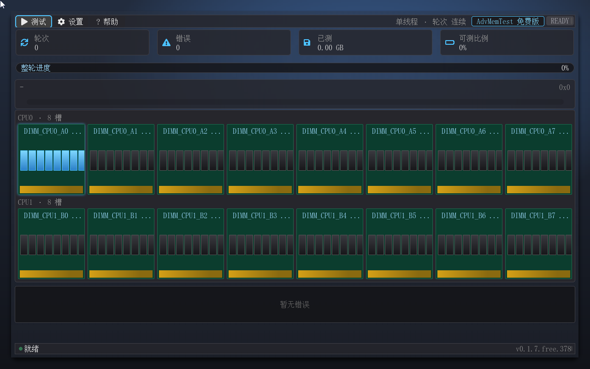
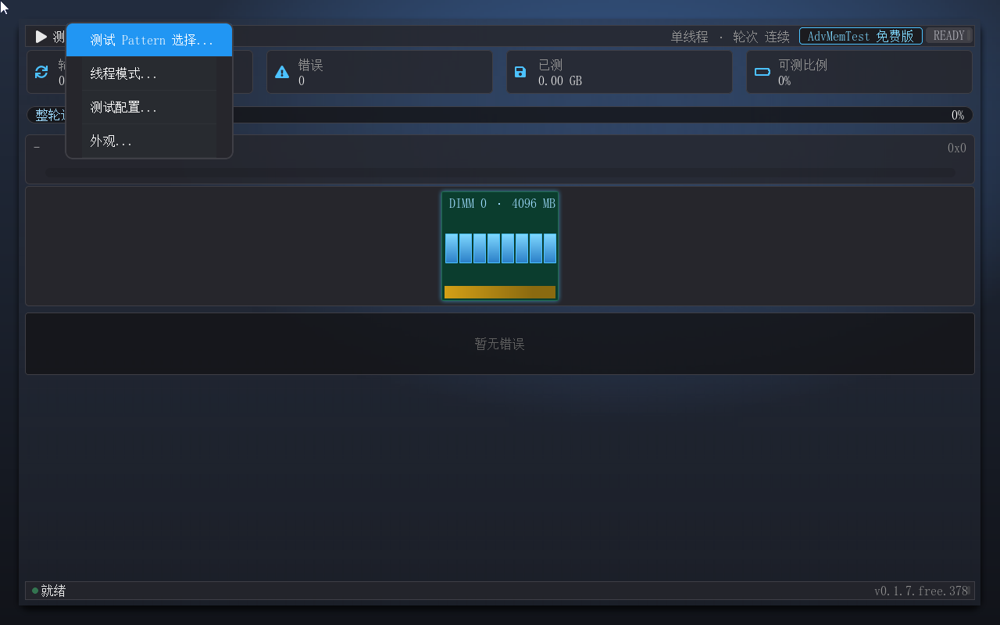
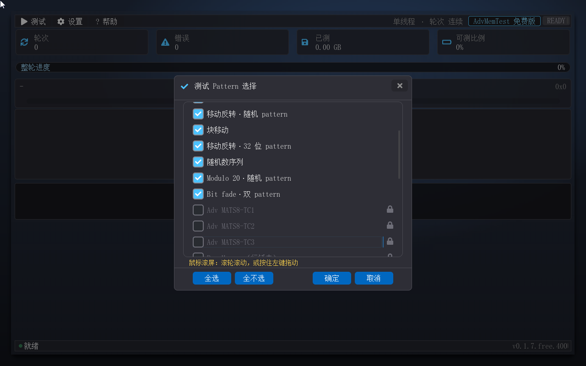
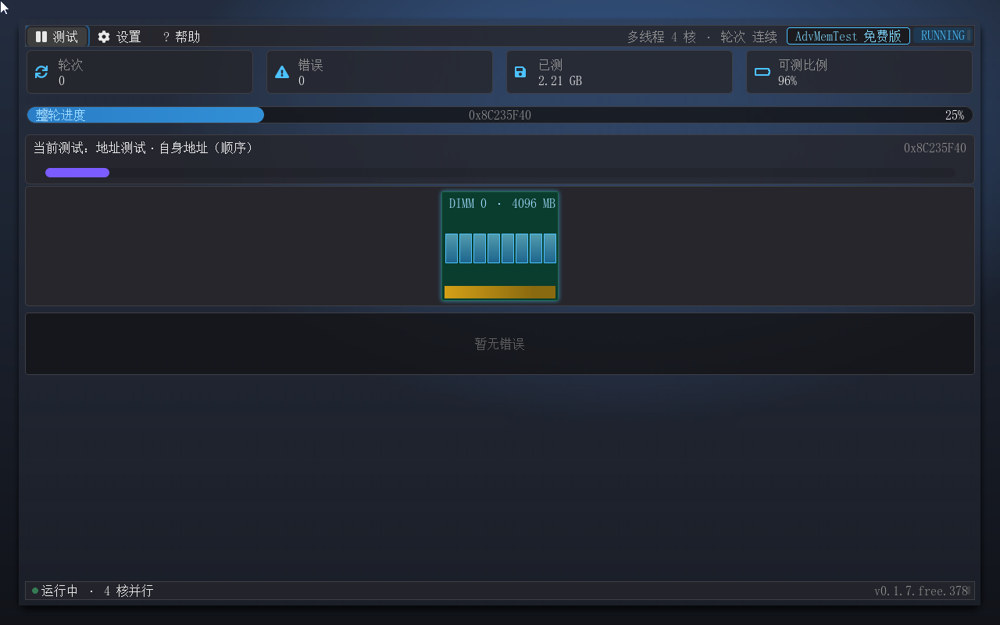
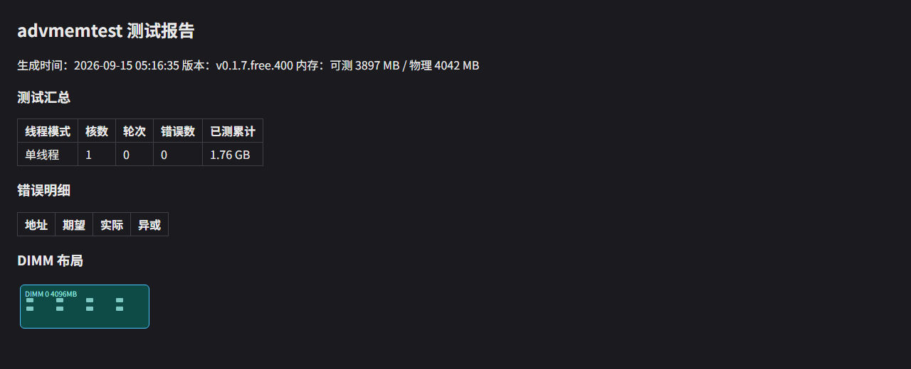

# AdvMemTest — 内存压力测试工具（二进制发布包）

> [English version below](#english) ｜ [English README](#english)

AdvMemTest 是运行在 **UEFI Shell**（或免 Shell 的可启动 ISO）中的图形化内存压力测试工具，对标 Memtest86 全家——装机验收、故障排查与返修质检的第一道关卡。**11 条经典测试 pattern 免授权即可执行**（专业版 31 条全量），四线程模式真实多核调度，自我重定位（程序自身占用的内存也纳入测试），动态 DIMM 可视化带（槽位 / 空槽 / 分组随固件事实渲染，最大 48 槽），HTML 报告自动落盘。**专业版**在经典测试集之上追加 18 条高级 pattern（AMT 系 / 行锤 / 厂商系 / 增补条），并把错误指认精确到**颗粒级**——Socket / Channel / DIMM / Rank / Device 五级坐标，直接回答"哪根条上的哪颗芯片坏了"。

> 内存有没有坏、坏在哪——两件事一起回答。

- **版本**：0.1.7（Build 401；免费版 11 条用户可见 pattern 可执行，专业版 31 条全量）——Build 号随每次发布递增，以实际产物为准
- **发布**：[AdvMemTest-v0.1.7 Release](https://github.com/MikeWuPing/UEFI_Test_Suite/releases/tag/AdvMemTest-v0.1.7)（专业版不发公开渠道——经商务渠道交付）
- **作者**：Mike Wu
- **许可**：个人用户免费使用；商业用途需授权（商业路径 = AdvMemTest 专业版授权，请联系作者）——见套件根 README 的许可节
- **产品手册**：[免费版技术手册（MD）](docs/manual/advmemtest-free-user-guide.md) ｜ [Word 版](docs/manual/advmemtest-free-user-guide.docx) ｜ [快速上手（MD）](docs/manual/advmemtest-quick-guide.md) ｜ [Word 版](docs/manual/advmemtest-quick-guide.docx) ｜ [功能演示 GIF](docs/manual/advmemtest-feature-tour.gif) ｜ [ISO 用法说明](docs/manual/iso-boot-readme.txt)

## 包内容

| 文件 | 说明 |
|---|---|
| `binaries/advmemtest-free.efi` | 应用本体（UEFI x64 应用，约 1.4 MB）——**免费版**，个人用户免费使用、无需授权文件 |
| `iso/AdvMemTest-boot-0.1.7.401+20260915_174937.iso` | **可启动光盘镜像**（免 UEFI Shell 直启 Live-CD，El Torito + 内嵌 ESP，约 18 MB；文件名带版本号 + 时间戳——改版留档）。无需 UEFI Shell，用法与注意事项见 [ISO 用法说明](docs/manual/iso-boot-readme.txt) |
| `docs/manual/` | 产品手册（免费版技术手册 + 快速上手，各 MD + Word）+ 24 张功能截图 + 功能演示动图 + ISO 用法说明 |
| `AdvMemTest-0.1.7.401+20260915_174937.zip` | 便捷包（程序 + ISO + 手册 + 截图——与 Release 资产同内容） |

专业版（`AdvMemTestPro.efi` + `ADVMTEST.LIC` 授权文件）不随本仓公开发布：商业用途请联系作者，获授权后按商务渠道交付（授权文件离线校验、无需联网、无需注册）。

## 目录

- [快速上手](#快速上手)
- [功能特性](#功能特性)
- [功能示例](#功能示例)
- [运行要求](#运行要求)
- [已知限制](#已知限制)
- [常见问题](#常见问题)
- [姊妹工具](#姊妹工具)
- [更新记录](#更新记录)
- [许可](#许可)

## 快速上手

**第一步，启动（二选一）。** ① **ISO 形态**：把 ISO 写入 U 盘（Rufus / balenaEtcher / Ventoy 选正常模式）或挂进虚拟机 / BMC 虚拟光驱，开机从该设备启动，直接进程序——不需要 UEFI Shell；**先关闭 Secure Boot**（程序未签名）。② **Shell 形态**：把 `advmemtest-free.efi` 复制到 UEFI Shell 所在盘（通常 fs0:），在 Shell 提示符下输入文件名回车，或写入 `startup.nsh` 开机自动运行。

**第二步，起测。** 连按两下回车：第一下展开"测试"菜单，第二下选中"开始测试"（鼠标点菜单效果相同）。测试即刻开始，默认集已含全部适用 pattern，多核机器自动全核并行。

**第三步，看进度。** 关注整轮进度条与四张统计卡（轮次 / 错误 / 已测 / 可测比例）；DIMM 带上光晕流动的位置，就是当前正在压测的内存区域。

**第四步，暂停与停止。** 运行中按 `Esc` 是**暂停**（进度、错误现场全保，再按 `Esc` 或点菜单"继续测试"恢复）——防误触，不会白跑；要真正停止，打开"测试"菜单选"停止测试"（停止的同时自动写报告）。

**第五步，看结果。** 报告写到 `fs0:\advmemtest_report.html`，退出 Shell 后用浏览器直接打开；程序"退出"走"帮助 → 退出"或空闲时按 `Esc`（运行中退出会先弹确认框）。

> ISO 是只读介质：程序照常运行，但报告与设置写不出来（串口一行 `WARN: report write failed: Write Protected`，不崩、测试不中断）。需要报告文件请用 Shell 形态在可写盘上跑，细节见 [ISO 用法说明](docs/manual/iso-boot-readme.txt)。

## 功能特性

- **经典测试集（免费版 11 条用户可见 pattern，全部真实写读）**：
  - 地址类 3 条——步进 1 地址测试、自身地址（顺序）、自身地址（并行），检测地址线开路 / 短路 / 译码错误；
  - memtest86+ 系 8 条——移动反转族 4 条（全 1 全 0 / 8 位 / 随机 / 32 位走花）、块移动、随机数序列、Modulo 20（20 字节错位写，绕开缓存行干扰）、Bit fade（写后静置再校验，检测电荷保持故障）。
  - 另有 2 条引擎自检参考条（空测试 / 热复位校验）不对外展示、不参与默认集。
- **四线程模式**：单线程、**多线程（地址切分并发，实测 4 核吞吐约 2.5 倍）**、顺序轮巡、轮流。多核机器起测默认全核并行；**免费版多核上限 16 核**。MP 协议缺席或单核平台自动降级并注明——降级只影响吞吐，不改变测试语义。
- **错误三通道**：界面错误日志区（最近 4 行）+ 串口 `TEST_FAIL` 行（多核带 cpu= 号，可直接对接自动化日志采集）+ 状态徽章转 FAIL。免费版为**地址级**口径（地址 / 期望 / 实际 / 异或），定位字段在信息源头就不产生；把错误指认到颗粒（Socket / Channel / DIMM / Rank / Device 五级坐标 + DIMM 红标）是专业版能力。
- **动态 DIMM 可视化带**：槽位布局由固件 SMBIOS 事实驱动——槽总数、点亮 / 空槽（`EMPTY` 置灰）、双路分组头、器件颗粒图标随拓扑渲染，最大 48 槽；从单槽小平台到 32 槽双路服务器自动切换全样式 / 紧凑样式 / 少槽降档。悬停任意槽位弹出 tooltip（插槽名 / 容量 / 组织 / 颗粒数 / rank）。
- **自我重定位**：启动后把自身镜像整体搬到新地址、释放原区域，把"测试程序自己占用的内存"也纳入测试——这是内存测试工具的天然盲区。
- **HTML 报告**：停止测试 / 跑满指定轮数 / 退出程序三个时机自动落盘（同系列固定名覆盖），UTF-8 单文件内联 CSS，汇总统计 + 错误明细 + DIMM 布局可视化一页呈现。
- **轮数配置与设置持久化**：轮数上限 1–99 轮或连续运行；Pattern 勾选、线程模式、轮数设置自动保存到程序目录下的 `ADVMTEST.CFG`，下次启动自动恢复。
- **分辨率自适应**：不足 1280×800 时自动向固件索取更高的显示模式（失败则按当前分辨率降级运行，建议最小 1024×768）。
- **全简体中文界面**，鼠标 + 键盘双操作：Tab 焦点循环、方向键、回车确认；支持鼠标滚轮滚动列表与正文。
- **专业版追加**（商业授权）：18 条高级 pattern（AMT 系工程序列 / 通用行锤 / 三家内存原厂算法 / 两条增补条，共 31 条全量）、颗粒级错误定位、SPD 深度内存信息页、内存带宽基准（读 / 写 / 拷贝）、禁用缓存测试模式、坏块清单导出（`badram.txt` / `badmemorylist.txt`）、多核上限 512 核。

## 功能示例

## 运行要求

| 项目 | 要求 |
|---|---|
| 平台 | x64（x86-64）UEFI 固件，无操作系统要求 |
| 启动形态 | ① 免 Shell 可启动 ISO（刻 U 盘 / 挂虚拟光驱 / BMC 虚拟光驱）；② UEFI Shell 手动 / 自动运行（单文件，无外部依赖、无需授权文件） |
| 介质 | FAT 系卷（Shell 形态：程序与报告、设置同盘）；ISO 形态为只读，写不出报告与设置 |
| 屏幕 | 1280×800 或更高（不足时自动索取更高显示模式；降级可用，建议最小 1024×768） |
| 推荐内存 | 512 MB+；被测内存由工具向固件申请、测完全量归还 |

## 已知限制

- **免费版错误只到地址**：颗粒级定位需要按设备位宽把地址切到芯片，而器件位宽只有 SPD 能提供——免费版不读取 SPD（零硬件依赖、零总线风险），因此不产生定位字段。
- **DIMM 带 tooltip 中的位宽为推测值**：无 SPD 真值时按 x8 推测并强制标注"（推测）"，位宽未知时不显示位宽与颗粒数。推测值绝不当事实呈现。
- **多核上限 16 核**：16 核以上的机器只使用 16 个核参与调度（降级不影响正确性，只影响吞吐）。顺序轮巡与轮流两档模式属专业版能力，在免费版中灰显 + 锁标、可读不可执行。
- **ISO 为只读介质**：程序运行与测试不受影响，但报告、坏块清单与设置文件都写不进去（串口给一行告警，不崩）；需要报告请用可写盘。程序"退出"后回到固件引导流程（不自动关机）——若该盘在启动顺序里仍列首位，部分固件可能再次引导它，离开测试请断电、改启动顺序或拔盘。
- **分辨率降级后的边界**：极端小分辨率下界面内容可能超出屏幕（建议最小 1024×768）。
- **自我重定位的降级**：可分配内存过低时放弃重定位（设计降级，测试照常进行）。

## 常见问题

- **为什么"可测比例"不是 100%？** 被测内存必须向固件申请、测完归还；固件头部还预留了 128MB 不纳入测试，加上固件自身占用，与物理内存存在固定差值。可测比例在测试中不变化。
- **报告文件在哪？** `fs0:\advmemtest_report.html`（停止 / 跑满轮数 / 退出三时机自动写入，同系列固定名覆盖）。ISO 形态除外——只读盘写不出文件。
- **按了 Esc 测试是不是停了？** 不是——运行中按 `Esc` 是**暂停**（进度与错误现场全保），再按一次从原地址继续。真正的停止入口只有一个："测试"菜单 →"停止测试"。
- **ISO 启动被拒？** 本程序未签名——请在固件设置里先关闭 Secure Boot（测试完成后再打开）。Ventoy 请选**正常模式**（第一个菜单项），不要选 grub2 模式。
- **16 核以上的机器是不是没跑满？** 免费版按 16 核封顶参与调度，多余核心不参与；这是免费版与专业版（上限 512 核）的差别之一。
- **免费版和专业版差在哪？** 免费版：11 条经典 pattern、单线程 / 多线程、地址级错误口径、HTML 报告，个人用户免费；专业版：31 条全量、颗粒级定位、SPD 深度信息页、带宽基准、禁用缓存、坏块清单导出、512 核。升级途径：联系作者。

## 姊妹工具

本套件其它成员：[pcDig](../pcDig/)（图形化整机硬件诊断）、[BootDoctor](../BootDoctor/)（启动诊断修复）。各工具独立发布、独立版本节奏，详见[套件根 README](../README.md)。

## 更新记录

- **2026-09-15 · AdvMemTest-v0.1.7**：AdvMemTest 二进制发布首版（0.1.7 Build 401）——免费版 11 条用户可见经典 pattern（地址 / memtest86+ 系 / 引擎自检参考条）+ 四线程模式（多核上限 16 核）+ 自我重定位 + 动态 DIMM 可视化带（SMBIOS 双入口、最大 48 槽、空槽置灰、双路分组头）+ 错误三通道（地址级）+ HTML 报告 + 设置持久化；首发即带**免 Shell 可启动 ISO**。专业版同版本经商务渠道交付（+18 条高级 pattern、颗粒级错误定位、SPD 深度内存信息页、内存带宽基准、禁用缓存模式、坏块清单导出、512 核扩展——商业用途需授权）。

## 许可

本工具：**个人用户免费使用；商业用途（营利性部署 / 分发 / 预装）需提前联系作者书面授权**——商业路径 = AdvMemTest 专业版授权，请联系作者。详见套件根 README 的许可节。第三方组件：图形库 LVGL 遵循其自身许可（MIT）。

---

## English

# AdvMemTest — Memory Stress Test Tool (Binary Release Package)

AdvMemTest is a GUI memory stress-test tool for the **UEFI Shell** (or a shell-free bootable **ISO**), benchmarked against the Memtest86 family — acceptance testing, fault diagnosis and RMA quality inspection. **11 classical patterns run without any license** (the Pro edition has all 31), four multi-core scheduling modes, self-relocation (the tool's own memory is tested too), a dynamic DIMM strip (slots / empties / groups rendered from firmware facts, up to 48 slots), and automatic HTML reports. The **Pro edition** adds 18 advanced patterns (AMT family / row hammer / vendor family / augmented) and **chip-level error location** — Socket / Channel / DIMM / Rank / Device five-axis coordinates: *which chip on which DIMM failed*.

> Is the memory bad — and where? Both answered.

- **Version**: 0.1.7 (Build 401; 11 user-visible patterns runnable in the Free edition, 31 in the Pro edition) — the build number increments with each release
- **Release**: [AdvMemTest-v0.1.7](https://github.com/MikeWuPing/UEFI_Test_Suite/releases/tag/AdvMemTest-v0.1.7) (the Pro edition is delivered through the business channel only, not published here)
- **Author**: Mike Wu
- **License**: free for personal use; commercial use requires a license — the commercial path is the AdvMemTest Pro edition; please contact the author. See the License section of the suite root README.
- **Manuals**: [Free edition manual (MD)](docs/manual/advmemtest-free-user-guide.md) ｜ [Word](docs/manual/advmemtest-free-user-guide.docx) ｜ [Quick start (MD)](docs/manual/advmemtest-quick-guide.md) ｜ [Word](docs/manual/advmemtest-quick-guide.docx) ｜ [feature GIF](docs/manual/advmemtest-feature-tour.gif) ｜ [ISO usage notes](docs/manual/iso-boot-readme.txt)

## Package contents

| File | Description |
|---|---|
| `binaries/advmemtest-free.efi` | The app itself (UEFI x64 application, ~1.4 MB) — **Free edition**, free for personal use, no license file required |
| `iso/AdvMemTest-boot-0.1.7.401+20260915_174937.iso` | **Bootable Live-CD** (shell-free direct boot, El Torito + embedded ESP, ~18 MB; the versioned filename keeps revision history). No UEFI Shell required — see the [ISO usage notes](docs/manual/iso-boot-readme.txt) |
| `docs/manual/` | Manuals (Free edition manual + quick start, MD + Word), 24 screenshots, the feature demo GIF and the ISO usage notes |
| `AdvMemTest-0.1.7.401+20260915_174937.zip` | Convenience bundle (app + ISO + manuals + screenshots — same as the Release assets) |

The Pro edition (`AdvMemTestPro.efi` + an `ADVMTEST.LIC` license file) is **not** published here: commercial use requires the Pro license, delivered through the business channel (offline verification — no network, no registration).

## Quick start

1. **Boot** — either write the ISO to a USB stick (Rufus / balenaEtcher / Ventoy in normal mode) or mount it in a VM / BMC virtual CD and boot from it (no UEFI Shell needed; **disable Secure Boot first** — the image is unsigned); or copy `advmemtest-free.efi` onto the UEFI Shell drive (usually fs0:) and run it from the Shell prompt (or via `startup.nsh`).
2. **Start** — press Enter twice (first opens the Test menu, second chooses "Start test"); the default set already contains every applicable pattern and multi-core machines run all cores in parallel.
3. **Pause / stop** — `Esc` while running is **pause** (progress and error context are kept; press again to resume). To really stop, use Test → "Stop test" (the report is written at that moment).
4. **Results** — the report is written to `fs0:\advmemtest_report.html`, open it in any browser. On the read-only ISO, reports cannot be written (one `WARN: report write failed: Write Protected` line, no crash) — use a writable drive for report files.

## Features

- **Classical test set — 11 user-visible patterns in the Free edition**, all real write/read: 3 address tests (address-line faults), 8 memtest86+ family tests (4 moving-inversion variants, block move, random sequence, Modulo 20, Bit fade charge-retention). Two further engine self-check patterns are internal and not listed.
- **Four multi-core modes** — single-thread, **multi-thread (address-split parallelism, ~2.5× on 4 cores)**, sequential round-robin and rotation; all cores run in parallel by default. **The Free edition caps at 16 cores**; when the MP protocol is absent or the platform is single-core the tool degrades gracefully and says so.
- **Three error channels** — on-screen error log (last 4 rows), a serial `TEST_FAIL` line per error (with `cpu=` under multi-core, ready for log automation) and the status badge switching to FAIL. The Free edition reports **address-level** (address / expected / actual / xor); chip-level location (Socket / Channel / DIMM / Rank / Device + DIMM red marks) is a Pro feature.
- **Dynamic DIMM strip** — slot layout driven by firmware SMBIOS facts: total slots, populated vs `EMPTY`, dual-socket group headers and per-chip icons, up to 48 slots; layouts adapt automatically from a single-slot board to a 32-slot dual-socket server. Hovering a slot shows name / size / organization / chip count / rank.
- **Self-relocation** — the tool moves its own image out of the way and releases the original region, so the memory it occupied is tested as well.
- **HTML report** — written automatically on stop, on reaching the round limit, and on exit (fixed filename per session): summary, error detail and a DIMM layout visualization in one self-contained UTF-8 file with inline CSS.
- **Round limit and settings** — 1–99 rounds or continuous; pattern selection, thread mode and round limit are stored in `ADVMTEST.CFG` next to the program and restored on the next run.
- **Resolution aware** — asks the firmware for a higher mode when below 1280×800 (falls back to the current one; 1024×768 minimum recommended).
- **Simplified-Chinese UI** with mouse and keyboard (Tab focus cycle, arrow keys, Enter; mouse wheel scrolls lists and text).
- **Pro edition additions** (commercial license): 18 advanced patterns (AMT engineering sequences, row hammer, three memory-vendor algorithms, two augmented entries — 31 in total), chip-level error location, an SPD deep memory-info page, a bandwidth benchmark (read / write / copy), a cache-bypass test mode, bad-block export (`badram.txt` / `badmemorylist.txt`) and up to 512 cores.

## Screenshots

## Run requirements

| Item | Requirement |
|---|---|
| Platform | x64 (x86-64) UEFI firmware, no operating system required |
| Boot form | ① shell-free bootable ISO (USB stick / virtual CD / BMC virtual CD); ② UEFI Shell, manual or automatic run (single file, no dependencies, no license file) |
| Medium | FAT-family volume for Shell use (program, report and settings on the same drive); the ISO is read-only — reports and settings cannot be written |
| Screen | 1280×800 or higher (a higher mode is requested automatically; degraded mode still works, 1024×768 minimum recommended) |
| Memory | 512 MB+; the tested memory is requested from the firmware and fully released afterwards |

## Known limitations

- **The Free edition reports addresses, not chips** — chip-level location needs the device width, which only SPD provides, and the Free edition does not read SPD (no hardware dependency, no bus risk). The location fields are simply not produced.
- **Tooltip widths are estimates** — with no SPD truth the width is assumed x8 and explicitly marked "（推测）" / "(approx)"; when unknown, width and chip count are not shown at all. Estimates are never presented as facts.
- **16-core cap** — machines with more cores use 16 of them (correctness is unaffected, only throughput). Sequential round-robin and rotation modes are Pro capabilities: greyed out with a lock icon in the Free edition.
- **The ISO is read-only** — testing works, but reports, bad-block lists and settings cannot be written (one warning line, no crash). Use a writable drive for report files. Leaving the program returns to the firmware boot flow (it does not power off); if the medium is still first in the boot order some firmware will boot it again — power off, change the order or remove the media.
- **Degraded resolution** — on extremely small screens the UI may exceed the display (1024×768 minimum recommended).
- **Self-relocation degradation** — skipped when allocatable memory is very low (by design; testing continues).

## License

This tool is **free for personal use; commercial use (profit-oriented deployment / redistribution / pre-installation) requires prior written authorization from the author** — the commercial path is the AdvMemTest Pro edition; please contact the author. See the License section of the suite root README. Third-party: the LVGL graphics library retains its own license (MIT).
