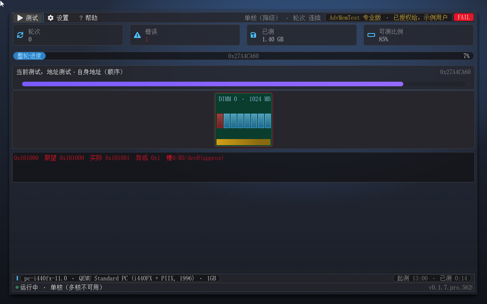
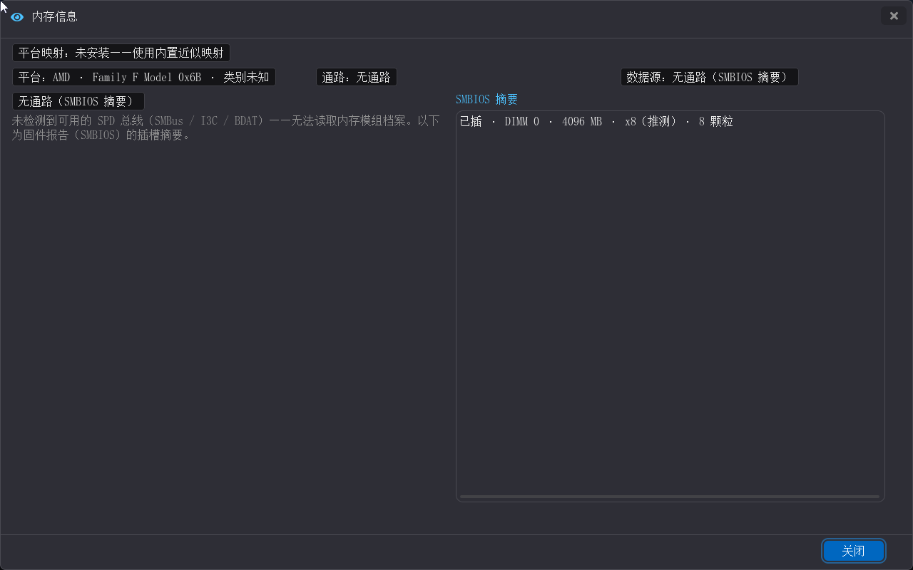
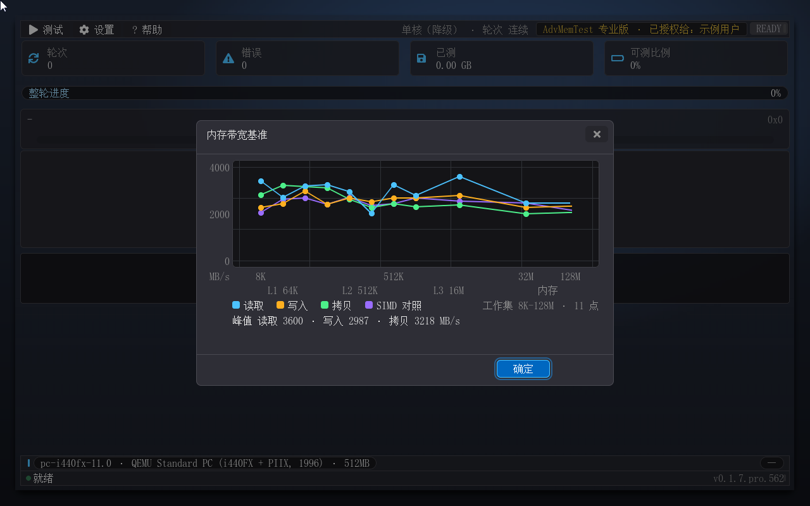

# AdvMemTest — 内存压力测试工具（二进制发布包）

> [English version below](#english) ｜ [English README](#english)

AdvMemTest 是运行在 **UEFI Shell** 下的图形化内存压力测试工具，对标 Memtest86 全家——装机验收、故障排查与返修质检的第一道关卡。**33 条真实测试 pattern**（地址线 / 数据线 / 电荷保持 / 缓存干扰 / 行锤 / 时序窗口 / 内存原厂算法 / SIMD 宽访存），四线程模式真实多核调度（MP Services）、自我重定位（程序自身占用的内存也纳入测试）、动态 DIMM 可视化带（槽位/空槽/分组随固件事实渲染，最大 48 槽）、平台信息条（CPU · 主板 · 内存总量 + 起测时刻/已测时长）、HTML 报告自动落盘。**专业版**在经典测试集之上追加 18 条高级 pattern（AMT 系 / 厂商系 / 增补条 / SIMD-256 宽访存——行锤与 SIMD-128 两版都有），并把错误指认精确到**颗粒级**——Socket/Channel/DIMM/Rank/Device 五级坐标，直接回答"哪根条上的哪颗芯片坏了"。

> 对标 Memtest86 的 UEFI 内存压测——颗粒级定位 / 18 条高级 pattern（Pro 版）。

- **版本**：0.1.7（Build 562；免费版 13 条用户可见（15 条可执行）/ 专业版 31 条目录（33 条可执行））——构建号每次构建递增，发布时以实际产物为准
- **发布**：tag **`AdvMemTest-v0.1.7.562`**（2026-09-20、Build 562、免费版 13 条用户可见；首个入列版为 `AdvMemTest-v0.1.7`——2026-09-15、Build 401、免费版 11 条用户可见。Pro 版不发公开渠道——商务私发）
- **作者**：Mike Wu
- **许可**：个人用户免费使用；商业用途需授权（商业路径 = AdvMemTest 专业版授权，请联系作者）——见[套件根 README 的许可节](../README.md)
- **产品手册**：[免费版技术手册（MD）](docs/manual/advmemtest-free-user-guide.md) ｜ [Word 版](docs/manual/advmemtest-free-user-guide.docx) ｜ [快速上手（MD）](docs/manual/advmemtest-quick-guide.md) ｜ [Word 版](docs/manual/advmemtest-quick-guide.docx) ｜ [功能演示 GIF](docs/manual/advmemtest-feature-tour.gif) ｜ [ISO 用法说明](docs/manual/iso-boot-readme.txt) —— 含全部功能截图与使用说明

## 包内容

| 文件 | 说明 |
|---|---|
| `binaries/advmemtest-free.efi` | 应用本体（UEFI x64 应用，约 1.5 MB）——**免费版**，个人用户免费使用、无需授权文件 |
| `iso/AdvMemTest-boot-0.1.7.562+20260920_222322.iso` | **可启动光盘镜像**（免 UEFI Shell 直启 Live-CD，El Torito + 内嵌 ESP，约 7.4 MB；文件名带版本号 + 时间戳——改版留档）。用法与注意事项见 [ISO 用法说明](docs/manual/iso-boot-readme.txt) |
| `docs/manual/` | 产品手册（免费版技术手册 + 快速上手，各 MD + Word）+ 33 张功能截图 + 功能演示动图 + ISO 用法说明 |
| `AdvMemTest-0.1.7.562+20260920_222322.zip` | 便捷包（程序 + ISO + 手册 + 截图，约 6.1 MB——与 Release 资产同内容） |

专业版（`AdvMemTestPro.efi` + `ADVMTEST.LIC` 授权文件）不随本目录公开发布：商业用途请联系作者，获授权后按商务渠道交付（授权文件校验全程离线，RSA-2048 验签）。

## 快速上手

1. 把 `advmemtest-free.efi` 复制到 UEFI Shell 所在盘（通常 fs0:），直接执行或写入 `startup.nsh` 开机自启（不想用 Shell 也可以直接把 ISO 写入 U 盘 / 挂 BMC 虚拟光驱，开机从该设备启动）；
2. **连按两下回车**起测（多核机器自动全核并行）；
3. 运行中按 `Esc` 是**暂停**（进度、错误现场全保，再按继续）；停止走"测试"菜单"停止测试"；
4. 报告自动写到 `fs0:\advmemtest_report.html`，浏览器直接打开（汇总/错误明细/DIMM 布局一页呈现）。

主要功能：**模式**——单线程 / 多线程（地址切分并发，4 核实测吞吐约 2.5×，免费版上限 16 核）/ 顺序轮巡 / 轮流；**Pattern**——免费版 15 条可执行，专业版 33 条全量；**错误处理**——错误三通道（界面日志 / 串口 TEST_FAIL / DIMM 带红标），Pro 版精确定位到颗粒；**报告**——停止 / 达标 / 退出三触发落盘 HTML；**两版通用**——内存带宽曲线对话框（工作集扫描；免费版只画读取一条线）、平台信息条与计时；**Pro 版追加**——SPD 深度内存信息页（六后端采集，无通路自动降级为 SMBIOS 摘要；含温度明细与 ECC 明细）、内存带宽曲线的读/写/拷贝/SIMD 四线 + 缓存台阶标注、禁用缓存测试模式（CR0.CD 旁路）、坏块清单导出（`badram.txt` / `badmemorylist.txt`）、内存健康卡（温度 + ECC）、512 核多核扩展。

## 功能示例

## 平台与运行要求

| 项目 | 要求 |
|---|---|
| 平台 | x64（x86-64）UEFI 固件，无操作系统要求 |
| 启动形态 | 可直启 ISO（`iso/AdvMemTest-boot-0.1.7.562+20260920_222322.iso`，刻盘/挂 BMC 虚拟光驱即用，不需要先有 UEFI Shell；使用前先关 Secure Boot）或 UEFI Shell 手动/自动运行（`binaries/advmemtest-free.efi`，单文件无外部依赖、无需授权文件） |
| 介质 | FAT 系卷（Shell 所在盘） |
| 屏幕 | 1280×800 或更高（不足时自动向固件索取高分辨率模式；降级可用，建议最小 1024×768） |
| 推荐内存 | 512 MB+；被测内存由工具向固件申请、测完归还 |

## 变更记录

- **2026-09-15 · AdvMemTest-v0.1.7**：**AdvMemTest 二进制发布首版（0.1.7 Build 401）**——免费版 **11 条用户可见**经典 pattern（13 条可执行，含 2 条引擎自检参考条）+ 四线程模式 + 自我重定位 + 动态 DIMM 可视化带（SMBIOS 双入口、最大 48 槽、空槽置灰、双路分组头）+ HTML 报告 + 设置持久化。Pro 版同版本交（商务渠道，**31 条全量**）：+18 条高级 pattern（AMT 系/行锤/厂商系/增补条）、颗粒级错误定位（五级坐标 + DIMM 红标 + 平台坐标协议契约）、SPD 深度内存信息页、内存带宽基准、禁用缓存模式、坏块清单导出、512 核多核扩展——商业用途需授权。
- **2026-09-20 · 0.1.7 增量版（Build 562）**：**注册表 31 → 33 条**（+SIMD-128 宽访存，两版默认勾选；+SIMD-256 宽访存，Pro 域且需固件启用 AVX2，未开则自动锁定、不影响其它条）；**内存带宽基准 → 工作集扫描曲线**（免费版读取一条线；Pro 读/写/拷贝 + SIMD 对照 + L1/L2/L3/内存四档缓存台阶标注；报告落"带宽曲线"段）；**内存温度与 ECC**（Pro：SPD 集线器读模组温度、Intel MCA 只读轮询读 CE/UE；健康卡与内存信息页的温度/ECC 明细节，读不到整节不出现）；**底部平台信息条**（两版通用：CPU · 主板 · 内存总量 + 起测时刻 / 已测时长，时长不含暂停、停止后冻结）；**DeviceLocator 长于 23 字符的机器上槽序修正**（旧版截断导致排序平局/数字段翻转，本版按完整字符串排序——槽位、错误日志红标下标与报告网格顺序随之与旧版不同，与"器件编号平移"同批口径）；**内部加固**：新栈 8KB→64KB、修正两处栈/ABI 越界写（安全余量已耗尽、无观测到的损坏；可测内存相应少 56KB，长会话按 64KB/次评估栈占用）；Ventoy 1.1.17 实测两种模式（**专业版请走正常模式**）。

## 姊妹工具

本套件其它成员：pcDig（整机硬件诊断）、BootDoctor（启动诊断修复）。运行环境与 GUI 底座同为 UEFI_LVGL（LVGL 的 UEFI 移植）。

## 许可

本工具：**个人用户免费使用；商业用途（营利性部署/分发/预装）需提前联系作者书面授权**——商业路径 = AdvMemTest 专业版授权，请联系作者。本目录未附 LICENSE 文件，适用[套件根 README](../README.md) 的许可节条款。第三方组件：图形库 LVGL 遵循其自身许可（MIT）。

---

## English

# AdvMemTest — Memory Stress Test Tool (Binary Release Package)

AdvMemTest is a GUI memory stress-test tool running in **UEFI Shell**, benchmarked against the Memtest86 family — acceptance testing, fault diagnosis and RMA quality inspection. **33 real test patterns** (address, data-line, charge-keep, cache-interference, row hammer, timing windows, memory-vendor algorithms, SIMD wide access), four multi-core scheduling modes over MP Services, self-relocation (the tool's own memory is included), a dynamic DIMM strip (slots/empties/groups rendered from firmware facts, up to 48 slots), a platform info bar (CPU · board · memory total, with start time / elapsed), and automatic HTML reports. The **Pro edition** adds 18 advanced patterns (AMT family / vendor family / augmented / SIMD-256 — row hammer and SIMD-128 ship in both editions) and **chip-level error location** — Socket/Channel/DIMM/Rank/Device five-axis coordinates: *which chip on which DIMM failed*.

- Version 0.1.7 (Build 562, 2026-09-20; Free 13 visible (15 executable) / Pro 31 listed (33 executable)) ｜ Author: Mike Wu
- **Release**: tag `AdvMemTest-v0.1.7.562` (the first suite release was `AdvMemTest-v0.1.7` — 2026-09-15, Build 401, Free 11 visible patterns). The Pro edition is delivered through the business channel only, not published here.
- **Download**: `binaries/advmemtest-free.efi` (~1.5 MB, Free edition, free for personal use) and `iso/AdvMemTest-boot-0.1.7.562+20260920_222322.iso` (~7.4 MB shell-free bootable Live-CD); the convenience bundle `AdvMemTest-0.1.7.562+20260920_222322.zip` (~6.1 MB). The Pro edition is delivered by business channel only (binary + `ADVMTEST.LIC`).
- **License**: free for personal use; commercial use requires a license — the commercial path is the AdvMemTest Pro edition; please contact the author. See the License section of the [suite root README](../README.md).
- **Docs**: [Free manual (MD)](docs/manual/advmemtest-free-user-guide.md) ｜ [Word](docs/manual/advmemtest-free-user-guide.docx) ｜ [quick start (MD)](docs/manual/advmemtest-quick-guide.md) ｜ [Word](docs/manual/advmemtest-quick-guide.docx) ｜ [feature GIF](docs/manual/advmemtest-feature-tour.gif) ｜ [ISO usage notes](docs/manual/iso-boot-readme.txt)

Boot the ISO from a USB stick (Rufus / balenaEtcher / Ventoy in **normal mode**) or a BMC virtual CD — no UEFI Shell needed; **disable Secure Boot first** (the image is unsigned). Ventoy was verified on 1.1.17 only.

## License

Free for personal use; commercial use (profit-oriented deployment / redistribution / pre-installation) requires written authorization from the author — the commercial path is the AdvMemTest Pro edition; please contact the author. This directory ships no LICENSE file; the License section of the [suite root README](../README.md) governs. Third-party: the LVGL graphics library retains its own license (MIT).
