# advmemtest 免费版技术手册

版本 0.1.7+401（免费版）· 适用环境：X64 UEFI Shell

## 前言

advmemtest 是运行在 UEFI Shell 下的内存压力测试工具，对标 Memtest86 全家，分免费版与专业版两个 SKU 发行；**本手册覆盖免费版**——经典测试集的全部能力，不需要任何授权文件即可使用。专业版在测试面与错误定位上的额外能力、以及获取途径，见第七章。本手册面向服务器与工作站的维护工程师、质检人员以及 DIY 玩家，假设读者熟悉 UEFI Shell 的基本操作，并对内存故障的基本形态（地址线、数据线、电荷保持、缓存干扰）有常识性了解。

手册按"看得见的功能 → 背后的引擎 → 错误处理 → 报告 → 高级特性 → 升级到专业版"的顺序组织。第二章介绍界面每一个区域的用途；第三章是测试引擎的全貌，13 条 pattern 的完整清单与两档线程模式逐一详解；第四章讲错误如何被发现、如何上报，以及免费版的工作口径（地址级）；第五章讲 HTML 报告；第六章讲自我重定位、厂商门控、多核降级等高级特性；第七章给出专业版的能力速览与获取途径；第八章集中回答常见问题。凡涉及真机行为的部分，本手册以 QEMU 验证环境为基准，真机差异以实测为准。

## 第一章 产品概述

### 1.1 产品定位

advmemtest 解决的核心问题，是把"内存有没有坏、坏在哪"这两件事同时回答清楚。传统内存测试工具（以 Memtest86 系为代表）能回答"有没有坏"，却只给一个裸地址——对"整根替换"的维修流程够用，对"精确到芯片"的更换决策不够（把错误指认到芯片、把坏页清单交出去的能力在专业版，见第七章）。免费版承担经典测试集的全部任务：地址、数据线、电荷保持与缓存干扰类故障的检测不需要任何授权；配合自我重定位让覆盖完整、多核真实并发（上限 16 核）让筛选变快。此外，电荷保持类隐性故障的检测，装机验收时的多核总线争抢类故障暴露，以及测试记录的存档流转，都在它的能力范围之内。

适用场景：个人验机、DIY 装机自检、维修现场快速筛选——11 条经典测试条目覆盖地址线、数据线、电荷保持、缓存干扰与随机性故障的大多数形态，两档线程模式与自我重定位全部可用；服务器验机、返修质检、向厂商索赔与内网机房的深度可靠性筛选，请见第七章。

### 1.2 运行环境与安装

- **固件**：X64 UEFI 固件。**两条启动路径都支持**：① 可直启 ISO——不需要 UEFI Shell，刻到 U 盘（Rufus / balenaEtcher / Ventoy / `dd`）或挂到 BMC 虚拟光驱，开机从该设备启动即直接进程序；② UEFI Shell——绝大多数服务器与工作站 BIOS 的启动菜单中可直接选择"UEFI Shell"，进入后敲文件名启动。使用 ISO 前请**先关闭 Secure Boot**（程序未签名）。
- **外设**：鼠标与键盘均可操作，界面全简体中文（UTF-8）。
- **安装**：无安装过程。ISO 路径免安装（见上）；Shell 路径把与版本对应的二进制复制到 Shell 所在盘（通常为 fs0:）即可：免费版为 `AdvMemTestFree.efi`（发布时亦可改名 `advmemtest.efi`）。可选做法是写入 `startup.nsh`，开机进 Shell 自动运行。本版不需要任何授权文件；专业版另有授权要求，见第七章。

### 1.3 启动与版本

在 Shell 提示符下输入 efi 文件名回车即启动。启动后主窗口固定角落显示 `APP_VERSION`，格式为 `v<版本>.<SKU>.<构建号>`（如 `v0.1.7.free.401`），串口同步输出一行 `APP_VERSION=`，便于与构建记录核对二进制身份。

### 1.4 界面总览

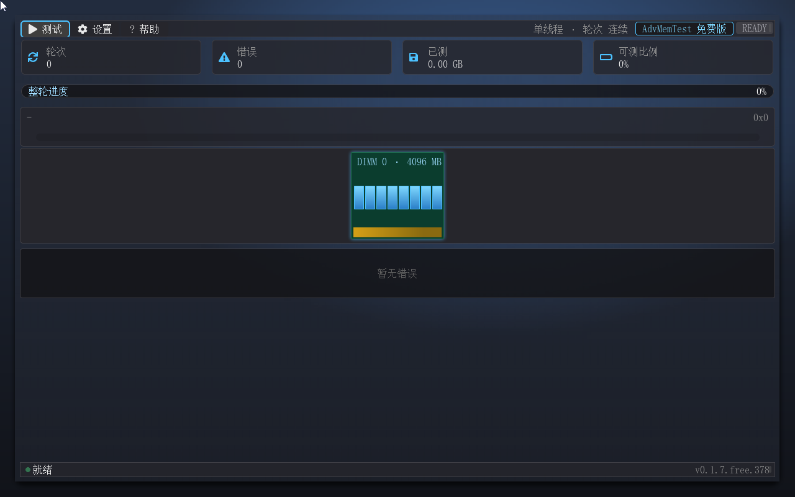

主窗口自上而下分为六个区域：菜单栏（测试 / 设置 / 帮助，右侧依次为模式面包屑、SKU 徽标、READY / RUNNING / PAUSED / PASS / FAIL 五态大字徽章）、四张统计卡、整轮大进度条、当前测试卡、DIMM 可视化带（槽位总数据 SMBIOS 动态决定，见 2.4）、错误日志区，窗口底部还有一条状态栏。第二章逐区说明。

## 第二章 界面导览

### 2.1 菜单栏

菜单栏覆盖全部操作入口。"测试"菜单的第一项是三态动态切换的：空闲时为"开始测试"，运行中变为"暂停测试"，暂停后变为"继续测试"，另有一项"停止测试"恒在——它是唯一的停止入口（见 2.6）。**"停止测试"按状态收敛可点性**：空闲（尚未开始测试）时它呈灰色且点不动——没有可停的对象时，灰显比"点了没反应"更诚实；测试运行中与暂停中它恢复为正常亮度、可点。菜单栏"测试"按钮的图标与第一项文案同拍切换：运行中为暂停图标（⏸，点击动作=暂停）、其余状态为播放图标（▶，点击动作=开始/继续），与右上角五态徽章联动。

"设置"菜单四项：**"测试 Pattern 选择..."、"线程模式..."、"测试配置..."、"外观..."**（菜单名省略号为产品界面现状——前两项用半角三点、"测试配置"与"外观"用标点省略号，本文档镜像之）。

"帮助"菜单两项：第一项打开关于对话框（快捷键 F1），第二项"退出"弹出退出确认对话框（与空闲 Esc 同一个确认框，见 2.6）——任何时候都有显式出口，不必记快捷键。菜单栏右侧是状态徽章，五态指示：READY（待机）、RUNNING（运行中，蓝色呼吸动画）、PAUSED（已暂停，琥珀色）、PASS（本轮达标完成、无错误）、FAIL（检出错误）。徽章左侧是模式面包屑，常驻显示当前模式（如"单线程 · 轮次 连续"、"多线程 4 核 · 轮次 第 1/10 轮"），点击可直接打开线程模式对话框。面包屑与徽章之间是 SKU 徽标：免费版为亮蓝色（#7FD8FF 字 + 强调色 #4CC2FF 描边）"AdvMemTest 免费版"。

**键盘与鼠标说明**：菜单与对话框的滚动以键盘 Tab（焦点循环）/ 上下键为主，**鼠标滚轮同样可用**——指针悬停在滚动容器（对话框清单、帮助正文等）上滚动滚轮即可，容器内的提示条会给出用法（"鼠标滚屏：滚轮滚动，或按住左键拖动"）；侧边滚动条为显示指示件。对话框内请用 Tab 切换焦点、回车确认。对话框沿用主界面灰阶体系（深色化 + Fluent 分栏：标题栏/右上角 ✕ 关闭钮/分隔线/强调色焦点辉光），与主界面风格统一，焦点光圈为强调蓝，任何背景下清晰可见。

### 2.2 四统计卡

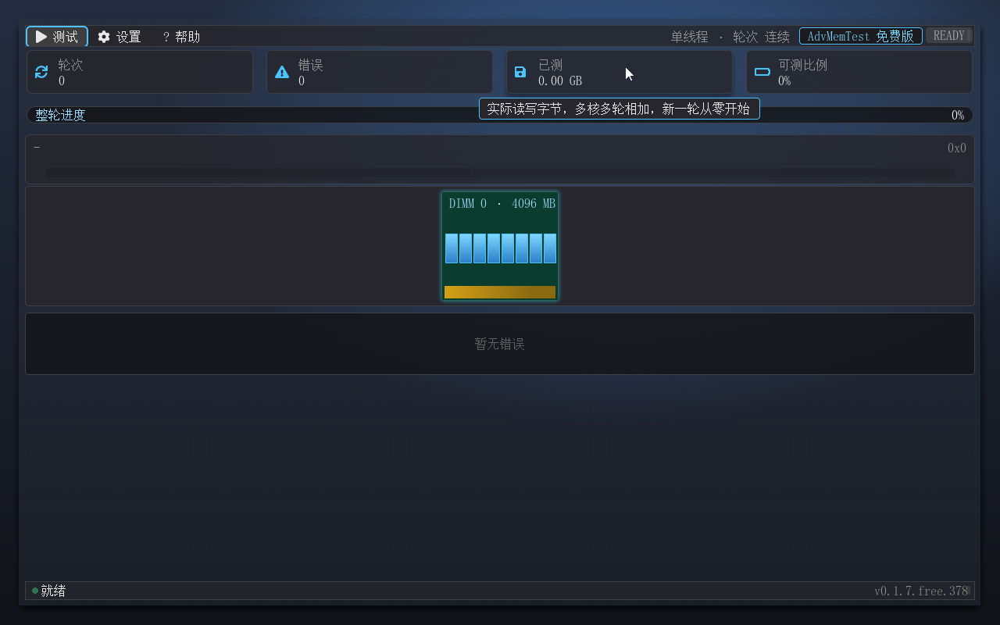

四张卡片依次是：**轮次**（当前完成轮数）、**错误**（累计错误数）、**已测**（实际读写字节数，多核多轮相加，新一轮从零开始）、**可测比例**（可测内存与物理内存的比值，测试中不变化——为何不是 100% 见第八章）。鼠标悬停任意卡片会弹出语义说明浮层。

### 2.3 整轮进度条与当前测试卡

进度条为 22px 全圆角蓝渐变长条，左侧标签、中间显示当前测试地址、右侧显示大号百分比，下方附一条紫色测试副条。进度条走满 100% 即完成一轮，进入下一轮（连续模式下永不封顶）。当前测试卡显示正在执行的 pattern 名称与段 / 偏移 / 相位坐标，配合进度条可以判断此刻压在内存的哪个区域。

### 2.4 DIMM 可视化带

这是本工具最具辨识度的界面元素。槽位布局由 SMBIOS 双入口驱动（Type 16 的槽位汇总定网格总数、Type 17 的已插图定点亮与几何/颗粒），**槽数随平台动态变化**：从单槽到双路服务器的 32 槽直至上限 48 槽，均按"每行最多 8 列"的规则自动排布。行数不超过 2 行时使用全样式——每根内存条按颗粒组织渲染颗粒图标，颗数取自颗粒几何模型（数据颗粒 + ECC 颗粒 + RCD：x8 模块 8 颗、带 ECC 9 颗、RDIMM 再加 RCD 为 10 颗；阵列上限 16 颗、超过按上限截断，该上限在 x4 模块上才会触及），与模组实际芯片布局一致；器件位宽为**推测值**时 tooltip 会标注。行数达到 3 行及以上自动切换紧凑样式（模组高压缩、颗粒以刻线示意，PCB、金手指与槽名/容量丝印保留）。**少槽降档**：已插图根数不超过 2 根时（单槽/双槽小平台）模组降为紧凑档——模组高 140px、宽固定 150px、水平居中于轨道，颗粒区按新高度重排铺满面板，避免"单根大模组上一小撮颗粒"的失衡观感；16 槽等全样式基线（2×8、模组高 177px）不受降档影响。测试时当前活动槽有蓝色光晕，光晕随测试地址流动。鼠标悬停任意点亮槽位弹出 tooltip，显示插槽名、容量、组织、颗粒数（位宽为**推测值**时标"（推测）"，位宽未知时不显示位宽与颗粒数），第二行给出 rank 数与内存技术（rank 取 Type 17 记录真值；记录未报该字段时按 1 rank 显示并同样标"（推测）"）：

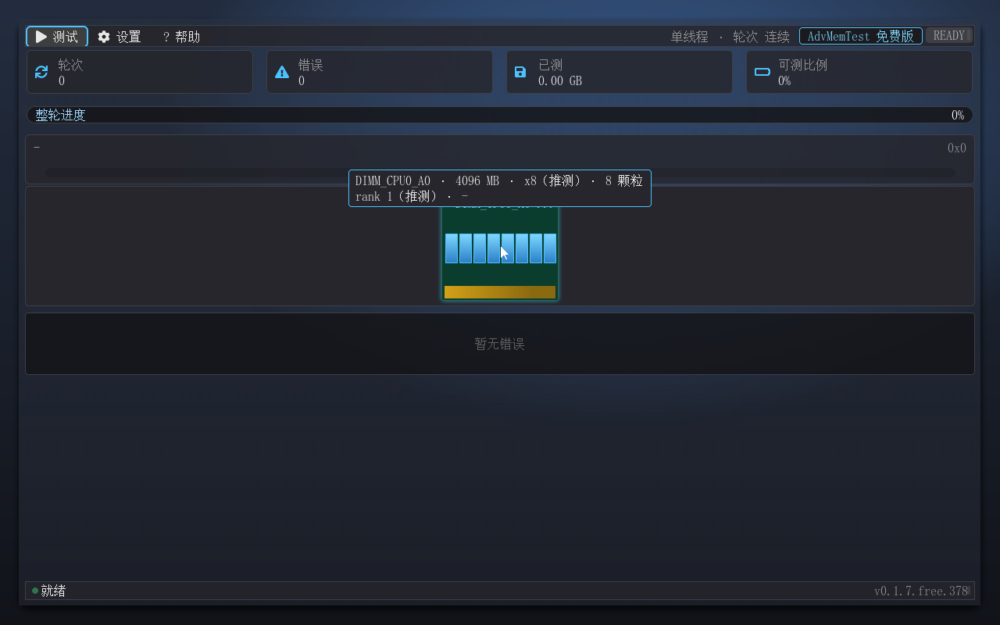

**器件位宽从哪来**：位宽只有 SPD 能提供（SMBIOS / ACPI 全谱系都没有该字段，Memtest86 系同源），免费版不读取 SPD——因此非真值一律按 **x8 推测并强制标注**（tooltip 内的"（推测）"），位宽未知时不印位宽与颗粒数。推测值绝不当事实呈现。

槽数决定的外形档位都有实测截图对应：单根平台为紧凑降档（模组 140px 高，含 1px 描边；颗粒铺满面板），双根同款每根各居半带；3 槽与 4 槽平台回全样式（单行全样式——行高由区高驱动约 **360px**，逐颗粒渲染；**177px** 为 16 槽 2×8 两行基线的行高），16 槽即 2×8 全样式基线。紧凑档与全样式的外观差异一图可见：

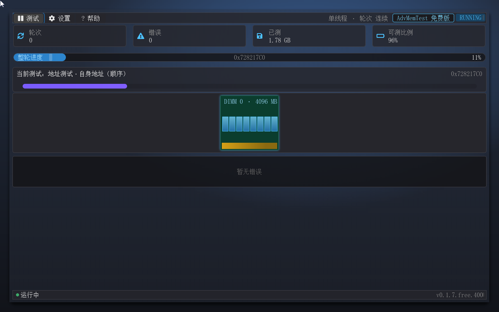

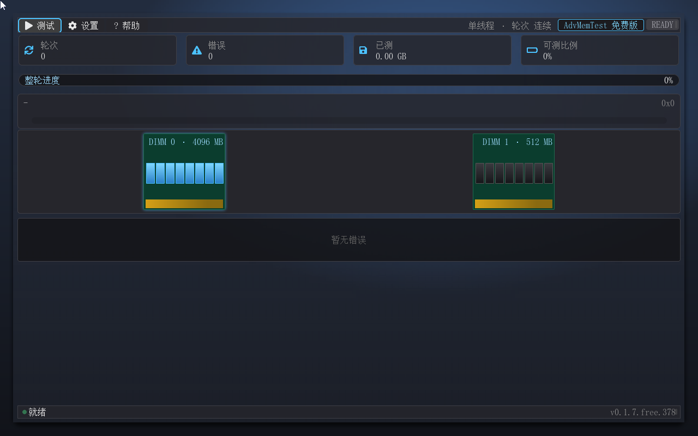

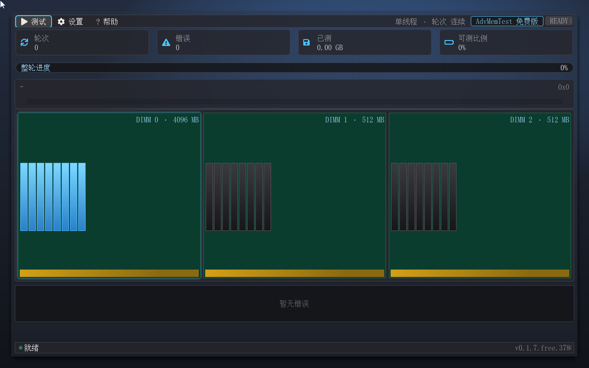

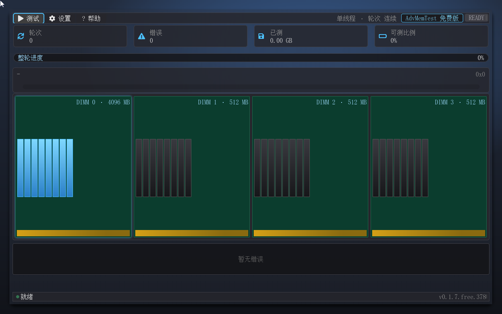

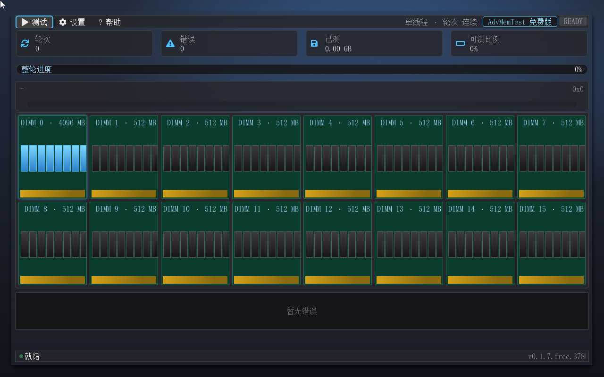

两个平台事实必须明说：**空槽置灰**——想"哪几槽空着"一目了然时，空槽以虚线框 + `EMPTY` 丝印呈现（真机服务器板把全部槽位列出、Size=0 表述空槽，本带按实渲染）：

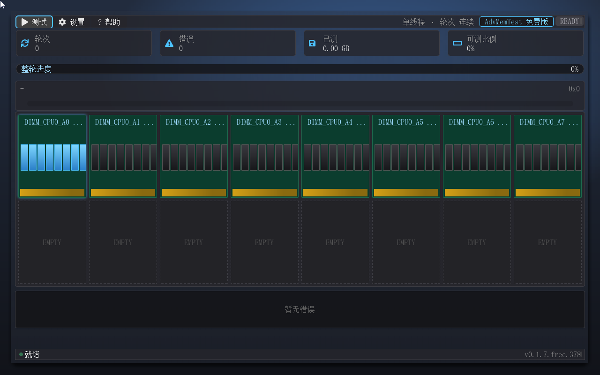

**分组头**——当 SMBIOS 提供可用分组信息（如双路平台的 DeviceLocator 前缀或多组 Type 16 数组）时，带顶渲染"组名 · N 槽"组头，槽序保持稳定（末尾数字段自然序，不会出现 A10 排在 A2 前的"跳排"观感）。32 槽双路平台即 8 列 × 4 行紧凑样式（每组 2 行）+ 两组头：

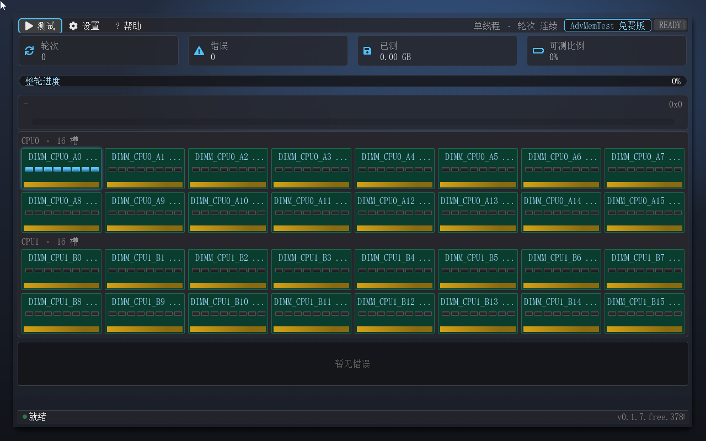

槽位总数超过 48 时按 48 满格兜底展示，带内黄字提示"本平台槽数 N 超出可视化上限"。免费版中 DIMM 带为**纯拓扑显示**——错误可视化形态见第四章。

### 2.5 错误日志区与状态栏

错误日志区固定在窗口底部，滚动显示最近 4 行错误，与串口构成错误上报的两条文本通道（免费版的完整口径见 4.1）。日志每行含地址、期望、实际、异或四项；不含定位字段——定位信息在免费版的信息源头就不产生（见 4.2）。状态栏显示运行模式文案：多核模式下为"N 核并行"；MP 协议缺席或单核平台自动降级单核时，状态栏会注明降级；暂停时显示"已暂停 · Esc 继续 / 菜单停止"。状态栏左端还有一枚呼吸点动画，指示界面事件泵在正常工作——运行中呼吸闪烁，暂停时定暗。

### 2.6 Esc 语义

Esc 键按上下文逐级生效，优先级从内到外：关闭二级消息框 → 关闭下拉菜单 → 关闭对话框 → **运行中暂停测试** → **暂停中继续测试** → **空闲时弹出退出确认**。

与许多内存测试工具"Esc 直接结束"的习惯不同，advmemtest 的 Esc 在测试运行中是**暂停**而不是停止——避免误触导致长时间压测白跑。运行中按 Esc，测试即打住（进度、错误现场全保），再按一次 Esc 继续；要真正结束测试，请打开"测试"菜单点击"停止测试"（或从暂停态点击）。只在空闲（未运行）状态下，Esc 才会弹出退出确认对话框，确认后才会退出程序。对话框打开时 Tab 键被焦点圈锁定在对话框内循环，消息框打开时 Tab 无操作。

上面那条 Esc 链是**防误触**设计：正因如此，测试运行中按 Esc 只会暂停、不会退出。要**显式退出**而不必先停测试，走"帮助 → 退出"菜单项——它与空闲 Esc 共用同一个退出确认对话框，但**不经**"运行中 = 暂停"那道护栏，测试跑着也能一步到位；这一层的保护由确认框自身承担：正文明确提示"测试进度将丢失"，并附"退出后请断电重启"的平台提示。换句话说，运行中退出是**允许**的（显式菜单入口 + 二次确认），只是不会被 Esc 意外触发。

## 第三章 测试引擎

### 3.1 内存占用模型

advmemtest 运行在固件之上，不能像裸机 memtest86 那样直接测全部物理内存。启动时它枚举内存映射中的可用区域（EfiConventionalMemory），逐段以 AllocatePages 占用，测试结束后（停止 / 退出）全量归还；固件头部预留 128MB 不纳入测试。占用模型决定了两个界面上看得到的量：可测比例是"可测内存 / 物理内存"，测试中的已测字节数则是跨核跨轮的真实读写量。

### 3.2 Pattern 注册表（13 条：11 条用户可见 + 2 条引擎自检参考条）

以下 13 条 pattern 全部为真实写读实现，免费版全量可执行。其中 Id 11/12 两条是引擎内部自检参考条——"空测试"与"热复位校验"，仅供 SelfCheck 与引擎内部使用，对话框中不展示；因此**用户可见可勾选的是 11 条**。表格中"多核资格"指该条在并行模式下的调度方式：**切分**（地址按核均分、可并发）、**轮换**（逐核轮换跑、天然串行语义）、**恒 BSP**（固定由引导核执行，多为依赖全局静置相位或跨边界邻接的条）。

| Id | 名称 | 说明 / 检测目标 | 多核资格 |
|---|---|---|---|
| 0 | 地址测试·步进 1（无缓存） | 每个地址写步进位模式，检测地址线故障 | 轮换 |
| 1 | 地址测试·自身地址（顺序） | 地址即数据，顺序写读 | 轮换 |
| 2 | 地址测试·自身地址（并行） | 地址即数据，并行写读（多核分化） | 切分 |
| 3 | 移动反转·全 1 全 0（并行） | 全 1 与全 0 并行移动反转，数据线翻转故障 | 切分 |
| 4 | 移动反转·8 位 pattern | 8 位走花移动反转 | 切分 |
| 5 | 移动反转·随机 pattern | 随机数移动反转 | 切分 |
| 6 | 块移动 | 块拷贝压测，缓存与突发路径 | 切分 |
| 7 | 移动反转·32 位 pattern | 32 位走花移动反转（跨地址错位依赖） | 恒 BSP |
| 8 | 随机数序列 | 随机数序列写读校验 | 切分 |
| 9 | Modulo 20·随机 pattern | 每 20 字节错位写，绕开缓存干扰 | 切分 |
| 10 | Bit fade·双 pattern | 写入后静置再校验，检测电荷保持（刷新）故障 | 恒 BSP |
| 11 | 空测试（自检用） | Null test，不触碰内存（对话框不展示） | 恒 BSP |
| 12 | 热复位校验 | Warm Reset 后校验上段内存（QEMU 环境为占位实现；对话框不展示） | 恒 BSP |

另有 18 条高级条目属**专业版域**（Id 13–30：AMT 系工程序列、通用行锤、三家内存原厂的专用算法、两条蓝本之上的增补条）——它们在 Pattern 对话框中以列表后段的灰显行 + 锁标列出：内容可读、焦点圈可落（键盘能浏览），但不可勾选，见 3.3 与第七章。

#### 地址类（Id 0–2）

地址测试检测的是地址线故障：地址线开路、短路或译码错误，会让写进 A 地址的数据从 B 地址读出来。步进 1 模式每个地址写步进位模式再读回，自身地址模式则直接以地址为数据。"并行"变体让多个核同时写读各自区域，把多核总线与切分边界上的译码错误也带出来。

#### memtest86+ 系（Id 3–10）

这一组是 memtest86+ 的经典序列：移动反转族（全 1 全 0、8 位、随机、32 位四种走花）以相反数据反复写读相邻地址，专门暴露数据线翻转类故障；块移动压测缓存与突发路径；Modulo 20 以 20 字节错位写、绕开缓存行干扰直达存储阵列；Bit fade 写完后静置一段时间再读回，检测 DRAM 电荷泄漏——刷新电路弱化、单元漏电偏大的颗粒会在这里现形。

#### 引擎自检参考条（Id 11–12）

这两条不在用户可选集内：空测试不触碰内存，用于自检时建立"零触碰也零误报"的基线；热复位校验在自检流程中核验上段内存的可读性（QEMU 环境为占位实现）。`advmemtest.efi selftest` 会逐条写读自检全部 pattern 并故意翻转一位做五链路断言，串口以 `SELFTEST: ALL PASS` 收尾。

### 3.3 Pattern 选择对话框

对话框列出全部 29 条**用户可见** pattern（本版可执行的 13 条减去 2 条引擎内部自检参考条 Id 11/12，加上 18 条未授权条目；两版目录数据同源同名），按类别组织，勾选即选中。**未授权条目按版本能力锁定**：免费版中专业版域条目（Id 13–30）**灰显 + 锁形图标**——内容可读、焦点圈可落（键盘能浏览），但**不可勾选**，点击按 Enter 均弹出提示"Pro 专属功能——请联系作者获取 Pro 版授权"（如需读取详细参数后在整机上完整压测，商业升级路径见第七章）。全部 11 条经典条目正常可勾选。

默认集为可见的 11 条（Id 11/12 自检参考条不参与默认集与全选——引擎内部自检用，免费版默认集固定于此，不随厂商信息变化）。全选只会选中 11 条，手动勾选以"全部可执行条目"为上限。清空所有勾选会触发双防护拦截，不会带着空集起测。对话框的焦点圈长度为 29 行 + 4 个命令按钮。

### 3.4 线程模式（两档）

线程模式对话框提供两档调度语义，对应不同的验收场景（另两档——顺序轮巡与轮流——属未授权能力，灰显 + 锁标，见第七章）：

**单线程。** 全部工作由引导核执行，每条 pattern 逐段推进。适用场景：MP 协议缺席的单核平台、需要精确复现某个错误的定位排查。它是唯一不依赖多核的兜底模式。

**多线程（地址切分并发）。** 把已占用的内存段按核数均分，各核同时压测自己的区段，仅对"可切分"资格的 pattern 生效。这是默认推荐的筛选模式：实测 4 核吞吐约为单核 2.5 倍，大容量机器做全量筛选时省时显著，且各核同时写读相邻区段，能暴露总线争抢、刷新窗口重叠类的多核故障——这是单核轮巡永远碰不到的工况。

依赖 MP Services 真实调度，多核参与数有界：**免费版上限 16 核**（对齐 Memtest86 Free）。QEMU 闭环已验证 ≤16 核与全部降级路径。降级行为：任何非单线程请求在 MP 协议缺席或单核平台上自动降级为单线程，状态栏注明降级，测试照常进行，不会中途报错。多核模式下错误收割也走多核通道：各核把错误写入免锁槽组，引导核逐核收割并打串口 TEST_FAIL 行（带 cpu= 号），保证多核压测的现场不丢（见 4.1）。

实现上的两个工程细节：BSP 工人+协调者双角色——界面泵、进度聚合、错误收割、串口输出全在引导核，AP 常驻工人不再需要参与界面；每核邮箱与错误缓冲按实测核数在运行时分配（每核约 2.9KB 量级，分配失败自动降级单核并在状态栏注明）。

### 3.5 轮数配置

测试配置对话框设定轮数上限：1–99 轮，或勾选"连续"不限轮次。连续模式下跑满 99 的取值为不封顶，测试一直进行到手动停止为止；指定轮数跑满即"达标完成"，自动写报告。整轮进度条每轮走满一次，轮次统计卡同步累计。

### 3.6 暂停与继续（防误触保护）

长时间压测最怕误触：一按 Esc 几小时的进度全没了。advmemtest 因此把 Esc 的语义从"停止"改为"暂停/继续"，并提供两条等价入口——键盘 Esc 与"测试"菜单第一项（运行时显示"暂停测试"，暂停后显示"继续测试"）：

- **运行中暂停**：按 Esc 或点"暂停测试"。引擎立即冻结：整轮进度条、当前测试卡、DIMM 光晕全部停在原地，误差不会继续扫描；界面同步进入暂停态——右上角徽章变 **PAUSED（琥珀色）**（运行中为 RUNNING 蓝色呼吸），状态栏显示"已暂停 · Esc 继续 / 菜单停止"，呼吸点、进度条流光、颗粒微光等动画节拍一并停止。
- **暂停中继续**：再按 Esc 或点"继续测试"，从暂停前的地址无缝接续——进度、错误计数、轮次全部保留。
- **暂停态同样可以停止**：点"停止测试"直接终结整个测试系列并写报告（见第五章），此为唯一停止入口。

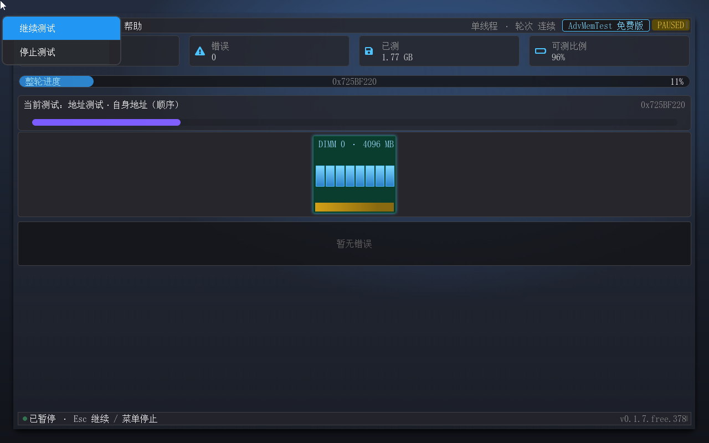

实现上的两个工程细节：单核下暂停即主循环步进器冻结；多核并行时，引导核通过每核邮箱把"暂停"标志广播给所有 AP——AP 正在跑的切片跑完即停，尚未开始的切片在原位悬置，恢复后原样捡起继续，进度一处不丢。暂停期间错误通道与自检日志都不受影响，恢复后照常收割。

## 第四章 错误处理

### 4.1 错误三通道（免费版口径：地址级）

检出错误后，同一个错误同时走三个通道上报（免费版口径）：

- **界面错误日志区**：滚动显示最近 4 行错误，每行含**地址、期望、实际与异或**四项，**无定位后缀**。
- **串口一行 `TEST_FAIL`**：多核模式带 cpu= 号（可直接对接自动化日志采集），行内容**止于 `xor=`**——核号是执行语境而非内存位置，因此保留。
- **DIMM 可视化带与徽章**：DIMM 带保持纯拓扑显示（**错误红标不点亮**），徽章转 FAIL。

免费版的错误记录在**信息源头**就不产生定位字段：错误记录、串口、报告、界面四条链路的定位代码整组不编入免费版二进制，不存在"计算了但没显示"的浅层遮罩——知道地址就够了，地址是维修与返修单上唯一必需的信息。

### 4.2 定位字段为何不出现

想"换哪根条、哪颗芯片"就必须把地址换算成 Socket / Channel / DIMM / Rank / Device 五级坐标，那需要按槽容量份额切槽、槽内按 rank 物理切分、再按设备位宽切颗粒——其中**器件位宽只有 SPD 能提供**（SMBIOS / ACPI 全谱系都没有该字段），而免费版不读取 SPD：镜像里不编入 SPD 栈，零硬件依赖、零总线风险。因此免费版的产物里没有定位字段，也不需要为它承担支持负担。把错误指认到颗粒（含位宽三级标注与"近似映射 / 平台映射"两级口径）、以及把坏页清单直接交给系统屏蔽的能力，见第七章。

## 第五章 测试报告

### 5.1 触发时机

三个时机自动写报告：手动停止测试、跑满指定轮数达标完成、退出程序。同一测试系列只写一份，文件名固定覆盖：`fs0:\advmemtest_report.html`。写盘失败（卷满 / 只读）会在串口与界面打 ERROR 行，测试本身不中断。

### 5.2 内容与字段

报告为 UTF-8 单文件，内联 CSS，浏览器直接打开。三部分内容：

- **汇总区**：版本（含 SKU 段，如 v0.1.7.free.401）、测试模式、轮数、错误总数、可测比例等整场统计。
- **错误明细表**：错误缓冲区现存全部快照——地址 / 期望 / 实际 / 异或四列。错误条数超过 64 条时标注"仅列出前 64 条"上限，总量仍在汇总区体现。
- **DIMM 布局可视化**：按当前平台槽位网格渲染，免费版为纯拓扑展示。

### 5.3 报告示例

无错误版展示整场统计与 DIMM 布局，适合作为验收存档；错误版在明细表逐条列出错误地址与期望 / 实际值，DIMM 布局同步呈现拓扑，适合随返修件流转——维修方打开报告就知道压测覆盖了多少内存、在哪几个地址上读回不一致。带定位列与布局红标的明细形态属专业版（见第七章），本手册的示例图即含该形态，便于对照（该错误版示例图取自专业版会话，图内版本行即专业版产物；无错误版示例图取自免费版会话）。

### 5.4 查看方式

退出 Shell 后，把 `fs0:\advmemtest_report.html` 拷出（或直接从虚拟盘 / U 盘目录访问），用任意现代浏览器打开。报告不依赖本工具即可独立阅读，方便发给厂商或留档。

## 第六章 高级特性

### 6.1 自我重定位

所有内存测试软件都有一个天然盲区：程序自己占用的内存不在测试范围内。advmemtest 的自我重定位把这个盲区也填上了。启动后它先分配一块新内存，把自身镜像整体搬移过去，再释放原区域——原先被自己占用的地址段就此纳入测试。搬移过程在串口输出一行（`relocate: old=... new=... fix=N`，N 为修正条数），并附带更换新的执行栈；测试期间自身处于新区，原区被压测时不会影响执行。边界情形：当整机可分配内存低于 4MB 时放弃重定位（设计降级，测试照常）。

### 6.2 SPD 厂商门控

**以下机制属专业版（免费版中这三条为可读不可执行，见第七章）。**厂商专用测试集（三家内存原厂算法）不是无条件启用的：在具备该能力的版本中，软件读取内存的 SPD 信息（真实平台经 SMBus 读取；QEMU 虚拟环境读不到，降级为读取 SMBIOS Type 17 的厂商字段），按 JEDEC 厂商 ID 前缀匹配白名单——平台厂商为海力士时默认集含海力士算法，三星时含三星算法，美光时含美光算法；匹配失败（包括读不到 SPD 的环境）采取 fail-closed 策略：厂商算法不进入默认集，仅手动勾选才跑。策略要点是"放行而不是封锁"：原厂算法只在匹配的内存上生效，也避免误选造成无效测试。

免费版中这三条属未授权条目（灰显 + 锁标、不可勾选，见第七章），默认集固定为可见的 11 条经典条目、不随厂商匹配变化；免费版也不编入 SPD 读取通路——只用 SMBIOS 记录真值，零硬件依赖、零总线风险。槽位基本信息（槽名 / 容量 / 组织 / 颗粒数 / rank）可在 DIMM 带的悬停 tooltip 摘要中查看。

### 6.3 多核模式降级与边界

多核调度的可靠性设计遵循"能降级、不报错"原则：MP 协议缺席、单核平台、运行中拉起 AP 返回不支持的固件，一律自动降级单核并在状态栏注明；**免费版多核参与数上限 16 核**（按 MP 实探核数取较小者，每核缓冲区按实测核数运行时分配，QEMU 下 8 核实测每核约 2.9KB；分配失败 → 单核降级并注明）。降级只影响吞吐，不改变测试语义与错误通道。QEMU 闭环验证覆盖 ≤16 核（8 核实测、单核降级、Pause/Resume 越界修复补证）。

### 6.4 分辨率自适应

启动时软件先探测系统当前显示分辨率（GOP 模式），不足 1280×800（软件界面的设计目标分辨率）时自动请求系统切到更高显示模式——取"宽高都不低于目标、面积不超过 2 倍"的最大一档，避免切到 4K 把图形缓冲撑爆；若系统没有可用模式或切换失败，则保持当前分辨率继续运行（降级），串口与日志都会注明。切换发生在图形界面初始化之前，因此不会出现界面闪烁或尺寸错位。低分辨率降级时窗口内容按比例收缩，极端小分辨率下内容可能超出屏幕——这是降级后的已知边界，建议最小 1024×768。

### 6.5 设置持久化

用户设置（Pattern 勾选、线程模式、轮数上限）在修改确定时自动写入本软件所在目录下的 `ADVMTEST.CFG`（文本格式，一行一个设置）。下次启动自动读取：文件存在且内容正确时恢复到上次设置，文件缺失、损坏或卷不支持写入（当前 UEFI 文件协议仅支持 FAT 系卷）时回退到默认值——设置保存失败不影响正常使用，仅在串口以 WARN 提醒。配置文件里属于未授权能力的项（锁定 pattern 位、缓存旁路位、注入位）会被免费版忽略并在串口以 WARN 提醒，不会污染本版行为；游离在能力之外的模式取值（如顺序轮巡 / 轮流）会被钳制回单线程并在串口输出一行（`thread mode locked (Free)`），状态栏按实际模式显示——即降级而不报错。

## 第七章 升级到专业版

免费版覆盖经典测试集；当工作内容跨过"这台机器能不能用"进入"哪根条、哪颗芯片坏了、要不要向厂商索赔"，专业版把测试面与证据链都再推一层：**测试面铺到工程显影级**（行锤、时序窗口、地弹、原厂算法深度搜索），**错误指认精确到芯片**，**坏页清单可直接交给操作系统屏蔽**。

### 7.1 专业版能力速览

- **颗粒级错误定位**——错误地址换算为 Socket / Channel / DIMM / Rank / Device 五级坐标，界面错误日志、串口 TEST_FAIL 行与 HTML 报告三处口径一致；DIMM 带与报告的出错槽位红边、出错颗粒红点同步"指认"故障芯片，定位粒度对标 Memtest86 Pro 的 Site（颗粒/位）级。器件位宽的精度三级（真值 / 推测 / 未知）与"近似映射 / 平台映射"两级口径同时外显，推测值绝不当事实呈现。
- **31 条 pattern 全量可执行**——在免费版 11 条经典条目之上，增加 AMT 系工程序列（MATS8 三相位变体、XMATS8/16、WCMATS8/WCMCH8、GNDB64、MARCHCM64、TWR、DATA_RET、SCRAM_X2）、通用行锤、三家内存原厂专用算法（受 SPD 厂商门控，匹配才进默认集、任何时候可手动放行）、以及两条蓝本之上的增补条（32/64 位档走滑，默认不勾选）。Pattern 对话框中全部 29 行正常可勾选，无锁标。
- **两档额外调度**——顺序轮巡（每条 pattern 由全部核轮流各跑一遍全量，适合逐核核验与对照诊断）与轮流（以 (pattern, 核) 为最小单元全局轮转，适合控制变量式的分核诊断）。
- **SPD 深度信息页**——全屏 SPD 解码页：平台判定 / 通路 / 数据源三枚状态徽章 + 槽位档案（基础信息 / 厂商与标识 / CRC 对账三态），六后端（I3C-CSR / BDAT / SPD5-I3C / ZX-I2C / SMBus / Null 保底）按平台逐级探测、先到先得；无通路时呈现一等公民的 SMBIOS 摘要降级态。
- **内存带宽基准**——读 / 写 / 拷贝三卡实时带宽，独占 32MB 独立块自取自还，与测试运行态解耦；结果随下一次报告落盘。
- **禁用缓存测试模式**——置 CR0.CD 缓存旁路并广播至各 AP，避免缓存把抖动与单元故障"盖住"，直击读回校验的存储阵列真值。
- **坏块清单导出**——随报告同点写出 `badram.txt`（BadRAM 格式 `badram=F,M`，页粒度、2 的幂次合并）与 `badmemorylist.txt`（Windows BCD `bcdedit /set {badmemory}` 命令，扁平 PFN 列表），把"哪些页别再用"变成一条命令。
- **多核上限 512 核**——按 MP 实探核数取 min(探测, 512)，每核邮箱与错误缓冲按实测核数运行时分配（512 核约 1.5MB 级）。
- **授权安装**——专业版须持有随证交付的授权文件方可启动（RSA-2048 离线验签、无需联网、无需注册）；安装细节随证说明，无授权文件时专业版会拒绝启动并给出原因。

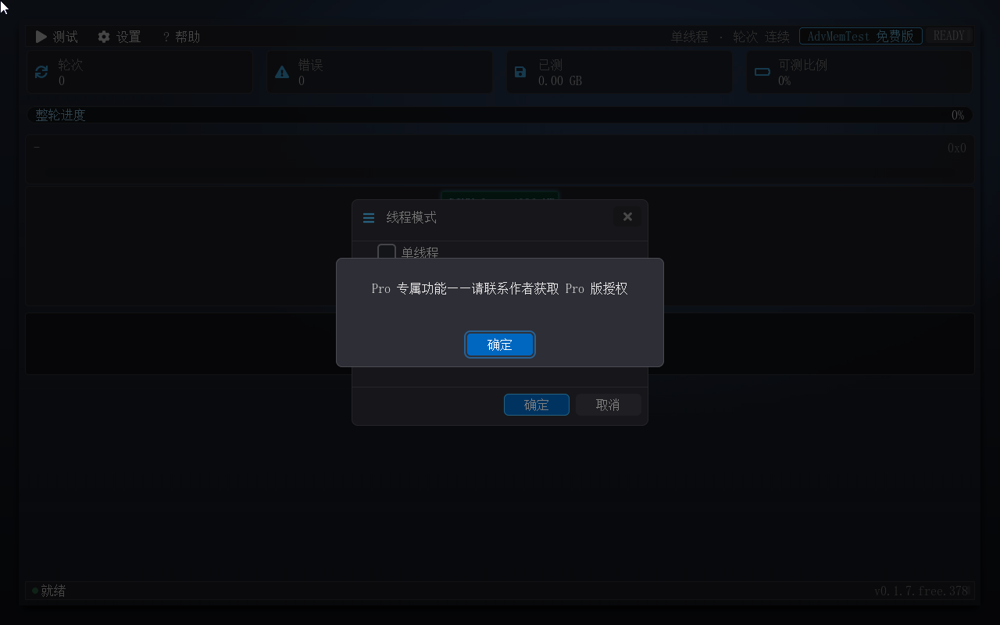

上图是免费版里"可读不可执行"的形态：条目内容可读、焦点圈可落，勾选框灰显 + 锁标，按下回车即弹出获取途径的提示（完整画面见 3.3 的 Pattern 选择对话框与 3.4 的线程模式对话框）。这条机制在免费版中同样诚实——不会"算出来再藏起来"，而是明确标出能力边界。

### 7.2 授权条款与获取途径

免费版供个人用户免费使用；商业用途（营利性部署 / 分发 / 预装）需取得专业版授权。**获取途径：请联系作者**（升级咨询、批量授权、按需报价与试用证一并受理）。

## 第八章 常见问题

**为什么"可测比例"不是 100%？** 因为固件头部预留了 128MB 不纳入测试，加上固件自身占用的区域，可测内存与物理内存存在固定差值。这是 UEFI 应用的根本约束——被测内存必须向固件申请，测完归还；工具自己占用的区域（重定位后为新区）也计入差值。可测比例在测试中不变化，真实比例以实测为准。

**报告在哪个位置？** `fs0:\advmemtest_report.html`，停止 / 跑满轮数 / 退出三时机自动写入，同系列固定名覆盖。找不到时先确认 Shell 当前盘是 fs0:，再用 `ls fs0:` 查看。

**测试大概要跑多久？** 取决于内存容量、pattern 条数与核数。粗估公式：单核全量一轮 ≈ 内存容量 ÷ 吞吐（不同 pattern 差异很大，Bit fade 这类静置型 pattern 单条时长显著拉长）；多核切分并发按约 2.5×（4 核实测）折算。精确时长以实测为准——这也是为什么建议先跑一轮小容量 / 少 pattern 的组合做时间预算。

**免费版能做什么，多出来的能力是什么？** 免费版可执行 11 条用户可见的经典测试条目（另 2 条引擎自检参考条不对外展示），支持单线程 / 多线程两档调度与自我重定位，报告与串口口径为地址级；专业版在其上增加颗粒级定位、31 条 pattern 全量、SPD 深度页、带宽基准、禁用缓存、坏块清单导出与 512 核扩展。详见第七章。

**错误注入演示在免费版里有吗？** 没有——注入演示（故意翻转一位以演练完整错误上报链路）属未授权能力，免费版不提供该入口。能力边界与获取途径见第七章。

**16 核以上的平台只用了一部分核？** 免费版按 16 核封顶参与调度，多余核心不参与。降级不影响正确性，只影响吞吐。

**按了 Esc 测试停止了，岂不是白跑了？** 不会：运行中按 Esc 只是**暂停**——进度、错误现场全保，再按一次 Esc 即从原地址继续。只有主动点"测试 → 停止测试"才会真正结束测试系列并写报告，所以不需要担心误触白跑。

## 附录 A 对话框速查

| 对话框 | 打开方式 | 一句话说明 |
|---|---|---|
| 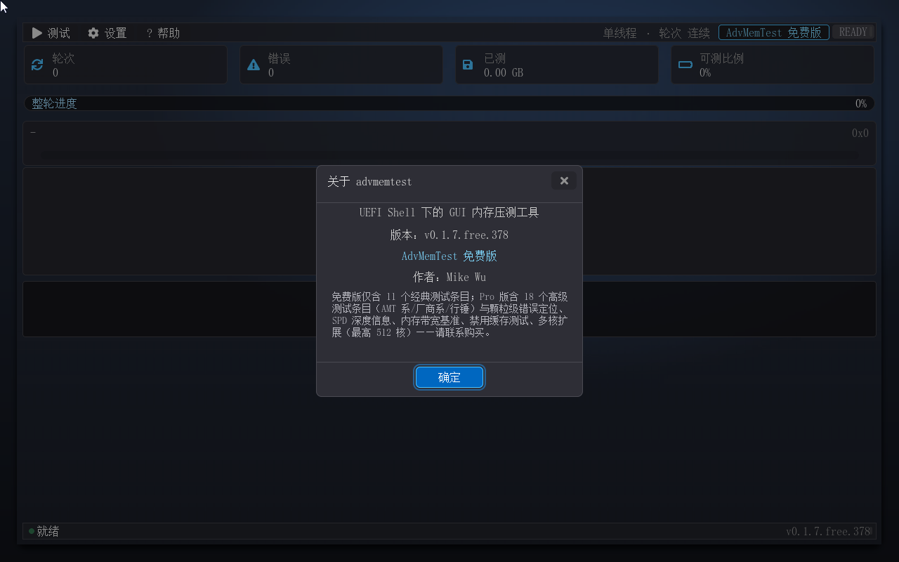 | 帮助菜单 / F1 | 版本、构建号、版权信息与升级导流段 |
|  | 设置 → 测试 Pattern 选择... | 29 条用户可见 pattern 按类勾选，默认集为可见 11 条；未授权条目灰显 + 锁标 + 提示 |
|  | 设置 → 线程模式... | 单线程 / 多线程两档可选；未授权的两档灰显 + 锁标 + 提示 |
|  | 设置 → 测试配置... | 轮数上限 1–99 或连续运行 |
|  | 空闲时按 Esc，或 帮助 → 退出 | 确认退出；Esc 在运行中是暂停/继续、不弹确认框，"帮助 → 退出"任何时候（含运行中）都直达确认框；停止测试走菜单"停止测试" |

所有对话框打开时 Tab 焦点锁定在对话框内循环，Esc 按"消息框 → 对话框 → 主窗口"顺序逐级关闭。

## 附录 B 版本与发布信息

- **当前版本**：0.1.7（免费版）。构建号随每次构建递增，`APP_VERSION=v<版本>.<sku>.<构建号>`（如 v0.1.7.free.401）输出于界面固定角落与串口，可与构建记录核对。
- **发布物**：`AdvMemTestFree.efi`（单文件，无外部依赖、无授权文件要求）、**可直接启动的 ISO**（`advmemtest-free.iso`，刻 U 盘 / 挂 BMC 虚拟光驱即用，不需要先有 UEFI Shell；使用前请先关闭 Secure Boot）、本手册（`user-guide-free.md`）与简版 `quick-guide.md`、报告样例截图。
- **ISO 路径的三条实测口径**：① 光盘只读——报告与坏块清单写不进去，串口给一行 `WARN: report write failed: Write Protected`，程序不崩、测试不中断，需要报告文件请把程序目录拷到可写盘上跑；② 程序"退出"后回到固件引导流程（QEMU/OVMF 实测落在启动设备选择菜单，未自动重引导本盘；若该盘在启动顺序里仍列首位则可能重新引导），离开测试请断电、改启动顺序或拔盘；③ 只读盘上设置（`ADVMTEST.CFG`）同样存不下来，当次运行照常。
- **已知边界（以实测为准）**：**器件位宽只有 SPD 能提供，免费版不读取 SPD，一律按 x8 推测并在界面 tooltip 强制标注"（推测）"**（位宽未知时不印位宽与颗粒数）；QEMU 虚拟环境读不到真实 SPD，厂商门控不参与免费版默认集；多核上限 16 核；自我重定位在可分配内存低于 4MB 时放弃；分辨率降级后极端小屏可能超出屏幕；颗粒级定位、坏块清单导出、SPD 深度页、带宽基准、禁用缓存等能力不在本版内（见第七章）。
