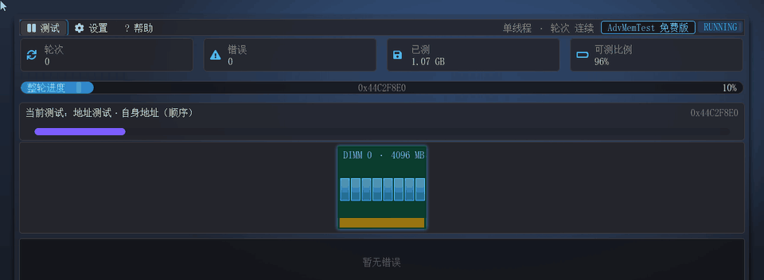
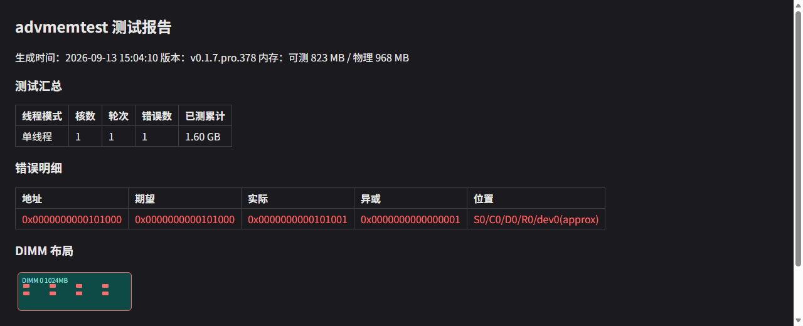
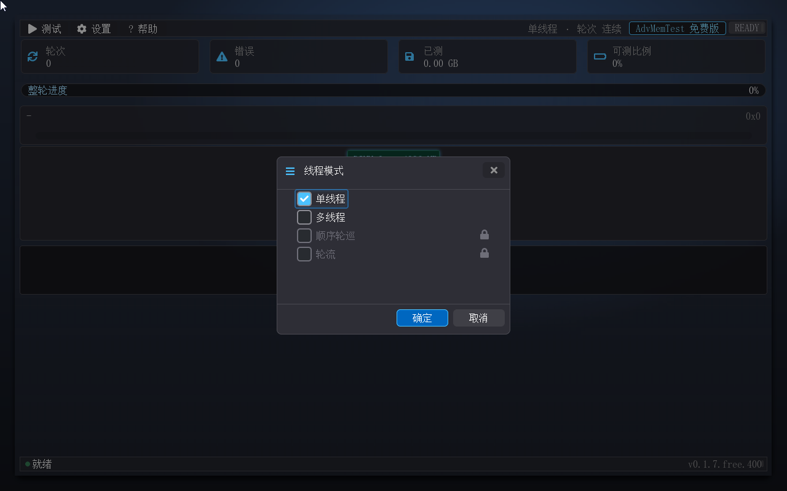
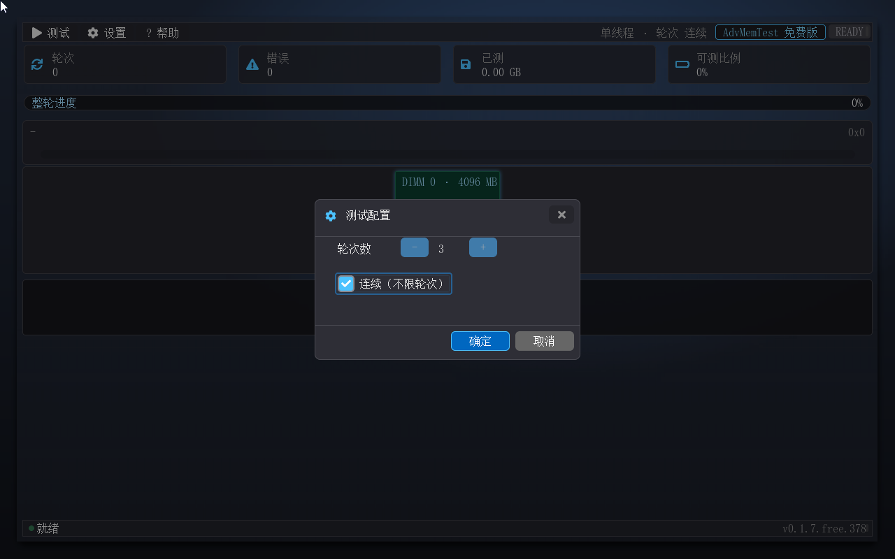
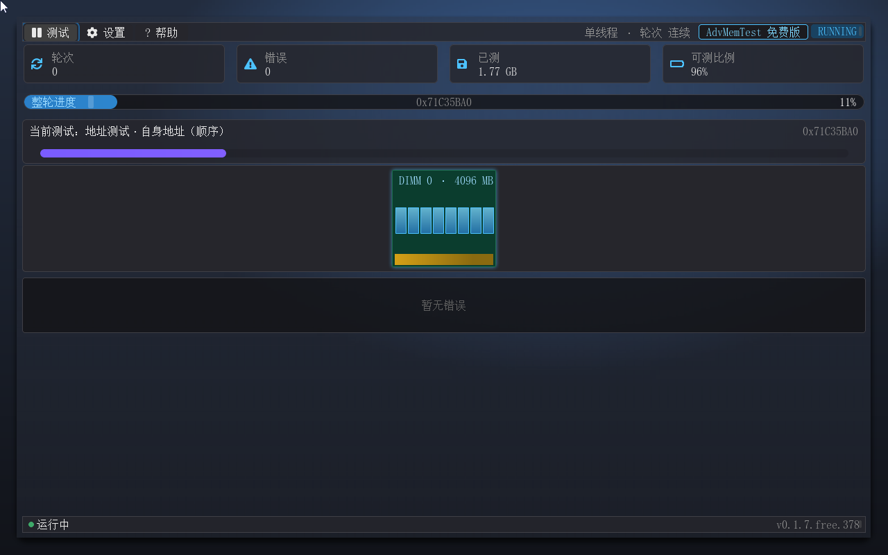
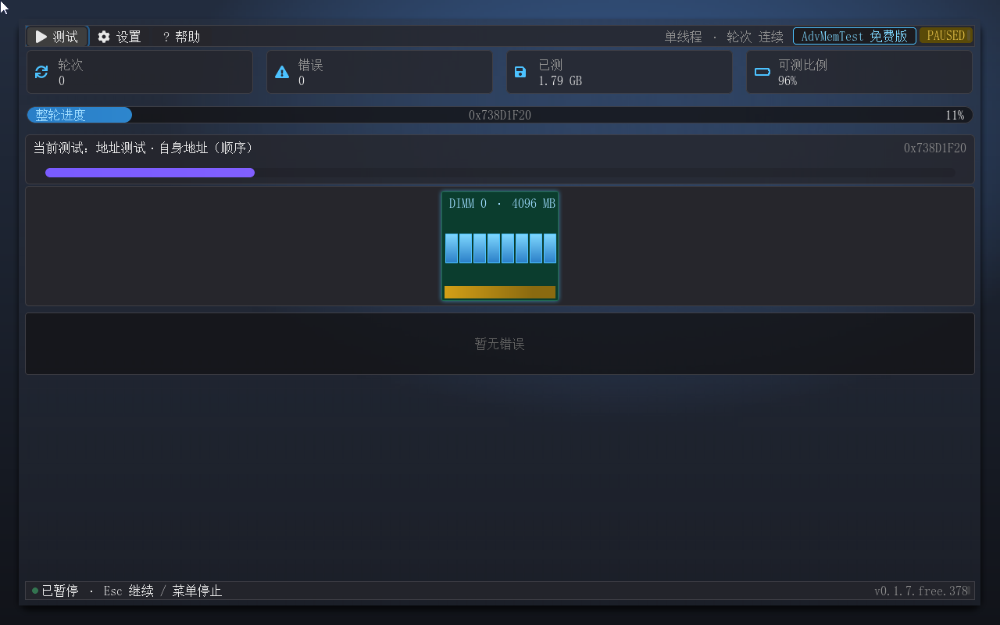
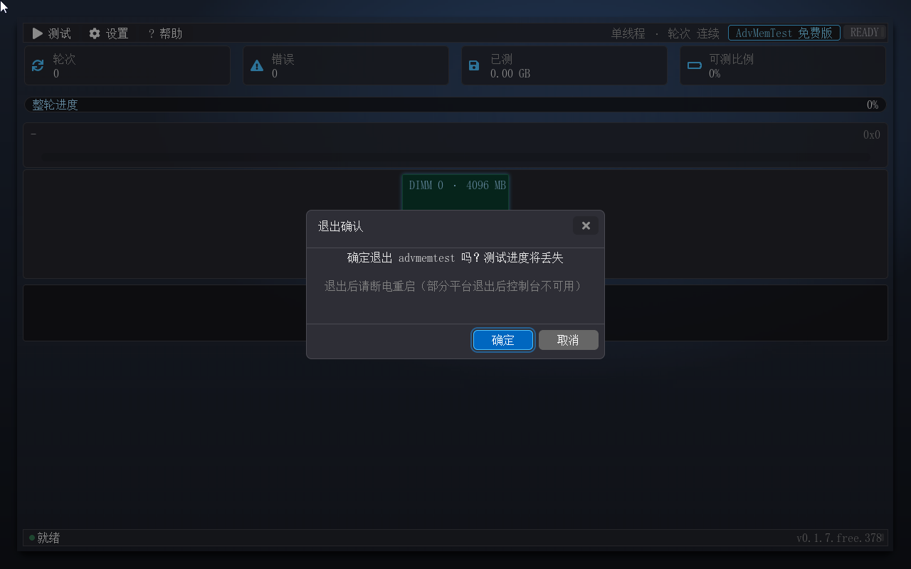

# advmemtest 快速上手

版本 0.1.7+401（Free / Pro 双 SKU）· 适用环境：X64 UEFI Shell

## 前言

上面这张动图把 advmemtest 的完整功能链串了一遍：从主界面出发，经过 Pattern 选择、线程模式、测试配置，到多核运行、错误注入演示，最后落到 HTML 报告。看一遍动图，再对照本文的五步快速上手，十几分钟就能跑起第一次完整测试。

## 产品简介

advmemtest 是一款运行在 UEFI Shell 下的内存压力测试工具，对标 Memtest86 全家，以 Free / Pro 双版本发行：**免费版**11 条用户可见经典测试条目（另有 2 条引擎自检参考条不对外展示）、个人免费使用；**专业版**31 条全量条目，再加颗粒级错误定位、SPD 深度信息、带宽基准、禁用缓存、顺序轮巡/轮流多核模式、512 核多核扩展与坏块清单导出，商业用途需授权。两版均无外部依赖——单个 efi 文件拷进 Shell 即可运行，全简体中文界面，鼠标与键盘双路操作，面向服务器、工作站的装机验收、故障排查与返修质检。

它可以浓缩成三句话：**错误定位细到内存颗粒（Pro）**、**测试覆盖包含软件自身**、**多核模式真实并发**。主流内存测试工具给不出颗粒定位，测不到自己占用的内存，多核也只是逐核轮巡。这三个差异正是下文"独家功能"的展开主线。

## 独家功能

**错误定位到颗粒（Pro 版）。** 主流工具报错只给一个地址，advmemtest 把错误地址换算成 Socket/Channel/DIMM/Rank/Device 五级坐标——直接指出"哪根内存条上的哪个颗粒坏了"。错误发生时错误日志区滚动、DIMM 带对应颗粒泛红光晕、徽章转 FAIL，三通道同时呈现。免费版错误只到地址（定位信息源头不产生）。

**自我重定位。** 运行中的程序会把自己占用的内存排除在测试之外，这是所有内存测试软件的天然盲区。advmemtest 启动后先把自身镜像整体搬移到新地址、释放原区域，把自己"占过的地方"也纳入测试，对内存的覆盖不留死角。

**多核真实并发。** 单线程之外提供三条多核模式：多线程（内存按核切段、并行压测，4 核实测吞吐约 2.5 倍）、顺序轮巡（每核全量轮流跑一遍）、轮流（pattern 与核心对轮转）。Memtest86 只有轮巡，advmemtest 是真实的切分并发。多核机器上起测默认即全核并行（免费版上限 16 核，专业版按系统核数实探、上限 512 核）。

**厂商专用测试集（Pro 版）。** 内置海力士（SKHYNIX）、三星（SAMSUNG）、美光（MICRON）三家原厂算法。软件读取 SPD 厂商信息后自动把默认测试集与内存品牌对齐——同品牌内存自动跑同品牌的原厂算法。

**HTML 报告落盘 + 坏块清单（Pro）。** 停止测试、跑满指定轮数或退出时，自动把整场测试写成 `fs0:\advmemtest_report.html`：汇总统计、错误明细（Pro 含颗粒定位，Free 仅地址）、DIMM 布局可视化一页呈现，浏览器直接打开，适合存档和随返修件流转。Pro 版同时导出 `badram.txt`（Linux BadRAM 格式）与 `badmemorylist.txt`（Windows bcdedit 命令）两份坏块清单。

**注入演示（Pro 版）。** 一项"体验功能"：在设置里勾选，或用 `advmemtest.efi inject-demo` 启动，软件会故意注入一条错误，把"错误上报 → 日志 → 红标 → 报告"的完整链路演示一遍。教学、验收、自检皆可用。免费版无该入口（参数与配置位均被忽略）。

## 功能一览

| 功能 | 说明 | 配图 |
|---|---|---|
| 主界面 | 菜单栏 + 四统计卡 + 整轮进度条 + 当前测试卡 + 动态 DIMM 可视化带（含 SKU 徽标）+ 错误日志区 |  |
| Pattern 选择 | 29 条用户可见 pattern 按类勾选（Free 11 条可执行 + Pro 域锁标）：地址 / memtest86+ 系 / AMT 系 / 行锤 / 厂商系 |  |
| 线程模式 | 单线程 / 多线程 / 顺序轮巡 / 轮流 四选一（Free 版后两模式锁标、Pro 专属），多核缺席自动降级并注明 |  |
| 测试配置 | 轮数上限 1–99 或连续运行；Pro 版含"禁用缓存测试模式" |  |
| 运行监控 | 整轮进度条、已测累计字节、当前测试卡、DIMM 带光晕流动 |  |
| 暂停 / 继续 | 运行中按 Esc 或菜单"暂停测试"即暂停（进度现场全保），再按 Esc 或"继续测试"恢复——停止入口只有一个 |  |
| 错误三通道 | 错误日志区 + 串口 TEST_FAIL 行 + 颗粒红光晕，徽章转 FAIL | — |
| DIMM 可视化 | SMBIOS 动态槽位（最大 48，空槽置灰 + 分组头），颗粒图标，活动槽光晕，悬停 tooltip |  |
| HTML 报告 | 停止 / 达标 / 退出三触发写盘，错误明细 + DIMM 布局 |  |
| 内存信息（Pro） | 设置→内存信息…：SPD 深度解析（平台 / 通路 / 数据源 + 槽位档案 + CRC 对账） | — |
| 带宽基准（Pro） | 读 / 写 / 拷贝三卡实时带宽 | — |
| 注入演示（Pro） | 勾选体验功能或 inject-demo 参数，演示错误上报全链路 | — |
| 退出 | 空闲 Esc 或"帮助 → 退出"弹退出确认；运行中 Esc 是暂停/继续 |  |

## 快速上手

从拷入文件到跑完一轮测试，只需要五步。

**第一步，拷入 Shell。** 把版本对应的 efi（`AdvMemTestFree.efi` 或 `AdvMemTestPro.efi`）复制到 UEFI Shell 所在盘（通常就是 fs0:）；Pro 版同时拷贝授权文件 `ADVMTEST.LIC` 到同目录。**第二步，启动。** 在 Shell 提示符下输入文件名回车；也可以写进 `startup.nsh`，开机进 Shell 自动运行。**第三步，起测。** 连按两下回车：第一下展开"测试"菜单，第二下选中"开始测试"（鼠标点菜单效果相同）。测试即刻开始，默认集已含全部适用 pattern，多核机器自动全核并行。**第四步，看进度。** 关注整轮进度条与"已测"统计卡；DIMM 带上光晕流动的位置，就是当前正在压测的内存区域。**第五步，暂停、停止与退出。** 运行中按 Esc 是暂停测试——进度、错误现场全保，再按 Esc（或点菜单"继续测试"）恢复，不用担心按错把工作白做；要真正停止，打开"测试"菜单选"停止测试"（停止的同时自动写报告）。要退出程序：空闲时按 Esc，或走"帮助 → 退出"——后者测试跑着也能直达退出确认框（确认后即退出，未跑完的进度会丢）。另外，"停止测试"在尚未开始测试时是灰显不可点的，起测后恢复可点。

报告位置：`fs0:\advmemtest_report.html`（Pro 版另有 `badram.txt` / `badmemorylist.txt`），退出 Shell 后用浏览器打开即可。

## 运行环境与发布信息

- **运行环境**：X64 UEFI 固件，通过 BIOS 设置或启动菜单进入 UEFI Shell；鼠标与键盘均可操作；界面全简体中文。
- **操作说明**：菜单与对话框以键盘 Tab（焦点循环）/ 上下键 / 回车为主，**鼠标滚轮同样可用**——指针悬停在滚动容器（对话框清单、帮助正文等）上滚动滚轮即可，容器内的提示条会给出用法（"鼠标滚屏：滚轮滚动，或按住左键拖动"）；侧边滚动条为显示指示件。退出后部分平台控制台不可用属固件行为，断电重启即可。
- **发布形式**：`AdvMemTestFree.efi` / `AdvMemTestPro.efi` 双产物（单文件无外部依赖，版本 0.1.7）。启动画面固定角落与串口输出 `APP_VERSION=v<版本>.<sku>.<构建号>`（如 v0.1.7.free.401），可与构建记录核对。
- **技术特性速览**：31 条真实 pattern（Free 用户可见 11 条；2 条引擎自检参考条不对外展示；增补条默认不勾选）；四线程模式（MP Services 真实多核调度，顺序轮巡/轮流两模式 Pro 专属，Free 上限 16 / Pro 上限 512）；SMBIOS 动态 DIMM 可视化带（最大 48 槽）；Pro 版 SPD 深度内存信息页、厂商门控、颗粒级错误定位、带宽基准、禁用缓存、坏块清单导出；自我重定位；HTML 报告；分辨率自适应（≥1280×800 自动索取）；设置持久化（ADVMTEST.CFG 与软件同级存放）。
- **许可证**：免费版个人用户免费使用；专业版商业用途（营利性部署 / 分发 / 预装）需授权——升级途径：请联系作者（详见免费版技术手册 `advmemtest-free-user-guide.md` 第七章）。
- **颗粒定位精度**：在真实服务器平台上以固件 MRC 的地址交错映射为准（"近似映射 / 平台映射"两级标注见免费版技术手册 7.1）；本手册所述行为以 QEMU 验证环境为基准，真机差异以实测为准。
