# advmemtest 快速上手

版本 0.2.2+914（Free / Pro 双 SKU）· 适用环境：X64 UEFI Shell

> 0.2.2/914：Intel Server 温度改读 IMC CLTT；SPD 位宽按 DeviceLocator 的 0/1 基 DimmId 对账；新增 `ecc path:` 取证行；报告位宽非 SPD 真值时标“（推测）”；会话趋势 0 轮/手动停止判 STOPPED。

## 前言

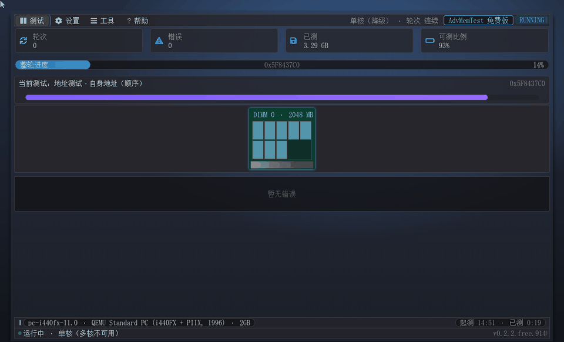

上面这段动图是 0.2.2（Build 914）的 1280×800 主界面在连续压测中的实录：四菜单布局、整轮进度、当前 pattern 与地址切换、DIMM 带和底部平台信息条/计时。对话框与报告的完整操作路径见后文五步快速上手；十几分钟就能跑起第一次完整测试。

## 产品简介

advmemtest 是一款运行在 UEFI Shell 下的内存压力测试工具，对标 Memtest86 全家，以 Free / Pro 双版本发行：**免费版**14 条用户可见经典测试条目（另有 2 条引擎自检参考条不对外展示）、个人免费使用；**专业版**36 条全量条目，再加颗粒级错误定位、SPD 深度信息（含温度/ECC 明细与位宽回填）、带宽曲线、MLC 延迟/带宽矩阵、ECC 错误注入（Server 实验）、禁用缓存、顺序轮巡/轮流多核模式、512 核多核扩展与坏块清单导出，商业用途需授权。两版共享 0.2.0 的新设置页（错误阈值/蜂鸣/规模百分比/预设 + 可滚动小屏布局）。两版均无外部依赖——单个 efi 文件拷进 Shell 即可运行，全简体中文界面，鼠标与键盘双路操作，面向服务器、工作站的装机验收、故障排查与返修质检。

它可以浓缩成三句话：**错误定位细到内存颗粒（Pro）**、**镜像自搬移 + 固定 64KB 自管新栈（栈水位可观测）**、**多核模式真实并发**。主流内存测试工具给不出颗粒定位，多核也只是逐核轮巡。这三个差异正是下文"独家功能"的展开主线。

## 独家功能

**错误定位到颗粒（Pro 版）。** 主流工具报错只给一个地址，advmemtest 把错误地址换算成 Socket/Channel/DIMM/Rank/Device 五级坐标——直接指出"哪根内存条上的哪个颗粒坏了"。下图是错误注入演示：错误日志区滚动、DIMM 带对应颗粒泛红光晕、徽章转 FAIL，三通道同时呈现。免费版错误只到地址（定位信息源头不产生）。

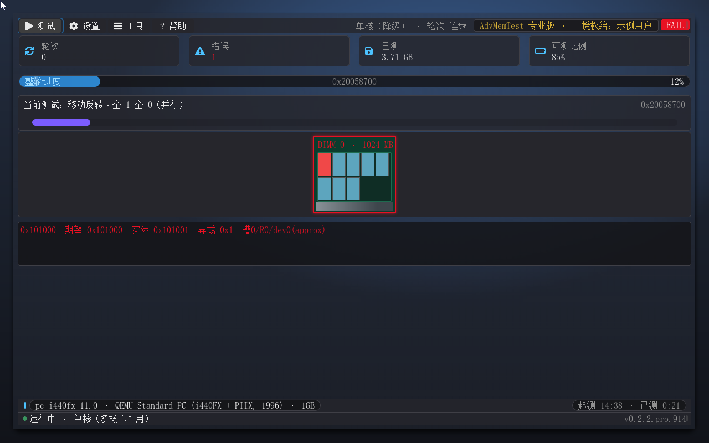

**自我重定位。** 运行中的程序会把自己占用的内存排除在测试之外，这是所有内存测试软件的天然盲区——advmemtest 不改变这个前提（工具自身占用不参与测试，与同类工具一致），但把**自管部分的运行状态**变成了可观测：启动后它把自身镜像整体搬移到新地址、换到一块**固定的 64KB 自管新栈**，运行栈的深度即水位读数（串口 `stack: … used=n/65536`，栈溢出可见）。原镜像区**保留不释放**——它属固件装载器所有，固件卸载镜像时仍要读它并负责回收；工具提前释放会造成退出乱码/挂死（2026-10-05 真机反馈修复）。

**多核真实并发。** 单线程之外提供三条多核模式：多线程（内存按核切段、并行压测，4 核实测吞吐约 2.5 倍）、顺序轮巡（每核全量轮流跑一遍）、轮流（pattern 与核心对轮转）。Memtest86 只有轮巡，advmemtest 是真实的切分并发。多核机器上起测默认进入多核并行模式：**切分类（PAR_SPLIT）pattern 全核并发**；**轮换类（PAR_ROTATE）pattern 缺省只由 1 核跑完整内存**（覆盖等价、不做 ×N 重复全量，CFG `par.rotate.cores` 可调宽）。免费版上限 16 核，专业版按系统核数实探、上限 512 核。

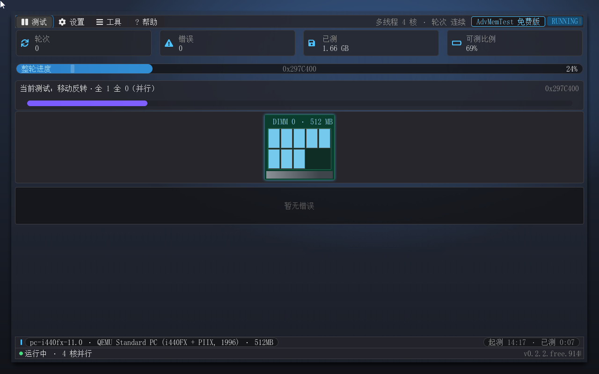

**厂商专用测试集（Pro 版）。** 内置海力士（SKHYNIX）、三星（SAMSUNG）、美光（MICRON）三家原厂算法。软件读取 SPD 厂商信息后按白名单放行——**union 语义**：只要认得出内存厂商（任一槽命中白名单），**这三条原厂算法就一并进默认集**（不是"逐条对上哪一家"）；读不到厂商信息时三条全不选、仅手动勾选才跑。

**HTML 报告落盘 + 坏块清单（Pro）。** 停止测试（含错误阈值自动停止）、跑满指定轮数时自动把整场测试写成**第一个 SFS 卷根（通常 `fs0:`；串口行固定打印 `fs0:`）**下的 `advmemtest_report.html`（退出时仅在本次系列已有错误且尚未写过报告时补写）：汇总统计、错误明细（Pro 含颗粒定位，Free 仅地址）、错误位分布、累计覆盖、DIMM 布局可视化一页呈现，浏览器直接打开，适合存档和随返修件流转。每个测试系列起测时就在同目录创建/清空机器可读的 `ADVERR.CSV`（全部 pattern 比对错误，8 列流式写全，不受报告表格条数限制；Free 版定位列恒空，Pro 版带颗粒定位、定位无效时该列留空）；Pro 另有 `ECCERR.CSV`（全部 CE/UE 事件，9 列流式写全）。报告表格只展示摘要（Pro 条数由 `report.max` 控制，缺省 16；Free 固定 64 条快照），顶部链接对应 CSV（Pro 两个、Free 一个）。Pro 版同时导出 `badram.txt`（Linux BadRAM 格式）、`badmemorylist.txt`（Windows bcdedit 命令）与 `badram_grow.txt`（**实验性生长档 A/B 对照**——可能过度覆盖健康页，仅供对照，**勿直接用于内核屏蔽**；严格档口径不变、仍是唯一推荐产物）三份坏块清单，报告与串口各给出 A/B 摘要（不自动择优），温度曲线上另按与曲线同轴的真实时间标出错误时刻红点（含起测前/暂停，不是 `TEST_FAIL` 的已测时刻）。

**报告与日志设置（设置 → 报告与日志…）。** Pro 可改报告最多显示错误条数（`report.max`，缺省 16，1–64）与错误清单保存上限（`error.max`，缺省 10000，1–1,000,000；`ADVERR.CSV` 与 `ECCERR.CSV` 合计，达到后停止追加，DIMM 错误标记仍全量）。两版都可在同一对话框打开**进度诊断文件**（`PROGRESS.LOG`，**默认关闭**）：勾选后写起测/停止、每条错误/ECC（ECC 行仅 Pro）与周期进度行；周期 = max(`status.interval`, 60) 秒，STATUS 关档 60 秒兜底，**没有 1 秒轮询**。Free 的两个上限项灰显锁定；进度文件的错误行只有地址、无颗粒定位。

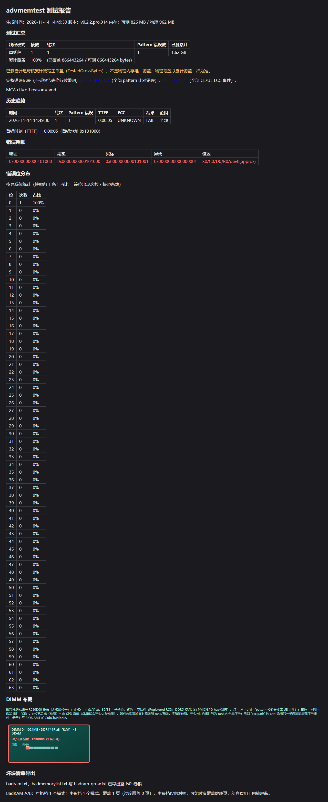

**注入演示（Pro 版）。** 一项"工具 → 软件错误演示"：在工具菜单勾选，或用 `advmemtest.efi inject-demo` 启动，软件会故意注入一条错误，把"错误上报 → 日志 → 红标 → 报告"的完整链路演示一遍。教学、验收、自检皆可用。免费版无该入口（参数与配置位均被忽略）。

## 0.2.0 新增速览

**设置页补齐并适配小屏。** 设置 → 测试配置现在有错误处理（`stop.after.errors` 1–9999 + 首错停止、`beep.on.error`）、测试范围与规模（`test.limit.pct` 1–100%、预设 自定义/快速/标准/耐久）两组新控件；正文可滚动、footer 固定、滚动条可拖、Tab/Shift+Tab 全控件可达。最终 914 产物已在 1280×800、1024×768、800×600 三种分辨率取证（详版免费手册 3.5/3.5.1）。

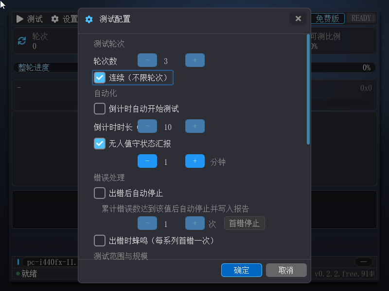

**MLC 延迟/带宽矩阵（Pro）。** 工具菜单打开只读诊断：SRAT/SLIT 节点拓扑、N×N 随机指针链延迟、读/写/拷贝带宽、全核加载延迟、cache-to-cache；对话框、报告与串口 `MLC:` 行同源。无 SRAT 退单节点；不写 MSR/IMC、不碰测试缓冲。

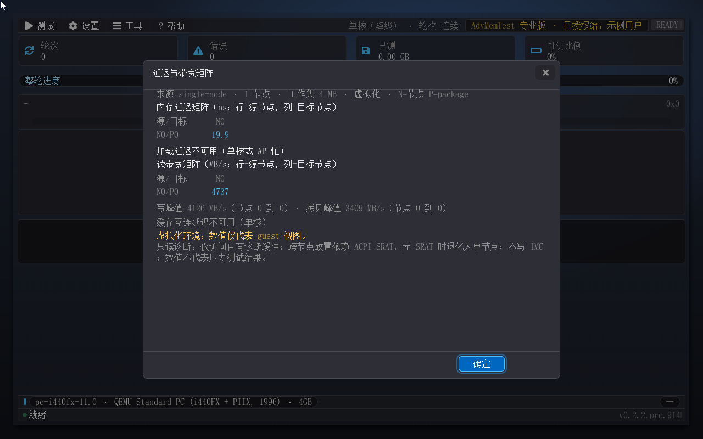

**ECC 硬件错误注入（Pro，Server 专用，实验/危险）。** 默认 dry-run；真正写 MCA 寄存器必须显式 `-go` 或勾选风险确认，QEMU 可用 `-mock`。走 BIOS MCEJ/AMEI + SW SMI，不直写 SMM-only 的 MSR 1E3h/1E4h；平台门按 McaBankMap，Client/AMD/未知 fail-closed。真实注入只有 EGS/BHS 真机项。

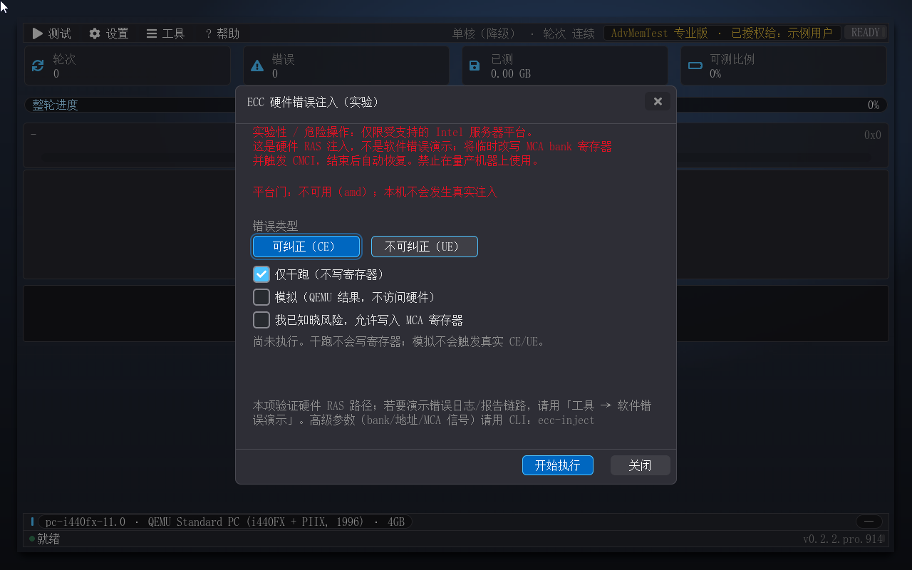

**SPD 位宽回填（Pro）。** 起测前用 SPD/BDAT/I3C 真值回填 `WidthSource=SPD`；实际宽度不符合平台期望时打 `WARN: spd width policy platform=… slot=… width=… expected=…`。Free 仍按平台大类推测并标"（推测）"。QEMU 无 SPD，正值证据在真机。

**导入 TM5 配置（两版）。** 工具 → "导入 TM5 配置..."：扫描可读卷的 `.cfg`，解析 `[Main Section]`/`[TestN]`，按语义映射到本工具 pattern，**未映射条目显式跳过并点名**；预览显示映射/跳过/轮数，确认后才替换 Pattern 与轮数。CLI：`advmemtest.efi tm5-import <file> [-apply]`。映射是语义近似，TM5 逐项重复顺序不保留。

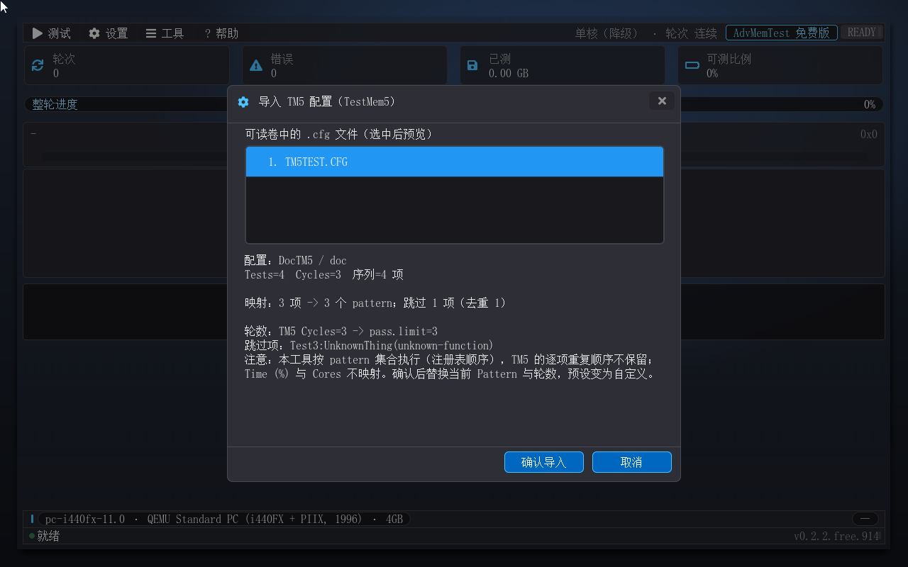

**F6 热键快照（两版）。** 空闲/运行/暂停按 **F6**，在卷根写编号报告 `advmemtest_report_0001.html` + 截图 `advmemtest_snap_0001.bmp`（递增不覆盖；不写 CSV/坏块/sessions）。状态栏提示 5 秒；串口 `snapshot: result=ok|partial|fail ...`。对话框/下拉打开时 F6 归模态层；无卷/只读卷明确失败。

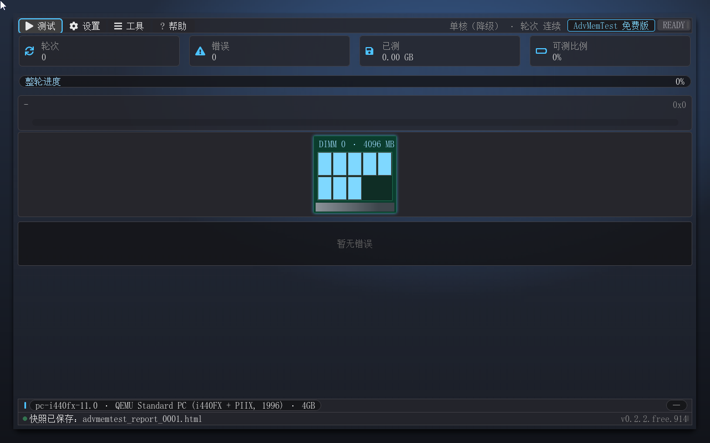

## 功能一览

| 功能 | 说明 | 配图 |
|---|---|---|
| 主界面 | 菜单栏 + 四统计卡 + 整轮进度条 + 当前测试卡 + 动态 DIMM 可视化带（含 SKU 徽标）+ 错误日志区 | 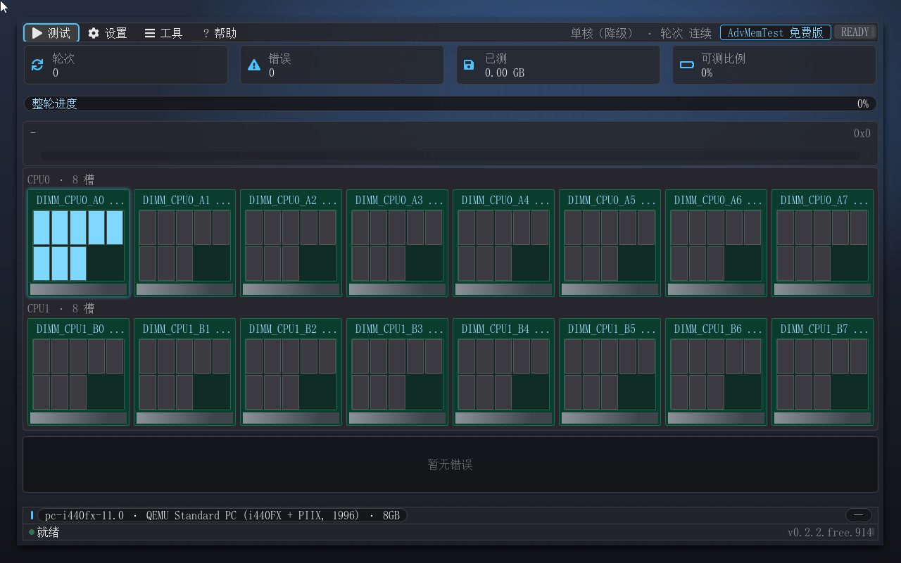 |
| Pattern 选择 | 36 条 pattern 按类勾选（Pro 用户可见 34 条；Free 用户可见 14 条可勾选 + Pro 域锁标）：地址 / memtest86+ 系 / 行锤 / Advanced 系 / 厂商系 / SIMD 宽访存 / 总线应力、缓存驻留与 BG 条纹 | 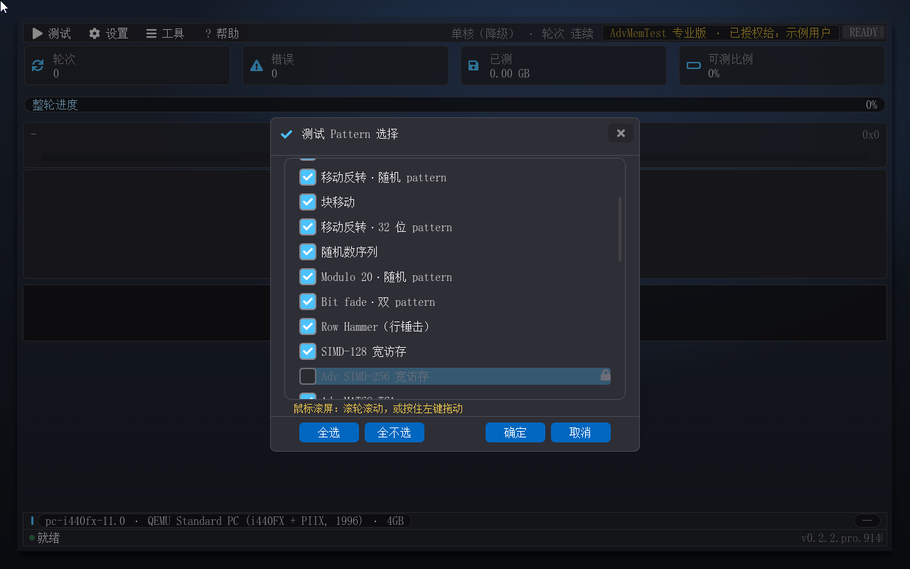 |
| 线程模式 | 单线程 / 多线程 / 顺序轮巡 / 轮流 四选一（Free 版后两模式锁标、Pro 专属），多核缺席自动降级并注明 | 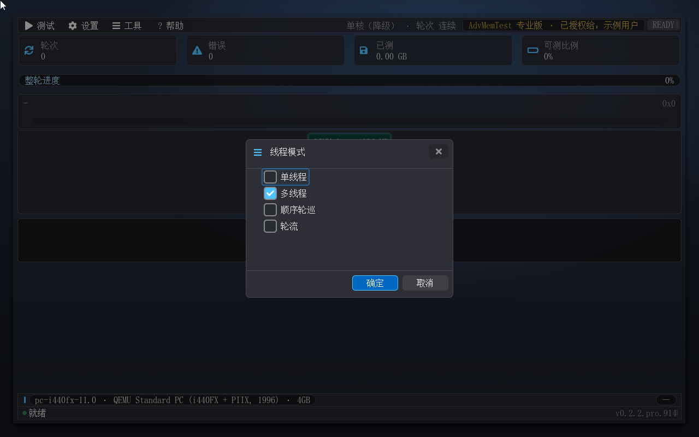 |
| 导入 TM5（0.2.0，两版） | 工具 → 导入 TM5 配置…：扫描可读卷 `.cfg`，预览映射/跳过/轮数，确认后替换 Pattern 与轮数；未映射条目点名；CLI `tm5-import <file> [-apply]` |  |
| F6 热键快照（0.2.0，两版） | 空闲/运行/暂停按 F6：编号报告 HTML + BMP 截图，递增不覆盖、不写旁产物；状态栏 5 秒提示 + `snapshot:` 串口行；模态面优先 |  |
| 测试配置（0.2.0） | 轮数上限 1–99 或连续；倒计时自动起测；无人值守状态汇报；**错误处理**（出错后自动停止 1–9999 / 首错停止、出错蜂鸣）；**测试范围与规模**（`test.limit.pct` 1–100%、预设 自定义/快速/标准/耐久）；正文可滚动 + 固定 footer + 可拖滚动条，1024×768/800×600 全控件可达；Pro 另有地址范围、禁用缓存与串口/完成动作配置 | 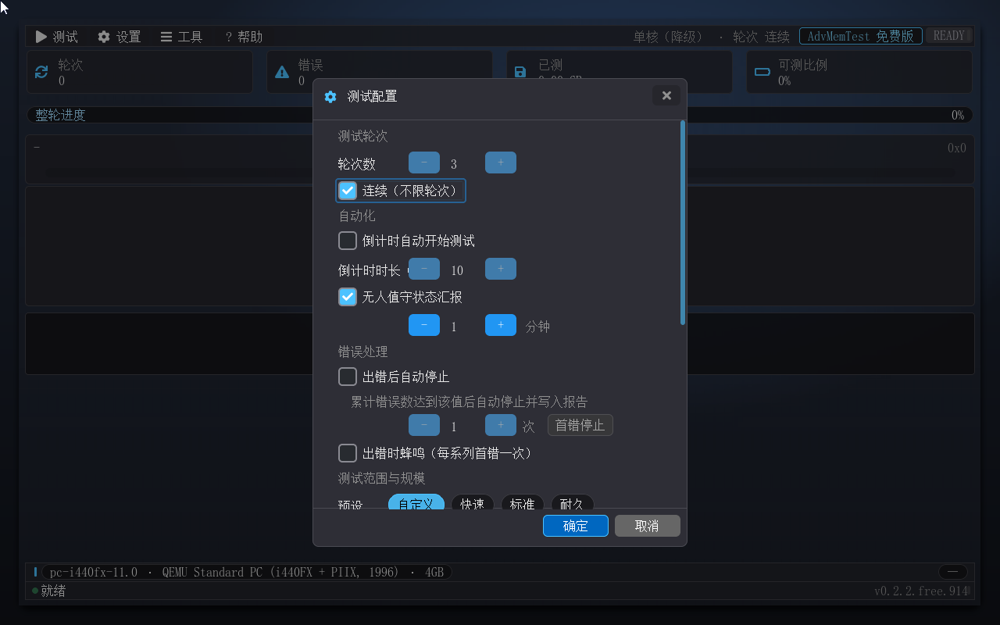 |
| 运行监控 | 整轮进度条、已测累计字节、当前测试卡、DIMM 带光晕流动 | 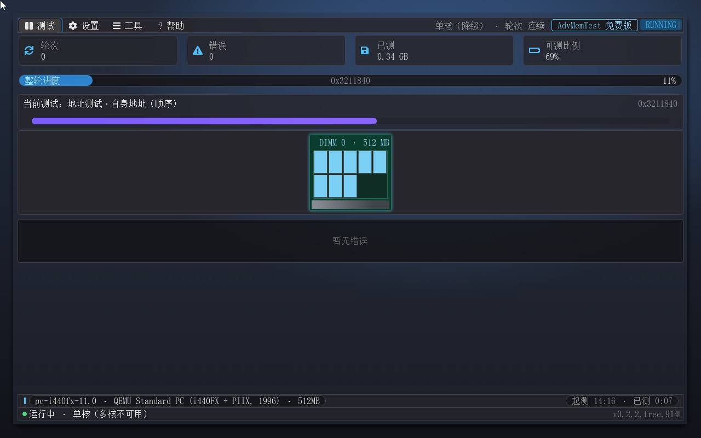 |
| 多核轮换与工作量诊断（两版都有） | **FB-40 提速**：`PAR_ROTATE`（逐核轮换）条目在多线程下**缺省只由 1 核跑完整内存**（覆盖等价、不做 ×N 重复全量）；CFG `par.rotate.cores` 调宽度（缺省 1，2..上限=参与核数，`0` = 旧版全核各自全量、最慢）。多核起测且选中这类条目时串口打一行 `perf: N cores x M full-memory pattern(s) (PAR_ROTATE); rotate on K core(s); …`（K = 实际参与轮换核数）。只诊断，不改判定/资格/进度；单核（含拉起失败/降级）不打 | — |
| 暂停 / 继续 | 运行中按 Esc 或菜单"暂停测试"即暂停（进度现场全保），再按 Esc 或"继续测试"恢复——停止入口只有一个 | 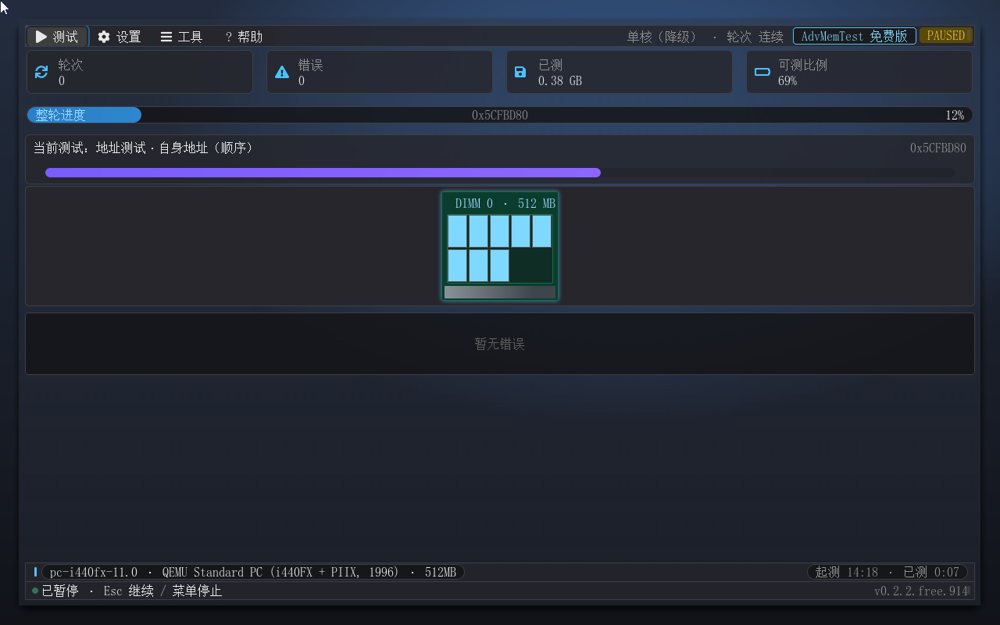 |
| 错误三通道 | 错误日志区 + 串口 TEST_FAIL 行 + 颗粒红光晕，徽章转 FAIL |  |
| DIMM 可视化 | SMBIOS 动态槽位（最大 32，空槽置灰 + 分组头），颗粒图标，活动槽光晕，悬停 tooltip；800×600 紧凑档按 rank 画 20 段颗粒条、短槽名（`A1 · 32G`）、钢色金手指 |  |
| HTML 报告 | 停止 / 达标时写盘（有错误退出时补写），错误明细 + 错误位分布 + 累计覆盖 + DIMM 布局（卡片 320×150；Pro 的 CE/UE 有文字定位）；起测即流式写 `ADVERR.CSV`（Pro 另写 `ECCERR.CSV`），报告只做摘要并链接 CSV | 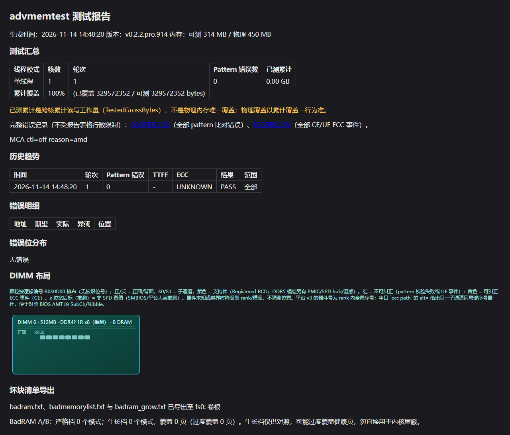 |
| 报告与日志设置 | 设置 → 报告与日志…：Pro 可改 `report.max`（缺省 16，1–64）与 `error.max`（缺省 10000）；两版均可开 `PROGRESS.LOG`（默认关，周期 max(status.interval,60) 秒，无 1 秒轮询） | — |
| ECC 会话判定（两版都有） | 起测取 MCA bank 基线、停止做逐 bank 差分：新增 UE 或新增 CE 达阈值即判 ECC FAIL 并进 `RESULT`（`errors=0` 也可 FAIL）；`ecc.ue.fail` / `ecc.ce.threshold` **两键均 Pro 专属**（CFG 或 PXE site.cfg），Free 固定缺省策略；无通路判 UNKNOWN、不拖红；Pro 报告含"会话新增/判定"行，Free 仅串口 | — |
| ECC 地址/颗粒定位（Pro） | 有记录的 MCA bank 在 `MCi_STATUS` 的 ADDRV=1 时读 `MCi_ADDR`；串口逐 bank 打 `ECC_LOC:` 定位行（地址 + `S/C/D/R/dev` 位置），报告 MCA bank 明细为六列（bank/类型/MCi_STATUS/地址/位置/**Misc**；Misc 追加在最后，按五列解析的旧脚本仍兼容；`misc=0x…`/`misc=-` 只透传不解码），内存信息页 bank 条目主行尾附 ` · R<n>/dev<n>`、Misc 另起子行；内置几何近似映射标 `(approx)` | — |
| 介质能不能存设置/报告 | 按启动形态而异——**本地启动要两者都稳**请把 efi 拷到可写 FAT32 盘跑；**Pro 版 PXE 直启的设置只能由 `site.cfg` 下发**（详表见两本详版手册 1.2） | — |
| 内存信息（Pro） | 工具→内存信息…：SPD 深度解析（平台 / 通路 / 数据源 + 槽位档案 + CRC 对账 + **内存设置** + 温度明细 + ECC 明细） | 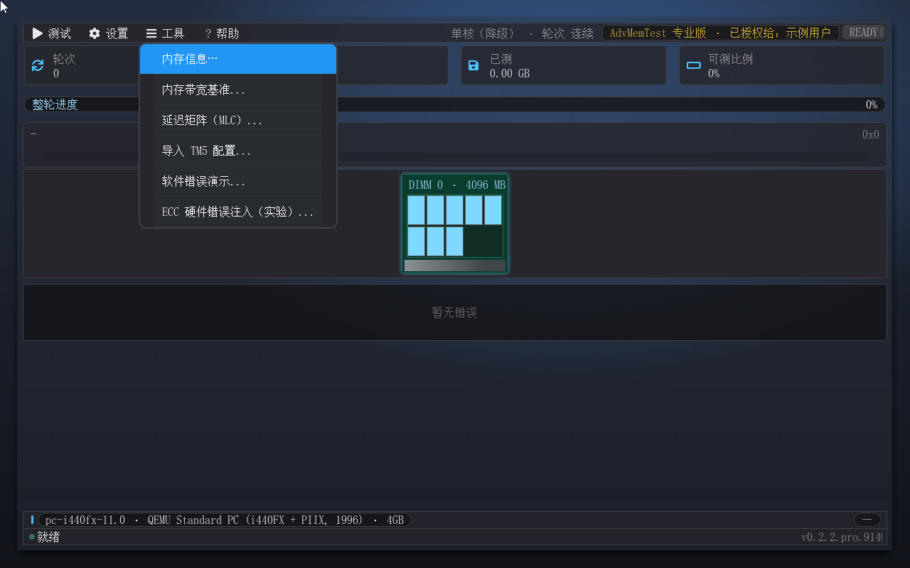 |
| 内存设置（Pro） | 槽详情与报告同源：SMBIOS 实况速度/电压（0=未报，逐字段判零）、SPD 标称时序（仅 CRC 通过槽）、XMP 3.0 profile1（名称/速率/CL；tAA 缺失不猜）、EXPO 仅存在性（不解码）；IMC 实况时序**不可用（平台未提供）**；无 SPD 缓存时报告整节省略；槽位按序号近似并标注 | — |
| 坏块清单 A/B（Pro） | 严格档 `badram.txt` + Windows BCD `badmemorylist.txt` + **实验性生长档** `badram_grow.txt`；生长档可能过度覆盖健康页，**仅供 A/B 对照、勿用于内核屏蔽**；报告/串口给 A/B 摘要，**不自动择优**；无错误也写头部 | — |
| 带宽基准（两版都有） | 工作集扫描带宽曲线；Free 只画读取一条线，Pro 另加写/拷贝/SIMD 对照三条与四档缓存台阶标注 | 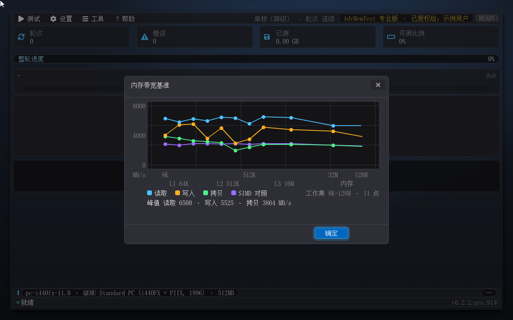 |
| MLC 延迟/带宽矩阵（Pro） | 工具菜单或 CLI `mlc`：SRAT/SLIT 拓扑、N×N 延迟、读/写/拷贝带宽、全核加载延迟、cache-to-cache；无 SRAT 退单节点；报告 `data-mlc` + 串口 `MLC:` 行；不写 MSR/IMC |  |
| ECC 硬件错误注入（Pro，实验/危险） | 工具菜单或 CLI `ecc-inject`：默认 dry-run；`-go`/风险确认才写 MCA 寄存器；`-mock` 走模型；BIOS MCEJ/AMEI + SW SMI，平台门 Server-only；报告实验段不混入真实 ECC 判定 |  |
| SPD 位宽回填（Pro） | 起测前用 SPD/BDAT/I3C 真值回填几何；实际宽度不符合平台期望时打稳定 `WARN: spd width policy ...`；Free 按 Server x4 / Client x8 推测并标"（推测）" | — |
| 缓存开/关 A/B（Pro） | CFG-only `cache.ab=1`：同一 pattern 集先缓存开跑一轮、再 CR0.CD 缓存关跑一轮，报告按（地址,异或,pattern）差分 `only_a`/`only_b`/`both`；强制两轮、不改 CFG 的 `pass.limit`；错误快照截断时明确标注"不构成完整对照"；Free 读到该键忽略 | — |
| 坏区排除/定点复测（Pro） | 启动参数 `retest=exclude`（跳过 `fs0:\badram.txt` 已知坏页）或 `retest=focus`（只测故障地址 ±N MB 窗口，`retest.window.mb` 1–1024、缺省 64）；只改测试视图、不改占用/归还；解析截断/错误/空视图 fail-closed 拒启；报告 `复测视图` 节明示结果不代表全内存健康；Free 忽略 | — |
| 测试地址范围（Pro） | 设置→测试配置内取消“测试全部内存范围”后填起始/结束物理地址（均为**含端点**、实际按 4KB 页对齐）；CFG `test.start`/`test.end` 持久化，启动参数 `-range=0xSTART-0xEND` / `-range=full` 只覆盖**本次会话**；与限额/复测叠加为空则拒启；报告加“仅该区间参与测试”限定语（零错误 PASS 不代表全内存健康）；Free 仅显示锁定行 | — |
| 跨会话趋势（Pro） | 每次报告追加 `fs0:\advmemtest_sessions.csv`（同机最近 200 条）；报告多出“历史趋势”节，列最近 10 次与 `Δ错误`/`ΔTTFF`；删除 CSV 即清空；Free 不生成 | — |
| 料单核验（Pro） | 启动参数 `bom=check` + `fs0:\expected_bom.csv`（无引号五列 CSV：slot,capacity_mb,ranks,vendor,part）；逐槽比对容量/rank/厂商/料号，未报字段算 UNKNOWN；报告“料单核验”节 + 串口 `bom:` verdict；缺/坏文件只 WARN 省略；Free 忽略 | — |
| 软件错误演示（Pro） | 工具 → 软件错误演示（或 inject-demo 参数），演示错误上报全链路；不是 ECC 注入 | 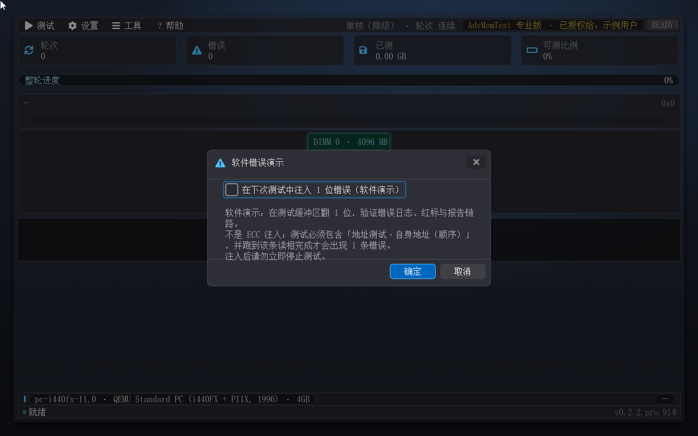 |
| 退出 | 空闲 Esc 或"帮助 → 退出"弹退出确认；运行中 Esc 是暂停/继续 | 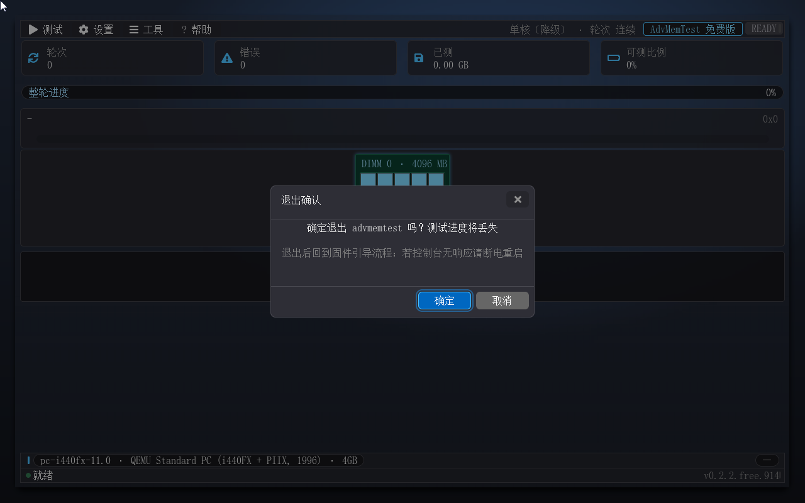 |

**0.2.1 构建 903 起菜单重组**：设置菜单只留 5 项（Pattern/线程模式/测试配置/外观/报告与日志）；功能入口统一放「工具」菜单。免费版工具菜单显示 4 项：内存信息（Pro 锁定导流）、带宽基准、导入 TM5、软件错误演示（Pro 锁定导流）；锁定的两项灰显 + 锁标，点击弹 Pro 授权提示。「测试配置」底部还多「禁用缓存测试模式（Pro）」与「测试地址范围（Pro）」两组锁定说明（灰字 + 锁标、无控件、不进焦点圈）。这几处只是升级入口，免费版镜像不含对应实现代码。

## 快速上手

从拷入文件到跑完一轮测试，只需要五步。

**第一步，拷入 Shell。** 把版本对应的 efi（`AdvMemTestFree.efi` 或 `AdvMemTestPro.efi`）复制到 UEFI Shell 所在盘（通常就是 fs0:）；Pro 版同时拷贝授权文件 `ADVMTEST.LIC` 到同目录。**第二步，启动。** 在 Shell 提示符下输入文件名回车；也可以写进 `startup.nsh`，开机进 Shell 自动运行。**第三步，起测。** 两个 SKU 的缺省行为不同：**Free 版**主界面就绪后**10 秒无操作即自动开始测试**（状态栏逐秒提示"将在 N 秒后自动开始测试（按任意键取消）"；倒计时期间按任意键或移动鼠标即取消，本会话不再自动起测）；**Pro 版缺省不自动起测**，主界面停在空闲态等待手动起测，或等待上位机经串口发启动键（`serial.start=1`，缺省键 `A`，串口会先打提示行，详见专业版手册 6.7；要恢复倒计时请在 CFG 写 `auto.start=1` 或在设置里勾选）。手动起测 = 展开"测试"菜单选"开始测试"（连按两下回车：第一下展开菜单、第二下选中该项；鼠标点菜单效果相同）；倒计时可在"设置 → 测试配置"里关闭或改时长（3–120 秒）。无论哪种起测方式，默认集都已含全部适用 pattern，多核机器自动进入多核并行模式（切分类 pattern 全核并发；轮换类 pattern 缺省只由 1 核跑完整内存，可用 `par.rotate.cores` 调宽）；此时串口会多一行 `perf:` 工作量诊断（含义与收口建议见下方"功能一览"的"多核轮换与工作量诊断"行）。**第四步，看进度。** 关注整轮进度条与"已测"统计卡；DIMM 带上光晕流动的位置，就是当前正在压测的内存区域。**第五步，暂停、停止与退出。** 运行中按 Esc 是暂停测试——进度、错误现场全保，再按 Esc（或点菜单"继续测试"）恢复，不用担心按错把工作白做；要真正停止，打开"测试"菜单选"停止测试"（停止的同时自动写报告）。要退出程序：空闲时按 Esc，或走"帮助 → 退出"——后者测试跑着也能直达退出确认框（确认后即退出，未跑完的进度会丢）。另外，"停止测试"在尚未开始测试时是灰显不可点的，起测后恢复可点。

报告位置：固件枚举到的第一个 SFS 卷根（通常是 `fs0:`）下的 `advmemtest_report.html`（Pro 版另有 `badram.txt` / `badmemorylist.txt` / `badram_grow.txt`——最后一份是实验性 A/B 对照，勿直接用于内核屏蔽），同目录另有错误明细 `ADVERR.CSV`（Pro 还有 `ECCERR.CSV`）；若在"报告与日志…"里开启进度诊断文件，还会多一份 `PROGRESS.LOG`。退出 Shell 后用浏览器打开报告即可。

## 运行环境与发布信息

- **运行环境**：X64 UEFI 固件，通过 BIOS 设置或启动菜单进入 UEFI Shell，或从 PXE 网络启动（专业版）；鼠标与键盘均可操作；界面全简体中文。
- **PXE 部署（专业版）**：把 Pro efi 改名为 DHCP 指定的启动文件名（通常 `BOOTX64.EFI`），与站点授权 `site.lic`（可选只读配置 `site.cfg`）一起放进 PXE 服务器的 TFTP 根，客户机从网络启动即可；服务器侧不需要授权服务或 TLS，续期只替换 `site.lic`。免费版可被 PXE 启动，但镜像不含网络取件代码。完整步骤见 `docs/advmemtest-pxe-deployment-guide.md`。
- **操作说明**：菜单与对话框以键盘 Tab（焦点循环）/ 上下键 / 回车为主，**鼠标滚轮同样可用**——指针悬停在滚动容器（对话框清单、帮助正文等）上滚动滚轮即可，容器内的提示条会给出用法（"鼠标滚屏：滚轮滚动，或按住左键拖动"）；侧边滚动条为显示指示件。退出后程序回到固件引导流程，Shell 提示符应正常返回；若个别平台控制台无响应，断电重启即可。
- **发布形式**：`AdvMemTestFree.efi` / `AdvMemTestPro.efi` 双产物（单文件无外部依赖，版本 0.2.2）。启动画面固定角落与串口输出 `APP_VERSION=v<版本>.<sku>.<构建号>`（如 v0.2.2.free.914），可与构建记录核对。
- **技术特性速览**：36 条真实 pattern（Free 用户可见 14 条；2 条引擎自检参考条不对外展示；增补条与 Id 33–35 默认不勾选；SIMD-256 需固件启用 AVX2，多数固件未开时自动锁定、不影响其它条）；起测缺省：Free 版 10 秒倒计时自动起测（按任意键/移动鼠标取消，可关闭或调时长）；Pro 版缺省不自动起测，支持串口触发起测（`serial.start`）与完成动作（`finish.action`）；四线程模式（MP Services 真实多核调度，顺序轮巡/轮流两模式 Pro 专属，Free 上限 16 / Pro 上限 512）；SMBIOS 动态 DIMM 可视化带（最大 32 槽）；底部平台信息条（CPU · 主板 · 内存总量 + 起测时刻 / 已测时长）；Pro 版 SPD 深度内存信息页（含内存设置、温度与 ECC 明细；IMC 实况时序不可用）、厂商门控、颗粒级错误定位、带宽曲线、禁用缓存、缓存开/关 A/B 对照（CFG-only）、坏块清单导出（含实验性生长档 A/B 对照，不自动择优）；自我重定位；HTML 报告（错误位分布 / 累计覆盖 + `ADVERR.CSV` / `ECCERR.CSV`）+ 报告与日志设置（`report.max` / `error.max` 为 Pro，`progress.file` 两版默认关）；分辨率自适应（≥1280×800 自动索取；800×600/1024×768 设置页可滚动）；设置持久化（ADVMTEST.CFG 与软件同级存放）；0.2.0 新增错误阈值/蜂鸣/规模百分比/预设、MLC 延迟矩阵（Pro）、ECC 错误注入（Pro/Server 实验）、SPD 位宽回填与位宽策略告警（Pro）。
- **许可证**：免费版个人用户免费使用；专业版商业用途（营利性部署 / 分发 / 预装）需授权——升级途径：请联系作者（详见专业版技术手册 `docs/manual/user-guide-pro.md` 第七章）。
- **颗粒定位精度**：在真实服务器平台上以固件内存控制器的地址交错映射为准（"近似映射 / 平台映射"两级标注见 `docs/manual/user-guide-pro.md` 4.2）；本手册所述行为以 QEMU 验证环境为基准，真机差异以实测为准。
