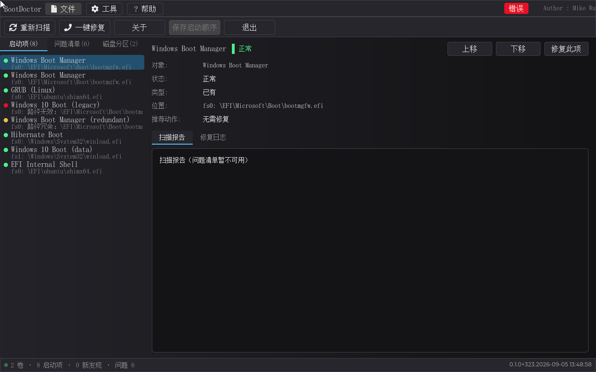
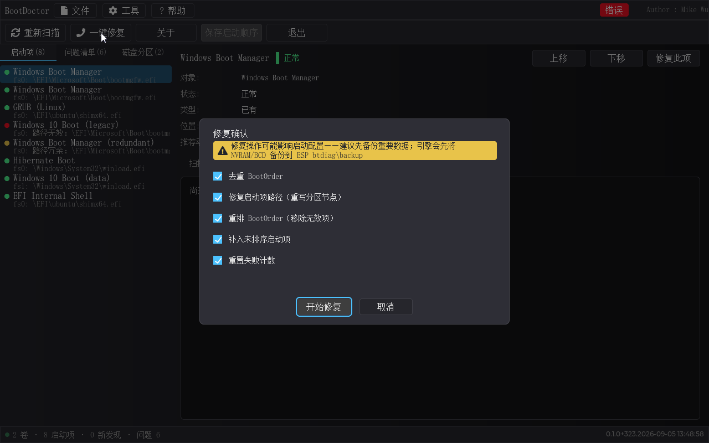
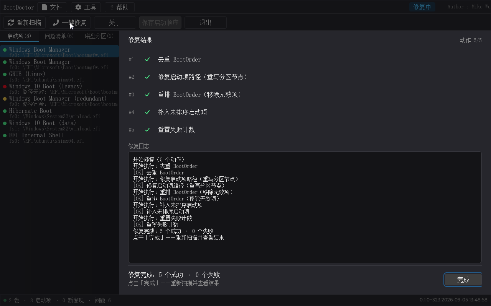
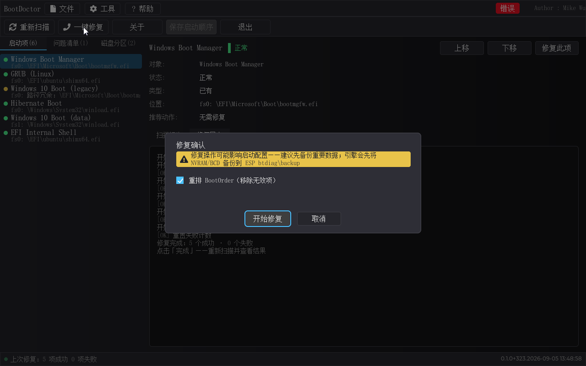
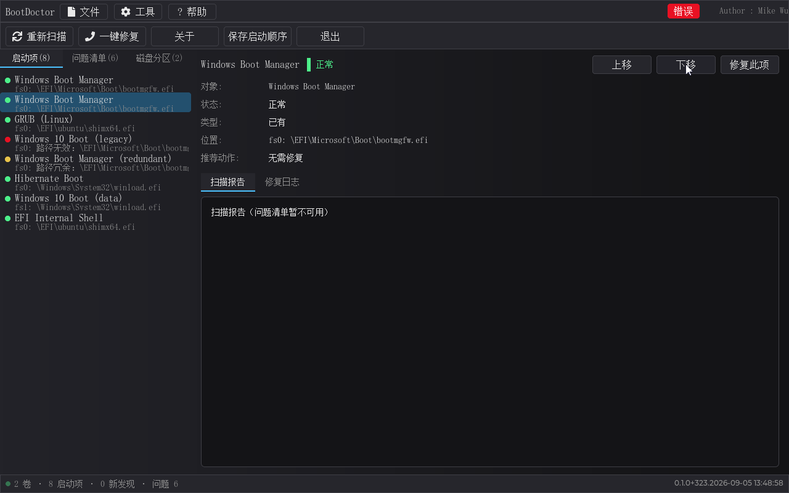
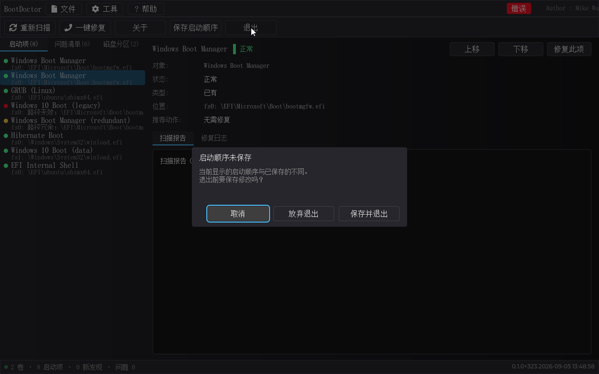
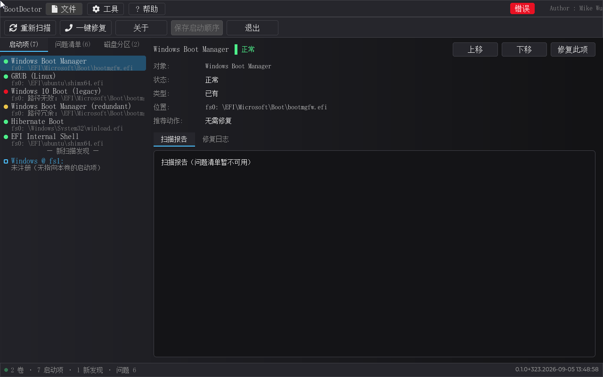
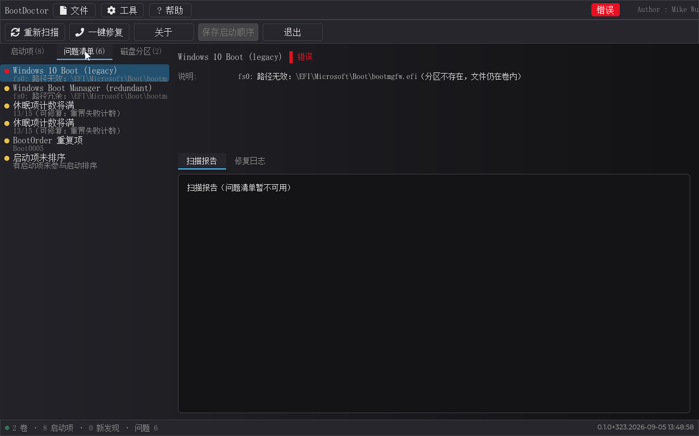
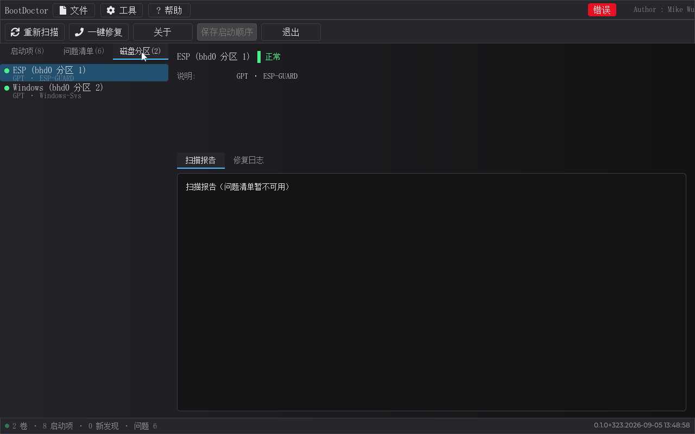
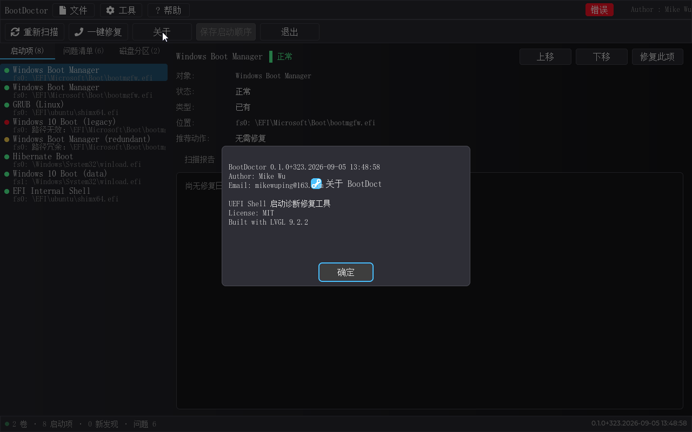

# BootDoctor — 启动诊断修复工具（二进制发布包）

> [English version below](#english) ｜ [English README](#english)

BootDoctor 是一个运行在 **UEFI** 环境下的图形化**启动诊断修复工具**，定位相当于 **bootrec + bcdboot 的图形版**——开机进不了系统的第一诊断修复工具。它扫描所有磁盘分区找 Windows/Linux 安装，按绿/红/黄/蓝四色列出启动链全部问题（启动顺序错乱、启动项失效、ESP/EFI 分区引导文件丢失、BCD 配置损坏……），一次「一键修复」自动修复，修复后自动重扫收敛。基于 LVGL 图形库构建，**全简体中文界面**（内置中文字库），鼠标与键盘双操作，**支持无 Shell 用户直接从可启动 ISO 进入本工具**。

> 开机进不了系统，不该只能重装；也不该只能敲命令。

- **版本**：0.1.0（Build 384，2026-09-06）
- **发布**：[bootdoctor-v0.1.0 Release](https://github.com/MikeWuPing/UEFI_Test_Suite/releases/tag/bootdoctor-v0.1.0)
- **作者**：Mike Wu（mikewuping@163.com）
- **许可**：[个人用户免费；商用请联系作者 + 免责声明](LICENSE.txt)
- **产品手册**：[功能演示 GIF](docs/manual/images/manual_demo.gif) ｜ [说明书（详版）](docs/manual/bootdoctor-product-manual.md) ｜ [说明书（Word 版）](docs/manual/bootdoctor-product-manual.docx)

---

## 包内容

| 文件 | 说明 |
|---|---|
| `binaries/bootdoctor.efi` | 应用本体（UEFI x64 应用，约 2.3 MB） |
| `iso/BootDoctor-boot-0.1.0.384+20260906_123223.iso` | **可启动光盘镜像**（免 UEFI Shell 直启 Live-CD，内嵌 ESP，约 19 MB；文件名带版本号+时间戳——改版留档） |
| `qemu_disk/` | 预构建运行盘内容（bootdoctor.efi + startup.nsh + expected_version.txt） |
| `docs/manual/` | 产品手册（MD + Word + 23 张功能截图 + 功能演示 GIF） |
| `LICENSE.txt` | 使用许可（个人免费/商用授权 + 免责声明） |
| `BootDoctor-0.1.0.384+20260906.zip` | 便捷包（说明书 MD/Word + 截图 + 运行盘 + 许可——与 Release 资产同内容） |

## 目录

- [功能特性](#功能特性)
- [产品手册](#产品手册)
- [运行要求](#运行要求)
- [快速上手](#快速上手)
- [已知限制](#已知限制)
- [常见问题](#常见问题)
- [许可](#许可)

## 功能特性

- **自动扫描诊断**：六阶段扫描（卷/分区枚举 → Windows/Linux 安装识别 → NVRAM 启动项读取 → 交叉校验 → 问题汇总），进度条 + 状态栏实时进度；启动即自动扫描，随时可重扫
- **四色问题列表**：绿=正常、红=错误、黄=警告、蓝=新发现（未注册安装）——行=状态点+名称+摘要，点击联动详情
- **右栏详情卡**：名称/类型/位置/描述/路径/判定说明 + 「修复此项」+ 顺序调整按钮；扫描报告/修复日志双页签；问题清单/磁盘分区两个页签（GPT/MBR 分区类型、大小）
- **一键修复**：全部待办汇总、确认框全选 → 免责声明 + 同意勾选门控 → 高危动作二次确认（写 BCD/删项/路径重写）→ 执行面板（绿勾/红叉/每步中文说明）→ 完成即重扫
- **一键修复自动收敛轮**：修复后自动重扫；仍有可修待办且本轮无失败 → 自动再弹确认框（剩余动作预选），点「开始修复」即收尾（至多 3 轮）——"一键修复"不再要用户手动点第二遍
- **单项修复**：「修复此项」只修当前选中项
- **动作表（9 条）**：
  - `[0] bcdboot 注册`——给未注册安装新建 Boot####（真实分区 GUID + 卷内真实引导文件——bootmgfw 优先/winload 兜底，绝不造死项）置顶入序
  - `[1] 重建 ESP 引导文件（现有分区内）`——建 `\EFI\Microsoft\Boot\`、拷 bootmgfw.efi、补 BCD 模板（不动分区表）
  - `[2] 重排 BootOrder（移除无效项）`——清冗余引用并删除冗余变量
  - `[3] 修复 BCD（重建）`——备份损坏 BCD → 模板式重建（15 对象基准蓝图，产物可经 bcdedit/字节级读方对拍验证）
  - `[4] 删除失效启动项`——真死项（文件确不存在）删除
  - `[5] 去重 BootOrder`——同号重复引用去重（与 [2] 路径冗余判定互不同源、互不污染）
  - `[6] 补入未排序启动项`——有效项追加入序
  - `[7] 修复启动项路径（重写分区节点）`——可修复死项：失效分区节点改写为真实分区 + 原 FILEPATH 同号覆盖
  - `[8] 重置失败计数`——BCD 计数元素 `0x25000021` **字节级定点归零**（清零"休眠计数将满"；不触碰 hive 其余字节）
- **死项策略**（引擎诚实语义）：目标引导文件**仍真实在卷内** → 可修复死 → [7] 修路径；**文件确不存在** → 真死 → [4] 删除；Legacy/BIOS 盘（无 UEFI 引导结构）→ 如实报"UEFI 无法修复"、不装配修复动作
- **未注册安装（蓝卡）登记**：识别"可启动但没有任何 Boot 项指向它"的安装；真实 GPT 分区（GUID 精确命中）与单卷形态下 [0] 修复后**蓝卡收敛消失**（分区节点精确指向，第二会话持久）；部分合成签名多卷形态/多卷同名文件安装如实报-only（不造成"点击一次两个错项"）
- **安装介质排除**：Windows 安装 U 盘（`\sources\install.wim/.esd/install.swm`）与 Ubuntu Live（`casper\vmlinuz`、`live\filesystem.squashfs`）= **安装源而非"已装系统"**——整卷排除，不报蓝卡、不装配注册动作（真机案例：曾误报"未注册系统"假问题 + [0] 修复错误——已根治）
- **启动顺序调整**：上移/下移按钮、Alt+↑/↓ 捷径、**拖拽改序**（行体跟指针、槽位互换、确定性秩交换）；「保存启动顺序」按钮（有改动才亮）+ **保存确认框**（免责声明 + 同意 checkbox 门控）；退出未保存三键提醒；BDS 平台项自动保留、备份先行
- **数据安全**：任何修改前备份（卷上 `\btdiag\backup\`）；风险动作双确认（高危二级框）；[8] 只动 8 字节、[3] 产出合法 hive；备份损坏原件字节全等（端到端实测断言）
- **键盘优先适配**：主板 BIOS 无鼠标驱动时状态栏 `[无鼠标驱动]` 标示；Tab/Shift+Tab 焦点循环（视窗口内限定）、上下键/空格/回车勾选操作、Alt 捷径、Esc 取消——纯键盘可用，对话框强制"理解并同意免责声明"后再使能开始按钮
- **平台提示横幅**：固件内嵌 UEFI Shell 如不建立启动项，不计入下表——列表头顶常驻提示，客户见"BIOS 有 Shell 选项而工具未列出"不误以为工具缺失
- **可启动 ISO（无 Shell 直启）**：嵌入式 ESP 双保险结构（ISO9660+Joliet+RockRidge+UDF 2.60 桥 + El Torito 指向 16MB FAT16 ESP 映像——Windows/Ubuntu 同款）；用户无需 Shell、无需任何引导配置，刻盘/Rufus/Ventoy（正常模式）/VMware/实体机经 FAT-ESP 路径、部分固件光驱走 UDF 桥，跨固件跨加载器兼容；**UEFI 启动即直达本工具**

## 产品手册

- **[功能演示 GIF](docs/manual/images/manual_demo.gif)**：21 帧串联主界面与全部功能视图（每帧 1.6 秒循环）
- **[说明书（详版 md）](docs/manual/bootdoctor-product-manual.md)**（[Word 版](docs/manual/bootdoctor-product-manual.docx)）：总论（功能清单表）→ 各功能章节，全部配 ULTRA 复杂错误环境截图（含一键修复确认框/高危二次确认/执行面板/自动收敛轮/拖拽改序/保存确认框/未注册蓝卡）

### 截图一览

| 功能 | 截图 |
|---|---|
| 主界面：四色列表 + 右栏详情（复杂错误环境） |  |
| 一键修复确认框（免责黄条 + 同意条款门控） |  |
| 高危二次确认 |  |
| 执行面板（绿勾/红叉/每步说明 + 汇总面板） |  |
| 修复后重扫（"已修复"标注 + 问题收敛） |  |
| 一键修复自动收敛轮（引擎自动再弹确认框） |  |
| 拖拽改序 + 保存钮点亮 |  |
| 保存启动顺序确认框（免责 + 同意门控） |  |
| 未注册蓝卡（新发现安装） |  |
| 问题清单页签 |  |
| 磁盘分区页签 |  |
| 关于对话框 |  |

## 运行要求

| 项目 | 要求 |
|---|---|
| 平台 | x64（x86-64）UEFI 固件（Pre-UEFI/Legacy BIOS 形态仅作"无法修复"如实报告） |
| 启动形态 | ① 免 Shell 可启动 ISO；② 可写 FAT 介质（U 盘/分区）Shell 自动/手工运行 |
| 介质 | FAT32 分区（修复形态——ISO 只读仅诊断）；FAT12/16/32 均支持扫描 |
| 屏幕 | 1280×800 或更高（实测窗口 1280×800，高分辨率缩放显示） |

## 快速上手

1. **启动**：ISO 形态——虚拟机挂载/U 盘（ventoy/rufus）/刻录后引导，开机即进主界面；FAT 介质形态——把 `bootdoctor.efi` + `startup.nsh` 放入分区，开机自动执行或 `Shell> bootdoctor.efi` 运行。
2. **扫描**：进入界面自动扫描（六阶段进度条 + 状态栏），完成后左栏三 tab：**启动项**（Boot0000-00FF 逐项诊断）、**问题清单**（绿/黄/红/蓝卡）、**磁盘分区**（ESP/Windows/Linux 分区表）。
3. **修复**：点任一问题行 → 右栏详情 →「修复此项」，或一键修复（并集全部动作）→ 免责声明 + 勾选同意 →（高危动作再弹二次确认）→ 备份先行执行 → 汇总面板 → **自动重扫收敛**（仍有可修待办自动再弹，至多 3 轮）。
4. **改序**：拖动左侧启动项行调整顺序（或 Alt+↑/↓），工具栏「保存启动顺序」落盘；退出时脏序提醒。
5. **看结果**：右栏扫描报告/修复日志双 tab；修复日志记录每动作结果与 NVRAM 备份位置。

## 已知限制

- **滚轮不可用**：固件鼠标驱动层即截断滚轮事件（`EFI_ABSOLUTE_POINTER_STATE` 无 z 字段、SimplePointer RelativeMovementZ 恒 0）——滚轮事件到不了本工具；以键盘/拖拽替代（列表滚动与手机操作类似）
- **无 ESP 分区（S6a 类）**：`esp: missing` 如实报"需分区级重建（未自动执行——避免数据风险）"，不自动动分区表
- **Legacy/BIOS 盘**（MBR+NTFS 无 EFI 结构）：如实报"UEFI 无法修复"、不装配修复动作
- **多卷同名/同签名多卷形态**：未注册安装登记在此类形态可能报-only（引擎如实——不承诺做不到的事）；真实 GPT 分区与单卷形态端到端收敛
- **安装介质文件**（install.wim 等）所在卷按"安装源"整卷排除——不参与安装识别（这符合事实：介质不是已装系统）
- **BCD 完整重建边界**：模型数据结构 512B 上限——真实 BCD 中多值（MULTI_SZ）等超容元素由宿主 bcdedit 处理（引擎如实报）；[8] 失败计数走字节级定点修补（不触碰此类元素）
- **固件内嵌 Shell 判定边界**：本工具按启动项列表 + 卷证据诊断启动链；固件内嵌入口（平台项/内嵌 Shell 可能不建立启动项变量）无法从变量层判定"有无"——见界面临管提示横幅与产品手册注记

## 常见问题

- **为什么 BIOS/启动菜单里有 UEFI Shell，BootDoctor 却"扫不到"？**
  固件内嵌的 Shell 是平台入口，可能不注册启动项变量——BootDoctor 按启动项列表诊断，
  列表顶部提示横幅："固件内嵌 UEFI Shell 如不建立启动项，不计入下表，未列不代表缺失"。
  工具只能确证变量层没有 Shell 项，不能证明固件没有内嵌入口。
- **ISO 里能修复吗？**
  ISO 是只读介质——扫描/诊断/查看都行；**写（修复）要在 FAT 写介质**（qemu_disk 形态）运行。
- **Ventoy 启动报 "No bootfile found for UEFI!"？**
  Ventoy 菜单请选**正常模式（默认项）**，不要选 GRUB2 模式（Ventoy 对非标准 ISO 的已知限制）。
- **Secure Boot 开启被拒启动？**
  本工具未签名——请先关闭 Secure Boot（或有签名后在固件白名单添加）。
- **修复后重扫仍有问题提示？**
  一键修复后自动重扫并**自动收敛**（至多 3 轮）；剩余黄色警告多为"仅提示"类
  （如休眠未关闭）——引擎如实报告，不伪造删除。

## 许可

个人用户免费使用；商业用途（营利性部署/分发/预装/收费服务）需作者书面授权——见 [LICENSE.txt](LICENSE.txt)。
**免责**：本软件开放免费试用，因此不对修改后无法启动和磁盘数据丢失负责，
请谨慎使用，并在使用前，做好数据备份。
第三方组件：图形库 LVGL（MIT）与 UEFI 移植层 [UEFI_LVGL](https://github.com/MikeWuPing/UEFI_LVGL) 遵循其各自许可。

---

# English

# BootDoctor — Boot-diagnosis & Repair Tool (binary release)

BootDoctor is a **graphical boot-diagnosis and repair tool** that runs in the UEFI environment — the GUI equivalent of **bootrec + bcdboot**, the first-step fixer for "the machine won't start": it scans every partition for Windows/Linux installations and lists boot-chain problems (broken boot order, dead boot entries, missing ESP/EFI boot files, corrupted BCD …) color-coded green/red/yellow/blue, then repairs them all with one-click "fix everything", followed by an automatic rescan-and-converge loop. Based on LVGL; **entirely Simplified-Chinese UI** (built-in SimSun font); mouse and keyboard; **can be entered directly from a bootable ISO even without a UEFI Shell**.

> "My machine won't boot" shouldn't mean "reinstall everything" — and shouldn't mean digging in shell commands.

- **Version**: 0.1.0 (Build 384, 2026-09-06) ｜ **Release**: [bootdoctor-v0.1.0](https://github.com/MikeWuPing/UEFI_Test_Suite/releases/tag/bootdoctor-v0.1.0)
- **Author**: Mike Wu (mikewuping@163.com) ｜ **License**: [free for personal use; commercial use requires authorization + disclaimer](LICENSE.txt)
- **Manual**: [feature GIF](docs/manual/images/manual_demo.gif) ｜ [detailed manual (md)](docs/manual/bootdoctor-product-manual.md) ｜ [Word edition](docs/manual/bootdoctor-product-manual.docx)

## Package contents

| File | Description |
|---|---|
| `binaries/bootdoctor.efi` | The app itself (UEFI x64 application, ~2.3 MB) |
| `iso/BootDoctor-boot-0.1.0.384+20260906_123223.iso` | **Bootable Live-CD** (shell-free direct boot, embedded ESP, ~19 MB; versioned filename keeps revision history) |
| `qemu_disk/` | Pre-built run-disk content (bootdoctor.efi + startup.nsh + expected_version.txt) |
| `docs/manual/` | Product manual (MD + Word + 23 screenshots + demo GIF) |
| `LICENSE.txt` | License (personal free / commercial authorization + disclaimer) |
| `BootDoctor-0.1.0.384+20260906.zip` | Convenience bundle (manual + screenshots + run disk + license; same as the Release assets) |

## Features

- **Automatic diagnostic scan** — six phases (volume/partition enumeration → Windows/Linux installation detection → NVRAM boot entries → cross-validation → issue summary) with progress bar + status bar; starts automatically on entry, rescan anytime
- **Color-coded issue list** — green = ok, red = error, yellow = warning, blue = newly-found **unregistered** installation; row = status dot + name + summary, click links the detail pane
- **Detail pane** — name/type/location/description/path/verdict + "fix this item" + order buttons; scan-report / fix-log tabs; issue-list and partition tabs (GPT/MBR types, sizes)
- **One-click fix** — all pending items in a confirm dialog with the disclaimer + agree checkbox gate → risk double-confirm for destructive actions (BCD write / delete / path rewrite) → progress panel (green check/red cross, per-step Chinese notes) → auto rescan
- **Auto-converge rounds** — after the post-fix rescan, if repairable work remains and no step failed, the confirm dialog **re-opens automatically** (remaining actions preselected; up to 3 rounds) — no more "second pass shows a leftover error"
- **Per-item fix** — "fix this item" targets only the selected card
- **Action table (9 actions)**: register bootmgfw entry (bcdboot semantics); rebuild ESP boot files (inside the existing partition); reorder BootOrder; rebuild BCD from a 15-object blueprint; delete truly-dead entries; dedupe BootOrder; append unlisted entries; fix boot-item path (rewrite partition node); reset BCD failure counters (byte-level zeroing of `0x25000021`)
- **Dead-entry policy (honest engine semantics)** — target file **still really exists** → repairable dead → fix path; no longer exists → truly dead → delete; legacy/BIOS disks → "UEFI cannot repair" honestly
- **Install-media exclusion** — Windows setup U-disk (`\sources\install.wim/.esd/install.swm`) and Ubuntu Live (`casper\vmlinuz` / `live\filesystem.squashfs`) are *sources*, not installations — no false "unregistered" card (real-machine case)
- **Boot-order editing** — up/down buttons, Alt+↑/↓ shortcut, **drag reordering**; "save boot order" toolbar button (lit only when dirty) backed by a **save confirm dialog** (disclaimer + agree-checkbox gate); dirty-exit three-button reminder; platform items preserved, backup first
- **Data safety** — every modifying action is preceded by a backup (`\btdiag\backup\`); risky actions need double confirmation; [8] touches only 8 bytes; [3] produces a valid hive
- **Keyboard-first** — when the motherboard BIOS has no mouse driver the status bar shows `[无鼠标驱动]`; full Tab focus cycle, arrows/space/enter toggling, Alt shortcuts, Esc cancel; the repair confirm dialog gates "开始修复" behind the disclaimer checkbox
- **Platform hint banner** — the embedded UEFI Shell is a platform entry (may not register boot variables) — not listed ≠ missing
- **Bootable ISO (no Shell)** — embedded-ESP dual-path structure (ISO9660+Joliet+RockRidge+UDF bridge + El Torito → 16 MB FAT16 ESP image — Windows/Ubuntu style); burn / Rufus / Ventoy (choose "normal mode") / VMware / real firmware all boot via the FAT-ESP path; a UDF bridge covers CD-ROM boots. Works without any Shell.

## Run requirements

| Item | Requirement |
|---|---|
| Platform | x64 UEFI firmware (Pre-UEFI/Legacy BIOS reported honestly as "UEFI cannot repair") |
| Boot form | ① shell-free bootable ISO; ② writable FAT medium (U-disk/partition), auto or manual Shell run |
| Medium | FAT32 partition (repair form — the ISO is read-only, diagnosis only); FAT12/16/32 all scanned |
| Screen | 1280×800 or higher (window is 1280×800; scales on higher resolutions) |

## Quick start

1. **Boot**: ISO form — mount in a VM / create a Ventoy or Rufus U-disk / burn it; FAT form — copy `bootdoctor.efi` + `startup.nsh` into a FAT partition (auto-run or `Shell> bootdoctor.efi`).
2. **Scan**: automatic on launch — left tabs: **Boot items** (Boot0000-00FF diagnosis), **Issue list** (green/yellow/red/blue), **Partitions** (ESP/Windows/Linux).
3. **Repair**: click an issue → detail card → "Repair this item", or one-click repair → disclaimer + agree checkbox → (second confirmation for high-risk) → backup-first execution → summary → **automatic re-scan convergence** (up to 3 rounds).
4. **Reorder**: drag boot items (or Alt+↑/↓) and save with the toolbar button; exit prompt when dirty.
5. **Results**: scan-report / fix-log tabs; the log records every action's outcome and NVRAM backup location.

## Known limitations

- **No mouse wheel** — the wheel is truncated in firmware pointer drivers; drag-to-scroll (phone-like) or arrow keys instead
- **No ESP partition (S6a class)** — reported honestly as "partition-level rebuild needed (not auto-executed — avoiding data risk)"; partition table is never touched automatically
- **Legacy/BIOS disks** (MBR+NTFS, no EFI) — "UEFI cannot repair", no action assembled
- **Multi-volume same-name / same-signature shapes** — unregistered registration may be report-only in such shapes (honest engine); real GPT/single-volume shapes converge end-to-end
- **BCD rebuild boundary** — model caps at 512 B; multi-value (MULTI_SZ) elements are handled by host bcdedit (engine reports honestly); [8] uses byte-level in-place patching
- **Embedded-Shell judgment boundary** — the tool reasons from boot variables + volume evidence; whether the firmware embeds a Shell without registering a variable cannot be decided from the variable layer — see the on-screen banner and the manual note

## FAQ

- **Why "no UEFI Shell" in the list while the BIOS menu has one?** — The firmware-embedded Shell is a platform entry that may not register a boot variable; the banner on the list states: not listed ≠ missing. The tool can only confirm the variable layer has no Shell entry, not that the firmware has no embedded one.
- **Can I repair from the ISO?** — Read-only medium: scan/diagnose/view only; **writes (repairs) need a writable FAT** (qemu_disk form).
- **Ventoy says "No bootfile found for UEFI!"?** — Choose **normal mode (the default)**; GRUB2 mode is a known Ventoy limitation for non-standard ISOs.
- **Rejected under Secure Boot?** — The image is unsigned; disable Secure Boot (or enroll it).
- **Still warnings after repair?** — Auto-convergence handles leftovers (up to 3 rounds); remaining yellows are mostly report-only (e.g., hibernate) — the engine reports honestly, never fake-deletes.

## License

Free for personal use; commercial use (distribution, bundling, paid services) requires written authorization from the author — see [LICENSE.txt](LICENSE.txt). **Disclaimer**: the software is free for trial; the author is not responsible for boot failure or data loss after modifications — back up your data first. Third-party: LVGL (MIT) and the UEFI port layer [UEFI_LVGL](https://github.com/MikeWuPing/UEFI_LVGL) retain their own licenses.
