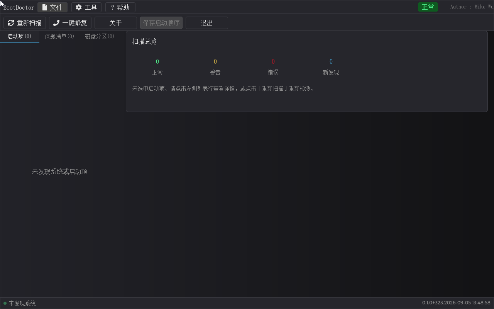

# BootDoctor — 启动诊断修复工具（二进制发布包）

> [English version below](#english) ｜ [English README](#english)

BootDoctor 是一个运行在 **UEFI**（免 Shell 可启动 ISO 或 Shell 手工运行）下的图形化**启动诊断修复工具**，对标 `bootrec + bcdboot` 的图形版：扫描所有分区找 Windows/Linux 安装，四色列出启动链问题，一键修复并自动收敛，重建 ESP / 修复 BCD / 补 bootmgfw 启动项，拖拽调整启动顺序——**"开机进不了系统"的第一道防线**。界面全简体中文（内置 SimSun 中文字库），鼠标 + 键盘双通道，长耗时扫描全程进度条可视化。

> 把 **"开机进不了系统"** 拆成 20 余项可判定的检查——问题清单逐项给出可一键执行的修复建议，修复前自动备份、破坏性动作二次确认。

- **版本**：0.1.0（Build 384，2026-09-06）
- **发布**：[bootdoctor-v0.1.0 Release](https://github.com/MikeWuPing/UEFI_Test_Suite/releases/tag/bootdoctor-v0.1.0)
- **作者**：Mike Wu（mikewuping@163.com）
- **许可**：[个人用户免费；商用请联系作者](LICENSE.txt)
- **产品手册**：[详版手册（MD）](docs/manual/bootdoctor-product-manual.md) ｜ [Word 版](docs/manual/bootdoctor-product-manual.docx) —— 含全部功能截图与启动链诊断/修复的图文说明

## 包内容

| 文件 | 说明 |
|---|---|
| `binaries/bootdoctor.efi` | 应用本体（UEFI x64 应用，约 2.3 MB） |
| `iso/BootDoctor-boot-0.1.0.384+20260906_123223.iso` | **可启动光盘镜像**（免 UEFI Shell 直启 Live-CD，内嵌 ESP，约 19 MB；文件名带版本号+时间戳——改版留档） |
| `qemu_disk/` | 预构建运行盘内容（bootdoctor.efi + startup.nsh + expected_version.txt） |
| `docs/manual/` | 产品手册（MD + Word + 23 张功能截图 + 功能演示 GIF） |
| `LICENSE.txt` | 使用许可（个人免费/商用授权 + 免责声明） |
| `BootDoctor-0.1.0.384+20260906.zip` | 便捷包（说明书 MD/Word + 截图 + 运行盘 + 许可——与 Release 资产同内容） |

---

## 目录

- [运行要求](#运行要求)
- [快速上手](#快速上手)
- [功能特性](#功能特性)
- [界面一览](#界面一览)
- [操作方式（鼠标/键盘/Esc 状态机）](#操作方式鼠标键盘esc-状态机)
- [状态徽标语义](#状态徽标语义)
- [数据与安全说明](#数据与安全说明)
- [姊妹工具](#姊妹工具)
- [常见问题](#常见问题)
- [已知限制](#已知限制)
- [更新记录](#更新记录)
- [许可](#许可)

## 运行要求

| 项目 | 要求 |
|---|---|
| 平台 | x64（x86-64）UEFI 固件（Pre-UEFI/Legacy BIOS 形态仅作"无法修复"如实报告） |
| 启动形态 | ① 免 Shell 可启动 ISO；② 可写 FAT 介质（U 盘/分区）Shell 自动/手工运行 |
| 介质 | FAT32 分区（修复形态——ISO 只读仅诊断）；FAT12/16/32 均支持扫描 |
| 屏幕 | 1280×800 或更高（实测窗口 1280×800，高分辨率缩放显示） |
| 系统盘 | 扫描目标：Windows (winload/bootmgfw/BCD) 与 Linux (GRUB/shim) 安装；Windows 安装介质（install.wim 等）按"安装源"排除，不误报 |

## 快速上手

1. **启动**：ISO 形态——虚拟机挂载/U 盘（ventoy/rufus）/刻录后引导，开机即进主界面；FAT 介质形态——把 `bootdoctor.efi` + `startup.nsh` 放入分区，开机自动执行或 `Shell> bootdoctor.efi` 运行。
2. **扫描**：进入界面自动扫描（六阶段进度条 + 状态栏），完成后左栏三 tab：**启动项**（Boot0000-00FF 逐项诊断）、**问题清单**（绿/黄/红/蓝卡）、**磁盘分区**（ESP/Windows/Linux 分区表）。
3. **修复**：点任一问题行 → 右栏详情 →「修复此项」，或一键修复（并集全部动作）→ 免责声明 + 勾选同意 →（高危动作再弹二次确认）→ 备份先行执行 → 汇总面板 → **自动重扫收敛**（仍有可修待办自动再弹，至多 3 轮）。
4. **改序**：拖动左侧启动项行调整顺序（或工具栏第 4 钮保存启动顺序），退出时脏序提醒。
5. **看结果**：右栏扫描报告/修复日志双 tab；修复日志记录每动作结果与 NVRAM 备份位置。

## 功能特性

### 诊断篇（扫描即诊断，20 余项判定）

| 类别 | 判定项（示意） |
|---|---|
| 启动项完整性 | 指向卷内存在（有效）/ 目标文件仍在卷内但路径/分区失效（可修复死）/ 目标文件已不存在（死项）/ 与另一启动项布尔等价（冗余） |
| 安装注册 | Windows/Linux 安装是否已有指向它的启动项——未注册 = 蓝卡「未建启动项」（允许一键补注册） |
| BCD 链 | ESP 是否有 BCD；BCD hive 魔数/结构损坏（corrupt）→ 修复时模板式重建；失败计数超限（将满）→ 定点归零 |
| 引导文件 | bootmgfw.efi / winload.efi / GRUB / shim 文件存在性（ESP 结构缺 Boot 子目录等） |
| 平台注记 | 固件内嵌 UEFI Shell 为平台入口（可能不建立启动项变量）——界面临管横幅提示：未列不代表缺失 |

### 修复篇（一键修复，备份先行，破坏性动作二次确认）

| 动作 | 说明 |
|---|---|
| 补 bootmgfw.efi 启动项（bcdboot 语义） | 给"已装系统但无启动项"的安装补注册启动项（指向卷内 bootmgfw/winload） |
| 重建 ESP 引导文件 | 现有分区内重建 `\EFI\Microsoft\Boot\`（bootmgfw + BCD 模板）；无 ESP/ESP 损坏 = 分区级红线不自动执行，如实报告 |
| 启动顺序调整 | BootOrder 重排（上移/下移/拖拽），保存时备份先行 |
| 修复 BCD（重建） | 损坏/缺失 hive 按模板式重建（备份原件 → 换装解析重装配或基准蓝图写回） |
| 删除失效启动项 | 目标文件确不存在才建议删除（避免误删可修复项） |
| 修复启动项路径 | 目标文件仍存在但分区节点失效（拔盘后重插）→ 同号重写真实分区前缀 |
| 重置 BCD 失败计数 | 失败计数/重试计数元素字节级定点归零（bcdedit/字节面一致） |
| 一键修复 | 问题清单全部动作并集一次执行 + **自动收敛轮**（重扫后仍有可修自动再弹，至多 3 轮） |

### 交互篇

- **四色徽标**：绿=正常，黄=警告（冗余/顺序），红=错误（死项/损坏），蓝=新发现（未注册安装）；
  长条纹 badge + 徽章色一致，右栏详情带徽章/KV/推荐动作。
- **键盘全程**：Tab 焦点循环（左栏 tab → 列表 → 右栏 tab → 报告区…），焦点高亮/失焦低亮；Alt+↑/↓ 排序捷径；纯键盘可完成"扫描 → 定位 → 一键修复"全流程；无鼠标 BIOS 自动提示（状态栏 `[无鼠标驱动]` 前缀）。
- **拖拽改序**：启动项列表行按住拖动实时换位，释放一次性提交；保存启动顺序按钮（脏=亮，无改动/只读=灰）＋退出提醒（保存并退出/放弃退出/取消）。
- **安装介质排除**：Windows 安装 U 盘（install.wim/.esd/install.swm）与 Ubuntu Live（casper/vmlinuz、live/filesystem.squashfs）= 安装源而非"已装系统"——不报蓝卡、不装配注册动作（真机案例：曾误报"未注册系统"假问题 + 修复错误——已根治）。
- **免责门控**：一键修复/修复该项确认框内免责条款黄条 + 「理解并同意免责声明」勾选（默认未选，未选=开始修复禁用）。

## 界面一览

- 左栏：启动项/问题清单/磁盘分区三 tab（计数后缀）；启动项行 = 徽章条 + 名称 + 副标题。
- 右栏：详情卡（名称/状态/位置/推荐动作 + 扫描报告与修复日志双 tab）；扫描完成未选中时显示"扫描总览"四色计数卡。
- 状态栏：左扫描状态/计数，右版本号；列表顶部常驻平台提示横幅。

## 操作方式（鼠标/键盘/ESC 状态机）

- **鼠标**：单击列表行选中；「修复此项/一键修复」触发确认；拖拽行 = 改序。
- **键盘**：Tab = 焦点循环；↑/↓ = 行内选择（焦点在列表时）；Enter = 确认/执行；
  Alt+↑/↓ = 上移/下移（启动项列表）；**ESC 在弹出层=取消**（确认框/汇总）；纯键盘可完成全部操作。
- 无鼠标（BIOS 未装鼠标驱动）：状态栏提示 `[无鼠标驱动]`，全程键盘优先可用。

## 状态徽标语义

| 徽标 | 颜色 | 语义 | 示例 |
|---|---|---|---|
| 绿 | 正常（OK） | 启动项/分区/安装状态判定通过 | 有效启动项指向存在的 bootmgfw.efi |
| 黄 | 警告（Warn） | 不致命但不优：冗余/顺序/休眠未关（仅提示不修复） | 与另一项语义重复的启动项 |
| 红 | 错误（Bad） | 启动链故障项：死项/BCD 损坏/文件缺失 | 目标文件不存在；BCD corrupt (magic) |
| 蓝 | 新发现（New） | 扫描新发现的未注册 Windows/Linux 安装 | ESP 内 Windows 无启动项引用 |

（T19 后"重复色"语义 = S2 冗余判定收敛为黄——引擎诚实收敛，非漏检。）

## 数据与安全说明

- **备份先行**：写 NVRAM 启动项/BootOrder、BCD、ESP 前一律备份到 `fs0:\btdiag\backup\`（NVRAM 备份文件），失败如实报告、不中断显示原因。
- **破坏性动作二次确认**：写启动项/重建 BCD 等 HighRisk 动作在「开始修复」后还需高危弹窗二次确认；中风险动作常规确认 + 警示条。
- **红线不自动执行**：无 ESP/分区级重建、删除非确证死项 —— 工具如实报告"需人工处理"，不越权动分区表。
- **免责声明**：本软件开放免费试用，因此不对修改后无法启动和磁盘数据丢失负责，请谨慎使用，并在使用前，做好数据备份。（详见 [LICENSE.txt](LICENSE.txt) 与产品手册。）

## 姊妹工具

- [pcDig](https://github.com/MikeWuPing/UEFI_Test_Suite/tree/main/pcDig) —— 图形化整机硬件诊断工具（21 项自检 + HTML 报告），与本工具同套发布：
  "开不了机"先用 BootDoctor 判**启动链**，pcDig 判**硬件**——两者互补。
- 高级内存测试 advmemtest —— 内存专项 pattern 测试（Dell 风格）；加入套件后在此列出。

## 常见问题

- **为什么 BIOS/启动菜单里有 UEFI Shell，BootDoctor 却"扫不到"？**
  固件内嵌的 Shell 是平台入口，可能不注册启动项变量——BootDoctor 按启动项列表诊断，
  列表顶部提示横幅："固件内嵌 UEFI Shell 如不建立启动项，不计入下表，未列不代表缺失"。
  工具只能确证变量层没有 Shell 项，不能证明固件没有内嵌入口（该判定需要 FV 枚举+解压，
  成本/收益不划算——以界面提示为准即可）。
- **ISO 里能修复吗？**
  ISO 是只读介质——扫描/诊断/查看都行；**写（修复）要在 FAT 写介质**（qemu_disk 形态）运行。
- **Ventoy 启动报 "No bootfile found for UEFI!"？**
  Ventoy 菜单请选**正常模式（默认项）**，不要选 GRUB2 模式（Ventoy 对非标准 ISO 的已知限制）。
- **Secure Boot 开启被拒启动**：本工具未签名——请先关闭 Secure Boot（或有签名后在固件白名单添加）。
- **修复后重扫仍有问题提示？** 一键修复后自动重扫并**自动收敛**（至多 3 轮）；
  剩余黄色警告多为"仅提示"类（如休眠未关闭）——引擎如实报告，不伪造删除。

## 已知限制

- 滚轮滚动不可用（平台指针驱动能力限制）——滚动列表用拖动（与手机操作类似）或方向键。
- 安装介质文件（install.wim 等）所在卷按"安装源"整卷排除——不参与安装识别（这符合事实：介质不是已装系统）。
- 单分区无 ESP / Legacy BIOS（MBR）形态：如实报告"UEFI 无法修复"，不装配修复动作。
- BCD 元素级修复：多值/超容元素（MULTI_SZ 等）全量重装配会被保真守卫拒绝——
  此类真实 BCD 的元素级修复交由宿主 bcdedit，引擎如实报状态。
- 本工具按启动项列表 + 卷证据诊断启动链；对固件内嵌入口（平台项/内嵌 Shell）不建立启动项变量的形态，
  无法从变量层判定其"有无"——见界面临管提示横幅与产品手册注记。

## 更新记录

- **2026-09-06 · bootdoctor-v0.1.0**：二进制发布首版（0.1.0 Build 384）。
  覆盖：四色诊断（启动项完整性/安装注册/BCD 链/引导文件/平台注记）、一键修复 + 自动收敛轮、
  BCD 模板式重建 + 失败计数字节级定点归零、未注册安装登记（bcdboot 语义）、死项区分策略
  （目标文件仍存在→修复路径/确不存在→删除）、拖拽改序 + 保存启动顺序 + 退出提醒、
  安装介质排除（Windows 安装 U 盘/Live CD 真机案例）、免责门控（黄条 + 同意勾选）、
  无鼠标键盘优先 + 平台提示横幅、真镜像层场景（GPT+FAT）、Ventoy 兼容双保险 ISO。

## 许可

个人用户免费使用；商业用途需作者书面授权（含对外分发/预装/收费服务）。
**免责**：本软件开放免费试用，因此不对修改后无法启动和磁盘数据丢失负责，
请谨慎使用，并在使用前，做好数据备份。详见 [LICENSE.txt](LICENSE.txt)。

---

## English

# BootDoctor — Boot-diagnosis & Repair Tool (binary release)

BootDoctor is a graphical **boot-diagnosis & repair tool** that runs on **UEFI** (a shell-free bootable ISO, or a plain FAT medium run from the UEFI Shell): it scans every partition for Windows/Linux installations, classifies the boot chain with a four-color list, and offers a one-click repair with automatic re-scan convergence — the graphical counterpart of `bootrec + bcdboot` for "my PC won't boot". Simplified-Chinese UI only (bundled SimSun glyph subset), mouse + keyboard dual input, progress visualization for long scans.

> Turn **"won't boot"** into 20+ checkable findings, each with a one-click actionable repair; backups before write, second confirmation for destructive actions.

- **Version**: 0.1.0 (Build 384, 2026-09-06) ｜ **Release**: [bootdoctor-v0.1.0](https://github.com/MikeWuPing/UEFI_Test_Suite/releases/tag/bootdoctor-v0.1.0)
- **Author**: Mike Wu (mikewuping@163.com) ｜ **License**: [free for personal use; commercial use requires authorization](LICENSE.txt)
- **Manual**: [MD](docs/manual/bootdoctor-product-manual.md) ｜ [Word](docs/manual/bootdoctor-product-manual.docx)

## Package contents

| File | Description |
|---|---|
| `binaries/bootdoctor.efi` | The app itself (UEFI x64 application, ~2.3 MB) |
| `iso/BootDoctor-boot-0.1.0.384+20260906_123223.iso` | **Bootable Live-CD** (shell-free direct boot, embedded ESP, ~19 MB; versioned filename keeps revision history) |
| `qemu_disk/` | Pre-built run-disk content (bootdoctor.efi + startup.nsh + expected_version.txt) |
| `docs/manual/` | Product manual (MD + Word + 23 screenshots + demo GIF) |
| `LICENSE.txt` | License (personal free / commercial authorization + disclaimer) |
| `BootDoctor-0.1.0.384+20260906.zip` | Convenience bundle (manual + screenshots + run disk + license; same as the Release assets) |

## Quick start

1. **Boot**: ISO form — mount in a VM, put onto an U-disk (ventoy/rufus) or burn it; FAT form — copy `bootdoctor.efi` + `startup.nsh` into a FAT partition and boot (or `Shell> bootdoctor.efi`).
2. **Scan**: automatic on launch — three tabs on the left: **Boot items** (Boot0000-00FF diagnosis), **Issue list** (green/yellow/red/blue cards), **Partitions** (ESP/Windows/Linux).
3. **Repair**: click an issue → detail card → "Repair this item", or one-click repair (union of all actions) → disclaimer + agree checkbox → (second confirmation for high-risk) → backup-first execution → summary → **automatic re-scan convergence** (up to 3 rounds).
4. **Reorder**: drag boot items (or Alt+↑/↓), save with the toolbar button; exit prompt when dirty.
5. **Results**: right pane has scan-report / repair-log tabs; the repair log records every action's outcome and NVRAM backup location.

## Feature summary

- **Four-color diagnosis**: green OK / yellow warning (redundancy, ordering, hibernate) / red error (dead entries, corrupt BCD, missing files) / blue new (unregistered Windows/Linux installation).
- **Repair set**: register bootmgfw boot entry (bcdboot semantics), rebuild ESP boot files, reorder BootOrder, rebuild BCD (template-based), delete dead entries, rewrite partition nodes of fixable-dead entries, reset BCD failure counters (byte-level zeroing), one-click union + auto convergence.
- **Install-media exclusion**: Windows setup U-disk (install.wim/.esd/install.swm) and Ubuntu Live (casper/vmlinuz, live/filesystem.squashfs) are treated as *sources*, not installations — no false "unregistered" card (real-machine case).
- **Keyboard-first**: full Tab focus cycle, Alt+↑/↓ shortcuts, no-mouse BIOS auto hint, disclaimer gate with agree checkbox.
- **Drag reorder + save-order + exit prompt**; **platform hint banner**: the embedded UEFI Shell is a platform entry (may not register boot variables) — not listed ≠ missing.

## Safety notes

Backups before every NVRAM/BCD/ESP write (`fs0:\btdiag\backup\`); high-risk actions need a second confirmation; partition-level rebuild is never auto-executed (red line — reported honestly). **Disclaimer**: the software is free for trial; the author is not responsible for boot failure or data loss after modifications — back up your data first.

## Sister tools

- [pcDig](https://github.com/MikeWuPing/UEFI_Test_Suite/tree/main/pcDig) — whole-machine hardware diagnostics (21 checks + HTML report) in the same suite: use BootDoctor for the **boot chain**, pcDig for the **hardware**.
- advmemtest — memory-specialist patterns (Dell style); will be listed here once it joins.

## Known limitations

- Mouse-wheel scrolling unavailable (platform pointer-driver limit) — drag the list (phone-like) or use arrow keys.
- Install-media volumes are excluded from installation detection (they are sources, not installations).
- No-ESP / Legacy-BIOS (MBR) machines: reported honestly as "UEFI cannot repair" — no repair actions assembled.
- Element-level BCD repair is limited (MULTI_SZ/oversized values are refused by the fidelity guard — use host bcdedit for those).
- The tool reasons about the boot chain from boot-variable + volume evidence; whether the firmware embeds a Shell without registering a variable cannot be decided from the variable layer — see the on-screen banner.

## Changelog

- **2026-09-06 · bootdoctor-v0.1.0**: first binary release (0.1.0 Build 384) — four-color diagnosis, one-click repair + convergence rounds, template BCD rebuild + byte-level failure-counter zeroing, unregistered-install registration, dead-entry strategy (exists → fix path / missing → delete), drag reorder + save order + exit prompt, install-media exclusion (real-machine Windows setup U-disk case), disclaimer gate, no-mouse keyboard-first + platform banner, GPT/FAT image scenarios, Ventoy-compatible dual-path ISO.

## License

Free for personal use; commercial use (distribution, bundling, paid services) requires written authorization from the author. **Disclaimer**: the software is free for trial; the author is not responsible for boot failure or data loss after modifications — back up your data first. See [LICENSE.txt](LICENSE.txt).
