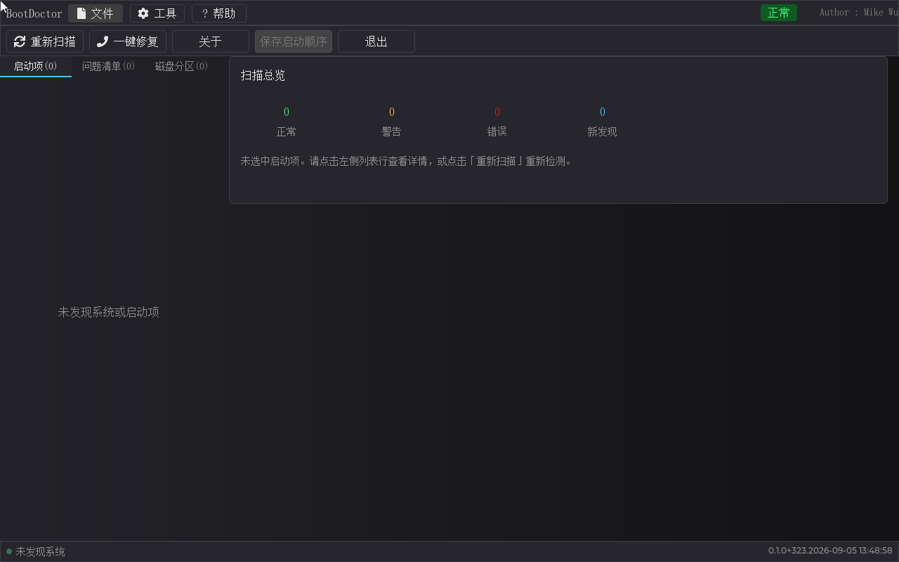
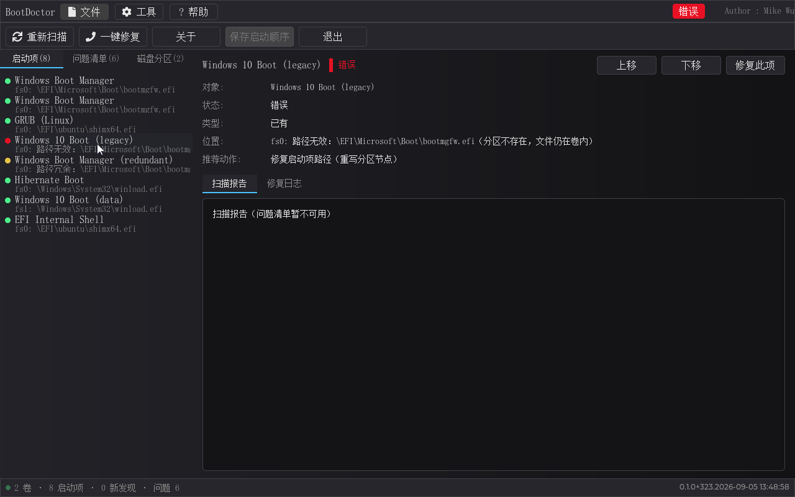
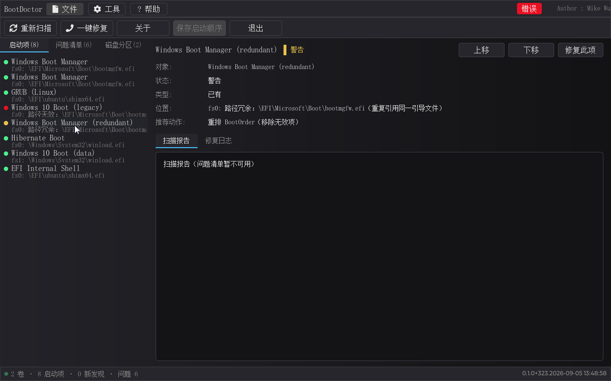
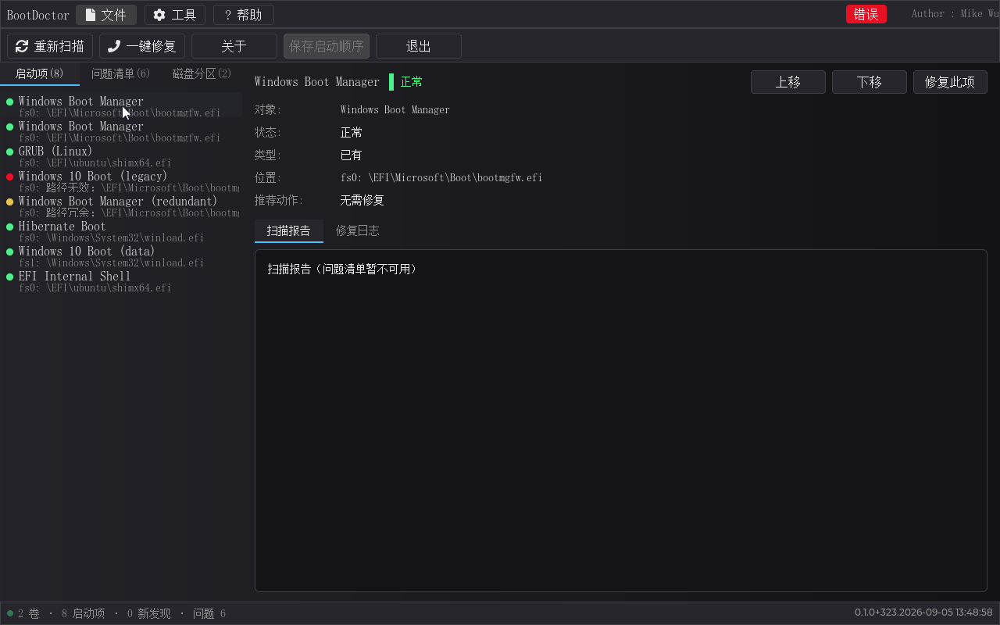
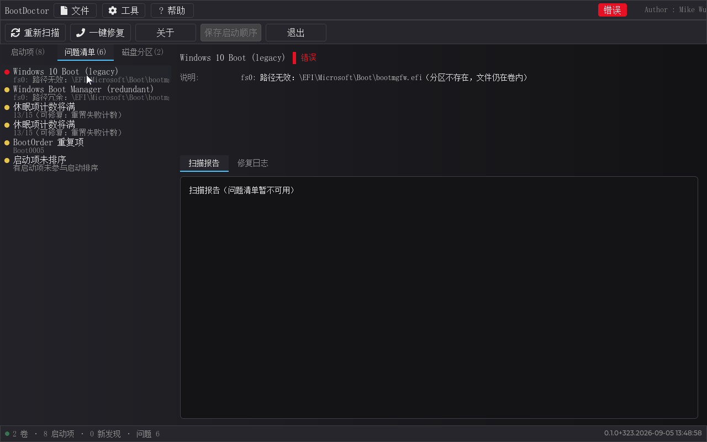
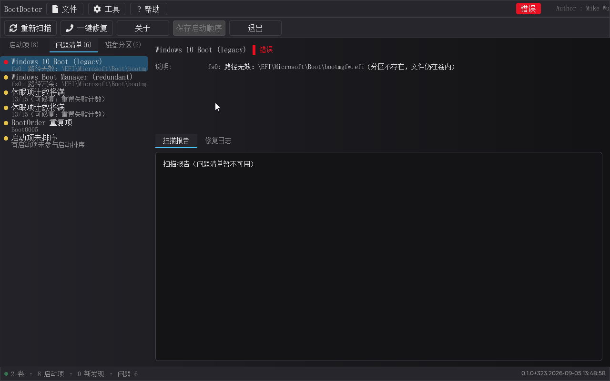
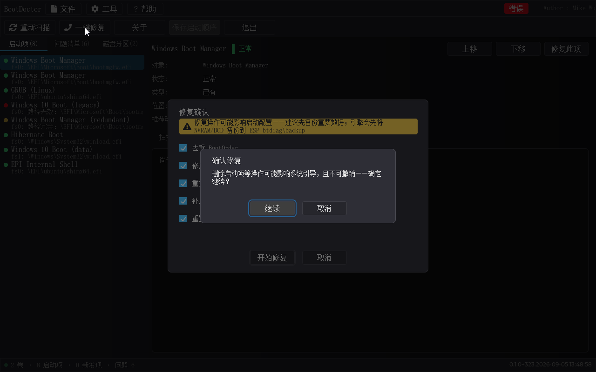
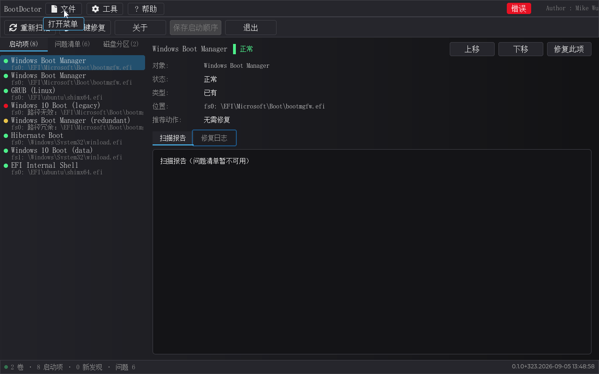
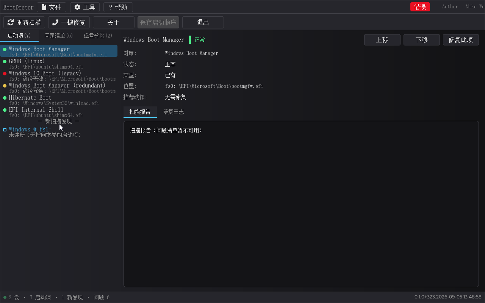

# BootDoctor 产品手册

**功能概要。** BootDoctor 是运行在 UEFI 环境下的图形化启动诊断修复工具（简体中文、Windows 11 风格、鼠标键盘双操作）——它是 bootrec + bcdboot 的图形版：**开机进不了系统**这一最常见场景的第一诊断修复工具。进工具即自动扫描全部磁盘分区上的 Windows/Linux 安装与引导文件，把"启动顺序错乱、启动项失效、ESP 分区引导文件丢失、BCD 配置损坏"等引导链问题逐个列出（绿/红/黄/蓝四色分级），按一次「一键修复」即自动修复；引导不上的系统，重装之前先试它。

> **免责声明**：本软件开放免费试用，**并不对造成的启动宕机和磁盘数据丢失负责**，请谨慎使用，并在使用前，做好数据备份。

> 本手册所有界面截图取自**当前构建能构造的最复杂错误环境**（场景 ULTRA = GOLDReal 全量 + BootOrder 同号重复 [5,5] + 真实 BCD）：同一台"机器"上同时存在红色错误（一个可修复的死启动项）、黄色警告（路径冗余启动项、BootOrder 同号重复、两条休眠计数将满、一条未排序）、绿色正常项六行（Windows ×2——同号重复各占一行、GRUB、休眠、指向数据卷的 Boot0010、Shell——计数 8 启动项 · 问题 6）与一个**真实** BCD（hive 15 对象、休眠计数 13/15×2——"重置失败计数"动作可直达目标）；一键修复并集 [5,7,2,6,8]（去重/修死项路径/清冗余/补序/**重置失败计数**）。唯一不能在此环境演示的功能——**未注册蓝卡**（ULTRA 的 fs1 安装已被 Boot0010 注册）——用同族场景 **GOLDReal0**（GOLDReal 全量但无 Boot0010）单独拍摄（§12）。

---

## 1. 为什么需要这个软件

开机进不了系统，十有八九不是硬件坏了，而是引导链出了问题：启动顺序错乱、启动项失效、ESP 分区引导文件丢失、BCD 配置损坏——这些本该由维护者修复，但传统的修复要进命令行（UEFI Shell/Windows bcdboot），普通用户根本无从下手。BootDoctor 的目的就是把这套流程变成**图形界面**：开机进工具，自动扫描出所有问题，点几下就修好——功能上相当于 bootrec + bcdboot 的图形版，其定位是"开机进不了系统"这一最常见场景的第一诊断修复工具。

**面向客群。** 谁都可能遇到开机进不去系统：一个按钮都不会按的普通用户、被"交给他修"的懂行同事、装机店/售后的营修工程师、企业 IT 运维——四类人的共同困境是"问题表象相同（开机黑屏/卡 Logo/转圈死机），但根因无法凭肉眼判定"。本工具恰好卡在"进不去系统"到"重装系统"之间的空档：不需要敲一条命令行、不需要理解分区表和 BCD 是什么，开机自动扫描、四色分级、一键修复；营修人员则可以把它当作故障定级的第一道工序——扫描报告会把"这是一个 C 盘数据完好、只是引导项失效的盘"和"这是 BCD 已损坏、需要重建的盘"直接亮出来。

**详细功能清单**（每项功能在后续章节展开讲解并配截图；下方 GIF 为各功能操作流程演示）：

| 功能 | 说明 | 章节 |
|------|------|------|
| 自动扫描诊断 | 六阶段扫描：卷/分区枚举、Windows/Linux 安装识别、NVRAM 启动项读取、交叉校验、问题汇总；进度条+状态栏实时进度 | §4 |
| 四色问题列表 | 启动项列表按状态着色：绿=正常、红=错误、黄=警告、蓝=新发现（未注册安装）；行=状态点+名称+摘要 | §5 |
| 详情卡 | 选中行显示名称/类型/位置/描述/路径/判定说明 +「修复此项」+ 顺序调整按钮；扫描报告/修复日志双页签 | §6 |
| 问题清单页签 | 全部疑难汇总（错误/警告/新发现），点击联动详情 | §6 |
| 磁盘分区页签 | 每块盘每个分区的 GPT/MBR 类型、大小 | §6 |
| 一键修复 | 汇总全部待办逐个修复：确认框全选 → 高风险二次确认 → 执行面板（进度/绿勾红叉/每步说明）→ 汇总 → 完成即重扫 | §7 |
| 一键修复自动收敛轮 | 修复后自动重扫；仍有可修待办且本轮无失败 → 自动再弹确认框（剩余动作预选），点「开始修复」即收尾（至多 3 轮）——"一键修复"不再要用户手动点第二遍 | §7 |
| 单项修复 | 「修复此项」只修当前选中项 | §8 |
| 启动顺序调整 | 上移/下移按钮、Alt+↑/↓ 捷径、**拖拽改序**；「保存启动顺序」按钮（有改动才亮）+ 退出未保存提醒；BDS 平台项自动保留、备份先行 | §10 |
| BCD 修复 | 损坏 BCD 模板式重建（15 对象基准蓝图，bcdedit 可验证）；失败计数定点归零（0x25000021 元素字节级） | §7 动作表 |
| ESP 重建 | 现有分区内重建 `\EFI\Microsoft\Boot\` 引导文件（建目录/拷 bootmgfw.efi/补 BCD 模板，不动分区表） | §7 动作表 |
| 未注册登记 | 新发现安装（无启动项指向）→ bcdboot 语义补 Boot####（真实分区 GUID + 卷内真实引导文件，绝不造死项）+ 置顶入序；真 GPT/单卷收敛、合成签名多卷如实报-only | §12 |
| 数据安全 | 任何修改前备份（`\btdiag\backup\`）；写 BCD/删项/路径重写=高风险双确认；[8] 只动 8 字节、[3] 产出合法 hive | §9 |
| 无鼠标适配 | 探测不到鼠标驱动 → 状态栏 `[无鼠标驱动]` 标示 + 键盘优先（Tab 大元素循环/方向键/Enter/Alt 捷径/Esc） | §13 |
| 可启动 ISO | 无 Shell 用户刻盘/写 U 盘开机直达本工具 | §2 |

---

## 2. 安装与启动（可启动 ISO）

**推荐形态：可启动 ISO**（`dist/BootDoctor-<版本>.iso`——UEFI El Torito 可启动光盘镜像，"嵌入式 ESP"双保险结构——内含应用本体与全部依赖文件）。**用户不需要 Shell、不需要任何引导配置**——把 ISO 刻录到光盘、用 Rufus 等工具以"UEFI: ISO 镜像模式"写入 U 盘、或放入 **Ventoy** 启动 U 盘（菜单选第一项「正常模式」），开机后固件会自动从介质找到本工具并直接启动进入界面；**注意 Secure Boot 须关闭**（镜像未签名）：

**工作原理**（供维护者参考）：ISO 采用 **"嵌入式 ESP"双保险结构**（Windows/Ubuntu ISO 同款）——ISO9660 + Joliet + RockRidge + UDF 2.60 桥，内容含 `EFI\BOOT\BOOTX64.EFI`（应用本体）与 `ESP_IMG.BIN`（16MB FAT16 嵌入式 ESP，内含 `EFI\BOOT\BOOTX64.EFI`）；El Torito "EFI 平台"引导（platform ID 0xEF）指向 ESP_IMG.BIN。这样：固件 / **Ventoy（正常模式）** / VMware / 真机走"El Torito → FAT ESP → bootmgfw 路径"，OVMF 光驱走 UDF 桥（绕开 EDK2 FatPkg 对 FAT16@2048 块的限制）——双保险各管一端，跨固件/跨加载器兼容（Ventoy 的 grub2 模式对非标准 ISO 为已知限制——菜单请选第一项「正常模式」）。本手册所示验证在标准 UEFI 固件的虚拟主机上完成：光驱直启、Ventoy 正常模式、raw/DD 直挂三者串口 `APP_VERSION` 均一致（上图即从 ISO 引导的实机画面）。

**三种使用形态对照**：

| 形态 | 用法 | 适合 |
|------|------|------|
| ISO（推荐） | 刻盘/`Rufus` 写 U 盘（UEFI: ISO 镜像模式） | 无 Shell 用户、救援盘、发行 |
| 磁盘镜像 `qemu_disk\*\disk.img` | 虚拟机直接挂载（虚拟磁盘文件） | 开发、测试、演示环境 |
| `run\hda\EFI\BOOT\BOOTX64.EFI` | 拷入任意 ESP 分区标准路径 | 已有 UEFI 环境的集成 |

**启动后**：自动进入主界面并完成首次扫描（无需任何按键）。退出工具后回到固件（光盘场景弹出介质即离开）。UI 以鼠标为主、键盘全兼容（见 §13——无鼠标固件自动键盘优先）。

---

## 3. 启动与界面总览

工具以 EFI 可执行文件形态随引导介质发布。BIOS 开机后搜索所有磁盘分区上的 Windows/Linux 安装与引导文件、读取 NVRAM 启动项，随后进入主界面并自动完成第一次扫描。

界面自上而下分为五个区域：

1. **标题栏**：左侧 BootDoctor 标志与三个菜单（文件/工具/帮助），右上角状态徽章（就绪/扫描中/修复中/正常/错误五态）与版本水印。
2. **工具栏**：重新扫描、一键修复、关于、保存启动顺序、退出五个按钮。
3. **进度条**：扫描/修复期间出现（默认隐藏），带流光亮纹与百分比。
4. **主区**：左栏三个页签（启动项/问题清单/磁盘分区，带计数）+ 一个三栏列表 + 右栏详情卡。
5. **状态栏**：左侧呼吸点与计数文本（本环境"2 卷 · 8 启动项 · 0 新发现 · 问题 6"），右侧版本号——与串口日志、右上水印三者恒一致。

## 4. 扫描

进入主界面后自动开始扫描（六阶段：卷枚举 → 分区扫描 → 安装识别 → NVRAM 读取 → 交叉校验 → 问题汇总）。期间进度条与状态栏显示"正在扫描…"，整个界面进入只读态（按钮置灰、列表行不可点）。正常机一次扫描在数秒内完成；扫描完成后列表按问题类型自动着色。也可以随时点工具栏「重新扫描」重来一遍。

## 5. 启动项列表与四色状态（核心视图）

启动项页签列出所有引导项，每行由状态点 + 名称 + 摘要行组成。**四色语义**：

| 颜色 | 含义 | 说明 |
|------|------|------|
| 绿色 | 正常 | 路径有效、文件存在的启动项（Windows/GRUB/休眠/Shell） |
| 红色 | 错误 | 启动项目标路径无效或文件缺失（无法修复/可修复两类，见下） |
| 黄色 | 警告 | 冗余引用、BootOrder 异常、计数将满、未排序等"有用但不健康" |
| 蓝色 | 新发现 | 扫描发现**未注册**的 Windows/Linux 安装（没有启动项指向它） |

**红色错误项**（下图为一个典型的"可修复死启动项"：分区节点已失效，但目标文件仍真实存在于卷内）：

红项在右栏可以看到具体说明与「修复此项」。工具遵循两种策略：目标引导文件**仍存在于卷内**的，判定为"可修复死"，建议「修复启动项路径（重写分区节点）」——把失效分区节点改写为真实分区并覆盖回写；文件**确不存在**的，判定为"真死"，才建议删除。

**黄色警告项**——冗余启动项（与另一项重复引用同一引导文件）：

**绿色正常项**：

## 6. 右栏详情卡

选中任意行，右栏显示该条目的完整详情：

- **六段关键信息**：名称/类型/位置/描述/路径/判定说明，配状态徽章与「修复此项」按钮；已入启动顺序的行还有「上移/下移」（启动顺序调整，见第 10 节）。
- **两个内容页签**：**扫描报告**（扫描期收集的全部事实，可放大滚动）与 **修复日志**（历次修复操作的流水账）。

更多**问题清单**页签（全部疑难汇总，行状态点语义同上，点击行同样联动右栏详情）：

**磁盘分区**页签（每块磁盘每个分区的 GPT/MBR、类型、大小——ESP/Windows/Linux/其他）：

## 7. 一键修复

> **免责声明**：本软件开放免费试用，**并不对造成的启动宕机和磁盘数据丢失负责**，请谨慎使用，并在使用前，做好数据备份。一键修复会实际改写引导配置（NVRAM 启动项与 BCD），执行前工具会先备份（§9），双向确认后才会动手——但请务必自己先备份重要数据。

工具栏「一键修复」会汇总扫描发现的全部待办，按确认清单逐个修复。本复杂环境共有 5 个动作（去重 BootOrder [5]、修复死项路径 [7]、清冗余 [2]、补入未排序项 [6]、重置失败计数 [8]——注意 [5] 同号重复与 [2] 路径冗余并存且互不污染）：

确认框列出全部动作并预选。**破坏性操作有两道防线**：写 BCD/删启动项/重写引导项路径属高风险，点击「开始修复」后额外弹出**高危二次确认**（警示"可能造成数据损失，请先备份"），确认后才真正执行：

执行面板逐动作推进，带进度、绿勾/红叉与每步中文说明（备份先行——任何写操作先落一份备份到卷上 `\btdiag\backup\`）：

完成后点「完成」立即重扫——问题随修复收敛，界面显示"（已修复）"标注：

**一键修复自动收敛轮（2026-09-05 起）。** 一次"修复"往往不是刚好一步：本环境里修复完死项路径 [7] 后，该行按"与 0005 同文件"被判为路径冗余（引擎诚实收敛——真机独立死项修复后即绿，无需再修）。旧版本此时需要你**手动再点一次「一键修复」**；现在重扫完成后引擎检测到"仍有可修待办且本轮无失败"，**自动再弹确认框**（剩余动作已预选），你点「开始修复」即收尾——不会出现"第一遍修复后第二遍又发现一个错误"：

自动收敛轮至多 3 轮（一般 1 轮即到"无待办"）；每轮执行前后自动重扫；全部收敛后再次点击「一键修复」提示 `no pending repairs`（不再重复写）。

## 8. 单项修复

选中红色/黄色行，点右栏「修复此项」（或菜单 工具 → 一键修复）只对当前项执行：

## 9. 修复动作速查表

| # | 动作 | 风险 | 语义 |
|---|------|------|------|
| 0 | bcdboot 注册 | 中 | 给未注册安装新建 Boot####（真实分区节点 + 卷内真实引导文件）并置顶入序 |
| 1 | 重建 ESP 引导文件（现有分区内） | 中 | 建 `\EFI\Microsoft\Boot\`、拷 bootmgfw.efi、补 BCD 模板（不动分区表） |
| 2 | 重排 BootOrder（移除无效项） | 中 | 清冗余引用并删除冗余变量 |
| 3 | 修复 BCD（重建） | **高** | 备份损坏 BCD → 模板式重建（15 对象基准蓝图，可经 bcdedit 验证） |
| 4 | 删除失效启动项 | **高** | 真正死项（文件确不存在）删除 |
| 5 | 去重 BootOrder | 中 | 同号重复引用去重 |
| 6 | 补入未排序启动项 | 中 | 未入 BootOrder 的有效项追加到尾部 |
| 7 | 修复启动项路径（重写分区节点） | **高** | 可修复死项：真实分区前缀 + 原文件路径覆盖回写 |
| 8 | 重置失败计数 | **高** | BCD 计数元素 0x25000021 字节级归零（清零"休眠计数将满"） |

**备份与数据安全**：每次修复批开始前对所有将被修改的 NVRAM 变量、BCD、引导文件做备份；备份落在卷上 `\btdiag\backup\`，二次确认框明示"可能造成数据损失"；[8] 定点修补只动计数 8 字节、[3] 替换为完整合法 hive——残留文件均可经 bcdedit /enum all 只读验证。

## 10. 启动顺序调整

让系统按你想要的顺序启动，有四件事：

1. **上移/下移**：选中绿色（已入序）项，右栏「上移/下移」逐个换位；
2. **Alt+↑/↓ 键盘捷径**：列表聚焦时按住 Alt 方向键，同效；
3. **拖拽**：直接按住启动项行拖到目标位置（行体跟指针、其他行让位，Windows 列表手感）；
4. **保存启动顺序**：以上操作只改**显示顺序**（不改真实 BootOrder）——工具栏「保存启动顺序」按钮在"有改动"时点亮（无改动/只读期置灰），点击把当前显示序写回 BootOrder（备份先行，未入序项随保存入序，BDS 平台项自动保留尾部）。改序后直接退出会弹三键提醒（保存并退出 / 放弃退出 / 取消）：

## 11. 菜单与关于

- **文件**：重新扫描 / 退出（有未保存改序时弹提醒）；
- **工具**：一键修复；
- **帮助**：关于——版本、联系邮箱(mikewuping@163.com)、License(MIT) 与构建信息：

## 12. 未注册安装（蓝卡）与新系统

蓝卡 = 扫描发现一个**可启动但没有任何 Boot 项指向它**的 Windows/Linux 安装（例如新分区、系统盘被换过、引导链被破坏后重装系统）——本节截图用 GOLDReal0 环境演示（与 ULTRA 同构但无 Boot0010——fs1 数据卷 Win10 不被任何启动项指向）：

选中蓝卡查看详情——"未建启动项（未注册——无指向本卷的启动项）"：

「修复此项」走 bcdboot 语义：新建一条 Boot####（指向该分区真实 GUID + 卷内真实引导文件——bootmgfw.efi 优先、winload.efi 兜底，绝不造死项）并置顶入序。**能否真正收敛取决于"新项能不能指向这个分区"**：真机/真镜像（GPT 分区 GUID 精确命中）与单盘单卷（唯一候选命中）下，重扫后蓝卡消失、新项变绿（端到端回归：`detect: Windows @ fs1:` 消失、`new=0`、第二会话持久）；而在合成签名测试盘环境（两盘 MBR 签名相同 + 同分区号）下 HD 字节全等、新项恒被解析到第一盘——写上去不但蓝卡不收敛还会与既有项路径全等报"冗余"（"点击一次两个错项"）——引擎对此如实报-only（蓝卡保留 + 注记"未注册（无指向本卷的启动项）"），不承诺做不到的事。

## 13. 状态栏、无鼠标驱动与键盘优先

状态栏左侧呼吸点与计数；右下版本号。**主板 BIOS 无鼠标驱动**时（真机常见——固件根本没装鼠标驱动，与"鼠标坏了"不同），启动时探测两个指针协议（绝对指针/相对指针），均缺失时状态栏计数前置 `[无鼠标驱动]` 前缀并进入**键盘优先**模式：

- **Tab / Shift+Tab**：在大元素间循环焦点（菜单 → 工具栏 → 页签 → 列表 → 详情按钮），当前控件高亮描边；对话框打开时焦点限定在对话框内；
- **方向键**：列表内上下移动选中（实时联动详情），Enter 触发当前项；
- **Alt+↑/↓** 列表排序捷径；**Esc** 关闭对话框/取消。

## 14. 退出

工具栏「退出」或 文件 → 退出。有未保存的启动顺序改动时先弹三键提醒；否则直接退出回到 UEFI Shell。

> **免责声明（再次重申）**：本软件开放免费试用，**并不对造成的启动宕机和磁盘数据丢失负责**，请谨慎使用，并在使用前，做好数据备份。请定期备份系统盘与重要资料；本工具对引导配置的任何修改都先备份到卷上 `\btdiag\backup\`——万一修复后仍无法启动，从该目录可复盘原始状态。

## 附录 A：已验证的典型故障场景

以下场景均有本工具实测记录（验证环境：标准 UEFI 固件虚拟主机 + 合成 GPT/MBR 磁盘镜像——两种典型盘形态（单盘单卷、GPT 双分区）与真盘结构一致），每个场景都执行过"扫描→判定→修复→重扫收敛"全链路：

| 案例 | 故障表象 | 工具判定与修复 | 验证结论 |
|------|------|------|------|
| 死启动项（可修复） | 启动项红、提示路径无效 | 目标文件仍真实在卷内 → 「修复启动项路径（重写分区节点）」同号覆盖 | 修复后该项变绿、未注册安装随注册收敛 |
| 死启动项（真死） | 同上 | 文件确不存在 → 仅建议「删除失效启动项」（高危二次确认） | 删除后不再出现 |
| 冗余启动项 | 与另一项指向同一引导文件（黄） | 「重排 BootOrder（移除无效项）」删冗余变量 | 清理后行消失 |
| BootOrder 同号重复 | 同一启动项两次入序（黄） | 「去重 BootOrder」 | 保留其一；与路径冗余判定互不污染 |
| 休眠计数将满 | 计数 13/15（黄×2，真实 BCD） | 「重置失败计数」字节级归零（0x25000021） | 归零后警告消失；系统侧 bcdedit 可读、字段全等 |
| BCD 损坏 | BCD 无法解析（红） | 「修复 BCD（重建）」：备份损坏原件 → 模板式重建（15 对象基准蓝图） | 重建后可读、对象≥1；损坏原件备份字节全等 |
| 启动项未排序 | 有效启动项未入 BootOrder（黄） | 「补入未排序启动项」 | 补入后排序齐全 |
| 未注册安装（蓝卡） | 有可引导安装但无任何 Boot 项指向 | bcdboot 语义新建 Boot####（真实分区 GUID + 卷内真实引导文件）置顶入序 | 修复后蓝卡消失、新项变绿、重启会话持久 |
| ESP 缺引导文件 | `esp: no boot dir`（红） | 「重建 ESP 引导文件（现有分区内）」建目录/拷 bootmgfw.efi/补模板 | 修复后 `esp: ok`；主机侧文件在位 |
| 无 ESP 分区（风险域） | `esp: missing`（红） | 分区级红线——如实报"需分区级重建（未自动执行——避免数据风险）" | 不自动动分区表；提示人工处理 |
| 全族混合（最复杂案） | 死项/冗余/重复/计数将满×2/未排序/正常项×6 同屏 | 一键修复并集 [5,7,2,6,8] + 自动收敛轮（1 轮） | 一键后问题 6→1→无待办；重扫"（已修复）"标注出现 |
| Legacy/BIOS 盘（无 UEFI 引导结构） | 传统 MBR+NTFS 盘 | 如实报"UEFI 无法修复"路径，不装配修复动作 | 不误导用户、不妄动 |

**工具自身可靠性**：全部判定以真实文件探测为准（不信"名字像"）；引用指向以分区节点精确匹配（多卷同名文件不串认）；修复前备份、双确认、[8] 只动 8 字节；版本号三角（界面右下角/工具日志/校验文件）恒一致。

## 附录 B：术语表

| 术语 | 含义 |
|------|------|
| BootOrder | NVRAM 中决定启动顺序的数组（Boot0000/Boot0001…的排列） |
| Boot#### | 一条启动项变量：名称+设备路径+可选项 |
| ESP/EFI 分区 | FAT 格式引导分区，`\EFI\Microsoft\Boot\` 放 bootmgfw.efi 与 BCD |
| BCD | 注册表格式 hive（`\EFI\Microsoft\Boot\BCD`），Windows 启动配置数据 |
| HD 分区节点 | Boot 项设备路径里的"指向哪个物理分区"节点（GPT=分区 GUID，MBR=盘签名+分区号） |
