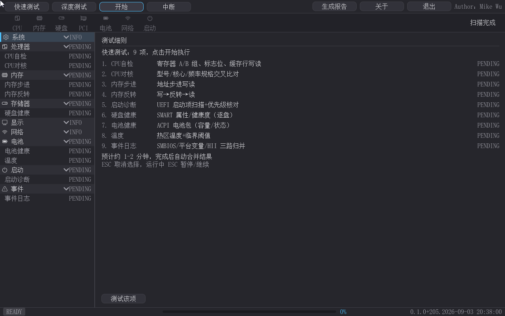

# UEFI_Test_Suite

> [English version below](#english) ｜ [English README](#english)

**UEFI 硬件诊断工具套件** —— 面向 UEFI 环境的硬件诊断、测试与维修辅助工具**二进制发布仓**。本仓库**不含源码**：仅发布各工具的二进制产物、可启动镜像与产品文档。**个人用户免费使用；商业用途请联系各工具许可页与作者授权。**

> The binary release repository for UEFI hardware diagnostics, testing and repair-assist tools. **No source code here** — only compiled binaries, bootable images and documentation. **Free for personal use; commercial use requires contacting the authors for authorization.**

---

## 目录 / Contents

| 工具 | 说明 | 文档 |
|---|---|---|
| [pcDig](pcDig/) | 图形化整机硬件诊断工具（对标 Dell BIOS 内建 Diagnostics / PC-Check）：UEFI Shell 或免 Shell 可启动 ISO，21 项自检（CPU/内存 7 pattern/存储 SMART+DST/显存/网络/USB/输入设备/启动诊断/事件日志/温度电池传感器）+ 扫描条放大镜可视化 + 左树实时联动 + 汇总弹窗 + HTML 报告 | [详细说明](pcDig/README.md) ｜ [产品手册](pcDig/docs/manual/pcdig-product-manual.md) |

## pcDig — Hardware Diagnostics Toolkit

运行在 **UEFI Shell**（或免 Shell 的可启动 ISO）中的图形化整机硬件诊断工具：快速 9 项 + 深度 12 项 = 21 项自检，全程扫描条放大镜动画、左树实时联动（TESTING→OK/WARN/FAIL），完成后汇总弹窗 + HTML 报告；纯键盘全流程、无鼠标自动提示、屏幕三点测试；姊妹工具导流（高级内存测试 advmemtest / 启动医生 BootDoctor）。基于 LVGL 图形库（MIT），全简体中文界面，右上角署名 `Author：Mike Wu`。

- 版本：0.1.0（Build 213，2026-09-05）｜ 作者：Mike Wu（mikewuping@163.com）
- **下载**：`pcDig/pcdig.efi`（1.1 MB，UEFI 应用）；`pcDig/pcDig-boot.iso`（约 3 MB，免 Shell 直启 Live-CD——随仓提供）
- 详见 [pcDig 说明](pcDig/README.md) ｜ [产品手册（MD/Word）](pcDig/docs/manual/pcdig-product-manual.md)

## 许可 / License

本套件各工具默认：**个人用户免费使用；商业用途（营利性部署/分发/预装）需提前联系作者书面授权**，各工具目录内 LICENSE 为准。作者联系方式：mikewuping@163.com。

> Each tool in this suite is **free for personal use; commercial use (profit-oriented deployment / redistribution) requires written authorization from the author** — see the LICENSE file inside each tool directory. Contact: mikewuping@163.com.

---

## English

# UEFI_Test_Suite

The binary release repository of UEFI hardware diagnostics, testing and repair-assist tools. This repository contains **no source code** — only compiled binaries, bootable images and documentation.

| Tool | Description | Docs |
|---|---|---|
| [pcDig](pcDig/) | A GUI whole-machine hardware diagnostics toolkit (Dell built-in Diagnostics / PC-Check style): UEFI Shell or a shell-free bootable ISO — 21 self-tests (CPU, 7 memory patterns, SMART+DST storage, VRAM, network, USB, input, boot diagnostics, event log, temperature & battery), scanbar magnifier visualization, real-time left tree, completion summary dialog, HTML report | [README](pcDig/README.md) ｜ [Product manual](pcDig/docs/manual/pcdig-product-manual.md) |

## pcDig — Hardware Diagnostics Toolkit

Runs in the **UEFI Shell** (or a shell-free bootable ISO): 9 quick + 12 extensive = 21 checks, with scanbar magnifier animation, a live left tree (TESTING→OK/WARN/FAIL), a completion summary dialog and an HTML report; full keyboard-only workflow, automatic no-mouse hint, on-screen 3-point screen test; sister-tool cross-links (advmemtest / BootDoctor). Built on the MIT-licensed LVGL graphics library; fully simplified-Chinese UI; top-right `Author：Mike Wu`.

- Version 0.1.0 (Build 213, 2026-09-05) ｜ Author: Mike Wu (mikewuping@163.com)
- **Downloads**: `pcDig/pcdig.efi` (1.1 MB) and the shell-free Live-CD `pcDig/pcDig-boot.iso` (~3 MB, in this repo).

## License

Free for personal use; commercial use requires written authorization — see the LICENSE file in each tool directory. Contact: mikewuping@163.com.
