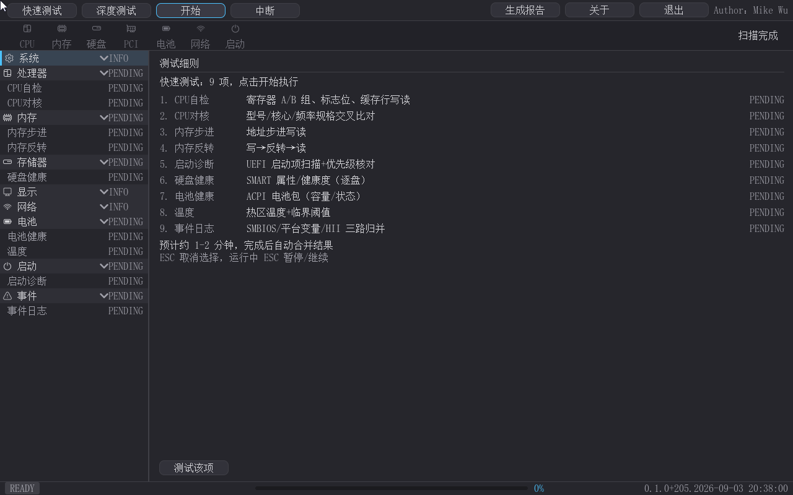
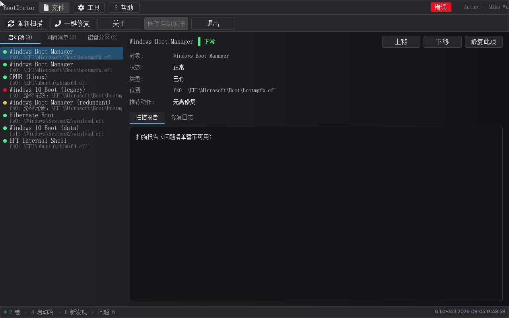
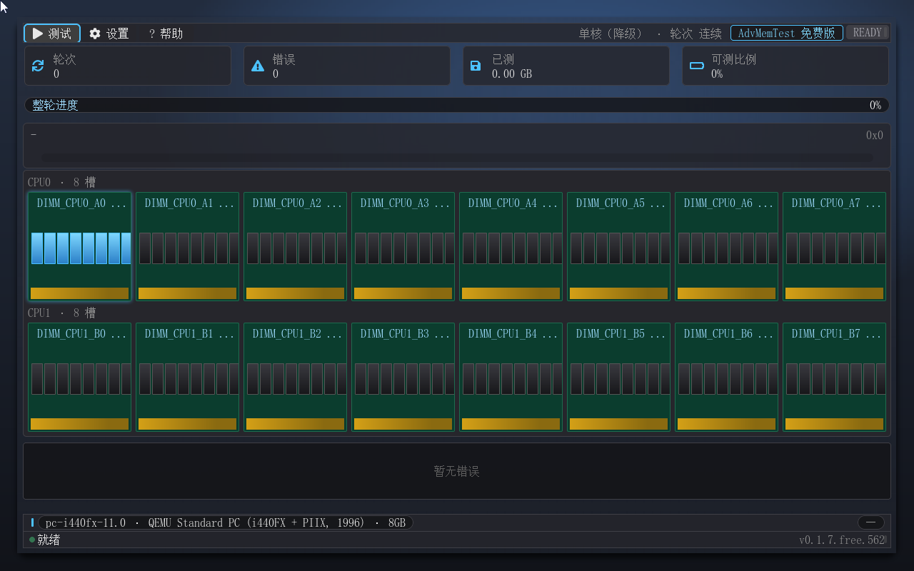
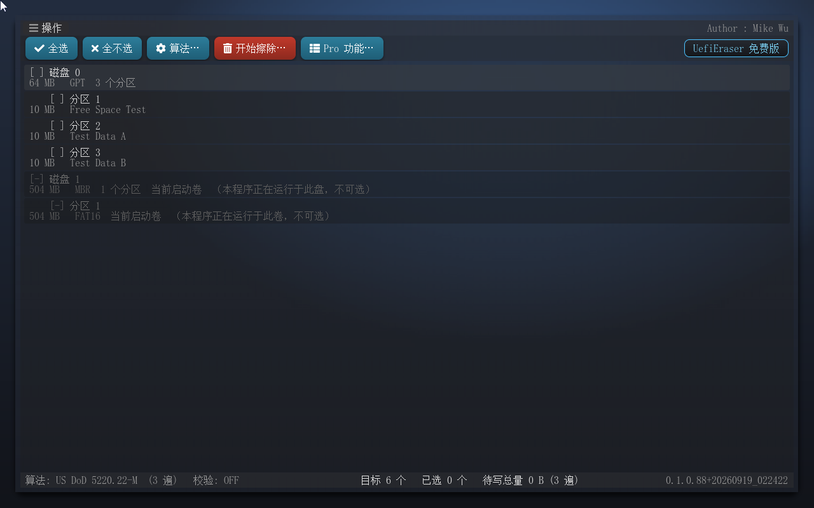

# UEFI_Test_Suite

> [English version below](#english) ｜ [English README](#english)

**UEFI 硬件诊断工具套件** —— 面向 UEFI 环境的硬件诊断、测试与维修辅助工具**二进制发布仓**。本仓库**不含源码**：仅发布各工具的二进制产物、可启动镜像与产品文档。**个人用户免费使用；商业用途请联系各工具许可页与作者授权。**

> The binary release repository for UEFI hardware diagnostics, testing and repair-assist tools. **No source code here** — only compiled binaries, bootable images and documentation. **Free for personal use; commercial use requires contacting the authors for authorization.**

---

## 目录 / Contents

| 工具 | 说明 | 文档 |
|---|---|---|
| [pcDig](pcDig/) | 图形化整机硬件诊断工具（对标 Dell BIOS 内建 Diagnostics / PC-Check）：UEFI Shell 或免 Shell 可启动 ISO，21 项自检（CPU/内存 7 pattern/存储 SMART+DST/显存/网络/USB/输入设备/启动诊断/事件日志/温度电池传感器）+ 扫描条放大镜可视化 + 左树实时联动 + 汇总弹窗 + HTML 报告 | [详细说明](pcDig/README.md) ｜ [产品手册](pcDig/docs/manual/pcdig-product-manual.md) |
| [BootDoctor](BootDoctor/) | 图形化启动诊断修复工具（bootrec + bcdboot 的图形版）：扫描所有分区找 Windows/Linux 安装，四色列出启动链问题（启动项完整性/安装注册/BCD 链/引导文件），一键修复 + 自动收敛轮（补 bootmgfw 启动项/重建 ESP/修复 BCD/删除死项/重置失败计数/顺序修复），拖拽改序 + 保存启动顺序 + 退出提醒，免责门控 + 备份先行，免 Shell 可启动 ISO（Ventoy 兼容），安装介质排除（Windows 安装 U 盘/Live CD） | [详细说明](BootDoctor/README.md) ｜ [产品手册](BootDoctor/docs/manual/bootdoctor-product-manual.md) |
| [AdvMemTest](AdvMemTest/) | UEFI Shell 图形化内存压测工具（对标 Memtest86 系）：33 条真实 pattern（免费版 13 条用户可见）+ 四线程模式 + 自我重定位 + 动态 DIMM 可视化带（最大 48 槽）+ 平台信息条与计时；Pro 版颗粒级错误定位（五级坐标）、SPD 深度内存信息页（含内存温度与 ECC 明细）、内存带宽曲线（四线 + 缓存台阶标注）、禁用缓存、坏块清单导出、512 核扩展 | [详细说明](AdvMemTest/README.md) ｜ [免费版手册](AdvMemTest/docs/manual/advmemtest-free-user-guide.md) ｜ [快速上手](AdvMemTest/docs/manual/advmemtest-quick-guide.md) |
| [UefiEraser](UefiEraser/) | 图形化磁盘数据粉碎工具：在操作系统启动之前对**整块物理磁盘**、**单个分区**或**分区的空闲空间**做不可恢复的多遍覆写——12 种行业标准算法（DoD 5220.22-M / ECE、Gutmann 35、Schneier、HMG IS5、RCMP TSSIT OPS-II、VSITR、GOST P50739-95、AR 380-19、USAF 5020、自定义 N 遍）+ 末遍回读校验 + 安全闸门（只读与启动卷不可选 / 摘要确认 / 键入 ERASE / 整盘再键入容量）+ 文本报告 + CSV 审计日志 + 擦后按介质重扫（幽灵分区自动剔除）；全键盘可达，界面内建中文；Free 版 MIT 开源，设备级擦除（ATA Secure Erase / NVMe Format NVM / NVMe Sanitize）与 18 种扩展算法属商业版 Pro | [详细说明](UefiEraser/README.md) ｜ [产品手册](UefiEraser/docs/manual/UefiEraser-产品手册.md) |
| [uwinunlocker](uwinunlocker/) | 图形化**离线重置 Windows 本地账户密码**工具（对标 PCUnlocker / PassFab / chntpw）：在操作系统起来之前，列出这台机器上**所有已安装的 Windows** 并逐个给出**三态判定**（可以重置 / 不能重置 / **判不了**），选中账户后一键清空密码，内置 `Administrator` 则按钮变字为「启用并重置密码」；不用进 Windows、不用原密码、不联网，**不替换 `sethc.exe`、不改引导链、不动系统里的任何可执行文件**；**写前读卷脏标志**（强制断电或开着"快速启动"关机的卷一律拒绝写入）、**写后把文件读回来逐字节比对**；BitLocker 卷、微软账户、域账户明确列为"不支持"并说清是哪一条阻碍；液态玻璃界面、全简体中文，`Tab` 焦点环 + `Esc` 随处可退，**全流程不用鼠标**；免 Shell 可直启 ISO。个人用户免费 | [详细说明](uwinunlocker/README.md) ｜ [产品手册](uwinunlocker/docs/manual/README.md) |

## 版本对齐表 / Release Matrix

| 工具 | 当前版本 | 发布日期 | 发布 tag | 主推 |
|---|---|---|---|---|
| pcDig | 0.1.1（Build 213；ISO 结构修复） | 2026-09-05 | [pcDig-v0.1.1](releases/tag/pcDig-v0.1.1) | ISO 兼容性修复：内嵌 ESP 结构（Ventoy/VMware/实体机验证） |
| BootDoctor | 0.1.0（Build 384） | 2026-09-06 | [bootdoctor-v0.1.0](releases/tag/bootdoctor-v0.1.0) | 二进制发布首版：四色诊断 + 一键修复（BCD 重建/计数归零/未注册登记/死项策略）+ 拖拽改序 + 安装介质排除（真机案例） |
| AdvMemTest | 0.1.7（Build 562；免费版 13 条用户可见 / 专业版 31 条目录） | 2026-09-20 | [AdvMemTest-v0.1.7.562](releases/tag/AdvMemTest-v0.1.7.562) | 增量版：注册表 → 33 条（+SIMD-128/256 宽访存）、带宽基准 → 工作集扫描曲线（四线 + L1/L2/L3 缓存台阶标注）、内存温度与 ECC（健康卡 / 内存信息页明细 / 报告段）、底部平台信息条与计时、DeviceLocator 长名的槽序修正、内部加固（新栈 8KB→64KB） |
| UefiEraser | 0.1.0（Build 90） | 2026-09-19 | [UefiEraser-v0.1.0.90](https://github.com/MikeWuPing/UefiEraser/releases/tag/v0.1.0.90) | 首版入列：整盘 / 分区 / 空闲空间粉碎 + 12 种行业标准算法 + 末遍回读校验 + 安全闸门 + 报告与 CSV 审计日志；本版修掉「运行约 5 分钟后被固件看门狗复位」——0.1.0.89 及更早都有，会打断长时间擦除。Free 版 MIT 开源（设备级擦除与 18 种扩展算法属商业版 Pro），源码与 Releases 在独立仓库 [UefiEraser](https://github.com/MikeWuPing/UefiEraser) |
| uwinunlocker | 0.1.0（Build 273） | 2026-10-05 | [v0.1.0.273](https://github.com/MikeWuPing/uwinunlocker/releases/tag/v0.1.0.273) | 首版入列：**离线重置 Windows 本地账户密码**——列出这台机器上所有 Windows + 三态判定（可以重置 / 不能重置 / 判不了）+ 清空密码与「启用并重置 Administrator」+ 写前脏卷门 + 写后逐字节回读。Win10 19045 与 Win11 26200 两条路线都验过，另有一次人工交互验证（清掉一个账户、完全不碰另一个、启用内置 Administrator——三条同时成立）。二进制与 Releases 在独立仓库 [uwinunlocker](https://github.com/MikeWuPing/uwinunlocker) |

> 工具独立 tag/Release 发布（节奏自由）；本表是"套件全家福"锚点，后续工具按同样方式追加行；里程碑时补套件合版（suite-vX.Y.Z）。

> AdvMemTest 专业版不发公开渠道——二进制与 `ADVMTEST.LIC` 授权经商务渠道交付（见 [AdvMemTest 说明](AdvMemTest/README.md)）。

## pcDig — Hardware Diagnostics Toolkit

运行在 **UEFI Shell**（或免 Shell 的可启动 ISO）中的图形化整机硬件诊断工具：快速 9 项 + 深度 12 项 = 21 项自检，全程扫描条放大镜动画、左树实时联动（TESTING→OK/WARN/FAIL），完成后汇总弹窗 + HTML 报告；纯键盘全流程、无鼠标自动提示、屏幕三点测试；姊妹工具导流（高级内存测试 advmemtest / 启动医生 BootDoctor）。基于 LVGL 图形库（MIT），全简体中文界面，右上角署名 `Author：Mike Wu`。

- 版本：0.1.0（Build 213，2026-09-05）｜ 作者：Mike Wu（mikewuping@163.com）
- **下载**：`pcDig/binaries/pcdig.efi`（1.1 MB，UEFI 应用）；`pcDig/iso/pcDig-boot-0.1.0.213+20260905_200529.iso`（约 19 MB，免 Shell 直启 Live-CD，内嵌 ESP——随仓提供）
- 详见 [pcDig 说明](pcDig/README.md) ｜ [产品手册（MD/Word）](pcDig/docs/manual/pcdig-product-manual.md)

## BootDoctor — Boot-diagnosis & Repair Tool

运行在 **UEFI**（免 Shell 可启动 ISO 或 FAT 介质直启）中的图形化启动诊断修复工具——**bootrec + bcdboot 的图形版**：扫描所有分区找 Windows/Linux 安装，四色列出启动链问题，一键修复 + 自动收敛轮；重建 ESP / 修复 BCD（模板式重建 + 失败计数字节级定点归零）/补 bootmgfw 启动项（未注册登记）/删除死项 / 修复启动项路径，拖拽改序 + 保存确认，无鼠标 BIOS 键盘优先 + 平台提示横幅，安装介质排除（Windows 安装 U 盘实机案例），基于 LVGL 构建（UEFI 移植层 [UEFI_LVGL](https://github.com/MikeWuPing/UEFI_LVGL)）。

- 版本：0.1.0（Build 384，2026-09-06）｜ 作者：Mike Wu（mikewuping@163.com）
- **下载**：`BootDoctor/binaries/bootdoctor.efi`（2.3 MB，UEFI 应用）；`BootDoctor/iso/BootDoctor-boot-0.1.0.384+20260906_123223.iso`（约 19 MB，免 Shell 直启 Live-CD，内嵌 ESP，Ventoy 兼容——随仓提供）；`BootDoctor/BootDoctor-0.1.0.384+20260906.zip`（便捷包）
- 详见 [BootDoctor 说明](BootDoctor/README.md) ｜ [产品手册（MD/Word）](BootDoctor/docs/manual/bootdoctor-product-manual.md)

## AdvMemTest — 内存压力测试工具

运行在 **UEFI Shell** 中的图形化内存压力测试工具，对标 Memtest86 全家——装机验收、故障排查与返修质检。**33 条真实测试 pattern**（免费版 13 条用户可见；地址线/数据线/电荷保持/缓存干扰/行锤/时序窗口/内存原厂算法/SIMD 宽访存），四线程模式真实多核调度（多线程切分并发实测 4 核约 2.5×吞吐，免费版上限 16 核 / 专业版按系统核数实探上限 512 核），自我重定位（程序自身占用的内存也纳入测试），动态 DIMM 可视化带（SMBIOS 双入口、最大 48 槽、空槽置灰、双路分组头），底部平台信息条（CPU · 主板 · 内存总量 + 起测时刻 / 已测时长），HTML 报告自动落盘。**专业版**追加 18 条高级 pattern（AMT 系/厂商系/增补条/SIMD-256——行锤与 SIMD-128 两版都有），并把错误指认精确到**颗粒级**——Socket/Channel/DIMM/Rank/Device 五级坐标，直接回答"哪根条上的哪颗芯片坏了"；另有 SPD 深度内存信息页（六后端采集，含内存温度与 ECC 明细）、内存带宽曲线（工作集扫描，两版通用；专业版读/写/拷贝 + SIMD 对照四线，标注 L1/L2/L3/内存 四档缓存台阶）、禁用缓存测试（CR0.CD 旁路）与坏块清单导出（badram / bcdedit 格式）。

- 版本：0.1.7（Build 562，2026-09-20；免费版 13 条用户可见（15 条可执行）/ 专业版 31 条目录（33 条可执行））｜ 作者：Mike Wu
- **下载**：`AdvMemTest/binaries/advmemtest-free.efi`（约 1.5 MB，UEFI 应用——免费版，个人用户免费使用）；`AdvMemTest/iso/AdvMemTest-boot-0.1.7.562+20260920_222322.iso`（约 7.4 MB，免 Shell 直启 Live-CD，El Torito + 内嵌 ESP——随仓提供）；`AdvMemTest/AdvMemTest-0.1.7.562+20260920_222322.zip`（约 6.1 MB，便捷包）；专业版经商务渠道交付（`AdvMemTestPro.efi` + `ADVMTEST.LIC`），不随本仓发布
- 详见 [AdvMemTest 说明](AdvMemTest/README.md) ｜ [免费版手册（MD/Word）](AdvMemTest/docs/manual/advmemtest-free-user-guide.md) ｜ [快速上手（MD/Word）](AdvMemTest/docs/manual/advmemtest-quick-guide.md)

## UefiEraser — 磁盘数据粉碎工具

运行在 **UEFI Shell**（操作系统启动之前）中的图形化磁盘数据粉碎工具：把整块物理磁盘、单个分区、
或分区的空闲空间用 12 种行业标准算法多遍覆写彻底抹掉，擦完自动落报告与 CSV 审计日志。
`格式化不等于销毁`（快速格式化只改元数据）、`系统盘擦不掉自己`（操作系统正在用它）、
`SSD 多遍覆写不可靠`（FTL 会把写入重映射到别的物理块）——这三件事在系统之外一次解决。
安全闸门让手滑无害：只读设备与当前启动卷不可选，随后依次是摘要确认、键入 `ERASE`、
整盘再键入容量合计，任何一步 Esc 即中止、不写一个字节；擦完按介质重扫（重读 LBA 0），
盘上已不存在的分区行整行剔除。全键盘可达（Tab 焦点环 / F2 导出 / Del 清空）。
基于 LVGL 图形库（MIT），全简体中文界面，工具栏带 Free 版徽标，菜单栏署名 `Author：Mike Wu`。

- 版本：0.1.0（Build 90，2026-09-19）｜ 作者：Mike Wu（mikewuping@163.com）
- **下载**：`UefiEraser/binaries/uefieraser-free.efi`（约 1.0 MB，UEFI 应用，Free 版，随本仓提供）；
  源码与 Releases 在独立仓库 **[github.com/MikeWuPing/UefiEraser](https://github.com/MikeWuPing/UefiEraser)**
  （Free 版 MIT 开源；设备级擦除与 18 种扩展算法属商业版 Pro，Free 版里灰显加锁）
- 详见 [UefiEraser 说明](UefiEraser/README.md) ｜ [产品手册（MD/Word）](UefiEraser/docs/manual/UefiEraser-产品手册.md) ｜ [使用手册](UefiEraser/docs/manual/README.md)

## uwinunlocker — 离线重置 Windows 本地账户密码

运行在 **UEFI**（操作系统启动之前）里的图形化工具：**不用进 Windows、不用知道原密码、不用联网**，
把 Windows **本地账户**的登录密码清掉。它做三件事——列出这台机器上**所有已安装的 Windows**、
逐个给出"能不能重置"的判定、然后把选中的那个重置掉。判定是**三态**：「判不了」单独占一档，
因为对一个不是 Windows 的系统我们一无所知，那是"我们没查"，不是"查了不行"——把这两种答案
混成一种，用户就会拿着一台 Linux 机器来问为什么不行。它也**不替换 `sethc.exe`、不改引导链、
不修改系统里的任何可执行文件**，只改盘上 SAM 里那个账户的密码字段：写之前先读卷的脏标志
（强制断电、或开着"快速启动"点关机的卷一律拒绝写入，并让你先回 Windows 正常关机一次），
写之后把文件读回来**逐字节比对**——上游驱动有过"返回成功却没写进去"的记录，所以"写成功"
和"校验通过"被当成两件事。选中的是内置 `Administrator` 时，按钮的字变成「**启用并重置密码**」，
一次做完清空密码与启用两步。界面是**液态玻璃**、全简体中文，右上角署名 `作者：Mike Wu`；
鼠标（含滚轮）与键盘都能操作，`Tab` 在控件间走焦点环（状态栏报出下一站是哪儿）、
`Esc` 在任何一站都能退出，**不用鼠标也能走完整个流程**。

- 版本：0.1.0（Build 273，2026-10-05）｜ 作者：Mike Wu（mikewuping@163.com）
- **下载**：`uwinunlocker/binaries/uwnx.efi`（约 3.1 MB，UEFI 应用）与 `uwinunlocker/binaries/ntfs.efi`（约 0.2 MB，NTFS 读写驱动——**这两个文件必须放在同一个目录**，应用只从自己所在的目录找驱动）；`uwinunlocker/iso/uwinunlocker-boot-0.1.0.273.iso`（约 8.9 MB，免 Shell 直启 Live-CD，内嵌 ESP——随仓提供）
- 独立发布仓与 Releases：**[github.com/MikeWuPing/uwinunlocker](https://github.com/MikeWuPing/uwinunlocker)**（本目录不含源码）
- 详见 [uwinunlocker 说明](uwinunlocker/README.md) ｜ [产品手册（Word / 图文 MD）](uwinunlocker/docs/manual/README.md)

## 兄弟项目 / Sister Projects

- [gudumpinfo](https://github.com/MikeWuPing/gudumpinfo) —— UEFI Shell 图形化系统信息查看器：Handle/协议中心/内存/ACPI/CPUID/MSR/Event-Timer/DEPEX 等 20 类固件底层信息（X64/AArch64）
- [gsetupmod](https://github.com/MikeWuPing/gsetupmod) —— 固件设置浏览器：解析 HII/IFR 重建 BIOS Setup，展示被固件隐藏的选项
- [UEFI_LVGL](https://github.com/MikeWuPing/UEFI_LVGL) —— LVGL 的 UEFI 移植库（本套件各工具 GUI 的公共底座，LVGL 随库内置）
- [guedit](https://github.com/MikeWuPing/guedit) —— UEFI Shell 下的图形化文本编辑器（LVGL）
- [gufile](https://github.com/MikeWuPing/gufile) —— UEFI Shell 下的 GUI 文件管理器（Explorer 式界面）
- [mount](https://github.com/MikeWuPing/mount) —— UEFI Shell 挂载工具：NTFS/ext4/ISO 卷挂载与 ISO 虚拟块设备

姊妹工具（pcDig 内部导流）：**高级内存测试 AdvMemTest** 已入列（见上方 AdvMemTest 节）。**启动医生 BootDoctor** 已入列（见上方 BootDoctor 节）。

## 变更记录 / Changelog

- **2026-10-05 · uwinunlocker 0.1.0（Build 273）**：uwinunlocker 入列套件（二进制 + 免 Shell 直启 ISO + 产品手册 + 17 张截图）——列出这台机器上**所有已安装的 Windows** + **三态判定**（可以重置 / 不能重置 / **判不了**）+ 清空密码与「启用并重置 Administrator」+ **写前脏卷门**（强制断电、开着"快速启动"关机的卷一律拒绝写入）+ **写后逐字节回读**；BitLocker 卷、微软账户与域账户明确列为不支持，并说清具体是哪一条阻碍。**Win10 `10.0.19045.3803` 与 Win11 25H2 `10.0.26200.6584` 两条路线都验过**，另有一次**人工交互验证**（清掉一个账户、完全不碰另一个、启用内置 Administrator——三条同时成立）。二进制与 Releases 在独立仓库 [uwinunlocker](https://github.com/MikeWuPing/uwinunlocker)。
- **2026-09-20 · AdvMemTest-v0.1.7.562**：AdvMemTest 增量版（0.1.7 Build 562）——注册表重排为 **33 条**（**Free = Id 0–14 / Pro = Id 15–32**；**行锤放开到免费版**、新增 SIMD 宽访存两条；免费版用户可见 11 → **13 条**）+ **内存带宽基准改为工作集扫描曲线**（免费版读取一条线；Pro 读/写/拷贝 + SIMD 对照 + L1/L2/L3/内存四档缓存台阶标注）+ **内存温度与 ECC**（Pro：SPD 集线器读模组温度、MCA 只读轮询读 CE/UE；健康卡 / 内存信息页明细节 / 报告段）+ **底部平台信息条与计时**（两版通用）+ DeviceLocator 长名机器的槽序修正 + 内部加固（新栈 8KB → 64KB）。
- **2026-09-19 · UefiEraser 0.1.0（Build 90）**：UefiEraser 入列套件（二进制 + 产品手册 + 使用手册 + 29 张截图）——整盘 / 分区 / 空闲空间多遍覆写 + 12 种行业标准算法 + 末遍回读校验 + 安全闸门 + 文本报告 + CSV 审计日志 + 擦后按介质重扫；键盘全程可达。本版修掉「启动约 5 分钟后被固件看门狗整机复位」——该缺陷存在于 0.1.0.89 及更早的所有版本，长时间擦除会被中途打断。Free 版 MIT 开源；设备级擦除与 18 种扩展算法属商业版 Pro。源码与 Releases 见 [UefiEraser 仓库](https://github.com/MikeWuPing/UefiEraser)。
- **2026-09-15 · AdvMemTest-v0.1.7**：AdvMemTest 二进制发布首版（0.1.7 Build 401）——免费版经典测试集 11 条用户可见 pattern（地址类 / memtest86+ 系 / 引擎自检参考条）+ 四线程模式（多核上限 16 核）+ 自我重定位 + 动态 DIMM 可视化带（SMBIOS 双入口、最大 48 槽、空槽置灰、双路分组头）+ 错误三通道（地址级）+ HTML 报告 + 设置持久化；首发即带免 Shell 可启动 ISO（El Torito + 内嵌 ESP）。专业版同版本经商务渠道交付（+18 条高级 pattern、颗粒级错误定位、SPD 深度内存信息页、内存带宽基准、禁用缓存模式、坏块清单导出、512 核扩展——商业用途需授权）。
- **2026-09-06 · bootdoctor-v0.1.0**：BootDoctor 二进制发布首版（0.1.0 Build 384）——四色诊断（启动项完整性/安装注册/BCD 链/引导文件）+ 一键修复自动收敛轮（补 bootmgfw 启动项/重建 ESP/BCD 模板式重建 + 失败计数定点归零/删除死项/修复启动项路径）+ 拖拽改序 + 保存启动顺序 + 退出提醒 + 免责门控 + 安装介质排除（Windows 安装 U 盘/Live CD 真机案例）+ Ventoy 兼容双保险 ISO。
- **2026-09-05 · pcDig-v0.1.1**：ISO 由"UDF 桥"改为"内嵌 FAT16 ESP"双模式结构（Windows/Ubuntu 同款）——修复客户反馈的 Ventoy（实体机）/VMware UEFI "No bootfile found for UEFI!" 无法启动问题；APP 二进制不变（0.1.0 Build 213）。Ventoy 正常模式（默认项）与光驱直启均实测通过；Ventoy 的 GRUB2 模式为 Ventoy 对非标准 ISO 的已知缺陷（勿选该模式，正常模式即可）。

## 许可 / License

本套件各工具默认：**个人用户免费使用；商业用途（营利性部署/分发/预装）需提前联系作者书面授权**；工具目录内附有 LICENSE 文件的以其为准，未附 LICENSE 文件的工具适用本节条款（AdvMemTest 即为后者）。作者联系方式：mikewuping@163.com。

> Each tool in this suite is **free for personal use; commercial use (profit-oriented deployment / redistribution) requires written authorization from the author**. Where a tool directory ships a LICENSE file, that file governs; tools without one are covered by this section (AdvMemTest is such a case). Contact: mikewuping@163.com.

---

## English

# UEFI_Test_Suite

The binary release repository of UEFI hardware diagnostics, testing and repair-assist tools. This repository contains **no source code** — only compiled binaries, bootable images and documentation.

| Tool | Description | Docs |
|---|---|---|
| [pcDig](pcDig/) | A GUI whole-machine hardware diagnostics toolkit (Dell built-in Diagnostics / PC-Check style): UEFI Shell or a shell-free bootable ISO — 21 self-tests (CPU, 7 memory patterns, SMART+DST storage, VRAM, network, USB, input, boot diagnostics, event log, temperature & battery), scanbar magnifier visualization, real-time left tree, completion summary dialog, HTML report | [README](pcDig/README.md) ｜ [Product manual](pcDig/docs/manual/pcdig-product-manual.md) |
| [BootDoctor](BootDoctor/) | A GUI boot-diagnosis & repair tool (the graphical counterpart of `bootrec + bcdboot`): scans partitions for Windows/Linux installations, four-color boot-chain findings (boot-item integrity / installation registration / BCD chain / boot files), one-click repair with automatic convergence rounds (register bootmgfw entry / rebuild ESP / rebuild BCD / delete dead entries / reset failure counters / fix paths), drag-reorder + save-order + exit prompt, disclaimer gate + backup-first, shell-free bootable ISO (Ventoy-compatible), install-media exclusion (Windows setup U-disk / Live CD) | [README](BootDoctor/README.md) ｜ [Product manual](BootDoctor/docs/manual/bootdoctor-product-manual.md) |
| [AdvMemTest](AdvMemTest/) | A GUI memory stress-test tool for the UEFI Shell (Memtest86 family): 33 real patterns (13 visible in the Free edition), four multi-core modes, self-relocation, a dynamic DIMM strip (up to 48 slots), and a platform info bar with elapsed-time; the Pro edition adds chip-level error location (five-axis coordinates), an SPD deep memory-info page (with module temperature and per-bank ECC), a bandwidth curve (four series + cache-tier markers), cache-bypass testing, bad-block export and up-to-512-core scaling | [README](AdvMemTest/README.md) ｜ [Free manual](AdvMemTest/docs/manual/advmemtest-free-user-guide.md) ｜ [Quick start](AdvMemTest/docs/manual/advmemtest-quick-guide.md) |
| [UefiEraser](UefiEraser/) | A GUI disk-data shredder: before any operating system boots, overwrite a whole physical disk, a single partition or a volume's free space irreversibly — 12 industry-standard algorithms (DoD 5220.22-M / ECE, Gutmann 35, Schneier, HMG IS5, RCMP TSSIT OPS-II, VSITR, GOST P50739-95, AR 380-19, USAF 5020, custom N passes), optional last-pass read-back verification, safety gates (read-only devices and the boot volume cannot be selected; summary confirmation; a typed ERASE; the capacity total for whole disks), text report and CSV audit log, and a post-erase re-scan that drops partitions the medium no longer has. Full keyboard workflow, Chinese UI. The Free edition is MIT open source; device-level erase (ATA Secure Erase / NVMe Format NVM / NVMe Sanitize) and 18 further algorithms belong to the commercial Pro edition | [README](UefiEraser/README.md) ｜ [Product manual](UefiEraser/docs/manual/UefiEraser-产品手册.md) |
| [uwinunlocker](uwinunlocker/) | A GUI **offline Windows local-account password reset** tool (PCUnlocker / PassFab / chntpw class): before any OS boots it lists **every Windows installed on the machine** with a three-valued verdict (resettable / not resettable / **undecidable**), then clears the selected account's password — or "enable and reset" for the built-in `Administrator`. No need to boot Windows, no old password, no network; it does **not** replace `sethc.exe`, touch the boot chain, or modify any executable on the system. **Reads the volume's dirty flag before writing** (a hard power-off, or a "shutdown" taken with Fast Startup on, is refused) and **reads the file back byte for byte afterwards**; BitLocker volumes, Microsoft accounts and domain accounts are stated as unsupported with the specific blocker named. Liquid-glass UI, simplified Chinese, `Tab` focus ring + `Esc` from any stop, **the whole workflow without a mouse**; shell-free bootable ISO. Free for personal use | [README](uwinunlocker/README.md) ｜ [Product manual](uwinunlocker/docs/manual/README.md) |

## pcDig — Hardware Diagnostics Toolkit

Runs in the **UEFI Shell** (or a shell-free bootable ISO): 9 quick + 12 extensive = 21 checks, with scanbar magnifier animation, a live left tree (TESTING→OK/WARN/FAIL), a completion summary dialog and an HTML report; full keyboard-only workflow, automatic no-mouse hint, on-screen 3-point screen test; sister-tool cross-links (advmemtest / BootDoctor). Built on the MIT-licensed LVGL graphics library; fully simplified-Chinese UI; top-right `Author：Mike Wu`.

- Version 0.1.0 (Build 213, 2026-09-05) ｜ Author: Mike Wu (mikewuping@163.com)
- **Downloads**: `pcDig/binaries/pcdig.efi` (1.1 MB) and the shell-free Live-CD `pcDig/iso/pcDig-boot-0.1.0.213+20260905_200529.iso` (~19 MB, embedded ESP, in this repo).

## BootDoctor — Boot-diagnosis & Repair Tool

Runs on **UEFI** (a shell-free bootable ISO or a FAT medium): it scans every partition for Windows/Linux installations, classifies the boot chain in four colors, and offers one-click repair with automatic convergence — rebuild ESP, rebuild BCD (template-based), reset BCD failure counters (byte-level zeroing), register unregistered installations, delete dead entries, fix boot-item paths; drag reorder + save order + exit prompt; no-mouse BIOS keyboard-first + platform hint banner; install-media exclusion (real-machine Windows setup U-disk case). Built on the MIT-licensed LVGL graphics library (UEFI port layer [UEFI_LVGL](https://github.com/MikeWuPing/UEFI_LVGL)); fully simplified-Chinese UI.

- Version 0.1.0 (Build 384, 2026-09-06) ｜ Author: Mike Wu (mikewuping@163.com)
- **Downloads**: `BootDoctor/binaries/bootdoctor.efi` (2.3 MB); the shell-free Live-CD `BootDoctor/iso/BootDoctor-boot-0.1.0.384+20260906_123223.iso` (~19 MB, embedded ESP, Ventoy-compatible); the convenience bundle `BootDoctor/BootDoctor-0.1.0.384+20260906.zip`.

## AdvMemTest — Memory Stress Test Tool

A GUI memory stress-test tool for the **UEFI Shell**, benchmarked against the Memtest86 family — acceptance, diagnosis and RMA. **33 real test patterns** (13 visible in the Free edition; address / data-line / charge-keep / cache-interference / row hammer / timing windows / memory-vendor algorithms / SIMD wide access), four multi-core scheduling modes over MP Services (address-split parallelism measured ~2.5× on 4 vCPUs; Free caps at 16 cores, Pro probes the system up to 512), self-relocation (the tool's own memory is tested too), a dynamic DIMM strip (SMBIOS dual-entry, up to 48 slots, greyed empties, dual-socket group headers), a platform info bar (CPU · board · memory total, with start time / elapsed), and automatic HTML reports. The **Pro edition** adds 18 advanced patterns (AMT family / vendor family / augmented / SIMD-256 — row hammer and SIMD-128 ship in both editions) and **chip-level error location** — Socket/Channel/DIMM/Rank/Device five-axis coordinates: *which chip on which DIMM failed*; plus an SPD deep memory-info page (six backends, with module temperature and per-bank ECC), a bandwidth curve (a working-set sweep, shipped in both editions; Pro adds read/write/copy + a SIMD reference line with L1/L2/L3/memory cache-tier markers), cache-bypass testing (CR0.CD) and bad-block export (badram / bcdedit format).

- Version 0.1.7 (Build 562, 2026-09-20; 13 visible Free (15 executable) / 31 listed Pro (33 executable)) ｜ Author: Mike Wu
- **Downloads**: `AdvMemTest/binaries/advmemtest-free.efi` (~1.5 MB UEFI application — Free edition, free for personal use); `AdvMemTest/iso/AdvMemTest-boot-0.1.7.562+20260920_222322.iso` (~7.4 MB shell-free Live-CD, El Torito + embedded ESP, in this repo); the convenience bundle `AdvMemTest/AdvMemTest-0.1.7.562+20260920_222322.zip` (~6.1 MB); the Pro edition ships through the business channel only (`AdvMemTestPro.efi` + `ADVMTEST.LIC`) and is not published here
- See the [AdvMemTest README](AdvMemTest/README.md) ｜ [Free manual (MD/Word)](AdvMemTest/docs/manual/advmemtest-free-user-guide.md) ｜ [Quick start](AdvMemTest/docs/manual/advmemtest-quick-guide.md)

## UefiEraser — Disk Data Shredder

A GUI data shredder for the **UEFI Shell**, before any operating system boots: overwrite a whole
physical disk, a single partition, or a volume's free space with 12 industry-standard multi-pass
algorithms, then export a report and a CSV audit log. It answers three things at once — a quick
format only rewrites metadata, an operating system cannot shred the disk it is running from, and
multi-pass overwriting is unreliable on SSDs (the FTL remaps writes elsewhere). Safety gates make
a stray click harmless: read-only devices and the boot volume cannot be selected, then a summary
confirmation, a typed `ERASE`, and the capacity total for whole disks; Esc at any point aborts
without writing a byte. After erasing it re-scans the medium (re-reading LBA 0) and drops
partitions that no longer exist. Full keyboard workflow (Tab focus ring, F2 export, Del clear).
Built on the MIT-licensed LVGL graphics library; simplified-Chinese UI.

- Version 0.1.0 (Build 90, 2026-09-19) ｜ Author: Mike Wu (mikewuping@163.com)
- **Downloads**: `UefiEraser/binaries/uefieraser-free.efi` (~1.0 MB UEFI application, Free edition,
  in this repo); source and releases live in the separate repository
  **[github.com/MikeWuPing/UefiEraser](https://github.com/MikeWuPing/UefiEraser)** (the Free edition
  is MIT open source; device-level erase and 18 further algorithms belong to the commercial Pro
  edition and appear greyed out and locked in the Free build)
- See the [UefiEraser README](UefiEraser/README.md) ｜ [product manual (MD/Word)](UefiEraser/docs/manual/UefiEraser-产品手册.md) ｜ [usage guide](UefiEraser/docs/manual/README.md)

## uwinunlocker — Offline Windows Local-Account Password Reset

A graphical tool for **UEFI** — it runs before any operating system boots — that resets Windows
**local account** passwords **offline**: no need to boot Windows, **no need to know the old
password**, no network. It does three things: list **every Windows installed on the machine**, give
each one a verdict, and reset the one you pick. The verdict is **three-valued** — "undecidable" is
its own answer, because for a system that is not Windows at all we know nothing, and "we did not
look" is not the same answer as "we looked and it is no". It does **not** replace `sethc.exe`, change
the boot chain, or modify any executable on the system: it changes the password field of that account
in the on-disk SAM. Before writing it reads the volume's dirty flag and **refuses** when the last
shutdown was not clean; after writing it **reads the file back and verifies it byte for byte**,
because the upstream driver has a recorded case of returning success without writing. Selecting the
built-in `Administrator` turns the button into **"Enable and reset password"**, doing both in one
step. Liquid-glass UI, simplified Chinese, `作者：Mike Wu` in the corner; mouse (wheel included) and
keyboard both work — `Tab` walks a focus ring that reports the next stop, `Esc` exits from any stop,
and the whole flow is doable without a mouse.

- Version 0.1.0 (Build 273, 2026-10-05) ｜ Author: Mike Wu (mikewuping@163.com)
- **Downloads**: `uwinunlocker/binaries/uwnx.efi` (~3.1 MB UEFI application) and `uwinunlocker/binaries/ntfs.efi` (~0.2 MB NTFS read-write driver — **the two files must sit in the same directory**; the application looks for its driver only in its own directory); `uwinunlocker/iso/uwinunlocker-boot-0.1.0.273.iso` (~8.9 MB, shell-free Live-CD with an embedded ESP, in this repo)
- Standalone releases: **[github.com/MikeWuPing/uwinunlocker](https://github.com/MikeWuPing/uwinunlocker)** (no source code here)
- See the [uwinunlocker README](uwinunlocker/README.md) ｜ [product manual (Word / illustrated MD)](uwinunlocker/docs/manual/README.md)

## Sister Projects

- [gudumpinfo](https://github.com/MikeWuPing/gudumpinfo) — a GUI system-info viewer for the UEFI Shell: handles, protocols center, memory, ACPI, CPUID, MSR, Event/Timer, DEPEX — 20+ firmware views (X64/AArch64)
- [gsetupmod](https://github.com/MikeWuPing/gsetupmod) — firmware settings browser: rebuilds the BIOS Setup UI from HII/IFR and exposes hidden options
- [UEFI_LVGL](https://github.com/MikeWuPing/UEFI_LVGL) — the LVGL UEFI port layer (the common GUI base of this suite's tools)
- [guedit](https://github.com/MikeWuPing/guedit) — a GUI text editor for the UEFI Shell (LVGL)
- [gufile](https://github.com/MikeWuPing/gufile) — a GUI file manager for the UEFI Shell (Explorer-style)
- [mount](https://github.com/MikeWuPing/mount) — UEFI Shell mount tool: NTFS/ext4/ISO volume mounting

Sister tooling (cross-linked inside pcDig): the memory specialist tool **AdvMemTest** has joined (see its section above). 启动医生 BootDoctor has joined (see its section above).

## Changelog

- **2026-10-05 · uwinunlocker 0.1.0 (Build 273)**: uwinunlocker joins the suite (binary + shell-free bootable ISO + product manual + 17 screenshots) — list **every Windows installed on the machine**, a **three-valued verdict** (resettable / not resettable / **undecidable**), clear a password or "enable and reset" the built-in Administrator, a **dirty-volume gate before writing** (a hard power-off, or a "shutdown" taken with Fast Startup on, is refused) and a **byte-for-byte read-back afterwards**; BitLocker volumes, Microsoft accounts and domain accounts are stated as unsupported with the specific blocker named. **Verified on Windows 10 `10.0.19045.3803` and Windows 11 25H2 `10.0.26200.6584` by both routes**, plus one **human-driven session** on a single disk (one account cleared, a second left completely alone, Administrator enabled — all three at once). Binaries and releases: [uwinunlocker](https://github.com/MikeWuPing/uwinunlocker).
- **2026-09-20 · AdvMemTest-v0.1.7.562**: AdvMemTest incremental release (0.1.7 Build 562) — registry renumbered to **33 patterns** (Free = Id 0-14 / Pro = Id 15-32; **row hammer is now Free**; Free goes from 11 to **13 visible**) + **bandwidth benchmark becomes a working-set sweep curve** (Free: a single read line; Pro: read/write/copy + a SIMD reference line with L1/L2/L3/memory cache-tier markers) + **module temperature and ECC** (Pro: SPD-hub temperature, MCA read-only CE/UE polling; health card / memory-info detail / report sections) + a **bottom platform info bar with elapsed time** (both editions) + a slot-order fix for long DeviceLocator names + internal hardening (new stack 8KB -> 64KB).
- **2026-09-19 · UefiEraser 0.1.0 (Build 90)**: UefiEraser joins the suite (binary, product manual, usage guide, 29 screenshots) — whole-disk / partition / free-space multi-pass overwriting, 12 industry-standard algorithms, optional last-pass read-back verification, safety gates, text reports, a CSV audit log and a post-erase re-scan of the medium; the whole workflow is keyboard-reachable. This build fixes the firmware boot watchdog resetting the machine after roughly five minutes - a defect present in every build up to 0.1.0.89, which cut long erases short. The Free edition is MIT open source; device-level erase and 18 further algorithms belong to the commercial Pro edition. Source and releases: [UefiEraser](https://github.com/MikeWuPing/UefiEraser).
- **2026-09-15 · AdvMemTest-v0.1.7**: AdvMemTest first binary release (0.1.7 Build 401) — 11 user-visible classical patterns in the Free edition (address family / memtest86+ family / engine self-check reference), four multi-core modes (16-core cap in the Free edition), self-relocation, a dynamic DIMM strip (SMBIOS dual-entry, up to 48 slots, greyed empties, group headers), three error channels (address-level), HTML reports and settings persistence; the first release already ships a shell-free bootable ISO (El Torito + embedded ESP). The Pro edition ships through the business channel with the same version (+18 advanced patterns, chip-level error location, SPD deep memory-info page, bandwidth benchmark, cache-bypass mode, bad-block export, 512-core scaling — commercial use requires a license).
- **2026-09-06 · bootdoctor-v0.1.0**: BootDoctor first binary release (0.1.0 Build 384) — four-color diagnosis, one-click repair with convergence rounds (register bootmgfw / rebuild ESP / template BCD rebuild + failure-counter zeroing / delete dead / fix paths), drag reorder + save order + exit prompt, disclaimer gate, install-media exclusion (real-machine Windows setup U-disk / Live CD), Ventoy-compatible dual-path ISO.
- **2026-09-05 · pcDig-v0.1.1**: ISO switched from UDF-bridge to an embedded-FAT16-ESP dual-mode structure (Windows/Ubuntu style) — fixes the customer-reported "No bootfile found for UEFI!" failures on Ventoy (real hardware) and VMware UEFI; the app binary is unchanged (0.1.0 Build 213). Verified: ISO direct boot and Ventoy normal mode (the default). Ventoy GRUB2 mode is a known Ventoy limitation for non-standard ISOs (just use normal mode).

## License

Free for personal use; commercial use requires written authorization — see the LICENSE file in each tool directory. Contact: mikewuping@163.com.
