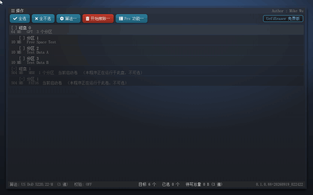

# UefiEraser —— 磁盘数据粉碎工具（二进制发布包）

> [English version below](#english) ｜ [English README](#english)

UefiEraser 是一个运行在 **UEFI Shell**（操作系统启动之前）里的图形化磁盘数据粉碎工具：
用鼠标或键盘选中目标，对**整块物理磁盘**、**单个分区**或**分区的空闲空间**执行不可恢复的
多遍覆写，擦完出一份报告。格式化只改元数据、系统盘擦不掉自己、SSD 多遍覆写不可靠——
这三件事它一次解决：它在系统之前运行，固件把每块盘原样交出来，想擦哪块擦哪块。

> 把"数据销毁"做成一件有记录、有闸门、手滑也点不动的事。

- **版本**：0.1.0（Build 90，2026-09-19）
- **源码 / Release**：[github.com/MikeWuPing/UefiEraser](https://github.com/MikeWuPing/UefiEraser) —— Free 版**开源**（MIT）；最新版二进制与产品说明书在该仓库的 [Releases](https://github.com/MikeWuPing/UefiEraser/releases) 页
- **作者**：Mike Wu（mikewuping@163.com）
- **许可**：[MIT 许可](LICENSE.txt)（Free 版开源，个人与商用均可自由使用）
- **产品手册**：[详版手册（MD）](docs/manual/UefiEraser-产品手册.md) ｜ [Word 版](docs/manual/UefiEraser-产品手册.docx) ｜ [使用手册](docs/manual/README.md) —— 含全部界面截图与算法对照

## 包内容

| 文件 | 说明 |
|---|---|
| `binaries/uefieraser-free.efi` | 应用本体（UEFI x64 应用，约 1.0 MB，Free 版；内置中文界面与字库） |
| `docs/manual/UefiEraser-产品手册.md` ｜ `.docx` | 产品手册（MD + Word，含全部界面截图与每个功能的详细用法） |
| `docs/manual/README.md` | 使用手册（面向使用者，逐步操作与故障排查） |
| `docs/manual/demo.gif` | 界面演示动画 |
| `docs/manual/images/` | 29 张界面截图 |
| `LICENSE.txt` | MIT 许可 |

本目录**不含源码**。Free 版源码在 [UefiEraser 仓库](https://github.com/MikeWuPing/UefiEraser)
（构建需 EDK II 与 LVGL 的 UEFI 移植包 [UEFI_LVGL](https://github.com/MikeWuPing/UEFI_LVGL)）。

---

## 运行要求

- **x86_64 UEFI** 机器，**Secure Boot 需关闭**（应用未签名）
- 一块 FAT/FAT32 格式的 U 盘
- 无操作系统依赖；无界面模式可在 UEFI Shell 里带参数运行

## 快速上手

1. 把 U 盘格式化为 FAT32，建立 `EFI\BOOT\` 目录，把 `binaries/uefieraser-free.efi`
   拷进去并改名为 `BOOTX64.EFI`（免 Shell 直启）；或者原样放进 U 盘任意位置，
   开机进 UEFI Shell 后执行 `fs0:\UefiEraser.efi`。
2. 关机，插 U 盘，开机在固件启动菜单里选 U 盘启动。
3. 界面上勾选要擦除的目标（整盘 / 分区 / 空闲空间可混选），选算法，点「开始擦除」。
4. 依次过闸门：摘要确认 → 键入 `ERASE` → 若含整盘再键入该盘容量合计。
5. 擦完在结果对话框点「导出报告」或按 **F2**，报告写到启动卷的 `UefiEraser-report.txt`。

> ⚠️ **擦除不可恢复。** 操作前请确认目标与备份。误擦没有后悔药。

## 功能特性

- **整盘粉碎**：覆写物理磁盘的全部 LBA，含分区表本身。
- **分区粉碎**：边界精确到字节，不波及相邻分区。
- **空闲空间粉碎**：不删除现有文件，只覆写未使用的簇，消除已删除文件的残留。
- **12 种行业标准覆写算法 + 自定义随机 N 遍**：US DoD 5220.22-M（3 遍）/ ECE（7 遍）、
  Gutmann（35 遍）、Schneier（7 遍）、英国 HMG IS5 基础/增强、加拿大 RCMP TSSIT OPS-II、
  德国 VSITR、俄罗斯 GOST P50739-95、美国陆军 AR 380-19、美国空军 5020。
  算法**单选**——一次运行只能一种，因为算法本身就是遍的序列。
- **末遍回读校验**（可选）：写完后回读，与该遍生成器的重放结果逐字节比对。
- **安全闸门**：只读设备与启动卷不可选 → 摘要确认 → 键入 `ERASE` → 整盘再键入容量合计；
  任何一步 Esc 即中止，不写一个字节。
- **报告与留痕**：文本报告导出 + CSV 审计日志（时间戳、目标、模式、算法、遍数、结果、写入字节数）。
- **擦完即知**：擦除后按介质重扫（重读 LBA 0），介质上已不存在的分区行整行消失。
- **键盘全程可达**：Tab 走遍每个按钮、方向键与空格多选、Enter 激活、Del 清空、F2 导出。
- **失败会说明原因**：设备级擦除不支持时报告直接写明原因（不在 ATA/NVMe 端口下、
  未实现 Security feature set、盘处于 FROZEN 等），不会只说"I/O 错误"。

## 界面一览

| 主界面（可多选） | 算法选择器 |
|---|---|
|  |  |

| 摘要确认闸门 | 进度与取消 |
|---|---|
|  |  |

| 结果报告 | 擦除后自动重扫 |
|---|---|
|  |  |

## 版本划分：Free 与 Pro

Free 版是完整可用的工具——上面这些功能全部包含，源码 MIT 开源。**设备级擦除
（ATA Secure Erase / NVMe Format NVM / NVMe Sanitize，SSD 唯一可靠的擦除方式）
与 18 种扩展算法属于商业版 Pro。** Free 版里这些条目可见但锁定：灰显加锁、
标注发布机构，点它会说明属于哪个版本，不会静默失败，也不会执行任何写盘动作。

| 能力 | Free | Pro |
|---|---|---|
| 整盘 / 分区 / 空闲空间粉碎 | ✅ | ✅ |
| 12 种标准覆写算法 + 自定义 N 遍 | ✅ | ✅ |
| 确认闸门、末遍回读校验、审计日志与报告导出 | ✅ | ✅ |
| 无界面模式（命令行 / 配置文件） | ✅ | ✅ |
| 设备级擦除（ATA Secure Erase / NVMe Format NVM / NVMe Sanitize） | 灰显加锁 | ✅ |
| 18 种扩展算法（BMB21-2019、GB 46864-2025、GA/T 1143-2014 等） | 灰显加锁 | ✅ |
| 擦除合规证书、TCG Opal 加密擦除、HPA/DCO、批量队列、RAID / 多命名空间、资产采集、报告签名、OEM 定制 | — | ✅ |

Pro 版按机器授权、源码不公开，洽谈请联系 mikewuping@163.com 或
[@MikeWuPing](https://github.com/MikeWuPing)。完整功能一览见
[UefiEraser 仓库说明](https://github.com/MikeWuPing/UefiEraser)。

## 重要提示

- **不要按 Ctrl+Alt+Del**：固件把它当复位键、且走键盘通知通道，应用拦不住，
  擦除中途按它整机会重启。中止请用进度对话框的「取消」。
- **多遍覆写对固态硬盘不可靠**：FTL 与磨损均衡会把写入重映射到别的物理块，
  覆写逻辑地址覆盖不到原数据——SSD 请用设备级擦除（Pro）。
- **请用 0.1.0.90 或更新的版本**：更早的版本受"运行约 5 分钟后被整机复位"影响
  （固件启动看门狗），长时间擦除会被中途打断；0.1.0.90 已在启动时解除看门狗。

---

## English

# UefiEraser — Disk data shredder (binary distribution)

A GUI disk-data shredder that runs in the **UEFI Shell**, before any operating
system boots. Pick a target with the mouse or the keyboard and overwrite a
**whole physical disk**, a **single partition**, or the **free space** of a
volume with industry-standard multi-pass patterns, then export a report.

> Data destruction as something with a record, with gates, and that a stray
> click cannot start.

- **Version**: 0.1.0 (Build 90, 2026-09-19)
- **Source / releases**: [github.com/MikeWuPing/UefiEraser](https://github.com/MikeWuPing/UefiEraser) — the Free edition is **open source** (MIT); the newest binary and manual live on that repository's [Releases](https://github.com/MikeWuPing/UefiEraser/releases) page
- **Author**: Mike Wu (mikewuping@163.com)
- **License**: [MIT](LICENSE.txt) — the Free edition is open source and free for commercial use too
- **Manual**: [product manual (MD)](docs/manual/UefiEraser-产品手册.md) ｜ [Word](docs/manual/UefiEraser-产品手册.docx) ｜ [usage guide](docs/manual/README.md)

### What is in this directory

| File | What it is |
|---|---|
| `binaries/uefieraser-free.efi` | the application (UEFI x64, ~1.0 MB, Free edition; Chinese UI and font baked in) |
| `docs/manual/UefiEraser-产品手册.md` ｜ `.docx` | the product manual (Markdown + Word, every screen illustrated) |
| `docs/manual/README.md` | the usage guide (step-by-step operation and troubleshooting) |
| `docs/manual/demo.gif` | UI demo animation |
| `docs/manual/images/` | 29 screenshots |
| `LICENSE.txt` | the MIT licence |

**No source code here.** The Free edition's source is in the
[UefiEraser repository](https://github.com/MikeWuPing/UefiEraser).

### Requirements

- An **x86_64 UEFI** machine with **Secure Boot off** (the application is unsigned)
- A FAT/FAT32 USB stick; no operating system required

### Quick start

1. On a FAT32 stick, either create `EFI\BOOT\` and copy `binaries/uefieraser-free.efi`
   there as `BOOTX64.EFI`, or leave the file anywhere and run `fs0:\UefiEraser.efi`
   from the UEFI Shell.
2. Boot from the stick. Tick the targets (whole disk / partition / free space may be
   mixed), choose an algorithm, press Start.
3. Clear the gates: confirm the summary, type `ERASE`, and if a whole disk is selected
   type its total capacity.
4. Export the report with the button or **F2** — it is written to the boot volume as
   `UefiEraser-report.txt`.

> ⚠️ **Erasing is irreversible.** Check the target and your backups first.

### Features

- Whole-disk, exact-boundary partition, and free-space shred (existing files kept)
- **12 industry-standard overwrite algorithms** plus custom N random passes
- Optional last-pass read-back verification, byte-for-byte against a replay
- Safety gates: read-only devices and the boot volume cannot be selected, then
  summary confirmation, a typed `ERASE`, and the capacity total for whole disks
- Text report export and a CSV audit log (timestamp, target, mode, algorithm,
  passes, result, bytes written)
- Re-scan after erasing: partitions that no longer exist on the medium disappear
  from the list
- Full keyboard workflow (Tab focus ring, F2 export, Del clear)
- Failures state their reason instead of just "I/O error"

### Editions

Everything above is in the **Free** edition, whose source is MIT-licensed.
**Device-level erase** (ATA Secure Erase / NVMe Format NVM / NVMe Sanitize — the
only reliable method for SSDs) and **18 further algorithms** belong to the
commercial **Pro** edition. In the Free build those entries are visible but
locked: greyed out, padlocked and labelled, and clicking one states which
edition it belongs to rather than failing silently.

The Pro edition is licensed per machine and its source is not published; contact
mikewuping@163.com. See the
[UefiEraser repository](https://github.com/MikeWuPing/UefiEraser) for the full
feature list.

### Notes

- **Do not press Ctrl+Alt+Del**: the firmware treats it as a reset and bypasses the
  application's keyboard handling; use Cancel in the progress dialog instead.
- **Multi-pass overwriting is unreliable on SSDs** — their FTL remaps writes to
  other physical blocks, so logical overwrites miss the original data. Use
  device-level erase (Pro) for SSDs.
- **Use 0.1.0.90 or newer**: earlier builds were reset by the firmware's boot
  watchdog after roughly five minutes, cutting long erases short.
