# UefiEraser 产品手册

**版本 0.1.0（Free 版）· 2026 年 9 月**

UefiEraser 是一款运行在 UEFI 环境（操作系统启动之前）里的磁盘数据粉碎工具。
把它放进一块 U 盘，任何 x86_64 机器开机即可进入图形界面，对整块物理磁盘、
单个分区或分区的空闲空间执行不可恢复的数据销毁。

> 本手册面向使用与采购决策，描述的是**免费开源版（Free）**。设备级擦除、
> 扩展算法名录等能力属于商业版（Pro），见[第六章](#六pro-版功能free-版不含)。
> 构建方法、算法字节级对照等开发者内容见仓库根目录
> [README.md](../../README.md) 与[使用手册](README.md)。

---

## 一、产品概述

处置一块旧硬盘，最怕的不是删不快，而是删不干净。

在 Windows 里格式化，文件表被清掉，数据本体原封不动；用擦除软件，系统盘又
擦不到——操作系统正跑在上面，文件全被占用。把盘拆下来接到别的机器上擦，对
批量处置来说根本不现实。

UefiEraser 把擦除动作搬到了操作系统之下：开机固件加载它，此时没有任何文件
系统被挂载、没有任何进程在写盘，整块物理磁盘完完全全暴露在面前。选好目标、
选好算法、通过确认闸门，剩下的就是等进度条走完。

它不修改宿主机系统，不联网，不装驱动，用完拔掉 U 盘，机器和原来一模一样。


## 二、产品特点

### 2.1 裸金属运行，系统盘一样擦

不依赖任何操作系统。系统分区、恢复分区、休眠文件、页脚残留——这些在系统内
永远擦不到的东西，在 UEFI 下没有任何东西占用它们。一块 FAT32 U 盘即可携带，
插上哪台机器就在哪台机器上开工。

### 2.2 看到的就是物理设备

目标列表由固件直接枚举，显示容量、分区表类型与每个分区，不经过盘符和挂载点
这两层容易误导的抽象。正在运行本程序的启动卷会被自动识别并整行置灰，从根源
上防止"把工具自己脚下的盘擦了"。

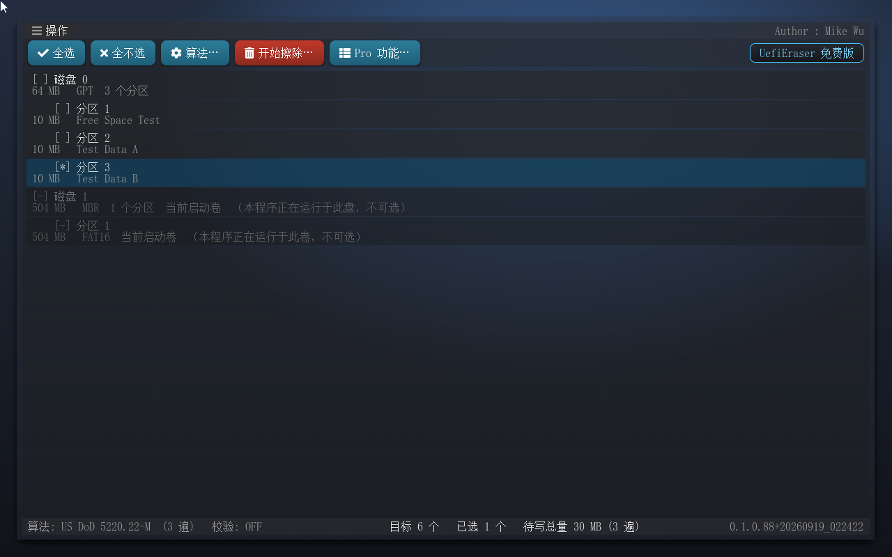

### 2.3 十二种标准覆写算法，字节级对照实现

美国国防部 DoD 5220.22-M、DoD ECE、Gutmann、Schneier、英 HMG IS5（基础/增强）、
加 RCMP TSSIT OPS-II、德 VSITR、俄 GOST P50739-95、美陆军 AR 380-19、美空军
5020 共 12 种算法，遍次模式逐字节对照开源擦除软件 Eraser 的源码实现，可在
§七查到每一遍的写入模式。另支持自定义随机 N 遍（1–64）。

**每种算法的来历与用途写在界面上**：算法列表只显示名称与遍数（Gutmann 的 35
遍写成一行是噪声），鼠标悬停即弹出该算法的大意与完整遍序。

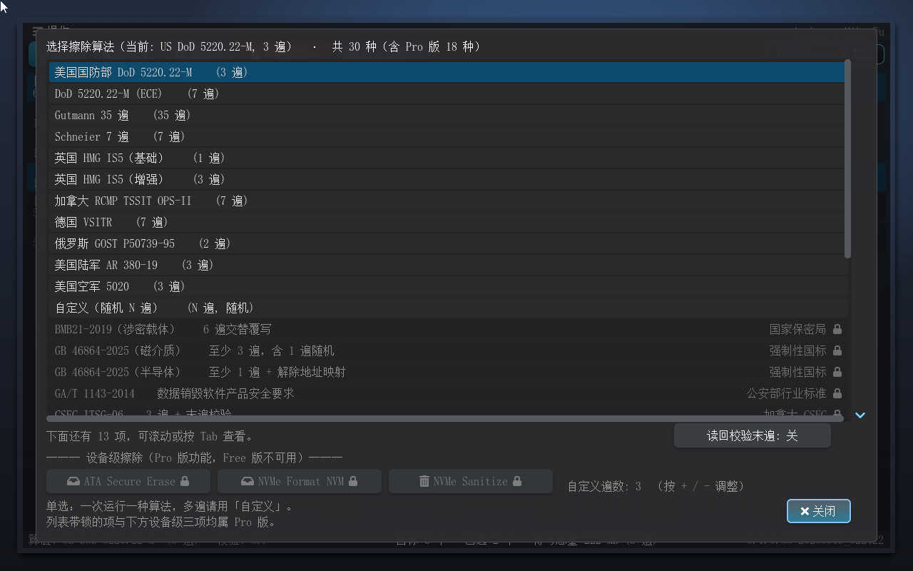

### 2.4 四道确认闸门，手滑点不动

按钮可以误触，输入框不行。从点击「开始擦除」到真正写第一笔数据，要经过：

1. **摘要确认**——目标数量、整盘数、待写总量、算法与遍数，逐个列出目标名；
2. **输入 `ERASE`**——全大写键入；
3. **输入整盘容量合计**——逼你真的去看一眼容量数字；
4. **运行中随时取消**。

任何一步按 Esc 都会中止，不写一个字节。输入错误时，提示行会说明差在哪里。

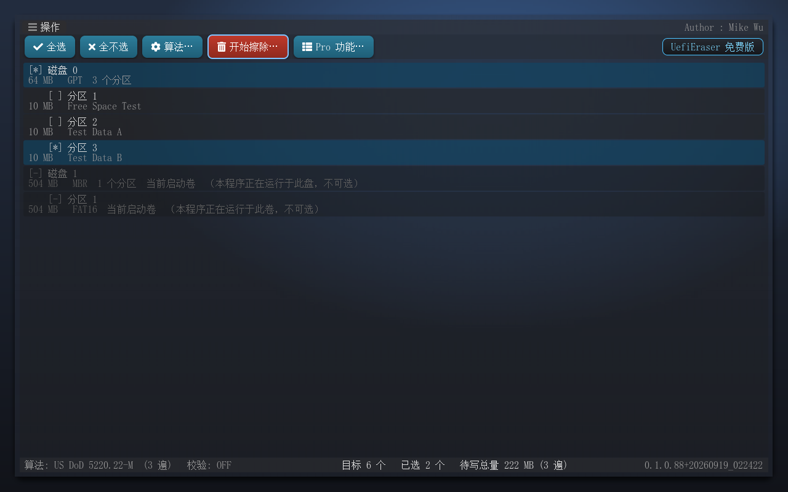

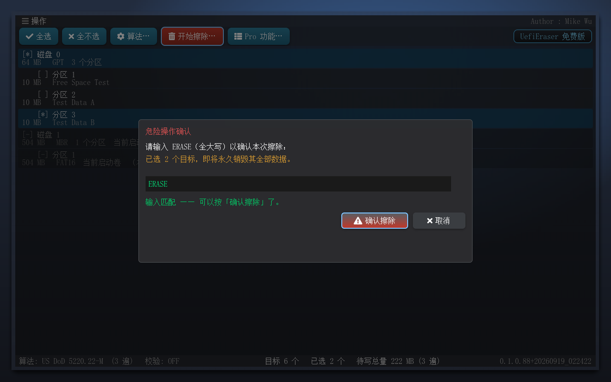

### 2.5 末遍读回校验

打开校验后，最后一遍写完会把整段数据读回来，与该遍应有的模式逐字节比对。
速度大约减半，换来一个确定的答案：写过的每个字节真的落盘了。

### 2.6 精确的边界

分区擦除严格落在该分区边界内，相邻分区逐字节不受影响（由仓库内
`tools/Verify-Erased.py` 的字节级断言在每轮回归中验证）。空闲空间擦除在卷内
反复写满临时文件再删除，消除已删除文件的残留，现有文件保持完好，结束后不留
任何临时文件。

### 2.7 审计留痕

每次擦除按目标写审计日志（时间、目标、模式、算法、遍数、结果、写入字节数），
结果可一键导出为文本报告存到启动卷。批量处置机器时，每块盘的处理记录都有据
可查。

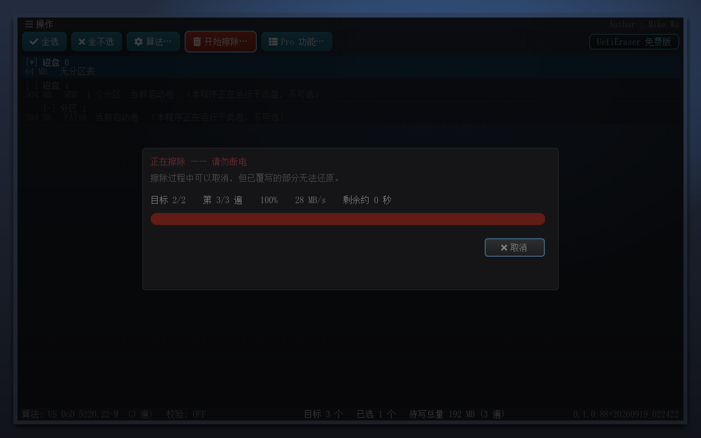

### 2.8 擦完即知：按介质重扫

擦除完成后应用重读每块盘的分区表，按介质上真实存在的内容重建列表——被抹掉
分区的盘在列表里立即变成"无分区表"，不存在"看着还有分区、不知道擦没擦干净"
的疑惑。也可以随时从菜单手动重扫。

### 2.9 键盘全程可达

从选目标、选算法、走完三道输入闸门到导出报告，全部操作都有键盘路径，焦点
永远以高亮或蓝色描边标出。鼠标、触摸板、纯键盘三种使用习惯都完整支持。

### 2.10 一套代码，两个版本

Free 版开源，包含上列全部能力；Pro 版面向需要设备级擦除、合规报告与批量
交付的商业用户，界面里以**灰色加锁的行**列出，看得见、点不动，选中会说明它
属于哪个版本。详见[第六章](#六pro-版功能free-版不含)。

## 三、目标客户

| 用户 | 场景 | 主要用到的能力 |
|---|---|---|
| 企业 IT 与资产处置 | 电脑退役、硬盘返修前、租约到期归还 | 系统盘整体擦除、审计日志、无界面模式批量执行 |
| 数据安全与合规岗位 | 满足介质销毁要求的留痕与算法要求 | 标准算法选择、读回校验、结果报告导出 |
| 二手交易的个人用户 | 卖电脑、送人、扔盘之前清一次底 | U 盘启动、整盘粉碎、确认闸门防误擦 |
| 固件与安全爱好者 | 研究 UEFI 应用、验证固件行为 | 裸金属图形界面、开源实现 |

## 四、安装与启动

1. **准备 U 盘**：把 `UefiEraser.efi` 拷入一块 FAT/FAT32 格式的 U 盘根目录。
   UEFI 只认 FAT 系列文件系统，NTFS/exFAT 不行。
2. **从 U 盘启动**：开机进固件设置，选择从该 U 盘启动，或选择"UEFI Shell"
   启动项（部分主板需要在 BIOS 里打开 Launch UEFI Shell from filesystem
   device）。
3. **运行程序**：

   ```
   Shell> fs0:
   FS0:\> UefiEraser.efi
   ```

   不确定盘符就先敲 `map`，列出所有卷再进。

4. **核对目标**：界面里每块盘都带容量与分区信息，擦前务必核对，同一块盘上
   可能有多个分区。

> 擦除过程中请保证电源稳定（笔记本接电源适配器）。覆写中途断电会留下部分
> 覆写的介质：原数据不完整，但也没擦干净。

## 五、功能详解

### 5.1 主界面

窗口是一张浮在壁纸上的毛玻璃卡片，自上而下分四块：菜单栏、工具栏、目标列表、
状态栏。

- **菜单栏**：左上角 `☰ 操作`，右上角署名 `Author : Mike Wu`（Free 版特有，
  Pro 版不署名）；
- **工具栏**：`✓ 全选`、`✕ 全不选`、`⚙ 算法…`、红色的 `🗑 开始擦除…`，最右是
  **`▤ Pro 功能…`**（列出商业版能力，见第六章）；
- **版本徽章**：工具栏最右端一枚描边胶囊，Free 版青色 `UefiEraser 免费版`，
  Pro 版琥珀色 `UefiEraser Pro`——一眼能看出手上跑的是哪个版本；
- **目标列表**：整盘节点下缩进显示各分区，每行两行文字——第一行名称与复选框，
  第二行容量、分区表类型、以及 `只读` / `可移除` / `当前启动卷` 标注；
- **状态栏**：左侧当前算法与遍数，中间已选目标数与待写总量，右侧版本水印
  （截图报障时请带上这一行）。


### 5.2 选择擦除目标

| 操作 | 效果 |
|---|---|
| 单击 | 切换该行选中（不清掉其它已选，避免误丢） |
| Ctrl + 单击 | 同单击 |
| Shift + 单击 | 范围选中：从上次点击处到当前行 |
| ↑ / ↓ + 空格 | 键盘移动焦点、切换选中 |
| Ctrl + A / 「全选」 | 全选 |
| Del / 「全不选」 | 清空选择 |

三类行**不可选**，整行置灰、第二行小字写明原因：

- **只读**设备（写保护的光盘等）；
- **当前启动卷**及其所在整盘——本程序正从那里运行；
- 固件未提供写入通道的设备。

点不可选的行时，列表下方的提示条会解释原因；「全选」也会报告跳过了几个、
为什么。选中一个合法目标后，提示条立即消失，不会被误读成"这次选择也被拒了"。

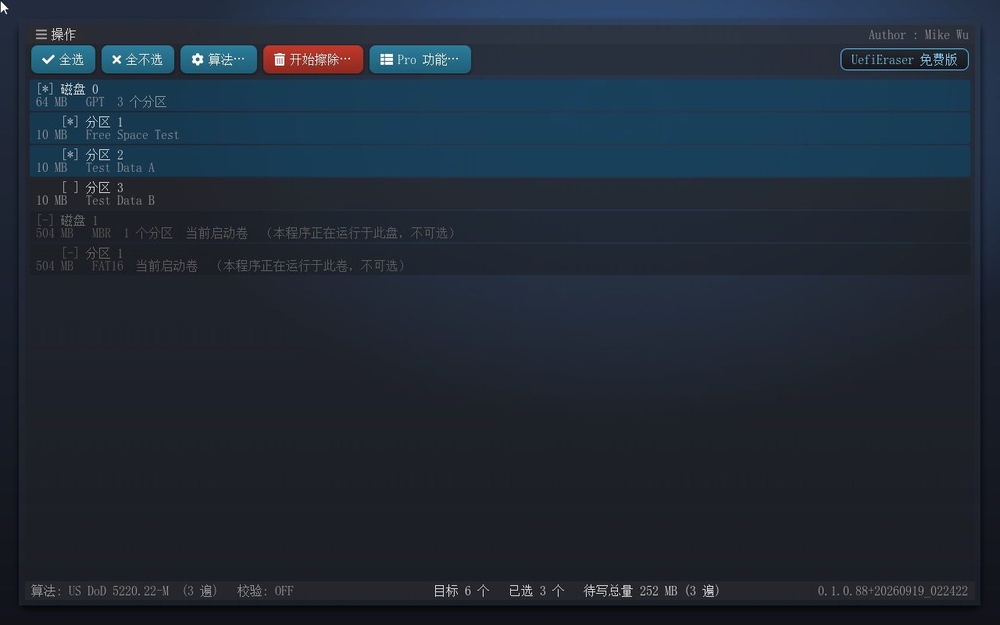


### 5.3 操作菜单

左上角 `☰ 操作` 打开，共七项：全选、全不选、选择算法、开始擦除、**重新扫描
目标**、关于、红色的退出。菜单打开后，上下键与 Tab 在七项之间移动焦点（不会
把菜单关掉），Enter 执行，Esc 关闭。

菜单里**只有对当前这次运行的操作**。商业版的能力不放在这里——它们不是本次
运行的一个动作，而是另一个版本的功能清单，见第六章的 `Pro 功能…` 按钮。

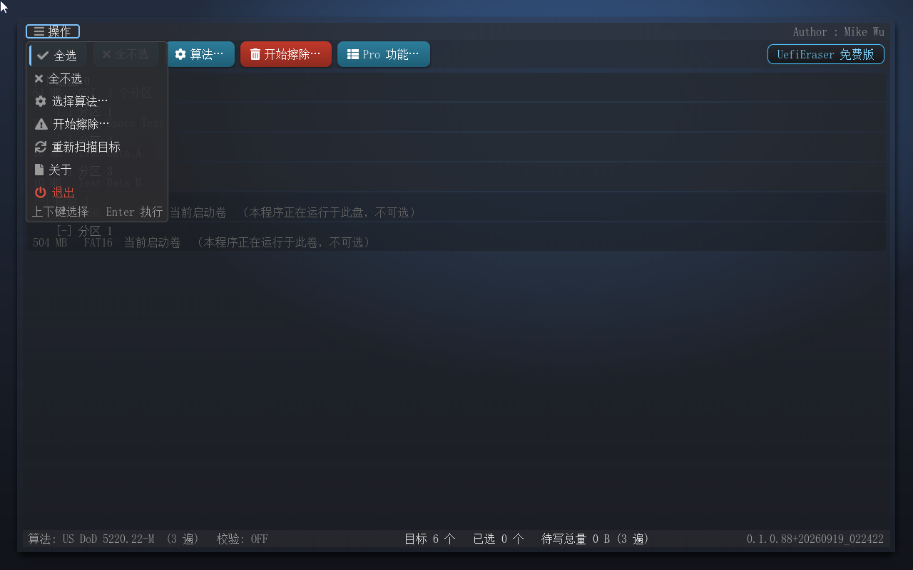

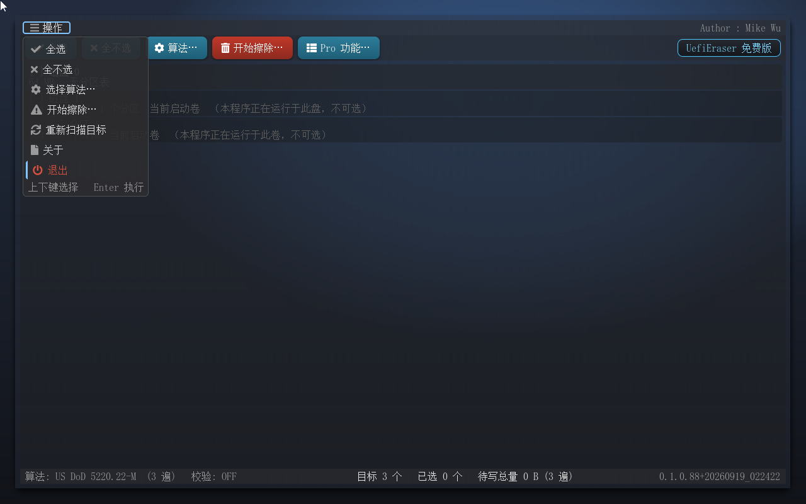

「重新扫描目标」适合两种时刻：擦完想立即确认，或者中途换盘、插了新盘。重扫
结果会在提示条里报出设备数、目标数与被丢弃的"幽灵分区行"数。

### 5.4 选择擦除方式与算法

点「⚙ 算法…」或按 F5 打开选择器。列表分两段，**表头写明总数**：

- **上半部分：本版本可用的 12 种覆写算法**（单选）。每行只写名称与遍数；
- **下半部分：标准扩展算法名录（Pro 版）**，18 种，灰显、带锁、右侧标注发布
  机构——国家保密局 BMB21-2019、强制性国标 GB 46864-2025（磁介质/半导体）、
  公安部 GA/T 1143-2014，以及 CSEC ITSG-06、NAVSO P-5239-26、NCSC-TG-025、
  BSI-2011-VS、ACSI-33、ISM 6.2.92、NNSA NAP 15.1-C、AFSSI 8580、DoD 全 7 遍、
  零填充、全 1 填充、只读校验、自定义遍序编辑。**点它会说明这属于 Pro 版**，
  在当前版本不会执行任何写盘动作。


**列表比窗口长，所以三处都在告诉你下面还有东西**：右侧一条常显滚动条、列表
右下角的向下箭头（上面还有内容时会出现向上的箭头）、列表下方一行文字
"下面还有 N 项，可滚动或按 Tab 查看"。用键盘 Tab 移动焦点时列表会自动滚动，
焦点行永远可见。

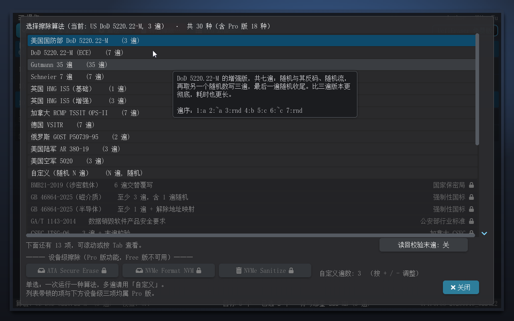

**鼠标悬停在任意算法行上**会弹出该算法的说明：它的来历、适用场合，以及完整
遍序。长遍序（例如 Gutmann 的 35 遍）会截断并注明总数——需要完整遍序请查
§七的表格。

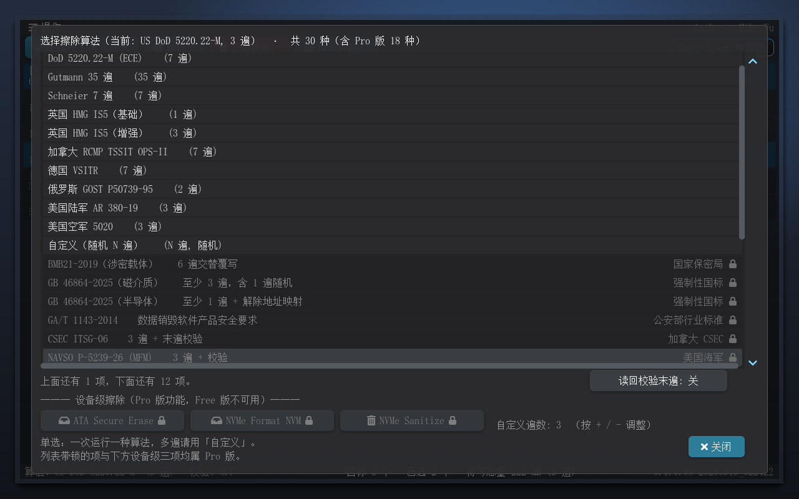

**下半部分与设备级三项**（ATA Secure Erase / NVMe Format NVM / NVMe Sanitize）
在 Free 版里灰显加锁；设备级擦除需要盘实现对应命令，且**只能作用于整盘**——
选区里带分区时程序直接拒绝。它们属于 Pro 版，见第六章。

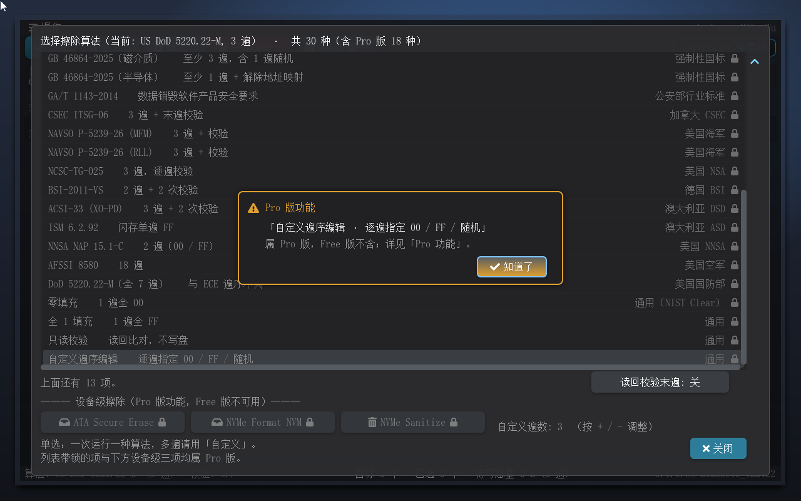

其他两项：

- **读回校验末遍**：选择器里一键开关，见 §2.5；
- **自定义遍数**：先选「自定义（随机 N 遍）」，再用 `+` / `-` 调整 1–64 遍；
- **为什么算法不能多选**：一次运行的遍次序列就是算法本身，后一遍会覆盖前一遍，
  "既是 DoD 又是 Gutmann"没有意义。要多遍，用自定义 N 遍。

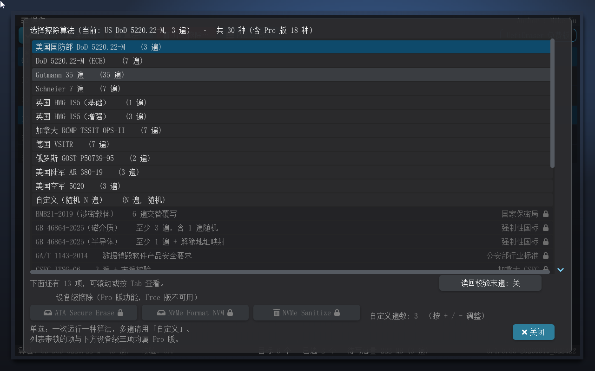

### 5.5 确认闸门

见 §2.4。两处细节值得知道：

- **容量单位跟着大小走**：整盘容量合计 ≥ 1 GiB 时按 GiB 提问，不足 1 GiB 时
  按 MiB 提问（容量闸门截图里的测试盘是 64 MiB，就输 `64`，而不是永远回答一个无意义的 0）；
- **输入框不装死**：输入正确时提示行变绿；输入错误时按确认，提示行变红说明
  差在哪、弹窗说明该输入什么、串口日志记一行拒绝原因。空输入也有明确提示。

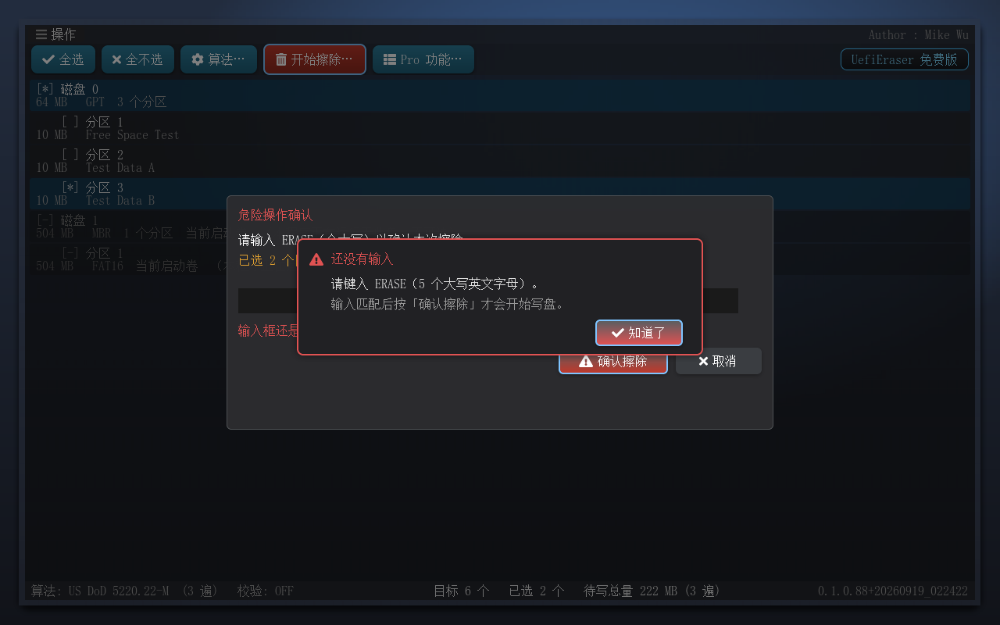


### 5.6 执行、进度与取消

进度对话框实时显示：第几个目标 / 共几个、当前遍次 / 总遍次、百分比、速率、
剩余秒数，以及红色的"请勿断电"。

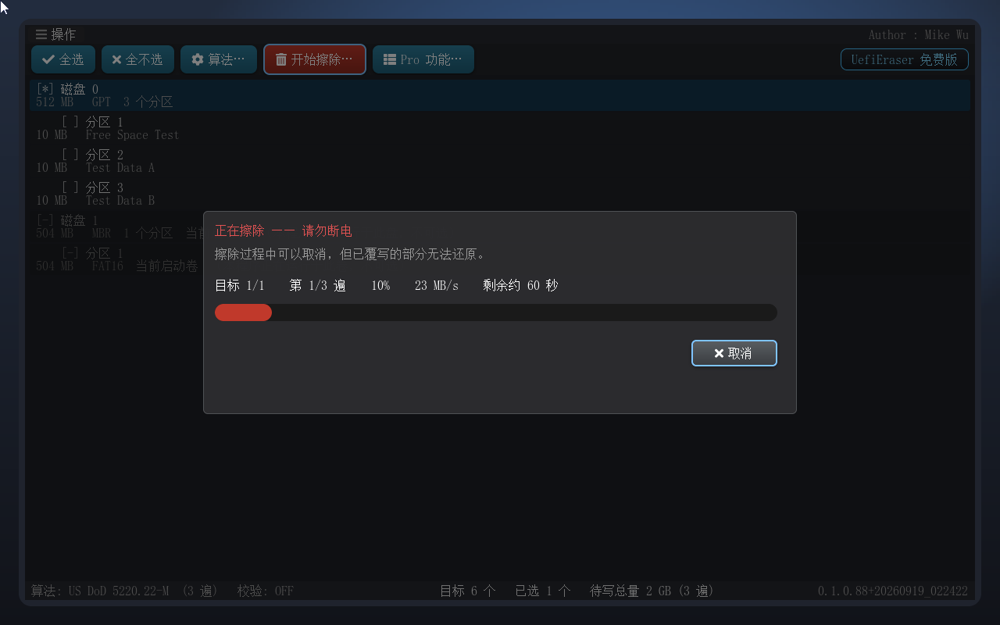

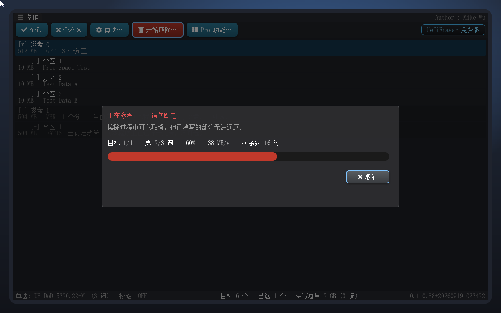

- 「取消」是协作式的：引擎在数据块之间检查取消标志，几百毫秒内停下；
- 取消后已写部分无法还原，目标处于"部分覆写"状态，报告会明确标记**已取消**；
- 每个目标擦完即写一条审计日志，中途取消时已完成部分仍有据可查。

### 5.7 结果与导出报告

擦完弹出结果对话框，按情况显示绿色"擦除完成"、黄色"校验未通过 / 已取消"、
红色"擦除失败（含原因）"。


点「导出报告」或按 F2，把结果写成 `UefiEraser-report.txt` 存到启动卷根目录
（UTF-8 文本，每次运行覆盖）。导出成功与失败都有弹窗确认；导出失败不影响
擦除本身。

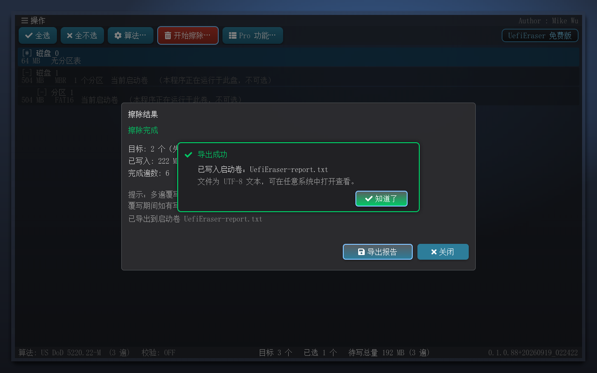

### 5.8 擦除后的自动重扫

关闭结果对话框后，列表已经按介质重扫过了：分区表被抹掉的盘不再显示分区行，
整盘行的第二句从 `GPT 3 个分区` 变成 `无分区表`。这不是显示问题，而是重新
读了盘上第一个扇区后的真实结论。想核对细节可看串口日志中
`ghost: N partition row(s) dropped` 的记录。

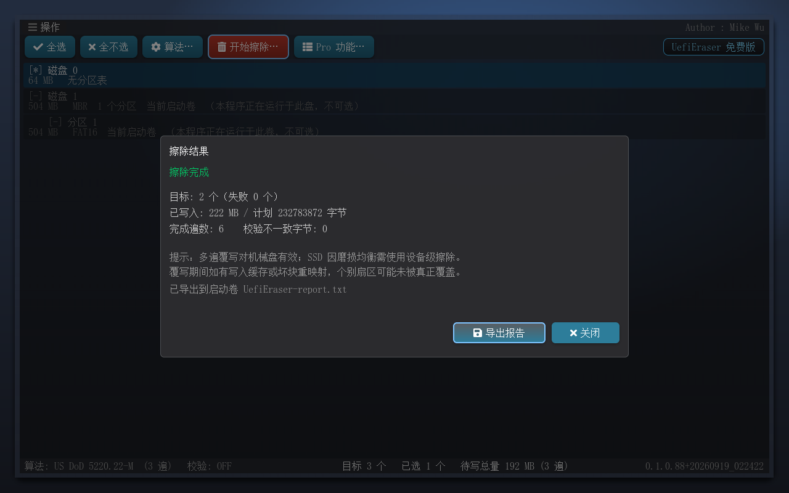

### 5.9 空闲空间粉碎（保留现有文件）

不删系统、只清残留：选中分区后，在目标列表里展开选择该分区的「空闲空间」
子项。程序在卷根反复创建临时文件、按算法模式写满、再删除，把未使用的簇覆盖
一遍——已删除文件的残留消失，现有文件原样保留。卷写满视为该遍成功（写不动
说明没有空间，没有空间就没有残留）。

### 5.10 关于对话框

菜单「关于」或 F1：显示版本、构建时间、当前版本（Free/Pro）与作者。反馈
问题时请把状态栏右下角的版本水印一并截进图。

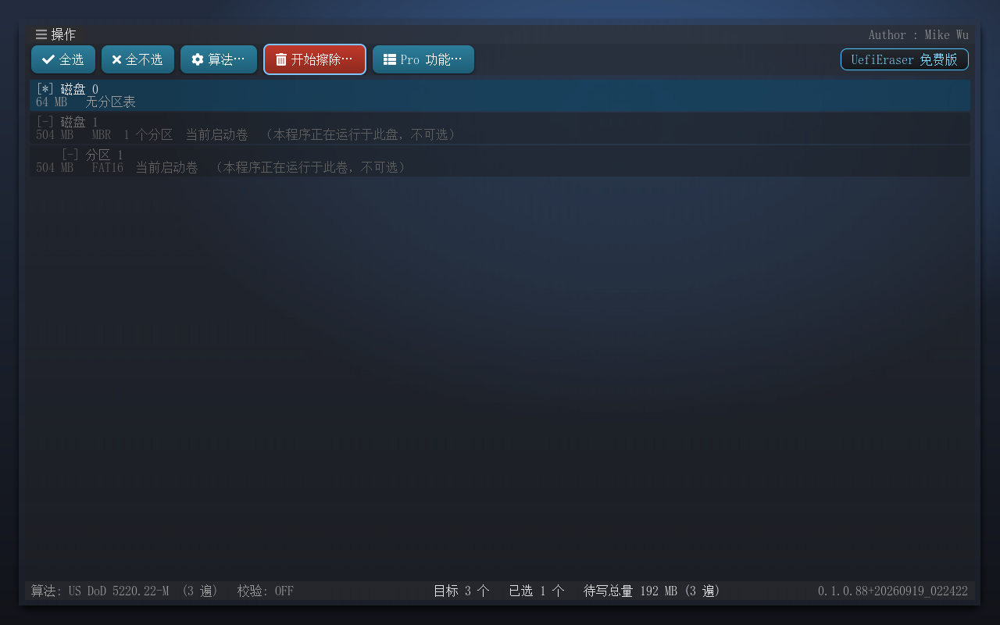

### 5.11 无界面模式与配置文件

自动化与批量场景可以完全脱离图形界面：

```
FS0:\> UefiEraser.efi erase=part:0:2 algo=dod522022m verify
```

| 参数 | 说明 |
|---|---|
| `erase=disk:<i>` | 第 i 块整盘（0 起） |
| `erase=part:<i>:<n>` | 第 i 块盘的第 n 个分区 |
| `erase=freespace:<i>:<n>` | 第 i 块盘第 n 个分区的空闲空间 |
| `algo=<id>` | 算法 id（见 §七，默认 dod522022m） |
| `custom=<n>` | 自定义遍数 |
| `verify` | 开启末遍读回校验 |

参数也可写入启动卷根目录的 `UefiEraser.cfg`（UTF-16LE 文本），供无法传命令行
的引导方式使用；命令行存在时优先于配置文件。无界面模式同样写审计日志与
结果报告。

## 六、Pro 版功能（Free 版不含）

Free 版是完整的工具：整盘/分区/空闲空间粉碎、12 种标准算法、四道确认闸门、
读回校验、审计与报告导出、无界面模式，全部开源。

Pro 版为需要**设备级擦除**、**合规交付**与**批量处置**的商业用户准备。上面
几处灰色加锁的行就是它的功能清单；也可以随时从工具栏点开 `▤ Pro 功能…`
看全貌：

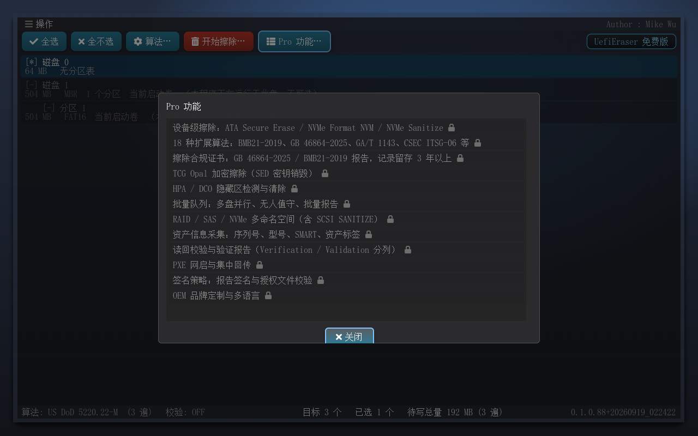

| 能力 | 说明 |
|---|---|
| **设备级擦除** | ATA Secure Erase、NVMe Format NVM、NVMe Sanitize——对固态盘唯一可靠的擦除方式（覆写碰不到磨损均衡重映射的块）。报告写明失败原因（无 ATA 端口 / 未实现 Security feature set / 盘处于 FROZEN 等） |
| **18 种扩展算法** | 国家保密局 BMB21-2019、强制性国标 GB 46864-2025（磁介质 / 半导体）、公安部 GA/T 1143-2014，以及 CSEC ITSG-06、NAVSO P-5239-26 (MFM/RLL)、NCSC-TG-025、BSI-2011-VS、ACSI-33、ISM 6.2.92、NNSA NAP 15.1-C、AFSSI 8580、DoD 全 7 遍、零填充、全 1、只读校验、自定义遍序编辑 |
| **擦除合规证书** | 按国标口径出具报告，写明对照条款、盘序列号与校验结果，记录留存 3 年以上 |
| **TCG Opal 加密擦除** | 对自加密硬盘销毁密钥，全盘数据瞬间不可读 |
| **HPA / DCO 隐藏区清除** | 检测并清除盘上隐藏的保护区——这些区域普通工具看不到、也擦不到 |
| **批量队列** | 多盘并行、无人值守、批量汇总报告 |
| **RAID / SAS / 多命名空间** | 覆盖服务器盘与阵列，含 SCSI SANITIZE 与 NVMe 多命名空间 |
| **资产信息采集** | 擦除前记录序列号、型号、SMART、资产标签，便于与台账核对 |
| **读回校验与验证报告** | 擦完自动读回比对，过程与结果分开列示（Verification / Validation） |
| **PXE 网启与集中回传** | 批量机器无需逐台插盘，结果集中回传 |
| **报告签名与授权校验** | 报告带签名防篡改，授权文件校验可用性 |
| **OEM 定制** | 可更换品牌标识与界面语言，供集成商交付客户 |

界面里的呈现方式与 Free 版一致：**看得见，点不动**——点这些行会告诉你它属于
Pro 版，在当前版本不会执行任何写盘动作。

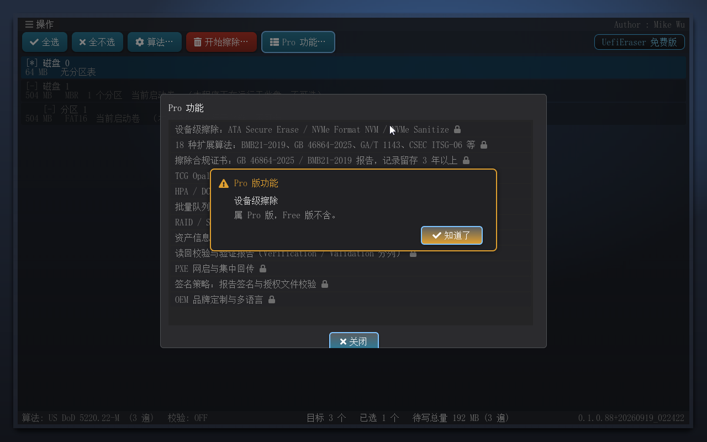

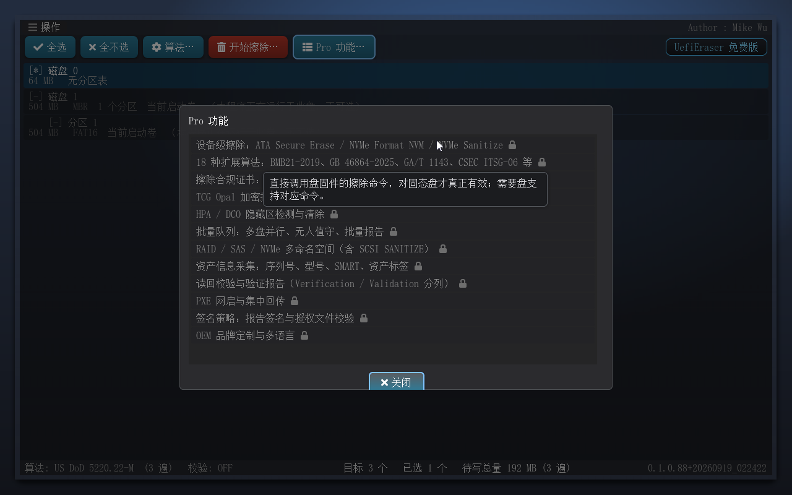

> Pro 版为商业授权。获取方式与报价见项目主页（仓库 README 与 Releases 页）。

## 七、算法一览

`R` = 伪随机数据流；`R1/R2/R3` = 每遍抽一个随机字节后整遍重复；`~R1` = R1 的
按位取反；其余为常量字节。

| 算法 | 遍数 | 遍次模式 |
|---|---:|---|
| 美国国防部 DoD 5220.22-M | 3 | 00, FF, R |
| DoD 5220.22-M (ECE) | 7 | R1, ~R1, R, R2, R3, ~R3, R |
| Gutmann | 35 | 4×R；55；AA；92 49 24；49 24 92；24 92 49；00…FF；92 49 24；49 24 92；24 92 49；6D B6 DB；B6 DB 6D；DB 6D B6；4×R |
| Schneier | 7 | 01, 00, 5×R |
| 英国 HMG IS5（基础） | 1 | 00 |
| 英国 HMG IS5（增强） | 3 | 00, 01, R |
| 加拿大 RCMP TSSIT OPS-II | 7 | 00,01,00,01,00,01, R1 |
| 德国 VSITR | 7 | 00,01,00,01,00,01, R |
| 俄罗斯 GOST P50739-95 | 2 | 00, R |
| 美国陆军 AR 380-19 | 3 | R, R1, ~R1 |
| 美国空军 5020 | 3 | R1, R2, R3 |
| 自定义（随机 N 遍） | N | N × R |

上表就是界面上悬停提示里那份遍序的完整版。各算法遍次模式逐字节对照开源软件
Eraser 的实现（有几处与常见文献不同，本工具以 Eraser 的字节值为准）；Gutmann
按原文规范顺序执行而不打乱，因为那 27 个模式是按序针对特定编码设计的。

> 现代介质不必迷信遍数：NIST SP 800-88 Rev.2（2025 年）已不再推荐多遍覆写，
> 单遍覆写或设备级擦除命令即满足其 Clear 要求；对固态盘，遍数越多只是越磨损，
> 设备级擦除才是正解（Pro 版）。

## 八、介质适用性

| 介质 | 建议方式 | 原因 |
|---|---|---|
| 机械硬盘（HDD） | 多遍覆写（分区/整盘） | 写入落在确定的物理扇区上，覆写即覆盖 |
| 固态硬盘（SSD/NVMe） | **设备级擦除（Pro 版）** | 磨损均衡会把覆写重映射到别的物理块，覆写不保证覆盖原数据 |
| U 盘 / SD 卡 | 不推荐，物理销毁更可靠 | 控制器行为不透明 |

## 九、安全须知与常见问题

1. **擦除不可逆**。没有撤销、没有回收站。先确认要保留的数据在别处有备份。
2. **核对容量**。界面和摘要里都有容量，1 TB 和 128 GB 在列表里可能长得像。
3. **SSD 用设备级擦除**（Pro 版），覆写对固态盘不可靠。
4. **别断电、别按 Ctrl+Alt+Del**。固件把这对组合键当复位键，应用拦不住；
   中止擦除请用进度对话框的「取消」。
5. **机械盘的坏块重映射区**主机写不到，高度敏感场景请用设备级擦除或物理销毁。
6. **设备级擦除报 I/O 错误**：先看报告里那行橙色原因文字。不在 ATA/NVMe 端口
   下（虚拟盘、USB 转接桥）、盘未实现对应命令、盘处于 FROZEN（断电重试可解）
   是四类最常见的原因。
7. **日志写在启动卷上**。如果擦的正是启动卷所在的盘，日志随之消失，这是预期
   行为；需要留报告请导出到另一个卷。
8. **擦完分区行不见了**？那是擦干净的证据：重扫按介质重建列表，没有分区表就
   不再列分区。

完整故障排查表见[使用手册](README.md)。

## 十、规格速览

| 项 | 值 |
|---|---|
| 运行环境 | UEFI 2.x，x86_64，GOP 图形输出（≥ 1280×800） |
| 载体 | 任意 FAT/FAT32 U 盘或 ESP 分区 |
| 界面 | LVGL 图形界面 + 无界面命令行 |
| 覆写算法 | 12 种 + 自定义 1–64 遍（Pro 另有 18 种扩展算法） |
| 设备级命令 | ATA Secure Erase / NVMe Format NVM / NVMe Sanitize（Pro） |
| 擦除粒度 | 整盘 / 分区 / 空闲空间 |
| 校验 | 末遍读回逐字节比对（可选） |
| 留痕 | 串口审计日志 + 启动卷报告导出 |
| 版本 | Free（开源）/ Pro（商业授权） |
| 许可 | Free 版开源（见仓库 LICENSE） |

---

*UefiEraser · 作者 Mike Wu*
