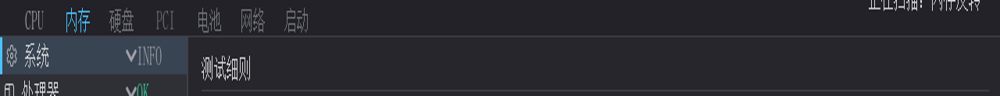
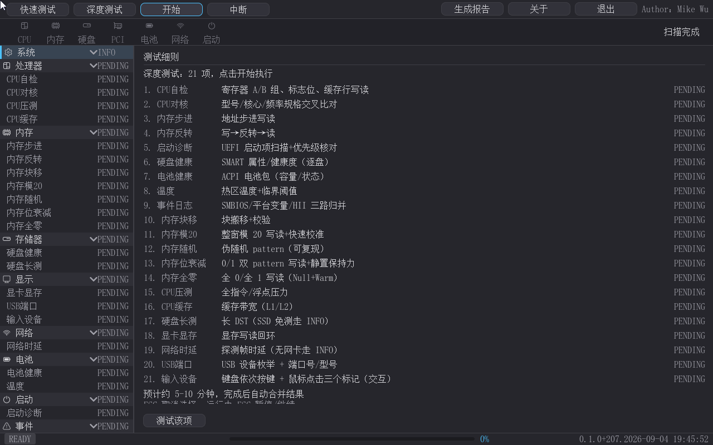
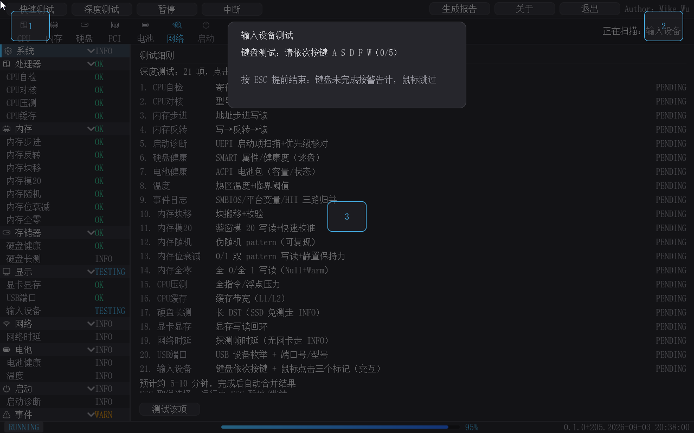
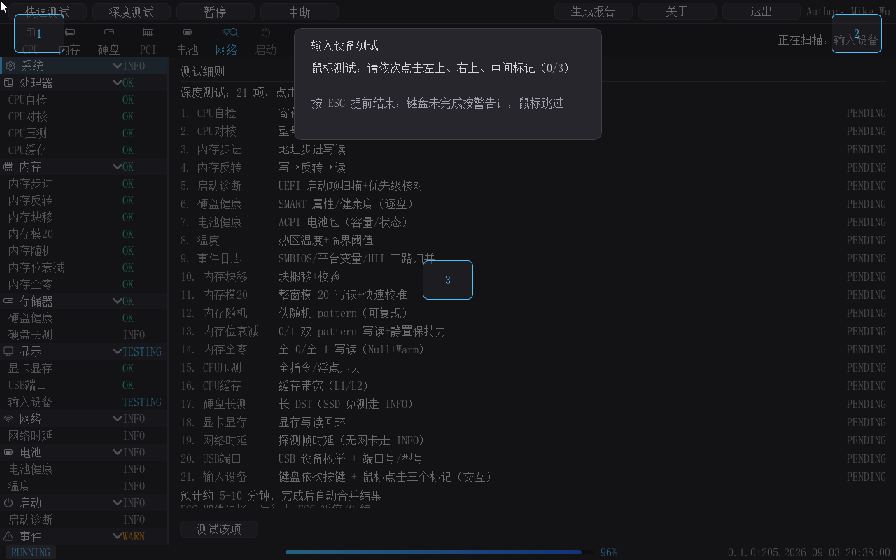
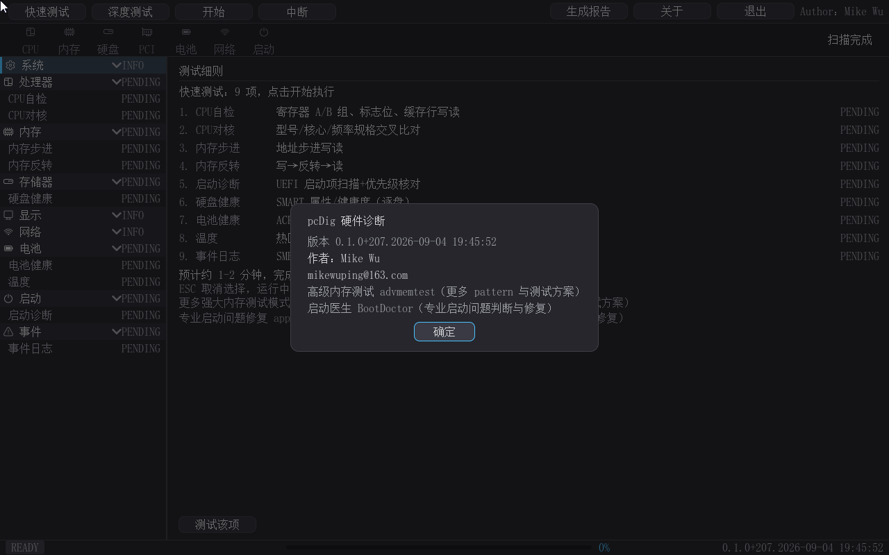
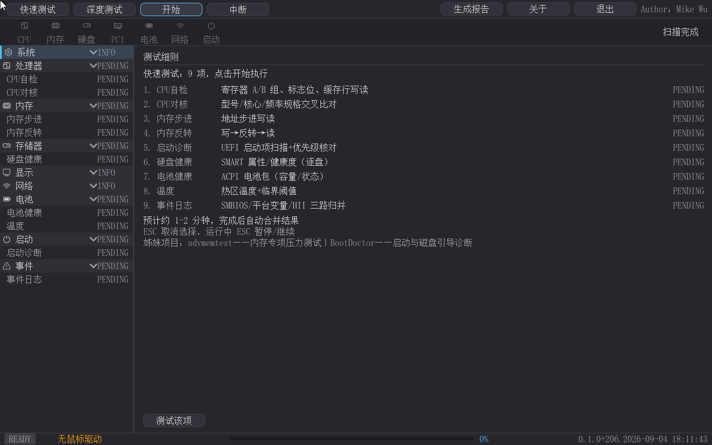
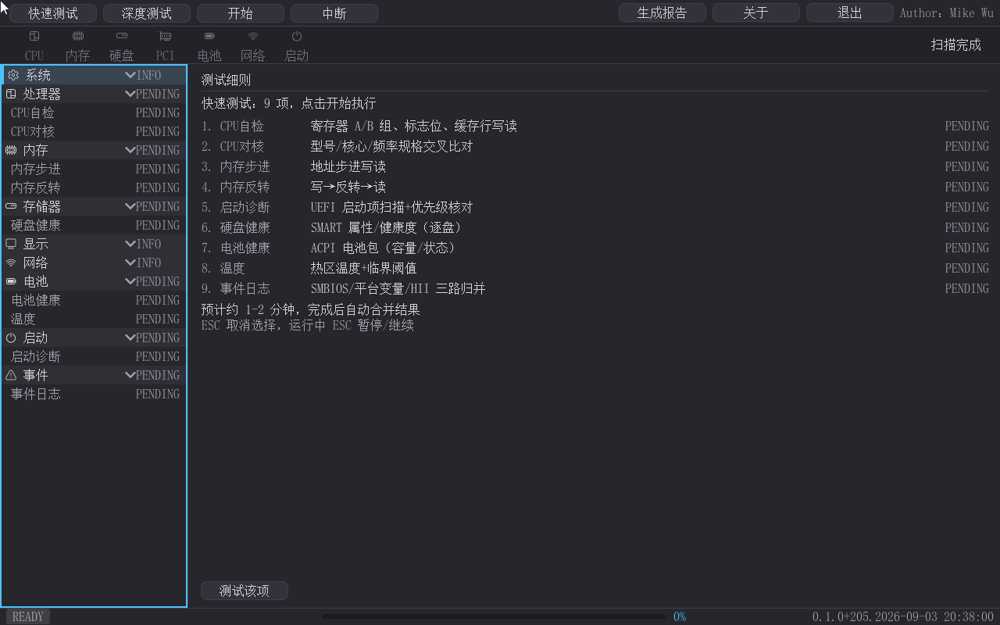
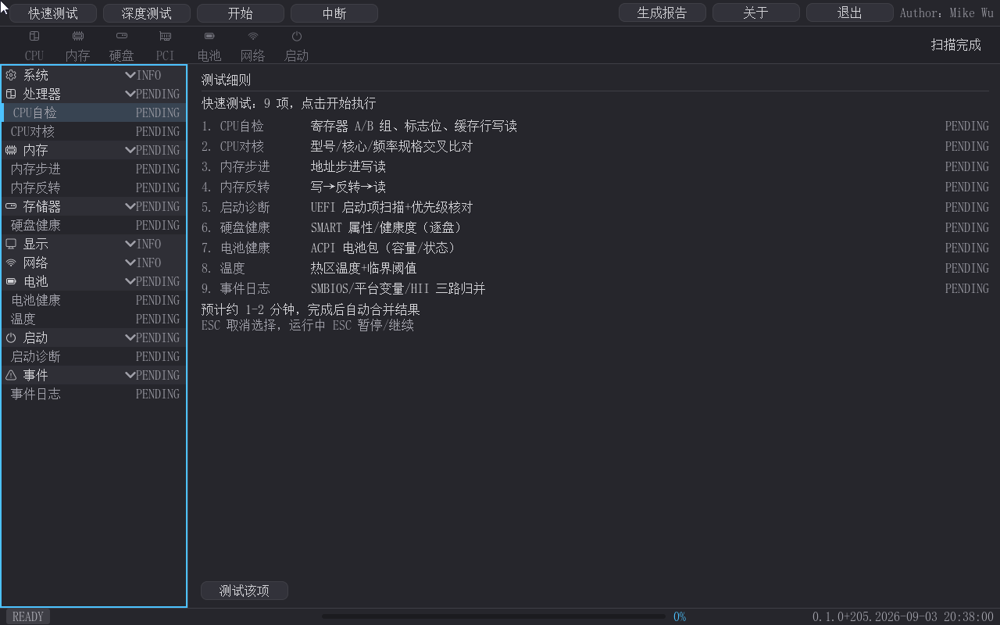
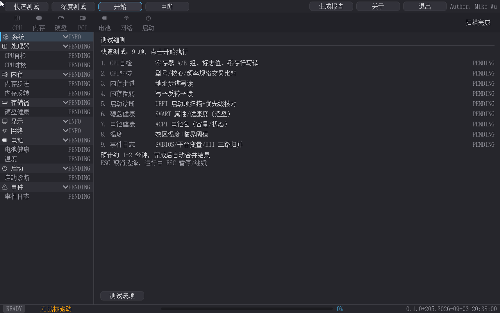

# pcDig — 硬件诊断工具（二进制发布包）

> [English version below](#english) ｜ [English README](#english)

pcDig 是一个运行在 **UEFI Shell**（或免 Shell 的可启动 ISO）下的图形化整机硬件诊断工具，对标 Dell BIOS 内建 Diagnostics 与商用 PC-Check：先于操作系统发现硬件故障——售前验机、售后维修、装机自检的第一道关卡。界面全简体中文（内置 SimSun 中文字库），支持鼠标 + 键盘双通道，诊断引擎以毫秒级"原子切片"轮转，21 项测试运行全程可视、左树实时联动。

> 把"机器能不能开机"拆成 21 项可判定的检查，逐项给出 OK / WARN / FAIL / INFO 结论，并生成留存报告。


- **版本**：0.1.0（Build 213，2026-09-05）
- **作者**：Mike Wu（mikewuping@163.com）
- **许可**：[个人用户免费；商用请联系作者](LICENSE.txt)
- **产品手册**：[详版手册（MD）](docs/manual/pcdig-product-manual.md) ｜ [Word 版](docs/manual/pcdig-product-manual.docx) —— 含全部功能截图与 HP/Dell/PC-Check 功能对比表

## 包内容

| 文件 | 说明 |
|---|---|
| `pcdig.efi` | 应用本体（UEFI x64 应用，约 1.1 MB） |
| `pcDig-boot.iso` | **可启动光盘镜像**（免 UEFI Shell 直启，Live-CD 风格，约 3 MB） |
| `qemu_disk/` | 预构建运行盘内容（pcdig.efi + startup.nsh + expected_version.txt） |
| `docs/manual/` | 产品手册（MD + Word + 15 张功能截图 + 报告样例） |
| `LICENSE.txt` | 使用许可（个人免费/商用授权） |

---

## 目录

- [运行要求](#运行要求)
- [快速上手](#快速上手)
- [功能特性](#功能特性)
- [界面一览](#界面一览)
- [操作方式（鼠标/键盘/Esc 状态机）](#操作方式鼠标键盘esc-状态机)
- [状态徽标语义](#状态徽标语义)
- [命令行模式](#命令行模式)
- [数据与安全说明](#数据与安全说明)
- [姊妹工具](#姊妹工具)
- [常见问题](#常见问题)
- [已知限制](#已知限制)
- [更新记录](#更新记录)
- [许可](#许可)

## 运行要求

| 项目 | 要求 |
|---|---|
| 平台 | x64（x86-64）UEFI 固件，无操作系统要求 |
| 启动形态 | ① 免 Shell 可启动 ISO；② UEFI Shell 手动/自动运行 |
| 介质 | FAT32 分区（Shell 形态）；任意可刻录/挂载介质（ISO 形态） |
| 屏幕 | 1280×800 或更高（其他分辨率以 WARN 提示但仍可用） |
| 推荐内存 | 2 GB+（深度测试按可用内存动态分块） |

## 快速上手

1. **启动**：ISO 形态——虚拟机挂载/U 盘（ventoy/rufus）/刻录后引导，开机即进主界面（默认快速测试预览，左树 9 项全 PENDING）；Shell 形态——把 `pcdig.efi` 与 `startup.nsh` 放入 FAT 介质，开机自动执行或 `Shell> pcdig.efi` 手动运行。
2. **开始**：按 **Enter**（或点"开始"）立刻运行快速套件——扫描条放大镜逐槽推进、进度条增长、左树当前项蓝色 TESTING、完成项即时 OK/WARN/FAIL；Esc = 暂停（再按继续），"中断"按钮中止本轮。
3. **看结果**：跑完自动弹"测试完成"汇总窗（通过/警告/失败/信息 + 逐项清单）；需要更全面检测点"**深度测试**"（快速完成后可选"仅深度继承/全部重测"）；可点"**生成报告**"导出 `fs0:\pcdig_report.html`；右上角"退出"结束（空闲 Esc 亦退）。

## 功能特性

### 测试套餐（快速 9 项，约 1-2 分钟；深度 12 项，全套 21 项约 5-10 分钟）

| # | 测试项 | 内容 |
|---|---|---|
| 1 | CPU自检 | 寄存器 A/B 组读改写、标志位置/清、缓存预读探针（8 片） |
| 2 | CPU对核 | CPUID 品牌串/供应商与频率规格交叉核对 |
| 3 | 内存步进 | 地址步进写读 |
| 4 | 内存反转 | 写→反转→读 |
| 5 | 启动诊断 | 三路扫描：引导设备枚举与优先级核对、启动变量（Boot####/BootOrder）完整性、引导事件；给出引导项清单与建议 |
| 6 | 硬盘健康 | SMART 属性/健康度（SATA 读属性表对照阈值 + NVMe 健康信息，逐盘出结论行） |
| 7 | 电池健康 | ACPI 电池包（已接入状态/剩余容量） |
| 8 | 温度 | SMBIOS Type 27 温度探针读数 + 临界阈值判定（Type 26/28 电压/风扇数据同步纳入检测面） |
| 9 | 事件日志 | SMBIOS Type 15 系统事件 + 启动/配置变量 + HII 表单关键字三路归并，统一等级展示 |
| 10-14 | 内存 5 个高级 pattern | 块搬移校验、整面模 20 写读（快速校准）、伪随机（可复现）、0/1 双 pattern 写读位衰减（静置保持力）、全 0/全 1 写读（Null+Warm）；按可用内存动态分块，低内存自动收缩 |
| 15 | CPU压测 | 全指令/浮点压力循环（热区/降频类问题"烤机"式探测） |
| 16 | CPU缓存 | L1/L2 缓存带宽 MB/s 实测 |
| 17 | 硬盘长测 | 长 DST 写读（SSD/不支持设备诚实报"不建议/不支持 INFO"——不假通过；0 盘环境"无数据"） |
| 18 | 显卡显存 | GOP 显存写读回环（报告轮次/字节量） |
| 19 | 网络时延 | 探测帧时延 + tx-min/avg/max + 丢包率 + RTT 与回应率（无网卡/链路断开 INFO 并说明原因） |
| 20 | USB端口 | USB 控制器 + Hub 拓扑枚举，设备端口号/型号/速率信息表 |
| 21 | 输入设备 | 键盘依次按键 A S D F W（避免"只用了一次"假阳性）+ 屏幕左上/右上/中间三点点测（触屏通路真机清单） |

### 套餐范围选择（含继承语义）

- 快速完成后点"深度测试"弹二选一：**仅深度（12 项，继承快速结果、跳过已测）** / **全部重测（21 项）** / 取消——继承场景省时，复查场景全量；
- 未跑过快速（或中断未算完成）时点深度直接预览全套 21 项；
- 开始/暂停/继续三态按钮 + 独立"中断"按钮；Esc 在运行中 = 暂停（再按继续），中断由按钮接管。

### 流程可视化与结果

- **扫描条放大镜**：7 个硬件槽位（CPU/内存/硬盘/PCI/电池/网络/启动）横向滚动，放大镜逐槽推进模拟"搜索硬件错误"，右角同步"正在扫描：× × ×"；平时放大镜隐藏；
- **动态进度条**：状态栏渐变进度条按条目数加权；
- **左树实时联动**：选择套餐后左树切为该套餐测试项清单（全 PENDING）；运行中当前项蓝色 TESTING 高亮、完成项即时变 OK/WARN/FAIL；
- **完成汇总弹窗**：自动弹出"测试完成"——通过/警告/失败/信息计数 + 逐项徽标清单；中断/故障不弹（结论走状态栏徽章 + 串口）；
- **终态收口**：结束后没有对应测试项的枚举行（主板型号/CPU 频率/内存容量等）统一转"信息"徽标，不再残留"未完成"暗示；
- **HTML 报告**：一键生成 `fs0:\pcdig_report.html`——深色主题自包含单文件：系统信息（SMBIOS/CPUID/内存明细）+ 9 类组件状态表 + 事件日志汇总 + 启动失败分析小结；报告生成时顺带日志分析。

### 纯键盘与无鼠标适配

- **Tab 在大元素间切换焦点**（快速测试→深度测试→开始→中断→生成报告→关于→退出→测试该项→左树）；左树是**单个焦点单位**（2px 强调边框——树行不入 Tab 链）；
- **方向键树内导航**（↑/↓ 移动选中并联动右面板、Enter 激活子项/折叠类别）、Shift+Tab 反向；
- **Esc 状态机**：预览中 = 取消选择、运行中 = 暂停/继续、空闲 = 退出、弹窗中 = 关闭弹窗（不退出）；
- **无鼠标驱动提示**：启动探测真实指针（带设备路径的 SimplePointer/AbsolutePointer——ConSplitter 虚拟实例不算），无鼠标时状态栏左下角显示"无鼠标驱动"警告色，全流程仍可键盘操作；
- **菜单/按钮点击联动**：点击扫描条槽图标定位左树对应类别行并滚动可见。

## 界面一览

主界面自上而下：**工具栏**（快速测试/深度测试/开始/中断/生成报告/关于/退出，右上角署名 `Author：Mike Wu`）→ **扫描条**（7 硬件槽位 + 放大镜动画）→ **左树**（9 类别实时状态徽标）+ **右面板**（详情/测试细则）→ **状态栏**（左下 READY 徽章/无鼠标提示、中部进度条、右下版本水印）。















### 纯键盘操作用例







## 操作方式（鼠标/键盘/Esc 状态机）

| 操作 | 行为 |
|---|---|
| 鼠标点击左树行 | 显示详情；类别行点击 = 折叠/展开 |
| 鼠标点击扫描条槽图标 | 左树定位到该类别行（表头高亮 + 滚动可见） |
| Tab / Shift+Tab | 各大元素间切换焦点（左树为单个焦点单位） |
| ↑/↓（左树内） | 上下移动选中行（高亮 + 右面板实时联动） |
| Enter | 激活：树内看详情/折叠类别；按钮 = 点击 |
| Esc | 运行=暂停（再按=继续）；预览=取消选择；空闲=退出；弹窗=关闭弹窗 |

## 状态徽标语义

| 徽标 | 颜色 | 含义 |
|---|---|---|
| PENDING | 灰 | 已登记、待测试（套餐预览时全量 PENDING） |
| TESTING | 蓝 | 当前正在测试该项 |
| OK | 绿 | 测试通过 |
| WARN | 橙 | 测试警告（如事件日志存在告警级事件） |
| FAIL | 红 | 测试失败 |
| INFO | 灰 | 无数据/未检测到设备/纯信息行（测试完成后枚举行统一转 INFO） |

## 命令行模式

```
Shell> pcdig.efi -enum        # 硬件枚举聚合（SMBIOS/CPUID/PCI/ACPI/BlockIo/电池）
Shell> pcdig.efi -engine      # 21 原子切片回归验证（串口 ENGINE: DONE）
Shell> pcdig.efi -loganalyze  # 只读挂载 NTFS/ext4 系统盘，分析上次启动失败原因
```

## 数据与安全说明

- 只读诊断：不修改任何硬件配置/固件设置（不写 NVRAM、不改分区表；"启动诊断/事件日志"为只读分析）；
- 报告写入运行介质（`fs0:\pcdig_report.html`）；ISO 形态为只读介质——需要报告时请另挂写可写介质（U 盘/硬盘）；
- 无网络上传行为：所有数据留在本机；
- 界面右上角常驻 `Author：Mike Wu` 署名与右下水印（构建号）。

## 姊妹工具

- **高级内存测试 advmemtest**：内存专项压力测试（更多 pattern 与测试方案）——pcDig 内存项可快速定位问题层级，专项深度排查转用它；
- **启动医生 BootDoctor**：专业启动问题修复——pcDig 的启动诊断源自该项目，发现问题时用它判断和修复。

两个入口在 pcDig 的关于对话框与套餐预览页脚内均已内嵌（仅名称 + 一句话定位，链接后续补充）。

## 常见问题

| 问题 | 处理 |
|---|---|
| 开机进固件菜单但没有启动项 | ISO 形态请确认为第一启动项；或在固件启动菜单中手动选择光驱/挂载项 |
| 提示"无鼠标驱动" | 正常提示——该环境无真实指针设备，全程可用 Tab/方向键/Enter 操作 |
| 报告点击后找不到文件 | 需要可写介质（fs0:）；无写介质时串口有 WARN 记录 |
| 版本水印是什么 | 右下角构建号（0.1.0+213）是正式构建标识，与 `qemu_disk/expected_version.txt` 一致 |

## 已知限制

- QEMU 下无鼠标注入（相对设备）：屏幕三点测试的真机点击与触屏路径待真机验证；
- 网络时延/RTT 需要真实链路（QEMU `-net none` 走 INFO）；Type 26/27/28 传感器读数依真实主板；
- 屏幕点测当前为 3 点（左上/右上/中间——QEMU 验证便利）；4 角模式列入后续；
- 深度 21 项预览页脚（姊妹工具导流行）需向下滚动可见。

## 更新记录

- **0.1.0（Build 213，2026-09-05）**：正式发布。21 项自检、左树套件联动与实时状态、测试完成汇总弹窗、屏幕点测三点化、无鼠标适配与纯键盘全流程、姊妹工具导流（高级内存测试 advmemtest / 启动医生 BootDoctor）、可启动 ISO（免 Shell 直启，UDF 桥 Live-CD 形态）。

## 许可

[个人用户免费；商用请联系作者](LICENSE.txt)（mikewuping@163.com）。图形库 LVGL 采用 MIT 许可（https://lvgl.io），UEFI 移植层见 [MikeWuPing/UEFI_LVGL](https://github.com/MikeWuPing/UEFI_LVGL)。

---

## English

# pcDig — Hardware Diagnostics Toolkit (binary release)

A **GUI whole-machine hardware diagnostics tool for the UEFI Shell** (or a shell-free bootable ISO), in the spirit of Dell's built-in Diagnostics and commercial PC-Check — the first checkpoint before the OS hides the damage: pre-sale inspection, field repair, DIY assembly. Fully simplified-Chinese UI (built-in SimSun font), mouse & keyboard input, and a slice-based diagnostic engine that keeps every one of the 21 checks visible in real time.

> Turn "does this machine boot?" into 21 pass/fail-aware checks — OK / WARN / FAIL / INFO verdicts — plus a report you can keep.


- **Version**: 0.1.0 (Build 213, 2026-09-05)
- **Author**: Mike Wu (mikewuping@163.com)
- **License**: [free for personal use; commercial use requires the author's authorization](LICENSE.txt)
- **Product manual**: [Detailed manual (MD)](docs/manual/pcdig-product-manual.md) ｜ [Word](docs/manual/pcdig-product-manual.docx) (all feature screenshots + HP/Dell/PC-Check comparison)

## Package contents

| File | Description |
|---|---|
| `pcdig.efi` | the app itself (UEFI x64, ~1.1 MB) |
| `pcDig-boot.iso` | bootable ISO — shell-free, Live-CD style, ~3 MB |
| `qemu_disk/` | prebuilt runtime-disk contents (pcdig.efi + startup.nsh + expected_version.txt) |
| `docs/manual/` | product manual (MD + Word + 15 screenshots + report sample) |
| `LICENSE.txt` | usage license |

## Requirements

x64 UEFI firmware, no OS; FAT32 media for Shell mode; any bootable media for ISO mode; 1280×800 or higher screen recommended; 2 GB+ RAM recommended.

## Quick start

1. Boot the ISO (VM attach / ventoy / disc) — you land on the main window with the quick-suite preview; or copy `pcdig.efi` + `startup.nsh` to FAT media and run `pcdig.efi` from the UEFI Shell.
2. Press **Enter** (or click Start) — the scanbar magnifier walks the 7 slots, the progress bar grows, the current item goes TESTING blue and finished items flip to OK/WARN/FAIL immediately; Esc = pause/resume; the Abort button stops the round.
3. A summary dialog pops on completion (pass/warn/fail/info counts + per-item list); use **Deep** for the full 21-item suite (optional "inherit quick results"); click **Generate Report** for `fs0:\pcdig_report.html`; **Exit** (in the top-right, or Esc at idle) when done.

## Features

### Suites (Quick 9, ~1–2 min; +12 extensive, 21 total ~5–10 min)

| # | Check | What it does |
|---|---|---|
| 1 | CPU self-test | register A/B read-write, flag set/clear, cache pre-read probe (8 slices) |
| 2 | CPU core check | CPUID brand/vendor vs. frequency spec cross-check |
| 3 | Memory Step | address-stepped write/read |
| 4 | Memory Invert | write → invert → read |
| 5 | Boot diagnostics | 3-way scan: boot-device enumeration & priority, boot variables (Boot####/BootOrder) integrity, boot events; per-item list with suggestions |
| 6 | Disk health | SMART attributes (SATA threshold compare + NVMe health info), per-disk verdict rows |
| 7 | Battery health | ACPI battery package (present state / remaining capacity) |
| 8 | Temperature | SMBIOS Type 27 probe readings + critical-threshold verdict (Type 26/28 voltage & fan data also in scope) |
| 9 | Event log | SMBIOS Type 15 events + boot/config variables + HII form keywords, merged in one view |
| 10-14 | 5 advanced memory patterns | Block Move + verify, full-page Mod-20 write/read (fast calibration), pseudo-random (reproducible), Bit Fade 0/1 with dwell time, All-Zero (Null+Warm); dynamic chunking, auto-shrink on low memory |
| 15 | CPU stress | full instruction + FP stress loop (thermal/throttle probing) |
| 16 | Cache | L1/L2 bandwidth in MB/s |
| 17 | Disk long test | long DST (SSD/unsupported honestly reported as "not suggested — INFO", never fake-pass; "no data" with 0 drives) |
| 18 | VRAM | GOP loopback with rounds/bytes reported |
| 19 | Network | probe-frame latency + tx-min/avg/max + loss % + RTT & response rate (INFO with reason when no NIC/link) |
| 20 | USB ports | controller + hub topology enumeration, port/model/rate table |
| 21 | Input devices | keyboard A-S-D-F-W sequence (no "used it once" false positives) + on-screen 3-point click test (top-left/top-right/center) |

### Suite scope choice (with inherit semantics)

- after a quick run, "Deep" pops a 3-way choice: **deep-only (12 items, inheriting quick results)** / **rerun everything (21)** / cancel;
- without a completed quick run, "Deep" previews the full 21 items directly;
- Start has three states (start/pause/resume) plus a dedicated Abort button; Esc during a run = pause (again = resume); abort moved to the button.

### Visualization & results

- **Scanbar + magnifier**: 7 hardware slots (CPU/memory/disk/PCI/battery/network/boot) scroll while the magnifier walks them — "searching for hardware errors" made visible; hidden when idle;
- **Gradient progress bar** weighted by item count;
- **Live left tree**: picking a suite switches the tree to that suite's item list (all PENDING); the running item is TESTING blue, finished items flip to OK/WARN/FAIL instantly;
- **Completion summary dialog**: auto-pops with pass/warn/fail/info counts + per-item badge list (not on abort/fault);
- **Info settlement**: after a run, enumeration rows without a matching test flip to INFO — no misleading "pending" remains;
- **HTML report**: `fs0:\pcdig_report.html` — dark self-contained single file (system info + component status table + event-log summary + boot-failure analysis).

### Keyboard-only & no-mouse

- **Tab cycles major regions**; the tree is ONE focus unit (2px accent frame);
- **Arrows navigate inside the tree** (panel linkage), Enter activates, Shift+Tab backwards;
- **Esc state machine**: cancel preview / pause-resume / quit / close dialog;
- **No-mouse-driver hint**: probes for a real pointer (device-path SimplePointer/AbsolutePointer — ConSplitter virtual instances don't count); warning-colored label bottom-left, workflow stays keyboard-driven.

## Walkthrough


## Controls

| Input | Behavior |
|---|---|
| click tree row | show details; category row toggles collapse |
| click scanbar slot | focus & scroll the matching tree category |
| Tab / Shift+Tab | focus between major regions (tree = one focus unit) |
| ↑/↓ (in tree) | move selection (highlight + panel linkage) |
| Enter | activate: details / collapse; buttons click |
| Esc | pause/resume while running · cancel preview · quit when idle · close dialog |

## Status badges

| Badge | Color | Meaning |
|---|---|---|
| PENDING | grey | registered, not yet run |
| TESTING | blue | currently running |
| OK | green | passed |
| WARN | orange | warning |
| FAIL | red | failed |
| INFO | grey | no data / device absent / plain info row (enumeration rows settle here) |

## CLI modes

```
Shell> pcdig.efi -enum        # hardware enumeration
Shell> pcdig.efi -engine      # 21-atom serial regression
Shell> pcdig.efi -loganalyze  # read-only mount of NTFS/ext4 system disk; analyze the last failed boot
```

## Privacy & safety

Read-only diagnostics (no NVRAM writes, no partition edits, no firmware settings). Reports go to the running media (`fs0:\pcdig_report.html`); the ISO is read-only — attach a writable disk for reports. Nothing is uploaded anywhere. The UI keeps the `Author：Mike Wu` credit and the build watermark.

## Sister tools

- **advmemtest (高级内存测试)**: memory-specialist stress testing (more patterns & test schemes);
- **BootDoctor (启动医生)**: professional boot-problem repair — pcDig's boot diagnostics originate from it.

Both are cross-linked in the About dialog and the suite-preview footer.

## Known limitations

- No mouse injection under QEMU: the 3-point screen test needs a real machine;
- Network latency/RTT needs a real link; Type 26/27/28 readings depend on the actual motherboard;
- Screen test currently uses 3 points; the 4-corner mode is on the roadmap;
- The extensive-preview footer is below the fold — scroll to see.

## Update log

- **0.1.0 (Build 213, 2026-09-05)**: first release — 21 checks, suite-linked live tree, completion summary, 3-point screen test, keyboard-only flow + no-mouse adaptation, sister-tool links, shell-free bootable ISO (UDF-bridge Live-CD).

## License

[Free for personal use; commercial use requires the author's authorization](LICENSE.txt). The LVGL graphics library is MIT-licensed (https://lvgl.io); UEFI port layer: [MikeWuPing/UEFI_LVGL](https://github.com/MikeWuPing/UEFI_LVGL).
