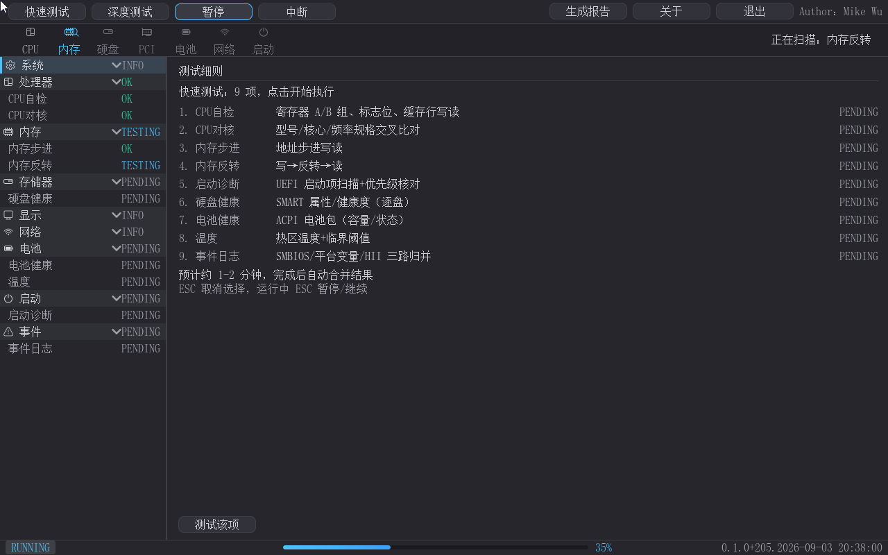
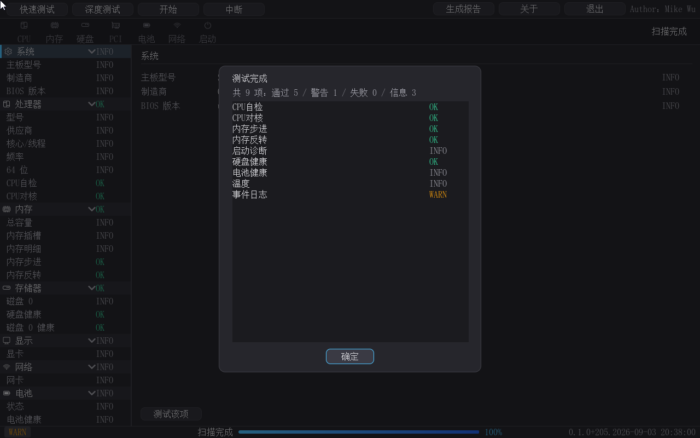
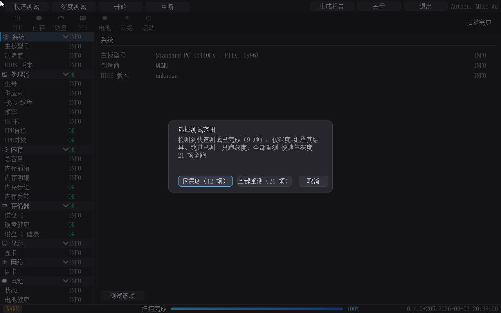

# pcDig — 硬件诊断工具（二进制发布包）

> [English version below](#english) ｜ [English README](#english)

pcDig 是一个运行在 **UEFI Shell**（或免 Shell 的可启动 ISO）下的图形化整机硬件诊断工具，对标 Dell BIOS 内建 Diagnostics 与商用 PC-Check。它先于操作系统发现硬件故障——售前验机、售后维修、装机自检的第一道关卡。界面全简体中文，支持鼠标 + 键盘双通道，21 项自检全程可视化、左树实时联动。

> 把"机器能不能开机"拆成 21 项可判定的检查，逐项给出 OK / WARN / FAIL / INFO 结论，并生成留存报告。


- **版本**：0.1.0（Build 213，2026-09-05）
- **作者**：Mike Wu（mikewuping@163.com）
- **许可**：[个人用户免费；商用请联系作者](LICENSE.txt)
- **产品手册**：[详版手册（MD）](docs/manual/pcdig-product-manual.md) ｜ [Word 版](docs/manual/pcdig-product-manual.docx)（含全部功能截图与 HP/Dell/PC-Check 功能对比表）

## 包内容

| 文件 | 说明 |
|---|---|
| `pcdig.efi` | 应用本体（UEFI x64 应用，约 1.1 MB） |
| `pcDig-boot.iso` | **可启动光盘镜像**（免 UEFI Shell 直启的 Live-CD 风格，约 3 MB——ISO9660+UDF 桥 + 固件标准引导路径，本仓随附） |
| `qemu_disk/` | 预构建运行盘内容（pcdig.efi + startup.nsh + expected_version.txt） |
| `docs/manual/` | 产品手册（MD + Word + 13 张功能截图 + 报告样例） |
| `LICENSE.txt` | 使用许可（个人免费/商用授权） |

## 运行要求

| 项目 | 要求 |
|---|---|
| 平台 | x64（x86-64）UEFI 固件，无操作系统要求 |
| 启动形态 | ① 免 Shell 可启动 ISO；② UEFI Shell 手动/自动运行 |
| 介质 | FAT32 分区（Shell 形态）；任意可刻录/挂载介质（ISO 形态） |
| 屏幕 | 1280×800 或更高（其他分辨率以 WARN 提示但仍可用） |
| 推荐内存 | 2 GB+（深度测试按可用内存动态分块） |

## 快速上手（三步）

1. **启动**：ISO 形态——虚拟机挂载/U 盘（ventoy/rufus）/刻录后引导，开机即进主界面（默认快速测试预览，左树 9 项全 PENDING）；Shell 形态——把 `pcdig.efi` 与 `startup.nsh` 放入 FAT 介质，开机自动执行或 `Shell> pcdig.efi` 手动运行。
2. **开始**：按 **Enter**（或点"开始"）立刻运行快速套件——扫描条放大镜逐槽推进、进度条增长、左树当前项蓝色 TESTING、完成项即时 OK/WARN/FAIL；Esc = 暂停（再按继续），"中断"按钮中止本轮。
3. **看结果**：跑完自动弹"测试完成"汇总窗（通过/警告/失败/信息 + 逐项清单）；需要更全面检测点"**深度测试**"（快速完成后可选"仅深度继承/全部重测"）；可点"**生成报告**"导出 `fs0:\pcdig_report.html`；右上角"退出"结束（空闲 Esc 亦退）。

## 功能特性（21 项自检一览）

| 套餐 | 项 | 内容 |
|---|---|---|
| 快速（约 1-2 分钟） | 9 | CPU 自检（寄存器/标志/缓存探针）、CPU 对核（CPUID 规格交叉）、内存步进、内存反转、启动诊断（引导设备/启动变量/引导事件三路扫描 + 建议）、硬盘 SMART 健康（SATA+NVMe 逐盘）、电池健康（ACPI 容量/状态）、温度（SMBIOS Type 27 + 阈值；26/28 电压/风扇在检测面内）、事件日志（Type 15/变量/HII 三路归并） |
| 深度（整套约 5-10 分钟） | +12 | 内存 5 个高级 pattern（块移校验/模 20 面写读/伪随机/位衰减静置/全零）、CPU 压测（全指令+浮点）、CPU 缓存带宽（L1/L2 MB/s）、硬盘长 DST（SSD 诚实报"不建议"不假通过）、显存 GOP 回环、网络时延/RTT/丢包（无网卡 INFO+原因）、USB 端口/Hub 拓扑枚举、输入设备（键盘 A-S-D-F-W + 屏幕左上/右上/中间三点点测交互） |

其余特性：套餐继承二选一（仅深度/全部重测）；扫描条放大镜"搜索硬件错误"可视化；左树实时联动（PENDING→TESTING→终态，完成后信息行收口 INFO）；纯键盘全流程（Tab 大元素焦点/方向键树内导航/Enter 激活/Esc 状态机）；无鼠标驱动自动提示（状态栏左下角）；HTML 报告（深色单文件：系统信息 + 组件状态 + 事件日志 + 启动失败分析）；姊妹工具导流（高级内存测试 advmemtest / 启动医生 BootDoctor——细节见手册）。







（更多截图：21 项预览、输入设备两阶段、键盘焦点/导航、无鼠标提示、放大镜特写——见产品手册。）

## 命令行模式

```
Shell> pcdig.efi -enum        # 硬件枚举聚合（SMBIOS/CPUID/PCI/ACPI/BlockIo/电池）
Shell> pcdig.efi -engine      # 21 原子切片回归验证（串口 ENGINE: DONE）
Shell> pcdig.efi -loganalyze  # 只读挂载 NTFS/ext4 系统盘，分析上次启动失败原因
```

## 数据与安全说明

- 只读诊断：不修改任何硬件配置/固件设置（不写 NVRAM、不改分区表；"启动诊断/事件日志"为只读分析）；
- 报告写入运行介质（`fs0:\pcdig_report.html`）；ISO 形态为只读介质——需要报告时请另挂写可写介质（U 盘/硬盘）；
- 无网络上传行为：所有数据留在本机；
- 界面右上角常驻 `Author：Mike Wu` 署名与右下水印（构建号）。

## 常见问题

| 问题 | 处理 |
|---|---|
| 开机进固件菜单但没有启动项 | ISO 形态请确认为第一启动项；或在固件启动菜单中手动选择光驱/挂载项 |
| 提示"无鼠标驱动" | 正常提示——该环境无真实指针设备，全程可用 Tab/方向键/Enter 操作 |
| 报告点击后找不到文件 | 需要可写介质（fs0:）；无写介质时串口有 WARN 记录 |
| 版本水印是什么 | 右下角构建号（0.1.0+213）是正式构建标识，与 `qemu_disk/expected_version.txt` 一致 |

## 更新记录

- **0.1.0（Build 213，2026-09-05）**：正式发布。21 项自检、左树套件联动与实时状态、测试完成汇总弹窗、屏幕点测三点化、无鼠标适配与纯键盘全流程、姊妹工具导流（高级内存测试 advmemtest / 启动医生 BootDoctor）、可启动 ISO（免 Shell）。

## 许可

[个人用户免费；商用请联系作者](LICENSE.txt)（mikewuping@163.com）。图形库 LVGL 采用 MIT 许可（https://lvgl.io），UEFI 移植层见 [MikeWuPing/UEFI_LVGL](https://github.com/MikeWuPing/UEFI_LVGL)。

---

## English

# pcDig — Hardware Diagnostics Toolkit (binary release)

A **GUI whole-machine hardware diagnostics tool for the UEFI Shell** (or a shell-free bootable ISO), in the spirit of Dell's built-in Diagnostics and commercial PC-Check — the first checkpoint before the OS hides the damage: pre-sale inspection, field repair, DIY assembly. Fully simplified-Chinese UI, mouse + keyboard, 21 self-test checks with full runtime visualization and a real-time left tree.

> Turn "does this machine boot?" into 21 pass/fail-aware checks — OK / WARN / FAIL / INFO verdicts — plus a report you can keep.

- **Version**: 0.1.0 (Build 213, 2026-09-05)
- **Author**: Mike Wu (mikewuping@163.com)
- **License**: [free for personal use; commercial use requires the author's authorization](LICENSE.txt)
- **Product manual**: [Detailed manual (MD)](docs/manual/pcdig-product-manual.md) ｜ [Word](docs/manual/pcdig-product-manual.docx) (all feature screenshots + HP/Dell/PC-Check comparison)

## Package contents

| File | Description |
|---|---|
| `pcdig.efi` | the app itself (UEFI x64, ~1.1 MB) |
| `pcDig-boot.iso` | **bootable ISO** (shell-free, Live-CD style, ~3 MB — ISO9660+UDF bridge + standard firmware boot path; shipped in this repo) |
| `qemu_disk/` | prebuilt runtime-disk contents (pcdig.efi + startup.nsh + expected_version.txt) |
| `docs/manual/` | product manual (MD + Word + 13 screenshots + report sample) |
| `LICENSE.txt` | usage license |

## Requirements

x64 UEFI firmware, no OS; FAT32 media for Shell mode; any bootable media for ISO mode; 1280×800 or higher screen recommended; 2 GB+ RAM recommended.

## Quick start

1. Boot the ISO (VM attach / ventoy / disc) — you land on the main window with the quick-suite preview; or copy `pcdig.efi` + `startup.nsh` to FAT media and run `pcdig.efi` from the UEFI Shell.
2. Press **Enter** (or click Start) — the scanbar magnifier walks the 7 slots, the progress bar grows, the current item goes TESTING blue and finished items flip to OK/WARN/FAIL immediately; Esc = pause/resume; the Abort button stops the round.
3. A summary dialog pops on completion (pass/warn/fail/info counts + per-item list); use **Deep** for the full 21-item suite (optional "inherit quick results"); click **Generate Report** for `fs0:\pcdig_report.html`; **Exit** (in the top-right, or Esc at idle) when done.

## The 21 checks

Quick (9, ~1–2 min): CPU self-test (registers/flags/cache probe) — CPU core check (CPUID spec cross-check) — Memory Step/Invert — Boot diagnostics (3-way: devices/variables/events, with suggestions) — Disk SMART health (SATA+NVMe) — Battery health (ACPI) — Temperature (SMBIOS Type 27 + thresholds; Type 26/28 also in scope) — Event log (Type 15 / variables / HII merge).

Deep (+12, ~5–10 min total): 5 advanced memory patterns (Block Move / Mod-20 / Random / Bit Fade / All-Zero), CPU stress (full instruction + FP), cache bandwidth (L1/L2 MB/s), disk long DST (honest INFO on SSD), VRAM GOP loopback, network latency/RTT/loss, USB port & hub enumeration, input devices (A-S-D-F-W keyboard sequence + 3-point on-screen click test).

Also: suite inherit choice (deep-only / rerun all), scanbar magnifier animation, live left tree (PENDING→TESTING→verdicts, info settlement after a run), full keyboard workflow (Tab regions / arrows / Enter / Esc state machine), no-mouse-driver hint, HTML report, sister-tool cross-links (advmemtest / BootDoctor).

## Privacy & safety

Read-only diagnostics (no NVRAM writes, no partition edits, no firmware settings). The report is written to the running media (`fs0:\pcdig_report.html`); the ISO is read-only — attach a writable disk if you need reports. Nothing is uploaded anywhere.

## Update log

- **0.1.0 (Build 213, 2026-09-05)**: first release — 21 checks, suite-linked live tree, completion summary, 3-point screen test, no-mouse adaptation & keyboard-only flow, sister-tool links, shell-free bootable ISO.

## License

[Free for personal use; commercial use requires the author's authorization](LICENSE.txt). The LVGL graphics library is MIT-licensed (https://lvgl.io); UEFI port layer: [MikeWuPing/UEFI_LVGL](https://github.com/MikeWuPing/UEFI_LVGL).
