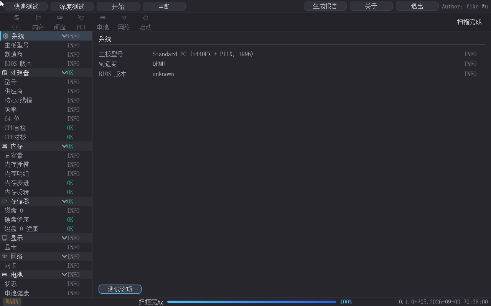

# pcDig 硬件诊断工具 产品手册

> 版本：pcDig v0.1.0（构建 0.1.0+207，2026-09-04）
> 适用环境：UEFI x64（UEFI Shell 或可启动 ISO 两种启动形态），无操作系统要求
> 配套文件：pcdig_report_sample.html（报告样例）、pcdig-product-manual.docx（Word 版）、dist/pcDig-boot.iso（可启动光盘映像，由 tools/build-boot-iso.py 生成到 dist/——发布产物目录）

---

## 1. 产品概述

pcDig 是一款**面向整机硬件自检**的 UEFI 图形化诊断工具，对标 Dell BIOS 内建 Diagnostics 与商用 PC-Check。它没有操作系统依赖——直接在 UEFI Shell 下运行，先于操作系统发现硬件故障，是售前验机、售后维修、装机自检的"第一道关卡"。技术底座是 LVGL v9.2.2 的 UEFI 移植层（LvglPkg），界面全简体中文、支持鼠标 + 键盘双通道操作；诊断引擎采用"原子切片"设计，21 项测试均以毫秒级时间片轮转，测试过程中界面实时联动（扫描条动画、进度条、左树状态即时刷新）。

核心价值一句话：**把"机器能不能开机"拆成 21 项可判定的检查，逐项给出 OK / WARN / FAIL / INFO 结论，并生成留存报告。**

### 1.1 功能清单（速览）

| 功能模块 | 内容 | 对应章节 |
|---|---|---|
| 硬件枚举信息页 | 系统/处理器/内存/存储/显示/网络/电池九类硬件信息（SMBIOS/CPUID/PCI/ACPI） | §3、§4 |
| 快速测试（9 项） | CPU 自检/对核、内存步进/反转、启动诊断、硬盘 SMART、电池、温度、事件日志 | §5 |
| 深度测试（12 项，全套 21 项） | 内存 5 个高级 pattern、CPU 压测、缓存带宽、硬盘长 DST、显存回环、网络时延/RTT、USB 端口、输入设备 | §6 |
| 套餐范围选择 | 快速完成后的"仅深度继承 / 全部重测 / 取消"二选一 | §6.1 |
| 扫描过程可视化 | 扫描条放大镜动画、进度条、左树实时联动（TESTING→OK/WARN/FAIL） | §7 |
| 测试完成汇总 | 通过/警告/失败/信息计数 + 逐项清单弹窗 | §8 |
| 交互式输入设备测试 | 键盘 A S D F W + 屏幕三点（左上/右上/中间）点测 | §9.7 |
| 启动诊断 | 引导设备/启动变量/引导事件三路扫描 + 修复建议 | §9.8 |
| 事件日志 | SMBIOS Type 15 / 启动变量 / HII 三路归并 | §9.8 |
| 系统日志分析（CLI） | 只读挂载 NTFS/ext4 系统盘，分析上次启动失败原因 | §9.9 |
| 测试报告 | 单文件 HTML（系统信息 + 逐项结果 + 状态着色） | §11 |
| 关于对话框 | 版本/作者/邮箱 + 姊妹项目指引 | §11 |
| 键盘纯键盘操作 | Tab 大元素焦点、方向键树内导航、Enter 激活、Esc 状态机 | §10 |
| 无鼠标适配 | 启动探测真实指针；无鼠标时左下角提示 + 全键盘流程 | §10.3 |
| 两种启动形态 | UEFI Shell（startup.nsh / 手动）与可启动 ISO（免 Shell 直启） | §2 |

## 2. 安装与启动

| 项目 | 说明 |
|---|---|
| 硬件要求 | x64 UEFI 固件（支持 UEFI 光盘引导或 UEFI Shell、分辨率 1280×800 或更高、推荐 2 GB+ 内存） |
| 部署方式 A（Shell） | 将 `PcDig.efi`、`startup.nsh` 拷入任意外接磁盘（U 盘/SATA 盘）的 FAT 分区 |
| 部署方式 B（ISO） | 使用 `pcDig-boot.iso`——虚拟光驱挂载、U 盘（ventoy/rufus）或刻盘；**免 Shell 直启**，见 §2.1 |
| 启动方式 | 方式 A：UEFI Shell 手动执行或开机自动执行 `startup.nsh`（内容：`pcdig.efi`）；方式 B：BIOS 选择光驱/挂载项启动，固件直接加载 `EFI\BOOT\BOOTX64.EFI` 进入 app |
| 运行参数 | `pcdig.efi`（默认：进 GUI）；`-enum`（硬件枚举 CLI）；`-engine`（全原子串口回归 CLI）；`-loganalyze`（系统日志分析 CLI） |
| 退出方式 | 工具栏"退出"按钮；或空闲态按 Esc；运行中 Esc = 暂停/继续，先中断再退 |

### 2.1 可启动 ISO（免 UEFI Shell）

针对**没有 UEFI Shell 的用户**，产品附带可启动光盘映像 `pcDig-boot.iso`：固件直接从光盘的标准引导路径 `EFI\BOOT\BOOTX64.EFI`（即 pcDig 本体）加载应用，**无需 Shell、无需任何磁盘**——开机即进 pcDig 主界面。下图是"仅挂载光盘、无任何磁盘"的虚拟机实拍（底部状态栏同时可见"无鼠标驱动"提示——该启动形态默认无鼠标设备，纯键盘全流程可用）：


ISO 使用方式：

| 场景 | 方法 |
|---|---|
| 虚拟机 | 挂载 `pcDig-boot.iso`，设为第一启动项（如 QEMU：`-drive file=pcDig-boot.iso,if=none -device ide-cd`） |
| U 盘 | 拷入 ventoy 即可点选启动；或 rufus 以"UEFI 镜像"方式写入 |
| 光盘 | 刻录后直接引导（所有现代 x64 平台固件均支持 UEFI 光盘引导） |
| 重新构建 | 版本更新后运行 `python tools/build-boot-iso.py`——自动重建到 `dist/pcDig-boot.iso`（发布产物目录；内嵌 ESP 为 FAT32 镜像、El Torito no-emul + UEFI 平台项） |

ISO 目录结构：`EFI\BOOT\BOOTX64.EFI`（启动入口 = pcDig 本体）、`PcDig.efi`（Shell 手动加载副本）、`startup.nsh`、`README.txt`。

**注意**：ISO 为只读介质——测试报告（`pcdig_report.html`）写入可写介质（fs0:，如另挂的 U 盘/硬盘）；纯 ISO 环境下点"生成报告"会得到一次 WARN 记录（串口可查），属预期。

**命令行模式示例**（供脚本化验证、无显示环境使用）：

```
Shell> pcdig.efi -enum
DIAG-CAT: 系统
DIAG-ITEM: 主板型号 = Standard PC (i440FX + PIIX, 1996)
...
DIAG-ENUM: OK

Shell> pcdig.efi -engine
[PcDig] ENGINE: slice 1/8 ...
[PcDig] ENGINE: DONE

Shell> pcdig.efi -loganalyze
[PcDig] LOGANALYZE: result=...
```

## 3. 界面总览

启动后即为"快速测试预览"界面（见下图）——左树是快速 9 项测试清单（全部 PENDING 待测），右侧是测试细则，按 Enter 即可开跑。


| 编号区域 | 名称 | 功能 |
|---|---|---|
| ① 工具栏 | 快速测试 / 深度测试 / 开始 / 中断 / 生成报告 / 关于 / 退出 | 全部流程入口；退出按钮位于右上角署名旁 |
| ② 扫描条 | 7 个硬件类别槽位（CPU/内存/硬盘/PCI/电池/网络/启动） | 扫描中显示"正在扫描：xxx"，放大镜逐槽推进；点击槽位图标定位左侧对应类别行 |
| ③ 左侧状态树 | 9 大类别 + 测试项/信息行 | 实时状态（PENDING/TESTING/OK/WARN/FAIL/INFO），点击行右侧显示详情 |
| ④ 右侧面板 | 详情 / 测试细则 | 选中行的详实信息，或套餐测试项清单 |
| ⑤ 状态栏 | READY 徽章 / 进度条 / 版本水印 | 左下角流程状态、中部测试进度、右下角版本号；无鼠标时徽章旁显示"无鼠标驱动" |

### 3.1 扫描条与放大镜


扫描条只在测试过程中出现放大镜动画（平时隐藏）：放大镜逐个扫描 7 个硬件槽位，对应"搜索硬件错误"的可视化过程；右上角同时显示"正在扫描：<当前测试项>"。点击槽位图标可直接把左侧树定位到该类别。

### 3.2 状态徽标语义

| 徽标 | 颜色 | 含义 |
|---|---|---|
| PENDING | 灰 | 已登记、待测试（套餐预览时全量 PENDING） |
| TESTING | 蓝 | 当前正在测试该项 |
| OK | 绿 | 测试通过 |
| WARN | 橙 | 测试警告（如事件日志存在告警级事件） |
| FAIL | 红 | 测试失败 |
| INFO | 灰 | 无数据/未检测到设备/纯信息行（枚举信息行在测试完成后统一转 INFO） |

### 3.3 窗口右上角署名

主界面右上角常驻 `Author：Mike Wu`；"关于"对话框内列出作者与邮箱（mikewuping@163.com）。

## 4. 快速上手（三步）

1. **选择套餐**：启动即显示快速测试预览（9 项全 PENDING，右侧列明每项将测什么）；需要更深度的检测点"深度测试"。
2. **开始**：按 Enter 或点击"开始"立即运行——测试过程中左树逐项联动（TESTING 蓝色 → 通过变 OK），扫描条放大镜推进，进度条实时增长。
3. **看结果**：全部完成后自动弹出"测试完成"汇总窗（通过/警告/失败/信息统计 + 逐项清单）；关闭汇总后左树为终态（信息行 INFO，测试行 OK/WARN/FAIL）；可点"生成报告"导出 HTML 报告，或点"退出"结束。

## 5. 快速测试（9 项，约 1～2 分钟）

| # | 测试项 | 类别 | 测试内容 |
|---|---|---|---|
| 1 | CPU自检 | 处理器 | 寄存器 A/B 组、标志位、缓存读写 |
| 2 | CPU对核 | 处理器 | 型号/核心频率规格交叉比对 |
| 3 | 内存步进 | 内存 | 地址步进写读 |
| 4 | 内存反转 | 内存 | 写→反转→读 |
| 5 | 启动诊断 | 启动 | 引导项扫描 + 优先级核对（三路：引导设备、启动变量、引导事件） |
| 6 | 硬盘健康 | 存储器 | SMART 属性/健康度（SATA/NVMe 逐盘） |
| 7 | 电池健康 | 电池 | ACPI 电池包（容量/状态） |
| 8 | 温度 | 电池类 | 热点温度 + 临界阈值（SMBIOS Type 26/27/28 + ACPI 温度） |
| 9 | 事件日志 | 事件 | SMBIOS Type 15 / 启动变量 / HII 三路归并 |

## 6. 深度测试（新增 12 项；全套 21 项，约 5～10 分钟）

### 6.1 深度模式选择——继承快速结果

快速测试完成后，点"深度测试"会先弹窗询问范围：


- **仅深度（12 项）**：继承快速测试结果、跳过已测项，只跑深度新增 12 项——适合"快速已过，只加深度"的复查场景（省时）；
- **全部重测（21 项）**：快速 + 深度全量重跑——适合换机/怀疑前一轮结果的场景；
- 取消则不改变任何状态。

快速未完成过（或中断未算完成）时点"深度测试"直接进入 21 项全部重测（无继承语义）。**首次直接深度测试**：若尚未做过快速，深度按钮直接预览全套餐。

### 6.2 深度 21 项预览


深度的新增项（在快速 9 项之上）：

| # | 测试项 | 类别 | 测试内容 |
|---|---|---|---|
| 10 | 内存块移 | 内存 | 块搬移 + 校验 |
| 11 | 内存模 20 | 内存 | 整面模 20 写读 → 快速校准 |
| 12 | 内存随机 | 内存 | 伪随机 pattern（可复现） |
| 13 | 内存位衰减 | 内存 | 0/1 双 pattern 写读 → 静置保持力 |
| 14 | 内存全零 | 内存 | 全 0/全 1 写读（Null+Warm） |
| 15 | CPU压测 | 处理器 | 全指令/浮点压力 |
| 16 | CPU缓存 | 处理器 | 缓存带宽（L1/L2） |
| 17 | 硬盘长测 | 存储器 | 长 DST（SSD 免测走 INFO） |
| 18 | 显卡显存 | 显示 | 显存写读回环 |
| 19 | 网络时延 | 网络 | 探测帧时延（无网卡走 INFO） |
| 20 | USB端口 | 显示类 | USB 设备枚举 + 端口号/型号 |
| 21 | 输入设备 | 显示类 | 键盘依次按键 + 鼠标点击三个标记（交互） |

> **姊妹项目导流**（话术定稿）：**更多强大内存测试模式，推荐使用：高级内存测试 advmemtest——那里有更多 pattern 和测试方案**；**专业启动问题修复 app：启动医生 BootDoctor——如启动测试发现问题，可以用它来判断和修复**（pcDig 的启动诊断也源自启动医生项目）——在套餐预览页脚与"关于"对话框内均已内嵌指引（见 §10.4）。

## 7. 测试运行过程


运行时的界面行为：

- 工具栏"开始"变为"**暂停**"；"中断"按钮随时可中止（中止不弹汇总窗，左树保留进度）；
- 右上角"正在扫描：× × ×" + 扫描条放大镜逐槽推进；
- 进度条百分比实时增长（21 项全套餐时按条目数加权）；
- **左树实时联动**：当前测试项变为蓝色 TESTING 高亮，完成的项立即变 OK/WARN/FAIL——不必等全部跑完即可看到个体结论；
- Esc = 暂停（再按 Esc 继续），与"中断"（放弃本轮）是两个概念。

## 8. 测试完成与汇总

全部原子完成后自动弹出汇总窗：


汇总窗列出：总项数、通过/警告/失败/信息计数，逐项清单（带状态徽标），确定后关闭。中断/故障路径不弹窗（结论走状态栏徽章 + 串口）。

**左树终态**（关闭汇总后）：



测试结束后，没有对应测试项的硬件信息行（主板型号、CPU 频率、内存容量等）统一转为"信息"徽标——它们本就不是测试项，避免"还有未完成"的误读；测试结论全部落在 21 个测试项行上。

## 9. 硬件诊断功能详解

### 9.1 处理器

- **CPU自检**（8 片）：寄存器 A/B 组读改写、标志位置位/清零、缓存预读探针——覆盖"CPU 能不能正常做基本运算"。
- **CPU对核**：CPUID 品牌串/供应商与频率规格交叉核对（无 `@GHz` 后缀时频率行 INFO）。
- **CPU压测**（深度）：全指令/浮点压力循环——热区/降频类型问题的"烤机"式探测。
- **缓存带宽**（深度）：L1/L2 缓存带宽 MB/s 实测。

### 9.2 内存（7 种 pattern，覆盖快速 + 深度）

快速：步进写读、反转写读；深度：块搬移校验、模 20 面写读、随机、位衰减、全零（Null+Warm）。多 pattern 交叉可捕捉耦合/温漂/制程缺陷类故障；位衰减含静置保持力时段，最接近"休眠后掉马"场景。深度运行时按可用内存动态分块，低内存机器自动收缩块尺寸。**内存专项的检测面需要更深时（更多 pattern/温漂类测试方案），请转用：高级内存测试 advmemtest**（推荐话术："更多强大内存测试模式，推荐使用：高级内存测试 advmemtest，那里有更多 pattern 和测试方案"——本工具定位仍是整机自检）。

### 9.3 存储

- **硬盘健康（快速）**：读 SATA SMART 属性（临界属性对比阈值——重映射扇区/寻道错误/通电小时等）与 NVMe 健康信息（温度/可用备用/介质错误），逐盘出结论行。
- **硬盘长测（深度）**：对支持 DST 的机械盘发起写读长测；SSD/不支持设备诚实报"不建议/不支持（INFO）"而不是假通过——0 盘环境显示"无数据"。**磁盘/引导链路需要进一步判断和修复时，请转用：启动医生 BootDoctor**（推荐话术："专业启动问题修复 app：启动医生 BootDoctor，如启动测试发现问题，可以用它来判断和修复"——pcDig 的启动诊断即源自该项目）。

### 9.4 显示与图形

- **显卡显存（深度）**：经 GOP 做显存写读回环（报告轮次/字节量）；无 GOP 或格式不支持 = INFO。
- **屏幕点测（输入设备/交互）**：屏幕依序显示 1、2、3 号标记，用户依次点中 **左上、右上、中间** 三处——验证触点/光标定位准确性；点击全部完成 = PASS，超时无操作 = INFO。

### 9.5 网络

- **网络时延（深度）**：向对端发送探测帧，统计 tx-min/avg/max、丢包率、RTT 与回应率——PC-Check 级网络探测（无网卡/链路断开时 INFO 并说明原因）。

### 9.6 电池与温度传感器

- **电池健康（快速）**：ACPI 电池包——已接入状态、剩余容量（能效/设计容量比对）。
- **温度（快速）**：SMBIOS Type 27（温度探针）读数 + 临界阈值判定；传感器缺失（台式机无感）= INFO——不做假报。
- 主板电源（电压/风扇）数据随 SMBIOS Type 26/28 一并纳入检测面（真机验证清单项）。

### 9.7 端口与输入设备

- **USB端口（深度）**：枚举 USB 控制器 + Hub 拓扑，列出设备（端口号/型号/速率信息），发现异常设备 = WARN 级别记录。
- **输入设备（深度交互）**：键盘阶段（依次按 A S D F W——避免"键盘只用了一次"的假阳性），鼠标阶段（三点屏幕点测，见 9.4）；触屏在真机清单已列。


### 9.8 启动诊断与事件日志

- **启动诊断（快速）**：三路扫描——引导设备枚举与优先级核对（默认项/降级追踪）、启动变量（Boot####/BootOrder 完整性）、引导事件（最近启动记录）；结果给出引导项清单、异常与建议，整类镜像进"启动"类别树。
- **事件日志（快速）**：三路归并——SMBIOS Type 15 系统事件（休眠/恢复、风扇、错误码）、启动/配置变量、HII 表单关键字（如 fault 关键字命中 = WARN）——找到"上一台机器上发生过什么"的硬证据。

### 9.9 系统日志分析（增强功能）

- 命令行 `-loganalyze`：经姊妹项目 mount（只读挂载）挂载 **Windows（NTFS）/Linux（ext4）系统盘**，过滤系统日志（如上次启动失败段、bugcheck/panic 记录），输出"上次启动失败原因"分析——把"软故障"也纳入诊断闭环。GUI 内"事件日志"类别留有该能力入口（真机验证清单项）。

## 10. 操作方式

### 10.1 鼠标

| 操作 | 效果 |
|---|---|
| 点击左树行 | 显示该行详情；类别行点击 = 折叠/展开 |
| 点击扫描条槽图标 | 左树定位到该类别行（表头高亮 + 滚动可见） |
| 点击工具按钮 | 对应流程动作 |

### 10.2 键盘（纯键盘可用）

| 键 | 行为 |
|---|---|
| Tab | 各大元素间切换焦点：快速测试 → 深度测试 → 开始 → 中断 → 生成报告 → 关于 → 退出 → 测试该项 → 左树（树为单个焦点单位，带 2px 强调边框） |
| Shift+Tab | 反向切换焦点 |
| ↑ ↓（左树内） | 在测试项/类别行间移动选中（选中行高亮，右面板实时联动） |
| Enter | 激活焦点项：左树内 = 查看详情/折叠类别；按钮 = 点击 |
| Esc | 运行中 = 暂停（再按 = 继续）；预览中 = 取消选择；空闲 = 退出；弹窗中 = 关闭弹窗（不退出） |


### 10.3 无鼠标适配

主板/固件不一定提供鼠标驱动——启动时检测真实指针设备（带设备路径的 SimplePointer/AbsolutePointer），无鼠标时状态栏左下角显示"**无鼠标驱动**"（ISO 启动形态即典型场景，见 §2.1 截图）：


该场景下 Tab/方向键/Enter/Esc 全流程可用（选套餐 → 开始 → 中断 → 生成报告 → 退出），鼠标只是可选通道。

## 11. 报告与关于

**生成报告**：点击"生成报告"按钮，将当前系统信息 + 测试结果写出为 `fs0:\pcdig_report.html`（自包含单文件，可在任意浏览器打开；深色主题、状态着色、表格化）：

> **报告样例片段**（pcdig_report_sample.html，完整文件见同目录）：
>
> ```
> pcDig 硬件诊断报告
> 生成时间：2026-09-03 14:15:09  版本：0.1.0+205.2026-09-03 20:38:00
> 系统信息
>   主板型号 | Standard PC (i440FX + PIIX, 1996)
>   制造商   | QEMU
>   内存明细 | DIMM 0 256MB
>   总容量   | 256 MB
> ...
> ```

**关于**：右上角"关于"按钮显示产品名/版本号/作者/邮箱 + **姊妹项目指引**：


### 10.4 姊妹项目导流（APP 内体现）

APP 内两处给出姊妹项目指引，便于用户"发现更深的检测面"：

1. **关于对话框**（上图）：两行灰字——"高级内存测试 advmemtest（更多 pattern 与测试方案）"与"启动医生 BootDoctor（专业启动问题判断与修复）"；
2. **套餐预览页脚**（ESC 提示行下方两行，§2.1/§4 快速预览截图可见全貌；21 项预览时向下滚动可见）："更多强大内存测试模式，推荐使用：高级内存测试 advmemtest（更多 pattern 和测试方案）"与"专业启动问题修复 app：启动医生 BootDoctor（如启动测试发现问题，可用它判断和修复）"——选择套餐时即可见。

链接字段按规范留待后续补充（仅名称 + 一句话定位，不引第三方外链）。

## 12. 与 HP / Dell / PC-Check 功能对比

> 说明：本表按各产品公开技术资料与常见功能集归类（HP = HP PC Hardware Diagnostics / BIOS 内建诊断；Dell = Dell ePSA / BIOS 内建 Diagnostics；PC-Check = Eurosoft PC-Check），"部分支持"表示该方向有实现但口径不同，差异详情见备注列。不构成逐点官方规格引证。

| 功能项 | pcDig | HP 内建诊断 | Dell 内建诊断 | PC-Check | 备注 |
|---|---|---|---|---|---|
| 无 OS 运行（UEFI 直启） | ✔ | ✔ | ✔ | ✔ | 四者均无需操作系统 |
| 简体中文 GUI | ✔ | 部分 | 部分 | 部分 | pcDig 全中文；HP/Dell 多语言包覆盖简体 |
| 鼠标 + 键盘双通道 | ✔ | ✔ | ✔ | ✔ | 另配无鼠标键盘全流程 |
| 内存测试 pattern 数 | 7（2 快 + 5 深） | 部分（默认覆盖 1-2 类模式） | 部分（快速/全测两档） | 较全 | pcDig 深度含位衰减静置、伪随机 |
| CPU 自检/指令测试 | ✔ | ✔ | ✔ | ✔ | |
| CPU 压力/浮点 | ✔（深度） | 部分 | 部分 | ✔ | |
| 缓存测试 | ✔（L1/L2 带宽） | ✔ | ✔ | ✔ | |
| 硬盘 SMART 健康 | ✔（SATA + NVMe） | ✔ | ✔ | ✔ | |
| 硬盘长 DST 写测 | ✔（机械盘；SSD 诚实 INFO） | ✔ | ✔ | ✔ | pcDig 对不支持项不假通过 |
| 显存测试 | ✔（GOP 回环） | ✔ | ✔ | ✔ | |
| 网络连通/时延/丢包/RTT | ✔（深度） | 部分（Ping 类） | 部分（Ping 类） | ✔ | pcDig 含 tx-loss/RTT 统计 |
| 电池健康 | ✔（ACPI 容量/状态） | ✔ | ✔ | 部分 | 台式机场景自动 INFO |
| 温度/电压/风扇传感器 | ✔（SMBIOS 26/27/28 + ACPI） | ✔ | ✔ | 部分 | 真机验证清单项 |
| USB 端口枚举/设备表 | ✔（深度） | 部分 | ✔ | ✔ | Hub 多设备待真机覆盖 |
| 键盘/鼠标交互测试 | ✔（A-S-D-F-W + 三点） | ✔ | ✔ | ✔ | |
| 屏幕点位点测 | ✔（3 点；真机恢复 4 角） | ✔ | ✔ | ✔ | 四角模式已在待办 |
| BIOS 事件日志读取 | ✔（Type15/变量/HII 三路） | 部分 | ✔ | ✖ | pcDig 的特色强项（Dell DSET 类另附） |
| 启动引导诊断 | ✔（三路扫描 + 建议） | ✖ | ✔ | ✖ | 对标 Dell 引导链检查 |
| 系统盘日志分析（挂载 OS 盘） | ✔（NTFS/ext4 只读挂载） | ✖ | 部分（DSET 体） | ✖ | 全产品独有——软故障闭环 |
| 测试报告导出 | ✔（HTML 单文件） | ✔（U 盘） | ✔（U 盘） | ✔（USB 媒体） | |
| 快速/深度分档 + 继承 | ✔（仅深度继承/全部重测） | 部分 | 部分 | 部分 | 分档均为三档起点 |
| 测试全程可视化（动画/实时联动） | ✔（扫描条放大镜 + 树实时联动 + 进度条） | 部分 | 部分 | 部分 | |
| 姊妹专项工具生态 | ✔（高级内存测试 advmemtest / 启动医生 BootDoctor——APP 内导流） | ✔ | ✔ | ✔ | pcDig 在"整机自检"之外开放"专项接力"入口 |

**一句话定位**：pcDig 在"硬件扫描"主干与 HP/Dell/PC-Check 持平，在"事件日志与系统日志分析"上显著领先（软硬件全链路闭环），且全中文 GUI + 无鼠标键盘全流程 + HTML 报告，适合维修/装机/验机场景。

## 13. 技术规格与验证环境

| 项目 | 规格 |
|---|---|
| 构建链 | EDK2（VS2019/x64/DEBUG），PACKAGES_PATH 双入口；版本化构建（VERSION.txt → Version.h → APP_VERSION= 串口行 + GUI 水印） |
| 图形库 | LVGL v9.2.2（LvglPkg UEFI 移植；LVGL 原生零修改，移植层改动走 upstream 流程） |
| 输出 | PcDig.efi（约 1.2 MB）、pcdig_report.html |
| 验证基线 | QEMU + 带鼠标驱动 OVMF（Ps2MouseDxe + UsbMouseAbsolutePointerDxe），-usb -device usb-mouse，禁 q35，cache=directsync，FAT 无分区镜像；串口日志 + 虚拟显存 screendump 证据闭环；可启动 ISO（El Torito no-emul + FAT32 ESP 映像）以"仅光驱设备"验证免 Shell 直启 |
| 截图说明 | 本手册截图取自 QEMU 1280×800 验证环境（构建 0.1.0+205/206/207——相邻构建仅版本水印差异，界面无差） |

**测试项目覆盖率**：快速 9 + 深度 12 = 21 项原子；每原子按类别行归口（处理器/内存/存储器/显示/网络/电池/启动/事件八类 + 系统信息类），套餐选择/重叠/继承语义半严格校验（预览行数与引擎注册数不符自动 WARN）。

## 14. 真机校验清单与后续规划

**真机后补验证**（QEMU 无法完全模拟的项，见 README 真机清单）：

- 鼠标/触屏在真机的定位精确度（QEMU 无鼠标注入）；
- USB Hub 多设备端口枚举；
- 网络时延/RTT 在真实局域网（QEMU -net none）；
- SMBIOS Type 26/27/28 传感器在真实主板上的读出；
- 长列表树滚动、模态弹窗首键吞（upstream 候选）。

**后续规划（待办）**：屏幕点测四角恢复（左上/右上/左下/右下——真机验收后切回）、QEMU 鼠标注入自动化、双列预览树、ABORT 树语义完善、USB 端口归入"存储/外部设备"类的视觉统一等。

---

## 附录 A：状态徽标语义速查

| 值 | 徽标 | 含义 |
|---|---|---|
| DIAG_PASS | OK | 通过 |
| DIAG_WARN | WARN | 警告（含建议项） |
| DIAG_FAIL | FAIL | 失败 |
| DIAG_INFO | INFO | 信息（无数据/未检测/纯信息行） |
| DIAG_TESTING | TESTING | 正在测试 |
| DIAG_UNTESTED | PENDING | 待测试 |

(坏点：类别行徽标 = 子项最差严重度；测试完成后残留的枚举行 PENDING 一律转 INFO。)

## 附录 B：套餐原子覆盖总表

| 套餐 | 原子数 | 内容 |
|---|---|---|
| 快速（quick/item） | 9 | CPU自检、CPU对核、内存步进、内存反转、启动诊断、硬盘健康、电池健康、温度、事件日志 |
| 仅深度（ext-only） | 12 | 5 内存 pattern + CPU压测 + CPU缓存 + 硬盘长测 + 显卡显存 + 网络时延 + USB端口 + 输入设备 |
| 全部重测（ext-all/extensive） | 21 | 快速 9 + 深度 12 |

## 附录 C：报告文件样例

完整样例见 `pcdig_report_sample.html`（4.2 KB，自包含深色主题单文件）。
