# UwinUnlocker 产品说明书

> **一句话**：列出这台机器上所有已安装的 Windows，告诉你能不能重置其中的密码，然后把它重置掉。

UwinUnlocker 是一个跑在 **UEFI** 下的图形化工具，用来**离线**重置 Windows 本地账户的登录密码。
它不需要进入 Windows、不需要原密码、不需要联网，也不修改系统里的任何可执行文件。

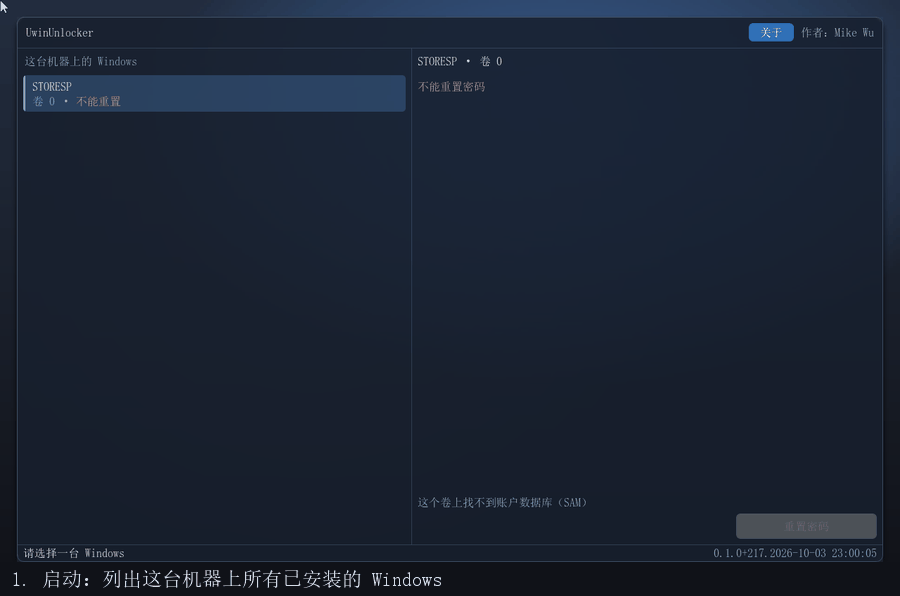

---

## 一、使用前提

三件事，缺一不可。它们都不是"建议"，是工具能不能工作的物理前提。

**第一，关掉 Secure Boot。** 工具在运行时加载的 NTFS 驱动是**未签名**的，Secure Boot 开着时固件会拒绝加载它，
而驱动加载不起来的直接后果是**盘上的 NTFS 卷一个都看不见**——工具会正常运行、正常显示界面，只是找不到任何 Windows。
进入固件设置的方式各家不同（通常在开机时按 `Del` / `F2` / `F10` / `Esc`），关掉 `Secure Boot` 一项即可；
如果主板开了 `CSM`/`Legacy` 兼容模式，关掉它通常也会顺带解掉这个问题。**这是用户最容易卡住的一步。**

**第二，目标 Windows 必须是正常关机出来的。** 上一回如果是强制断电、或者开着**快速启动**（Fast Startup）而"关机"，
盘上会留着**脏标志**和一份待重放的 NTFS 日志，内存镜像也还压在 `hiberfil.sys` 里。
这时候从外面写盘，等于和一份尚未提交的文件系统状态打架——轻则改动被日志覆盖，重则把卷写坏。
**本工具会在写入之前读卷的脏标志，脏就明确拒绝**，并让你先回 Windows 正常关机一次（顺带关掉快速启动）。

**第三，目标卷不能是 BitLocker 加密的。** 卷一旦加密，盘上的 SAM 就是密文，
任何离线手段都读不到它——**这不是实现难度问题，是密码学上的不可达**。
工具会在扫描时探测分区上的加密签名，遇到就明确标注为"不支持"，而不是让你点了重置再失败。

---

## 二、能重置什么，不能重置什么

界面上那一列给你的是**三种**答案，不是两种：**可以重置**、**不能重置**、以及**判不了**。
最后一种常常被省略掉，但它必须存在——"我们没查"和"我们查了、结论是不能"是两件不同的事。

| 账户 | 能不能重置 | 为什么 |
|---|---|---|
| **本地账户** | ✅ 可以 | 密码哈希就在盘上的 SAM 里 |
| **微软账户** | ❌ 不能 | 密码不在本地，SAM 里只有一个"这是微软账户"的标记 |
| **域账户** | ❌ 不能 | 凭据在域控上，本机不存 |
| **BitLocker 卷上的任何账户** | ❌ 不能 | 盘上的 SAM 是密文，读不到 |
| **不是 Windows 的系统**（例如 Linux） | ⚠️ 判不了 | 我们对它的账户一无所知——不是"不能"，是"我们没查" |

能重置的时候，工具提供两个动作，它们的**按钮文字随账户状态变**：
对普通账户是「**重置密码**」，对已被禁用的账户（典型的是内置 `Administrator`）是「**启用并重置密码**」。
这两条路线落在 SAM 里**不同的结构**上——前者清掉 `V` 值里的密码长度字段，后者还要改 `F` 值里的账户标志位。

---

## 三、部署：**两个 efi 必须放在同一个目录里**

工具由两个文件组成：

| 文件 | 是什么 |
|---|---|
| `uwnx.efi` | **应用本体**，你要运行的东西 |
| `ntfs.efi` | 应用要加载的 **NTFS 读写驱动** |

**`ntfs.efi` 必须和 `uwnx.efi` 放在同一个目录下。** 理由是应用**只从"它自己所在的那个目录"去找驱动**——
它用固件给的 `LoadedFilePath` 推自己的位置，**不信任 Shell 的当前目录**。这是刻意的：换了启动方式
（Ventoy、只读介质、被别人链式加载）之后，工作目录是什么完全不可知，只有"我在哪"是可靠的。

**只放 `uwnx.efi` 会怎样**：应用照样跑起来、界面照样出来，但**一个 NTFS 卷都找不到**，
于是那台机器上真正的 Windows 系统卷不会出现在列表里——你会看到工具"什么都没找到"。
这不是崩溃，是一种更难查的安静失败，所以这一条在这里加粗。

**用户不需要敲任何 `load` 命令。** 应用**自己**完成装载：找驱动 → `LoadImage` → `StartImage` → 触发总线重扫。
装载做成每帧一步的状态机，和界面的事件泵共用主循环，所以你不会看到界面卡住。

我们构建出来的启动镜像长这样，照着摆就行：

```
EFI/BOOT/BOOTX64.EFI   引导入口（UEFI Shell）
startup.nsh            一行：uwnx.efi
uwnx.efi               应用
ntfs.efi               驱动 —— 与应用同目录，这一条是重点
```

`startup.nsh` 的作用是"别让用户敲字"：Shell 起来会自动执行它，于是应用自动跑起来。
把上面四样按这个结构放进 U 盘（或任何能被固件认到的 FAT 分区）就可以用了。

---

## 四、怎么用

工具的主界面分两栏：**左栏是这台机器上所有已安装的 Windows**，每一行带着它的判定；
**右栏是你选中那一台的账户，以及可以做的操作**。

### 1. 启动，列出所有 Windows

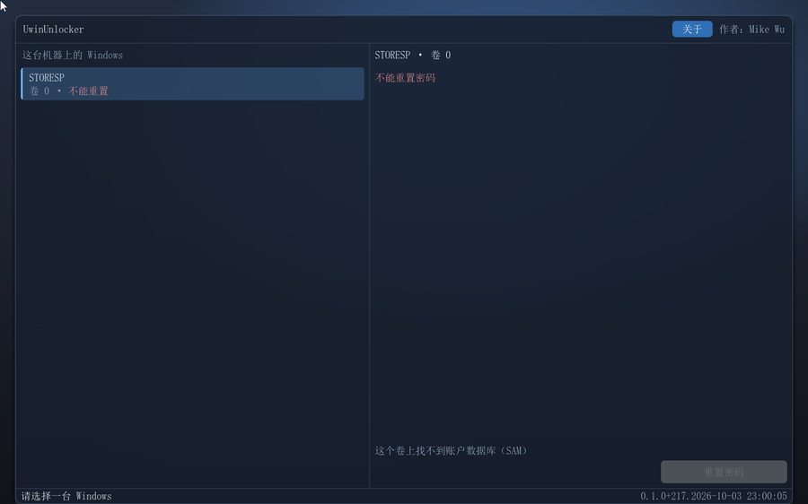

每一行左边是卷的标签，右边是判定。**判定读完再往下点**——「不能重置」的那些，点进去也不会有按钮。

### 2. 选中一台，右栏列出它的账户

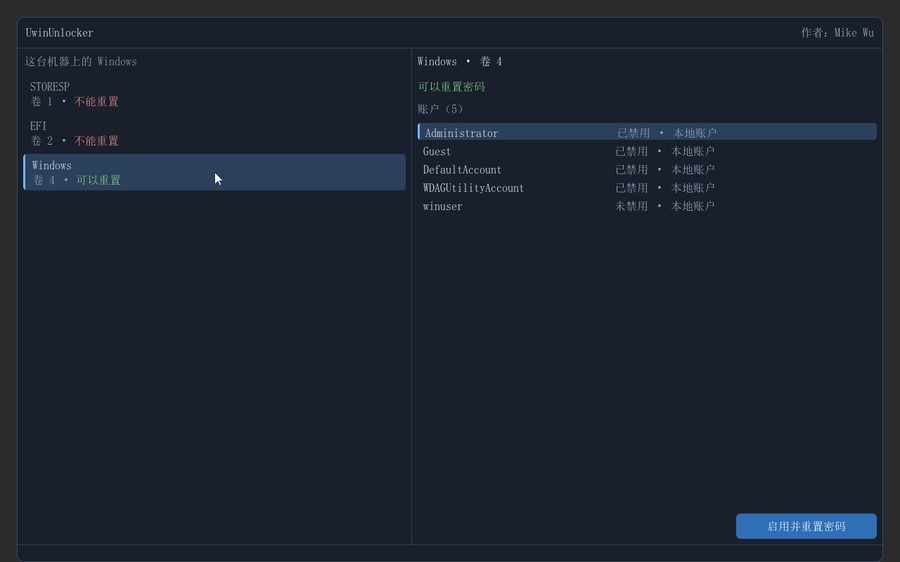

右栏顶部一句话告诉你这台能不能重置；下面是它的账户表，每个账户带着**是否已禁用**和**账户类型**（本地 / 微软 / 域）。

### 3. 按钮随账户状态变

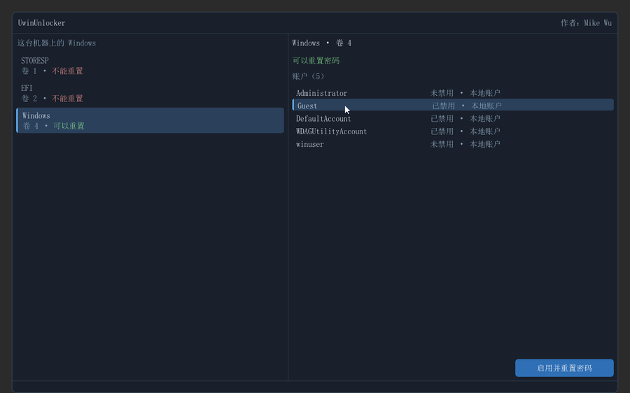

选中内置 `Administrator` 时，因为它**已禁用**，按钮写的是「**启用并重置密码**」——它会同时做两件事。
选中一个正常的本地账户时，按钮是「重置密码」。

### 4. 按下按钮 —— 不可逆操作，先确认

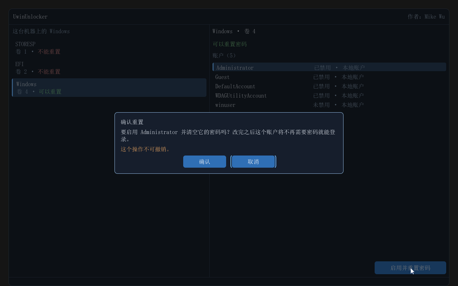

对话框会说清楚**要对哪个账户做什么**。这一步之后，那个账户的密码就不存在了。

### 5. 确认

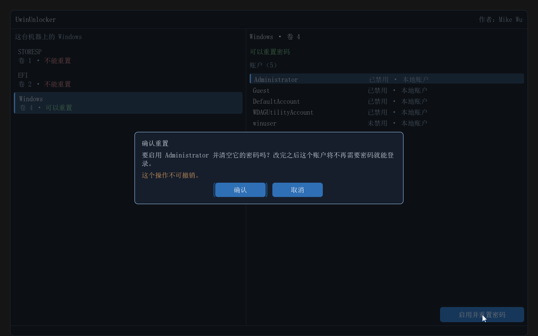

键盘和鼠标都能操作这个框：`←`/`→` 换按钮，`Enter` 确认，`Esc` 取消。默认焦点在**取消**上。

### 6. 执行，然后看结果


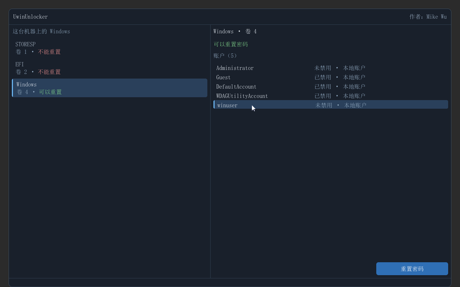

「已禁用」那一栏消失了，账户现在可用。

### 7. 键盘操作：Tab 遍历

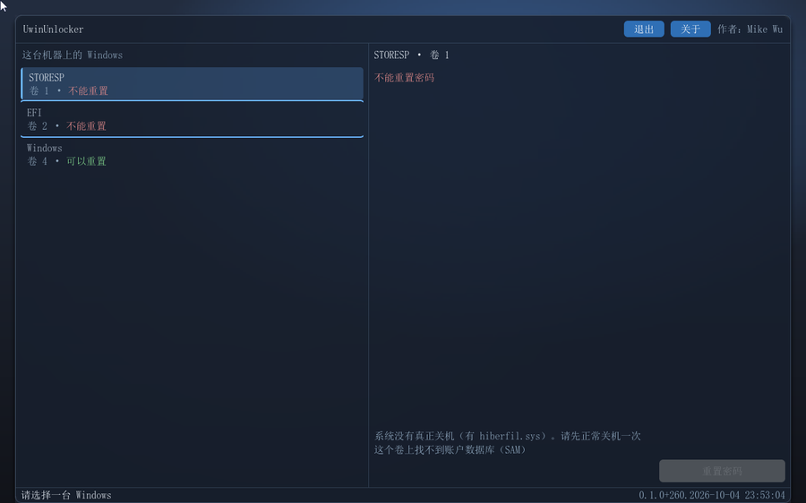

`Tab` 在**各个控件之间**移动焦点，`Shift+Tab` 反向，走到最后一个会绕回第一个。
焦点所在的那一项有**描边高亮**，状态栏还会告诉你**下一站是哪儿**。
`Esc` 在**任何一站**都能直接退出应用。

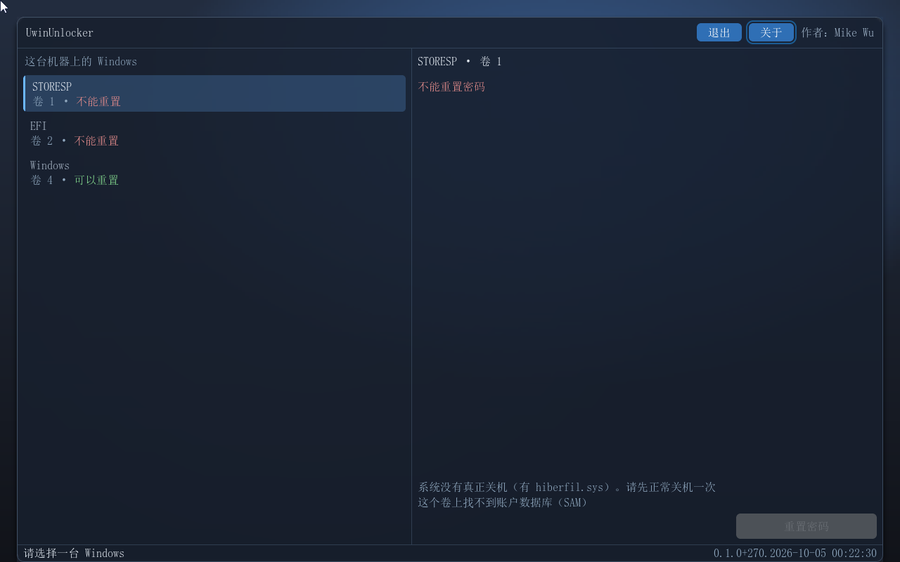

一路 `Tab` 下去，焦点会从账户行走到右下那颗动作按钮——**不用鼠标也能完成整个重置流程**。

### 8. 关于

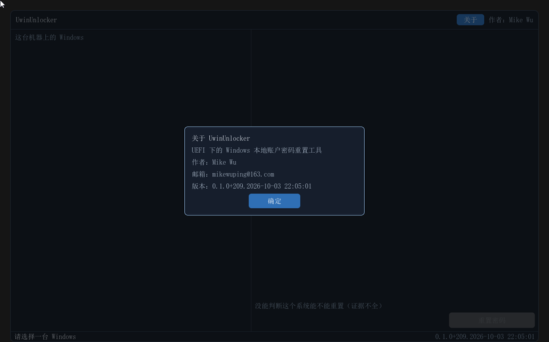

右上角常驻作者署名；「关于」里有版本号与联系方式。

---

## 五、它做之前检查什么，做完校验什么

工具的写路径不是"把文件改了就完事"，它有三道动作：

**写前读门。** 它按每一条安装行读三个信号——分区上的休眠文件、卷的脏标志、驱动挂载时是不是只读——
三条里有任何一条不利就**拒绝写入**，并告诉你**是哪一条**挡住的。拒绝时一个字节都不会写。

**写完读回来比对。** 这是从上流驱动的教训里学来的：它有过"返回成功却没真写进去"的记录。
所以"写成功"和"校验通过"被当成两件事，**只有后者算数**。

**看盘最后的干净程度。** 驱动写完盘之后卷是不是仍然干净，会被读出来记一笔——
但**判据不写死这个值**，因为它会随驱动版本变，那是外部事实。

---

## 六、已知限制（如实）

**界面上不会单独弹出一句"重置成功"。** 重置结束之后，界面会回到账户列表，而那个列表读的是盘上的真实状态——
所以**请以重启之后能不能直接进入那个账户为准**，不要以界面上有没有出现某句提示为准。

**从未在真机上跑过。** 到目前为止全部验证都在 QEMU 与 VirtualBox 里完成，用的是可丢弃的镜像。

**Secure Boot 的检测尚未实现。** 工具知道"驱动没装起来"这件事，但**不会**主动告诉你是 Secure Boot 挡的，
也不会给出关闭指引——今天的表现是一个降级结论，而不是一条明确的提示。上文的"第一"那一条因此要**由你事先确认**。

**列表的滚轮滚动没有演示过。** 鼠标滚轮的注入路径与"事件送到控件上"都量过，
但"一份列表真的滚动起来"没有——因为我们手上所有场景的列表都短于视口，无处可滚。

---

## 七、验证到什么程度

已安装的 Windows 有两种，都验过，而且验的是**两条路线**：

| | 版本 | 结果 |
|---|---|---|
| Windows 10 专业版 | `10.0.19045.3803` | 两条路线都成立；启用 Administrator 那条有 `whoami` 与提权标题为凭 |
| Windows 11 25H2 | `10.0.26200.6584` | 两条路线都成立；`whoami /groups` 含 `High Mandatory Level`（完整令牌） |

而**最硬的一次是一条人工的端到端验证**：在一份副本上另建一个账户，然后让工具
**清掉其中一个账户的密码、完全不碰另一个、再启用内置 Administrator**，最后在 VirtualBox 里
用 Windows 自己的登录行为确认三件事同时成立——

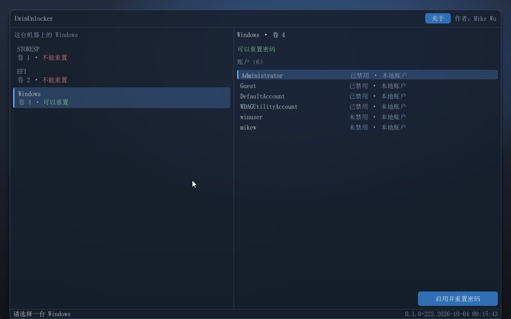

先在 guest 里**手工建一个属于验证者的账户**（这张是建完之后的样子）：

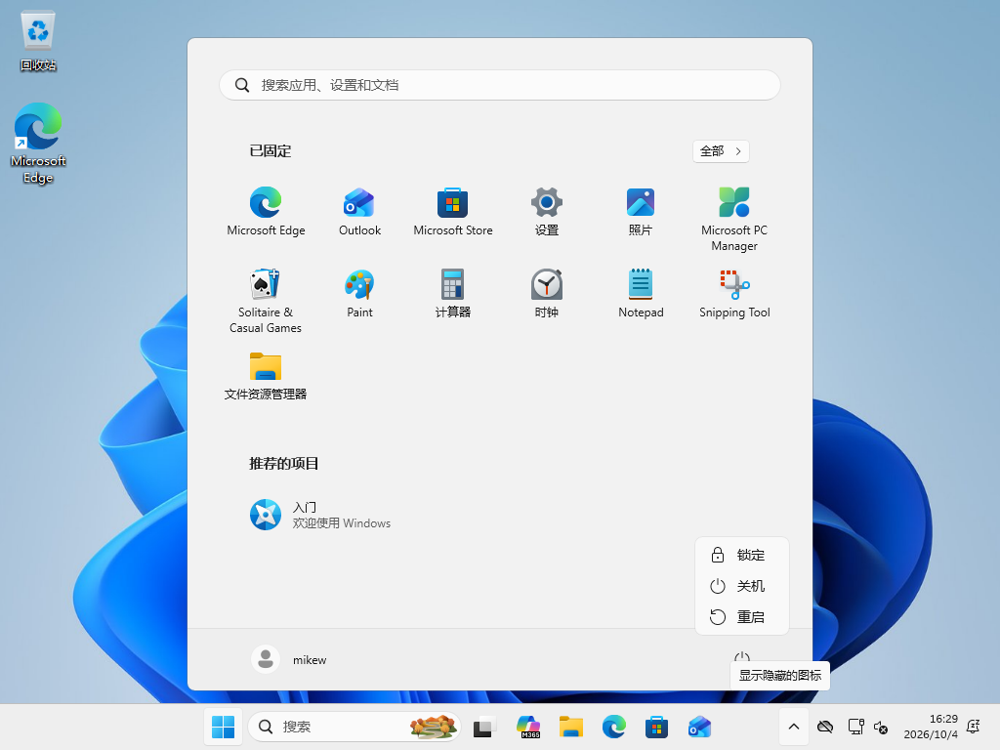

在工具里启用并清空 Administrator：

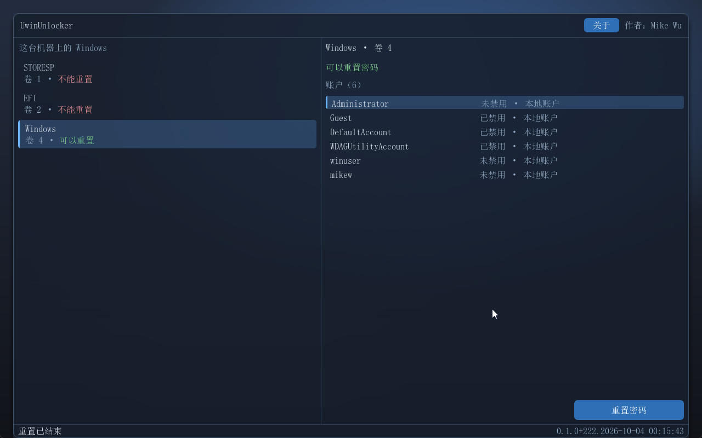

重置 `winuser` 的密码：

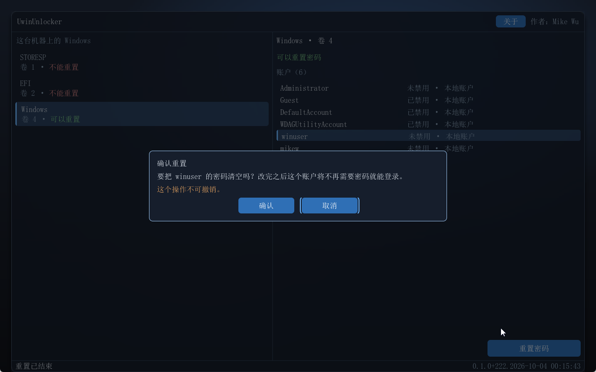

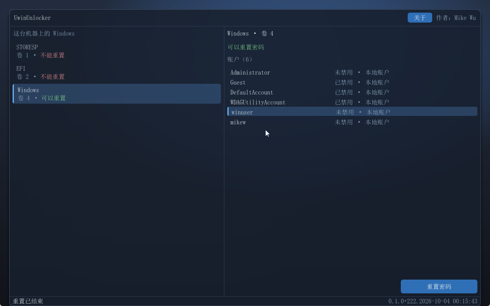

最后回到 Windows 验证：**`winuser` 不问密码就能进、`Administrator` 出现在登录界面上且不问密码、
而验证者自己那个账户仍然要密码、且原密码仍然管用**：

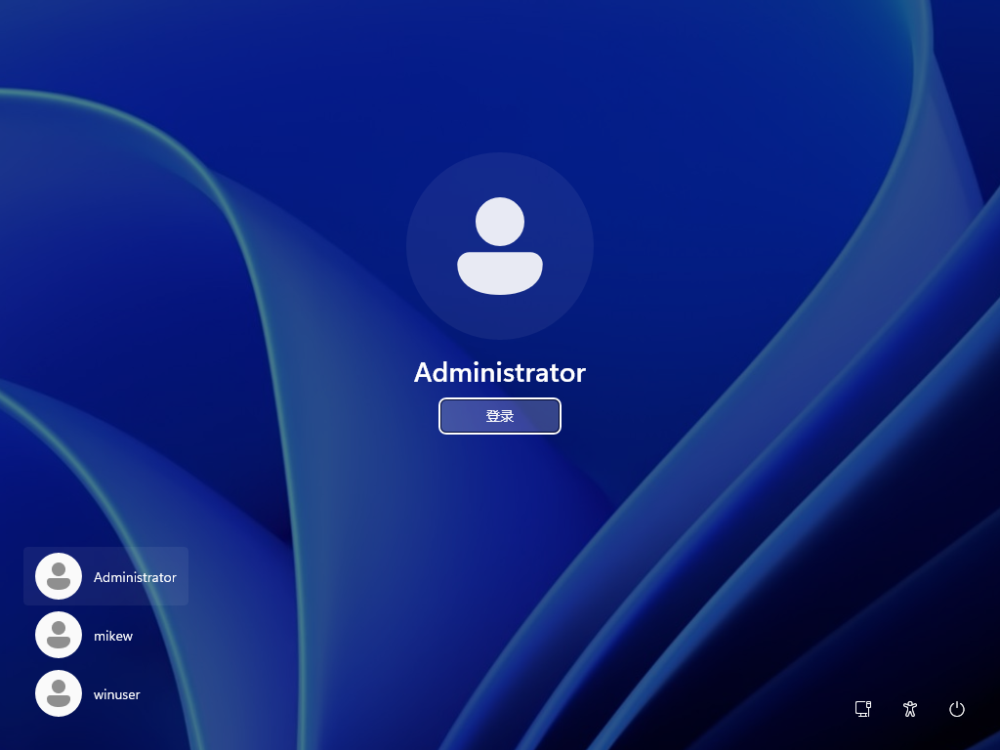

**这条判据特别在哪里**：对照组是**人自己建的**、不是我们造的夹具状态；"改了的"和"没改的"**同在一块盘上、
同一时刻并存**；而终点由 **Windows 自己的登录行为**判定，不是由我们读注册表、也不是由人看截图。

**边界也要说清楚**：以上全部只覆盖**干净关机**出来的卷。夹具所在虚拟机的固件不支持休眠，
所以"快速启动开着 → 开机重放日志覆盖这次编辑"这条失败模式**从未被复现过**。

---

## 八、许可

**本产品仅授权个人用户免费试用。商业使用要求联系作者。**
完整条款见本目录根下的 [`LICENSE.txt`](../../LICENSE.txt)，要点是：

- **个人用户**可以免费使用、复制完整原始副本（须随附本条款、不作修改）；
- **商业使用**——包括随硬件或服务分发、作为收费服务的一部分、在商业环境中部署、
  以及基于本产品提供有偿支持——**必须先取得作者的书面授权**；
- 不授权**修改后再分发**、**移除作者署名**、或**在未授权设备上使用**；
- 本工具会**不可逆地修改磁盘上的账户数据**，**使用前请自行备份**；
  产品按"现状"提供，不附带任何担保。

联系方式：**mikewuping@163.com**

**工具在运行时加载的 NTFS 驱动是 `GPL-2.0-or-later`**，来自 `pbatard/ntfs-3g`（`tuxera/ntfs-3g` 的 fork，
UEFI 移植由 Pete Batard 维护）。GPL 的分发义务要求随二进制提供源码，所以**整棵上游源码树随包携带**，
不需要另外去取。

我们相对上游**只改过一个文件的一行**：`uefi-driver.dsc` 里 X64 的 `CompilerIntrinsicsLib` 映射，
从"仅 `VS2022`"放宽到 `VS2022|VS2019`——因为本机工具链是 VS2019，而那份 DSC **只在 VS2022 下**才给 X64
挂这个库，于是编译全过、链接死在 `memcpy`/`memcmp`/`memset`/`memmove` 四个外部符号上。
**这一处改动连同它的理由与前后哈希，登记在 `NtfsRwPkg/upstream.deltas`**，
构建之前会跑一次校验：**出现没登记的差异、或者登记过的路径又和上游一致了，都会拒绝构建**。
换句话说，"我们没动过上游"这句话在这里不是声明，是一条能机械检查的性质。

因为驱动是**运行时装载**、与应用**不链接**，两者的许可证是隔离的。
